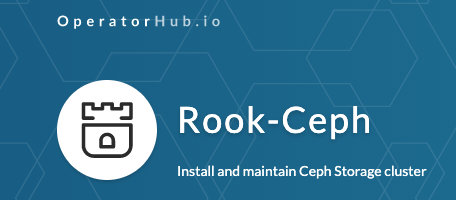

I’m excited to announce that just right for Cephalocon and KubeCon Europe, Rook has landed on [operatorhub.io](https://operatorhub.io). It has been quite a challenge to have it merged, but in the end [my pull request](https://github.com/operator-framework/community-operators/pull/348) got merged :). If you want to know what this means for upstream you should look at this [article](https://www.redhat.com/en/blog/rook-ceph-storage-operator-now-operatorhubio).

Source: Sebastian Han ([Rook just landed on operatorhub.io](https://sebastien-han.fr/blog/2019/05/17/Rook-just-landed-on-operatorhub-io/))
