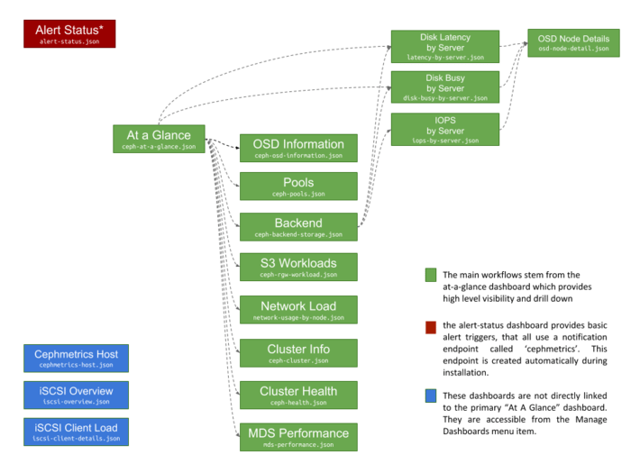
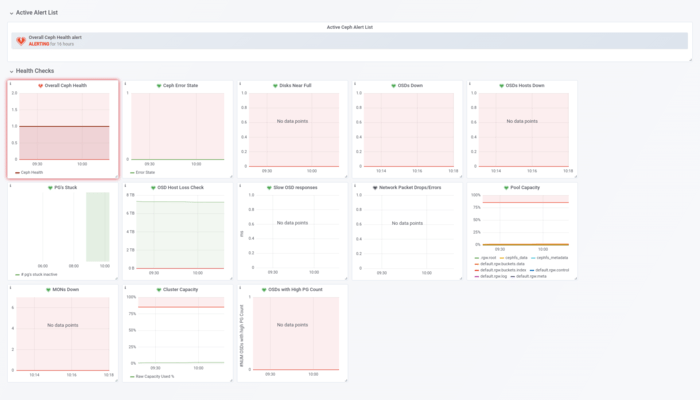

_with Paul Cuzner (Red Hat)_

Managing growth in applications and infrastructure is a significant challenge for many organizations as they scale. Every new application or server that’s added to the environment serves a business requirement, so keeping services usable in today’s 24x7x365 world represents both a challenge and an opportunity to meet a higher service level agreement (SLA).

\[youtube https://www.youtube.com/watch?v=EvikDWwQkz0&w=560&h=345\]

In [part 1](https://redhatstorage.redhat.com/2019/01/24/infrastructure-monitoring-as-a-service/) of this series, we discussed a SAAS solution to monitor your Ceph storage infrastructure. In this post, we continue the discussion by talking about how Prometheus, Grafana, and Ansible can rise to the challenge of Ceph monitoring.

# Understanding the Ceph monitoring challenge [#](#understanding-the-ceph-monitoring-challenge_1)

In the past, monitoring a service typically resulted in separate platforms. In today’s enterprise architectures, however, this is both undesirable and operationally impractical. Today’s monitoring fabrics must span legacy architectures as well as modern applications.

Monitoring software-defined storage platforms like [Red Hat Ceph Storage](https://www.redhat.com/en/technologies/storage/ceph) must fit the context of today’s enterprise monitoring architectures. Red Hat Ceph Storage is an infrastructure layer that may be called on to support hundreds or thousands of applications and users, so monitoring should be simple to deploy and offer advanced correlation and alerting capabilities.

Let’s look at how the tools integrated in Red Hat Ceph Storage can rise to the monitoring challenge.

# Laying out our Ceph monitoring strategy [#](#laying-out-our-ceph-monitoring-strategy_1)

Effective telemetry starts with accurate, timely, and reliable data. Sourcing this data as efficiently as possible is a key operational goal. In the past, agents have been used to gather metrics and forward them to a monitoring engine.

We can go one better with Red Hat Ceph Storage 3, by instrumenting the storage layer itself, with the help of the Prometheus project.

[](https://svbtleusercontent.com/w1ZZ66F8DU2pxo3bdLNxTL0xspap.png)

# Delving into data collection [#](#delving-into-data-collection_1)

Prometheus implements a two-tier architecture: server(s) and exporters. The exporters provide metrics to the server and use standard HTTP. They can be implemented as either standalone daemons or embedded within the application layer itself. With Red Hat Ceph Storage, metrics are provided by an embedded exporter module, which means there are:

- No agents to deploy
- No agents to manage (start/stop/debug)
- Available metrics that track the current Red Hat Ceph Storage release (reducing the lag between the monitoring stack and the available metrics)
- More seamless support for container and RPM-based deployments

One of the other key benefits of the embedded exporter architecture is that data gathering inherits higher availability from the Ceph Manager daemon.

Telling the cluster to provide monitoring telemetry can be simple: Just enable the Prometheus manager module:

```
> ceph mgr module enable prometheus
```

Once that is done, the prometheus server can be configured to “scrape” data from Red Hat Ceph Storage. Following is a sample scrape definition (prometheus.yml) that shows how you define each of the ceph mgr daemons as a data source, but link them through a common instance name (`‘ceph_cluster’`).

```
scrape_configs:  
  - job_name: 'ceph'
    honor_labels: true
    static_configs:
      - targets: ['rhceph-1:9283']
        labels:
          instance: 'ceph_cluster'
      - targets: ['rhceph-3:9283']
        labels:
          instance: 'ceph_cluster'
      - targets: ['rhceph-2:9283']
        labels:
          instance: 'ceph_cluster'
```

Examples like these help improve our understanding of how things work, but when it comes to actually deploying monitoring in Red Hat Ceph Storage, we would use Ansible to automate the legwork.

Metrics from Ceph only really represent part of the picture. With Red Hat Ceph Storage, the deployment process also installs the prometheus node\_exporter daemon on the Red Hat Ceph Storage hosts. With the node\_exporter in place, monitoring of the storage cluster is enhanced to include insights from OS-level metrics, like CPU, RAM, network, and disk.

With this level of integration, operations teams can deep-dive into storage issues and move between storage metrics and OS-level metrics to diagnose unexpected behavior or even predict performance.

# Getting into visualization [#](#getting-into-visualization_1)

Having the data available is a fundamental requirement, but being able to graph the data in a meaningful way is just as important. In addition to the Prometheus server, a Red Hat Ceph Storage cluster includes an instance of Grafana, an open source analytics and visualization tool. The Grafana instance provides several dashboards for visualization, a central dashboard for alert triggers and a separate dashboard focused on the performance of the monitoring host itself.

Each dashboard has been designed to provide insights into Ceph cluster operations, enabling the user to answer questions like:

- How effective is the external load-balancer distributing S3 connections to my cluster?
- How busy is my workload making the physical drives in the servers?
- What kind of I/O profile is a storage pool dealing with (R:W ratio)?
- Which is my busiest pool or heaviest workload?

The next diagram shows how the dashboards relate to each other.

[](https://svbtleusercontent.com/iF8AjWgmi2HF28qibJnUtG0xspap.png)

When you first log in to the Red Hat Ceph Storage Grafana instance, you get the “At a glance” view. This is a dashboard that correlates storage and OS-level metrics to provide the “30,000-foot view” of your storage cluster.

[](https://svbtleusercontent.com/nM4gL7iuUBsEBNhUgNLPDb0xspap.png)

This dashboard is split into 4 main areas:

1. _Dashboard links_ Links to other dashboards, providing deeper insight into specific areas of the Ceph cluster
2. _Active alerts_ Providing a breakdown of alerts that are currently active within the cluster
3. _At-a-glance_ Overview of the cluster state, the cluster’s components, and overall capacity
4. _Performance_ Performance metrics are presented in two layers, depicting front end (Ceph) and backend (hardware) performance

By default, data samples are gathered and graphed every 15 seconds with the last hour shown in the Grafana UI. However, in Grafana you can select a different time window if you want to see what happened over a longer timeframe. In addition to these temporary changes, Grafana also allows you to clone or create additional dashboards. Therefore, if you find useful a particular view that is not offered by default, we encourage you to propose a change upstream to the [cephmetrics project](https://github.com/ceph/cephmetrics).

# Examining alerting [#](#examining-alerting_1)

Having timely data and “cool” visualizations is only half the story, though. The solution should be able to detect and react to system problems and events. With Red Hat Ceph Storage, [12 alert triggers](https://access.redhat.com/documentation/en-us/red_hat_ceph_storage/3/html/administration_guide/monitoring#the-red-hat-ceph-storage-dashboard-alerts) are defined out-of-the-box to establish a common alerting policy that typically needs either escalation or investigation. The alert engine itself is a feature of the Grafana platform, based on queries and threshold values (triggers). Managing alerts is handled in the GUI, so extending the default set of alerts doesn’t require any CLI work.

An overview of the active alerts appears on the At-A-Glance dashboard. To see the alert triggers that are defined, click on the Alert Status link in the Active Alerts widget to the top right. This will open a browser tab and present something like this screenshot:

[](https://svbtleusercontent.com/rbHb1fazVxLh5pwKMArdaV0xspap.png)

Having alerts by themselves isn’t very helpful—When things go wrong, you need some form of notification. Grafana implements external notification through “Notification Channels.”

With Red Hat Ceph Storage monitoring, alerts flow to a notification channel called cephmetrics which, by default, is configured to notify via email, but doesn’t populate the email field. You’ll need to provide an email to receive alerts this way. However, Grafana supports [15 different notification targets](http://docs.grafana.org/alerting/notifications/#all-supported-notifier), including email, PagerDuty, and generic interfaces like using a webhook. To change your notifications, click the bell icon in the Grafana menu, select “Notification channels,” choose “cephmetrics,” update the type, and provide the relevant configuration information.

# Adding monitoring to Red Hat Ceph Storage [#](#adding-monitoring-to-red-hat-ceph-storage_1)

As with any distributed system, many components must work together, but this doesn’t mean that installing monitoring for a Red Hat Ceph Storage cluster has to be a complex task. When you choose to install Red Hat Ceph Storage, the process is automated with [Ansible](https://www.redhat.com/en/technologies/management/ansible); when you add monitoring, Ansible is once again there to help simplify the process with automation.

Red Hat Ceph Storage’s built-in monitoring solution uses containers for Grafana and Prometheus. This is designed to simplify installation and upgrade and provide the ability to safely co-locate these two workloads on the same physical or virtual host.

Installation takes three steps:

1. Install the `cephmetrics-ansible` rpm
2. Update your ansible inventory with an entry for the host that will hold the Prometheus and Grafana instances.
3. Run the playbook.

In addition to installing the Prometheus and Grafana components, the playbook deploys the prometheus node\_exporter daemons across the Ceph cluster and configures the data gathering for you. Once it completes, just point your browser at `http://<insert_your_host_here>:3000` to log in to Grafana and start understanding the storage profile of your application(s).

# Taking next steps [#](#taking-next-steps_1)

Red Hat Ceph Storage provides a storage foundation with which to support both legacy and modern application architectures. With Red Hat Ceph Storage, choosing to adopt an SDS strategy for your datacenter should now be considered a viable alternative to legacy and proprietary hardware solutions requiring advanced in-house R&D expertise. Core features like multi-protocol support and infrastructure integration, coupled with a highly scalable and self-healing architecture, make Red Hat Ceph Storage an innovative storage technology with built-in modern management instrumentation. With Red Hat Ceph Storage, Ceph is “open for business.”

For more information on Red Hat Ceph Storage, visit this [web page](https://www.redhat.com/en/technologies/storage/ceph), contact your Red Hat representative, or take a [test drive](https://engage.redhat.com/ceph-storage-aws-s-201506170259) on Amazon AWS.

# Further Reading [#](#further-reading_1)

- [Infrastructure Monitoring as a Service](https://redhatstorage.redhat.com/2019/01/24/infrastructure-monitoring-as-a-service/)
- [Red Hat Ceph Storage](https://www.redhat.com/en/technologies/storage/ceph)
- [RHCS Datasheet](https://www.redhat.com/en/resources/ceph-storage-datasheet)
- [RHCS Test Drive (AWS)](https://engage.redhat.com/ceph-storage-aws-s-201506170259)
- [RHCS Interoperability](https://access.redhat.com/documentation/en-us/red_hat_ceph_storage/3/html/red_hat_ceph_storage_hardware_selection_guide/)

_[Cross-posted to the Red Hat Blog](https://www.redhat.com/en/blog/ceph-monitoring-challenge-prometheus-grafana-and-ansible-rise-task)._

Source: Federico Lucifredi ([The Ceph monitoring challenge: Prometheus, Grafana, and Ansible rise to the task](https://f2.svbtle.com/the-ceph-monitoring-challenge-prometheus-grafana-and-ansible-rise-to-the-task))
