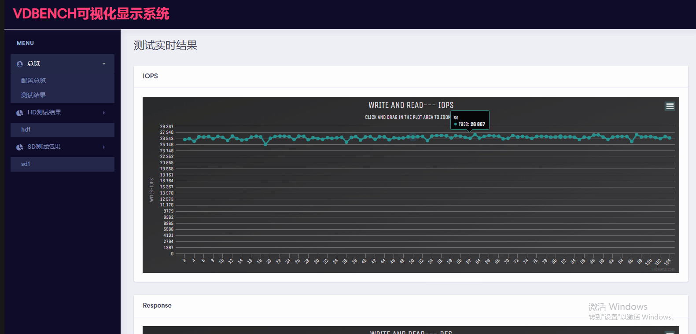

  
  

## 前言

前一段时间碰到一个系统，用rados bench 去跑都还比较正常，但是一跑数据库就非常慢，测试工具会抛出延时过大的提示，经过排查发现，云平台中有一台虚拟机还运行着备份数据库的服务，而这个备份软件是需要反复写一个标记文件的，因为这个标记文件只对应了一个对象，一个对象对应了一个pg，一个pg对应到固定的ssd上面，那个ssd的io几乎被这一个操作给打满了，然后全局的请求到了这个osd上面的时候，都会变得慢和卡顿

出现这种情况，在业务层面可能需要做好分离，我们在面对这种情况的时候该如何提前就做好测试，对自己的性能的剩余性能做一个更好的评估，什么时候需要分离，什么时候不需要分离，这个都是需要用数据来说话的

性能测试的时候，经常面临的这些问题，你告诉我这个环境能跑多少iops，带宽能多大，我的数据库能不能跑，这个我也没法回答，一般来说我都是说需要根据环境进行测试，这个测试也只能根据自己设计的模型进行测试，而越接近用户使用场景的业务模型，就越能反应真实的业务能力，最好的测试就是直接拿对接的软件进行测试，接什么业务就用什么业务压

我们可以自己先问自己几个问题

- 1、如果集群里面有一台虚拟机在跑大带宽的业务，你去测试iops，性能能到多少，这个对应的是真实场景里面一个备份业务和一个数据库业务混用的情况
- 2、单机iops能到多少，如果几十台服务器都同时在跑的时候，单机的iops还能到多少？
- 3、多机并发的时候，单个机器上面的io会不会受到其他的机器的io的影响
- 4、性能在遇到scrub的时候，或者迁移的时候，能够还保留多少的性能，这个保留性能是否可控
- 5、集群写入到70%的时候，性能是多少，是初始的百分之多少，还够覆盖业务IO不？

如果你的业务需求是远低于机器能提供性能的时候，上面的这些都不是问题，但是如果跑的业务是敏感型的时候，那么业务很可能收到较大的影响，这个时候我们只有对自己的环境有很精确的掌握才不至于在业务出现性能问题的时候去救火了

上面的这些是为了引出今天我需要讲的一个测试工具，在之前的文章当中比较多的讲的是故障的处理，后续的文章里面可能会讲一些偏向于控制和监控类的

## 性能测试工具

本篇讲的一个工具是vdbench，这个工具跟fio类似，很多测试里面会用到这个工具，这个比fio强大的是，既能够测试块接口也能测试文件接口，文件接口是去模拟写入文件，这个又和mdtest类似，但是mdtest主要是去测试元数据能力，vdbench则比较综合，这个工具在没有使用之前觉得很复杂，总觉得写个配置文件很麻烦，但是用了几次就会发现其实逻辑上面还是很清楚了，这里给个测试文件的模板，本篇主要写块接口的测试，所以模板也以块接口作为例子  

<table><tbody><tr><td class="code"><pre>*example workload:  Single run, 10 raw disk  *HD:    HOST Define *SD:    Storage Definition *WD:    Workload Definition *RD:    Run Definition * hd=default,vdbench=/root/vdbench,user=root,shell=ssh hd=hd1,system=192.168.129.40 hd=hd2,system=192.168.129.41 sd=sd1,lun=/dev/sdb,host=hd1,openflags=o_direct,hitarea=0,range=(0,100),threads=2 sd=sd2,lun=/dev/sdb,host=hd2,openflags=o_direct,hitarea=0,range=(0,100),threads=2 wd=wd1,sd=(sd1,sd2),xfersize=(4096,100),rdpct=0,seekpct=100 rd=run1,wd=wd1,iorate=max,elapsed=600,warmup=300 * 2 rbd disks, 100% random, 0% read of 4k blocks at unlimited rate </pre></td></tr></tbody></table>

上面的例子是测试两台机器的磁盘，每个磁盘两个线程写，4K的块大小，100%的写，100%随机，热身写300s，然后测试600s

这样一个配置后，就可以同时对两台机器按上面的写入模型写入了，我们看下系统开始测试的时候的显示

  
就是类似这样的显示，然后最后的测试结果会在output里面生成一些html文件

这个工具有以下优点：

- 1、能够每秒显示整个测试的io叠加，这样测试整个集群的io的时候，可以把所有虚机启动起来，然后进行io的压测，而不是去压单个rbd的iops，那个没有太大的意义，只能是一个数值，真正的环境大多也不是给一个业务使用的，也可以跑起一个业务以后，再看剩余的机器还能跑多少性能
- 2、在测试输出报告里面会根据主机统计一次io，这个面向的业务场景就是，比如某台主机上面可能挂载多块云盘，那么可以根据主机进行统计
- 3、在报告里面还会根据设备显示io个延时的信息，也就是只要是测试设备，每一个的性能指标都能查到，这个的好处就是检测集群里面的io是不是均匀的，如果做了qos，设备的测试性能值是不是跟设置限制一样

既然有上面的优点，那有没有缺点呢？这个我个人认为还是有优化的空间的，下面就是我根据自己的需求做的一点点优化工作，并且把工具投入到了自己的测试工作当中去了

## 一些需求

- 1、比如一个测试在一个小时，测试过程中碰上了scrub对性能的影响，我想知道这个影响到底有多大，如果按现在这个，我得等测试完了，再导出测试结果，再自己用excel图表工具做分析，这样一轮轮的进行测试
- 2、如果我需要对某个参数进行调整，进行调优测试，一般来说，都是测试一轮，然后再去调整参数，再重头再来一轮，反复测试，是不是有比较明显的显示让我能够实时的看到这个变化
- 3、io的抖动是不是能够比较明显的显示出来
- 4、测试的进度是不是能够有比较方便的地方看到
- 5、当前测试的是什么测试项目（如果测试是长时间的，可能自己也不清楚了）

以上这些就是我自己的一些需求，基于这个我写了一个动态显示测试的可视化的工具，我对自己的这个工具有一定的要求

- 1、随处可运行，也就是不需要系统上再安装其它软件
- 2、随时可运行可中断，不影响测试，即使测试结束后也能运行进行结果的解析

这个实际上是有个软件HCIBENCH是基于vdbench做的，但这个软件跟vmware结合太紧，测试是包括了创建虚拟机的接口一起的，这个耦合的太紧了，并不符合我自己的测试需求，所以准备自己写一个简单的

## 成品

花了一点时间后，这个工具可以根据我的想法运行了，大概是下面的效果  
  
显示了进度和配置文件

  
显示了iops，这里是测试多少秒就有多少个点，整个测试结果都会显示到页面上面，并且是实时更新的  
下面还有几张表，分别是响应时间和带宽的，读写响应时间分别显示的（混合读写的时候）

这个做了可视化以后，基本是能够覆盖我上面的几个需求，最终实现的是对测试结果的一个实时解析，如果需要导出测试结果，在测试完成以后，直接进行几个截图就完成了

如果是进行调优的测试，测试一小段时间也可以看到变化了

## 总结

本篇讲述的是我自己碰到问题，以及自己解决这个问题的方式，如果找不到需要的工具，那就根据自己的需要写一个简单的，这个可能写的过程会花点时间，但是后续用起来确实很节约时间

后续大概还有个scrub的数据可视化和scrub脚本生成器的工具，这个来可视化scrub的一些东西和我根据自己的分析生成的建议的scrub脚本

还有一个环境检测器的工具，这个是由于项目中出现了异常的低速的问题，排查起来很麻烦，这个也是准备一个写一个可视化工具来分析异常

可视化的好处是在大量的数据中间找到你需要的信息，这个在面向客户的系统的时候可能用处不大，或者需要面向客户做系统，但是有一些可视化的调试工具的时候还是很方便的

## 变更记录

| Why | Who | When |
| --- | --- | --- |
| 创建 | 武汉-运维-磨渣 | 2019-1-3 |

Source: zphj1987@gmail ([vdbench测试实时可视化显示](http://www.zphj1987.com/2019/01/03/vdbench-test-display/))
