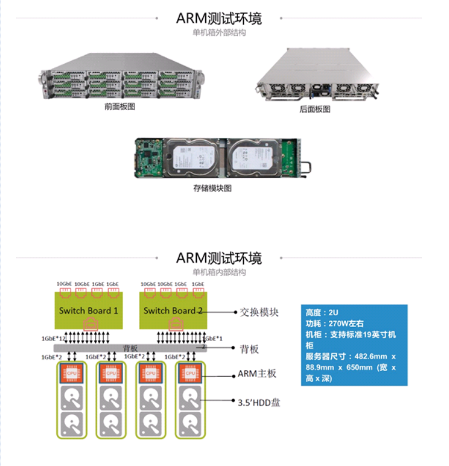

  
  

## 关于arm

之前wdlab对外发布过一次约500个节点的arm的ceph集群，那个采用的是微集群的结构，使用的是双核的cortex-a9 ARM处理器，运行速度为1.3 GHz，内存为1 GB，直接焊接到驱动器的PCB上，选项包括2 GB内存和ECC保护

这个在国内也有类似的实现，深圳瑞驰商用Arm存储NxCells

  
  

这个采用的是微集群的架构，能够比较好的应对一些冷存场景，但是今天要说的不是这种架构，而是一个比较新的平台，采用的是高性能的arm的架构，也就是类似X86的大主板结构  
  
很多人了解的arm的特点是小，功耗低，主频低，这个是以前的arm想发力的场景，类似于intel做的一款atom，在很早期的时候，我在的公司也尝试过基于atom主板做过1U的ceph存储，但是后来各种原因没有继续下去

实际上arm也在发力高性能的场景，但是这个比较新，并不是每个人都能接触的到，在这里，我把我们的硬件设备的测试数据发一部分出来，也许能改变你对arm的印象，在未来硬件选型的时候，也许就多了一层选择

## 高性能arm设备说明

<table><tbody><tr><td class="code"><pre>System Information   PROCESSOR:          Ampere eMAG ARMv8 @ 3.00GHz     Core Count:       32                             Scaling Driver:   cppc_cpufreq conservative     GRAPHICS:           ASPEED     Screen:           1024x768             MOTHERBOARD:        MiTAC RAPTOR     BIOS Version:     0.11                                                    Chipset:          Ampere Computing LLC Skylark                            Network:          2 x Intel 82599ES 10-Gigabit SFI/SFP+ + Intel I210     MEMORY:             2 x 32 GB DDR4-2667MT/s Samsung M393A4K40BB2-CTD    DISK:               FORESEE 256GB SS + 6001GB Seagate ST6000NM0115-1YZ     File-System:      xfs                                    Mount Options:    attr2 inode64 noquota relatime rw      Disk Scheduler:   DEADLINE                              OPERATING SYSTEM:   CentOS Linux 7     Kernel:           4.14.0-115.el7a.0.1.aarch64 (aarch64) 20181125               Compiler:         GCC 4.8.5 20150623                                           Security:         meltdown: Mitigation of PTI                                                    + spec_store_bypass: Not affected                                              + spectre_v1: Mitigation of __user pointer sanitization                        + spectre_v2: Vulnerable </pre></td></tr></tbody></table>

机器采用的是ampere的最新的平台RAPTOR平台进行的测试，这里只是做了最小环境的测试，因为测试设备被占用了，就利用有限的资源进行测试即可,机器上面的插口都没有什么限制，支持pcie插槽，能够自己扩展到多盘位机器，也支持万兆网卡，本次测试采用的就是36盘位的机器，对于36盘位的机器来说，底层的磁盘的总资源肯定是大于网络带宽的，这样也有个好处就是磁盘在前端业务满载的时候，不会那么忙

## 测试环境

测试环境说明

环境为单机36盘位的ceph12版本，配置的12.2.10版本的ceph，使用的是bluestore，设置的副本1，然后用一台X86机器作为客户端，客户端和服务器之间通过万兆相连，对比测试的机器同样为36盘位的机器，为了保证环境的一致性，测试过程中集群没有重搭，直接把盘换了一个平台进行了启动后进行测试

磁盘有36块6T的sata盘

本次测试测试了两组数据

- 机器的主机带宽（vdbench测试arm的）
- 机器带上ceph以后的输出带宽

本次测试只在现有的环境下对比，测试模型很多，同样的X86选型都可以选出各种各样的，这里我只拿我现有的机器进行的测试，X86和arm的都为32 processor的服务器，内存一致

### 主机带宽

主机vdbench测试

| 测试项目 | 测试时长 | IOPS | response | 带宽 |
| --- | --- | --- | --- | --- |
| 4K随机写 | 600s | 13123.1 | 5.400 | 51.26M/s |
| 4K随机读 | 600s | 3463.0 | 20.782 | 13.53M/s |
| 1M顺序写 | 600s | 3661.6 | 19.360 | 3661.63M/s |
| 1M顺序读 | 600s | 3857.8 | 18.657 | 3857.82M/s |

这个是vdbench 对主机带宽进行的测试，为什么需要这个测试，很久以前看过一篇博客，是讲fio测试的，博主提出了一个概念，你如果只是测试一个磁盘的数据，然后相加，这个数据可能跟实际偏离很多，还有个情况就是cpu的处理io的并发能力同样会影响最终输出，也就是你的写入越接近最终的并发写入，越能反应最终的可能的最大输出带宽，所以这个地方通过fio或者vdbench都能测出主机带宽，在知道可能存在这个问题以后，每次都会测一测，到目前为止已经发现了两次问题

第一次是前面的硬盘的面板带宽的，之前有次测试的数据24个盘不管怎么样都是1.9G，在到了19个盘之后的数据就不再上升，磁盘utils一直都是100%，后来查出来是面板驱动问题，找硬件厂商刷了下驱动后，带宽就恢复正常

一次是本次测试同样36盘一直跑出来发现只有2G/s,排查以后发现是内部的lsi的卡到面板只用了一根线，虽然看到的是36个盘，但是受限于线的带宽，只有2G/s，把线换成2根以后，性能就到了上面的3.6G/s了，这个如果不跑下整机带宽，也许没发现，或者后续会怀疑是不是本身软件处理慢了

本次测试主要是sata的盘的，也就是跑的带宽模式，大IO的场景，需要小io的场景的需要ssd的环境了，不在本篇讨论范围内

### 集群的测试数据

arm和X86测试数据对比  

<table><tbody><tr><td class="code"><pre>rados -p rbd -t 32 -b 64K bench  300 write --no-cleanup --run-name 64kt32 rados -p rbd -t 8 -b 4096K bench  300 write --no-cleanup --run-name 4Mt8 </pre></td></tr></tbody></table>

命令的例子，根据不同的用例进行调整参数

#### 64K块大小性能

| 读/写 | 块大小/并发数 | Bandwidth(MB/s) | Average IOPS | Average Latency(ms) |
| --- | --- | --- | --- | --- |
| arm写 | 64K/32 | 39.8914 | 638 | 0.0501339 |
| X86写 | 64K/32 | 39.3184 | 629 | 0.0508632 |
| arm写 | 64K/64 | 67.283 | 1076 | 0.0594479 |
| X86写 | 64K/64 | 66.0471 | 1056 | 0.0605586 |
| arm写 | 64K/128 | 110.14 | 1762 | 0.0726323 |
| X86写 | 64K/128 | 108.525 | 1736 | 0.0737129 |
| arm写 | 64K/256 | 177.103 | 2833 | 0.0903411 |
| X86写 | 64K/256 | 190.263 | 3044 | 0.0840909 |
| arm写 | 64K/512 | 260.715 | 4171 | 0.122732 |
| X86写 | 64K/512 | 261.358 | 4181 | 0.122422 |
| arm读 | 64K/32 | 1060.96 | 16975 | 0.00186769 |
| X86读 | 64K/32 | 958.661 | 15338 | 0.00206133 |
| arm读 | 64K/64 | 1026.75 | 16428 | 0.00387973 |
| X86读 | 64K/64 | 946.426 | 15142 | 0.00419585 |
| arm读 | 64K/128 | 1082.39 | 17318 | 0.007375 |
| X86读 | 64K/128 | 931.589 | 14905 | 0.00855418 |
| arm读 | 64K/256 | 1116.87 | 17869 | 0.0143076 |
| X86读 | 64K/256 | 1001.93 | 16030 | 0.0159373 |
| arm读 | 64K/512 | 1116.81 | 17868 | 0.0286263 |
| X86读 | 64K/512 | 1008.51 | 16136 | 0.0316968 |

#### 4M块大小性能

| 读/写 | 块大小/并发数 | Bandwidth(MB/s) | Average IOPS | Average Latency(ms) |
| --- | --- | --- | --- | --- |
| arm写 | 4M/8 | 377.74 | 94 | 0.0847078 |
| X86写 | 4M/8 | 377.604 | 94 | 0.0847369 |
| arm写 | 4M/16 | 676.168 | 169 | 0.094649 |
| X86写 | 4M/16 | 670.021 | 167 | 0.0955143 |
| arm写 | 4M/32 | 900.391 | 225 | 0.142123 |
| X86写 | 4M/32 | 902.573 | 225 | 0.1418 |
| arm写 | 4M/64 | 901.906 | 225 | 0.283723 |
| X86写 | 4M/64 | 902.953 | 225 | 0.28335 |
| arm写 | 4M/128 | 903.476 | 225 | 0.566172 |
| X86写 | 4M/128 | 904.942 | 226 | 0.56528 |
| arm读 | 4M/8 | 906.495 | 226 | 0.0347298 |
| X86读 | 4M/8 | 784.499 | 196 | 0.0395726 |
| arm读 | 4M/16 | 968.325 | 242 | 0.0655441 |
| X86读 | 4M/16 | 1091.42 | 272 | 0.0570873 |
| arm读 | 4M/32 | 1074.49 | 268 | 0.118411 |
| X86读 | 4M/32 | 1108.76 | 277 | 0.113665 |
| arm读 | 4M/64 | 1053.77 | 263 | 0.242012 |
| X86读 | 4M/64 | 1116.84 | 279 | 0.227442 |
| arm读 | 4M/128 | 1121.86 | 280 | 0.4553 |
| X86读 | 4M/128 | 1102.44 | 275 | 0.462227 |

从上面的两大组数据可以看到，在这个测试模型下面，这个arm的机器的性能并不差，两款硬件在同样的测试压力，和同等磁盘的情况下，基本维持了跟X86一致的水平

这个如果硬要说哪款好，我觉得那也不是一下两下说的清楚的，只能说给出一个测试模型，然后两个同样的压力同样环境去做比较，这样就太多场景了，并且也还会考虑成本的问题，兼容性的问题，如果在各方面都差不多的情况下，这个不失为一种选择

硬盘还分为sata，sas，ssd，高铁也有普通列车，和谐号，复兴号的差别，这个看怎么去定位硬件本身的输出能力了，这里从测试数据来看，还是一款不错的高性能arm硬件，当然需要到更多的环境下面去适应和磨合了

## 总结

在安培的arm高性能机器下，也能跑出跟X86下的差不多的性能了，虽然还不能说绝对能去完全替换X86，但是目前看性能还是很不错的，值得一试，如果价格合适，又满足需求，还是可行的

## 变更记录

| Why | Who | When |
| --- | --- | --- |
| 创建 | 武汉-运维-磨渣 | 2018-09-09 |

Source: zphj1987@gmail ([高性能arm运行ceph存储基准测试](http://www.zphj1987.com/2019/09/09/a-new-high-performance-arm64-running-ceph/))
