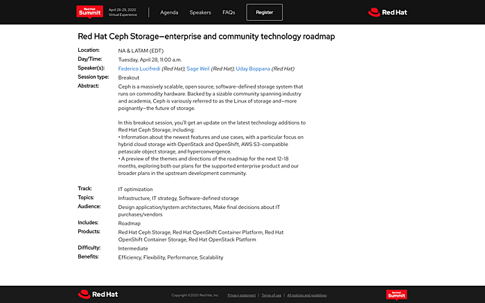

[Sage](http://twitter.com/liewegas), Uday, and [I](http://twitter.com/0xf2) put our best efforts into making sure that the new virtual venue for the [Red Hat Summit](https://www.redhat.com/en/summit) would not diminish customer access and visibility into our future plans for Ceph. We delivered an unprecedented [18-month roadmap](https://summit.redhat.com/conference/sessions/details/58918e7e-04bf-4e54-abc9-a2a8770a11aa) for the downstream, enterprise-class supported product, showcasing the “secret deck” that is usually reserved for internal planning use within our team — I usually make a roadmap statement to customers only when we have a 70%+ confidence estimate and delivery is scheduled to occur within a year, but this time I chose to relax the rules a little to give you a view stretching two major releases and 18-months into the future. We wanted to reward your virtual attention with more access by providing a little more food for thought into what is coming with Red Hat Ceph Storage 5 and 6 this Summer and the next.

Not to be outdone, Sage walked us through everything the upstream Community has accomplished with the Octopus release just a few weeks ago, and outlined the expansive plans the Community is embarking on right now, with the Pacific release due next year. We were both rushed for time (the virtual sessions are unfortunately shorter), so do not hesitate to ask us questions on Twitter or through the Summit’s interactive venues — we are happy to answer your questions, just reach out to us.

Yes, it is rain you see outside my window, and it is snow outside Sage’s.

To view the session’s recording, head to the [Red Hat Summit](https://www.redhat.com/en/summit) portal and select “watch and learn” at the top, then “sessions & labs”, select your geography, and filter with the keyword “ceph”. The session will be available in the archive for a year, and Summit registration is free this year.

Eran is leading a separate session with Sudhir and Patric detailing our plans for OpenShift Container Storage — I included relevant Ceph technology updates in the technology deck, but [that is the session](https://summit.redhat.com/conference/sessions/details/3751d1a4-cc27-4693-8083-47fd1002087e) you should be paying attention to for OCS-specific product roadmap updates.

Our slides are available as a [PDF download](http://people.redhat.com//%7Eflucifre/talks/Red%20Hat%20Summit%202020%20%E2%80%94%20Ceph%20Storage%20Enterprise%20and%20Community%20Technology%20Roadmap.pdf) and can be viewed inline below.

Comments? Discuss on [Hacker News](https://news.ycombinator.com/item?id=23010169).

Source: Federico Lucifredi ([Ceph at Red Hat Summit 2020](https://f2.svbtle.com/going-virtual))
