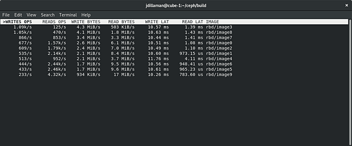
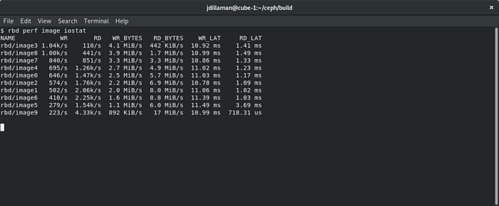
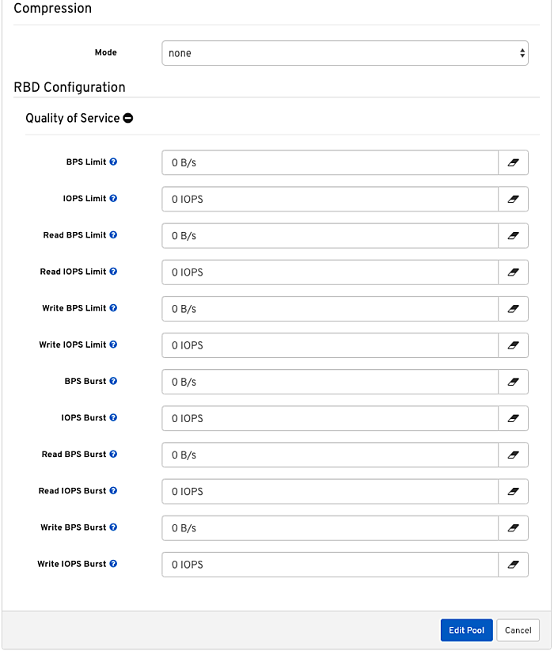

_Putting noisy neighbors in their place with “RBD Top” and QoS_

_with Jason Dillaman (Red Hat)_

Prior to Red Hat Storage 4, Ceph storage administrators have not had access to built-in RBD performance monitoring and metrics gathering tools. While a storage administrator could monitor high-level cluster or OSD I/O metrics, oftentimes this was too coarse-grained to determine the source of noisy neighbor workloads running on top of RBD images. The best available workaround, assuming the storage administrator had access to all client nodes, was to poll the metrics from the client nodes via some kind of homegrown makeshift external tooling.

Ceph Storage 4 now incorporates a generic metrics gathering framework within the OSDs and MGRs to provide built-in monitoring, and new RBD performance monitoring tools are built on top of this framework to translate individual RADOS object metrics into aggregated RBD image metrics for Input/Output Operations per Second (IOPS), throughput, and latency. These metrics are generated and processed within the Ceph cluster itself, so there is no need for access to client nodes to scrape metrics.

# The Prometheus exporter [#](#the-prometheus-exporter_1)

The first Ceph component where the RBD image metrics can be extracted is via the built-in MGR [Prometheus](https://github.com/prometheus/prometheus) Exporter module. If not already enabled, this module can be enabled by running this command:

```
$ ceph ceph mgr module enable prometheus
```

Note that RBD metrics are not enabled by default in the Prometheus exporter. To enable the RBD metrics, you must provide the module with a list of RBD pools to export. For example, to export metrics for the glance, cinder, and nova pools, run:

```
$ ceph config set mgr mgr/prometheus/rbd_stats_pools glance,cinder,nova
```

The Prometheus exporter metrics includes read/write operations and byte counters in addition to read/write latency measurements. An example of a metric export for image `image0` in the rbd pool is provided here:

```
# TYPE ceph_rbd_write_ops counter ceph_rbd_write_ops{pool="rbd",namespace="",image="image0"} 684652.0 ...
# HELP ceph_rbd_read_ops RBD image reads count
# TYPE ceph_rbd_read_ops counter ceph_rbd_read_ops{pool="rbd",namespace="",image="image0"} 5175256.0 
...
# HELP ceph_rbd_write_bytes RBD image bytes written
# TYPE ceph_rbd_write_bytes counter ceph_rbd_write_bytes{pool="rbd",namespace="",image="image0"} 3531403264.0
...
# HELP ceph_rbd_read_bytes RBD image bytes read
# TYPE ceph_rbd_read_bytes counter ceph_rbd_read_bytes{pool="rbd",namespace="",image="image0"} 242032795680.0 ...
# HELP ceph_rbd_write_latency_sum RBD image writes latency (msec) Total
# TYPE ceph_rbd_write_latency_sum counter ceph_rbd_write_latency_sum{pool="rbd",namespace="",image="image0"} 6886443555662.0
...
# HELP ceph_rbd_write_latency_count RBD image writes latency (msec) Count
# TYPE ceph_rbd_write_latency_count counter ceph_rbd_write_latency_count{pool="rbd",namespace="",image="image0"} 684652.0
...
# HELP ceph_rbd_read_latency_sum RBD image reads latency (msec) Total
# TYPE ceph_rbd_read_latency_sum counter ceph_rbd_read_latency_sum{pool="rbd",namespace="",image="image0"} 4371224159814.0 
...
# HELP ceph_rbd_read_latency_count RBD image reads latency (msec) Count
# TYPE ceph_rbd_read_latency_count counter ceph_rbd_read_latency_count{pool="rbd",namespace="",image="image0"} 5175256.0 
...
```

Additional details on how to configure and use the Prometheus exporter are included in the module’s documentation.

# Dashboard Integration [#](#dashboard-integration_1)

The Ceph Dashboard’s Block tab now includes a new Overall Performance sub-tab which displays an embedded [Grafana](https://github.com/grafana/grafana) dashboard of high-level RBD metrics. This provides a quick at-a-glance view of the overall block workloads’ IOPS, throughput, and average latency. It also displays the top 10 images that are using the highest IOPS and throughput, and as well as the images with the highest request latency — hence the moniker of “RBD Top.”

[](https://svbtleusercontent.com/dyzqnP3kTKjycKFdN327vd0xspap.png)

This Grafana dashboard depends on the metrics gathered by Prometheus from the MGR Prometheus exporter discussed above. For additional details on how to configure the Ceph Dashboard embedded Grafana dashboards, refer to the dashboard documentation.

# The Command Line Interface [#](#the-command-line-interface_1)

Finally, for storage administrators that prefer to use the command line, the rbd CLI tool has been augmented with two new actions: rbd perf image iotop and rbd perf image iostat.

The rbd CLI metrics aggregation is performed by a new MGR module, rbd\_support, that must be enabled before its first use:

```
$ ceph ceph mgr module enable rbd_support

```

[](https://svbtleusercontent.com/tTbWY3xoX5819qqP5Ld12n0xspap.png)

The `rbd perf image iostat` command provides an iostat-like view of images, sorted by one of the available metrics. The output can also be formatted as JSON or XML for ingestion by other tools, and the sort column can be changed via command line options.

[](https://svbtleusercontent.com/rNgNVMEWWYdJsKPbikbdJ50xspap.png)

Note that it might require around 30 seconds for metrics to populate upon first use. A further noteworthy observation is that latency measurements are not end-to-end but limited to the OSDs data path. As the additional network segment latency should be constant in any well-architected cluster, this should not be a concern.

# Noisy Neighbors and QoS [#](#noisy-neighbors-and-qos_1)

In any virtual environment, a noisy neighbor occurs when an instance starves other instances for a shared resource, causing performance issues to others running on the same infrastructure. Observing noisy neighbors in OpenStack environments backed by Ceph storage is not common, but it is certainly possible. These occurrences were once truly difficult to troubleshoot, as they required an operator to correlate compute and storage data, and to track accumulated metrics as we described — until now. The new “RBD Top” view (formally the Overall Performance pane) in the Ceph Storage 4 dashboard enables the operator of an OpenStack Cloud or a Kubernetes cluster to rapidly identify the most active instances in the cluster, and rapidly determine if a workload is misbehaving in a way generating unusual levels of load.

For customers that need to avoid resource starvation, as is the case for certain telco infrastructure workloads, the Red Hat Ceph and OpenStack teams have created a deployment strategy that provides deterministic storage performance using a capacity-planning based approach similar to those applied by the Amazon AWS [Elastic Block Storage](https://docs.aws.amazon.com/AWSEC2/latest/UserGuide/AmazonEBS.html) (EBS) [storage classes](https://aws.amazon.com/ebs/features/) mechanism.

By combining a capacity-planning exercise and [QEMU](https://www.qemu.org/) hypervisor throttles, we deliver Quality of Service (QoS) like the big boys do, by provisioning a certain number of IOPS per GB of storage allocated, at a rate defined by the chosen storage class of service.

We introduced this approach in May 2017 at the [Red Hat Summit](https://www.redhat.com/en/about/videos/deterministic-storage-performance-aws-way-capacity-based) and [OpenStack Summit](https://www.openstack.org/videos/summits/boston-2017/red-hat-deterministic-storage-performance-the-aws-way-for-capacity-based-qos-with-openstack-and-ceph) in Boston, and is explained in depth by the two linked talks.

\[youtube https://www.youtube.com/watch?v=O-Dro-0ZzqE&w=640&h=360\]

This IOPS provisioning strategy ensures that I/O capacity is not overcommitted and is available as specified to all of the virtualized workloads, whenever necessary. Red Hat Ceph Storage 4 introduced a new implementation of this mechanism in the form of LibRBD front-end QoS, which delivers the same ability to prevent resource contention for direct-mounted block devices where a hypervisor is not present using new throttles in LibRBD.

One final bit of awesomeness is the support for LibRBD front-end [QoS](https://access.redhat.com/documentation/en-us/red_hat_ceph_storage/4/html-single/dashboard_guide/index#quality-of-service-configuration) delivered by the [management dashboard](https://www.redhat.com/en/blog/command-and-control-red-hat-ceph-storage-4-dashboard-changes-game), enabling operators to conventintly configure this mechanism from the GUI when defining a storage pool or an individual RBD image, as is shown in the next picture.

[](https://svbtleusercontent.com/pLLWdFty1ofyRwLSiYt3rY0xspap.png)

# For the CIO’s Eyes Only [#](#for-the-cio39s-eyes-only_1)

A different use of the enhanced RBD monitoring we added to Ceph Storage 4 is in streamlining cross-team dynamics. In many IT organizations, the compute and storage team are separate groups.

As storage practitioners like to say with their tongue firmly planted in their cheek, whenever an application is running slowly, the finger is first pointed at the storage. While not an entirely unreasonable guess, it is (fortunately) often not the storage that causes a workload to run slow, requiring a human operator to investigate and determine the root cause of the problem.

With new monitoring data coupling image identities and load, it is now possible to determine whether it is actually storage or something else that is causing a bottleneck for the offending workload, and immediately re-route the trouble ticket to the right team — without advanced expertise, root cause analysis, delays…. or unnecessary drama.

In a runaway-workload scenario, the operator has to perform just the last step, and map the Cinder UUID name found in the RBD image name back to the user-friendly Cinder volume name to determine if any of the top images is the one she has received the report about or is co-located with one who does (the noisy neighbor scenario).

# Do Try This At Home [#](#do-try-this-at-home_1)

Red Hat Ceph Storage 4 is available from [Red Hat’s website](https://access.redhat.com/downloads/content/281/ver=4/rhel---8/4.0/x86_64/product-software). Try out your hand with the future of storage today!

_Comments? Discuss on [Hacker News](https://news.ycombinator.com/item?id=22893813)._

_Cross-posted to the [Red Hat Blog](https://www.redhat.com/en/blog/ceph-block-performance-monitoring-putting-noisy-neighbors-their-place-rbd-top-and-qos?source=bloglisting)._

Source: Federico Lucifredi ([Ceph Block Performance Monitoring](https://f2.svbtle.com/ceph-block-performance-monitoring))
