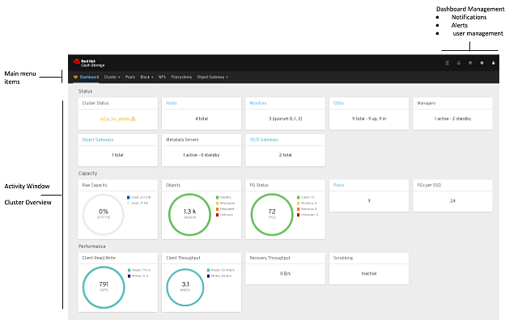
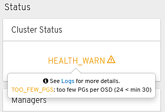
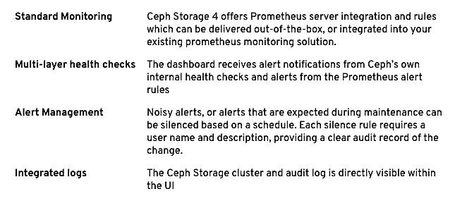

_The Red Hat Ceph Storage 4 Dashboard changes the game_

_with Paul Cuzner (Red Hat)_

Ease of use was a key development theme for Red Hat Ceph Storage 4. In our last post, we covered the role that the new install UI plays in enabling administrators to deploy Ceph Storage 4 in a simple and guided manner, without prior Ceph expertise.

Simplifying installation is only the first step—the second step is simplifying day-to-day management. To meet this challenge, Ceph Storage 4 introduces a new graphical user interface called the Dashboard.

# Ceph Storage Dashboard architecture

Ceph Storage 4 delivers a new web based User Interface (UI) to simplify and to a certain extent, de-mystify, the day-to-day management of a Ceph cluster. The UI has been developed to exploit the pluggable architecture of Ceph, consisting of:

- A Python backend providing stable API services and Ceph cluster integration
- A modern, [Angular](https://angular.io/) based, frontend application providing the UI
- Inherent fault tolerance through existing Ceph failover features
- Enhanced visualizations using embedded [Grafana](https://grafana.com/) dashboards
- Advanced monitoring and integrated alerting based on [Prometheus](https://prometheus.io/)

By placing the management interface inside the Ceph Storage cluster, resource requirements are reduced, deployment is simplified and management of the UI feature itself becomes a simple one-line Ceph command! There’s one more significant benefit to this design—data freshness. Data can be sourced directly from Ceph’s in-memory data structures—improving UI responsiveness and data accuracy.

# Exploring the UI

The Dashboard UI provides management and monitoring insights across various Ceph Storage components. However, you’ll be pleased to know that this article is not just going to walk you through a series of screenshots showing every single aspect of the UI—instead, we’re going to focus on the design elements of the UI that add value to Operational teams and Administrators.

# At-A-Glance Dashboard

When you first log in to the UI, you are presented with a summarized ‘at-a-glance’ view of the whole cluster, providing insight into cluster health and performance.

You can see that the UI consists of three main areas, the main menu, dashboard management and the main activity window. The dashboard menu uses a heart icon, styled in accordance with the cluster’s overall health—providing your first indicator of overall cluster health. The main window itself is rendered as a series of tiles depicting various attributes of “Status,” “Capacity” and “Performance.”

Most of the tiles also support some level of user interaction

- Hyperlinks to related management page
- Specific health check details currently active (just click HEALTH\_WARN)

The dashboard management area in the top right holds all alerts and notifications for the cluster. So no matter what task you’re working on, health and state information is always visible and available.

# Problem Determination features

Dealing with external events that impact any service is an operational fact of life. The challenge for Operations teams is having the right tools to be able to diagnose issues and respond to problems in a timely manner. The Ceph Storage Dashboard includes a number of features that support Operations teams.

# Performance Insights

The Prometheus instance within a Ceph Storage 4 cluster holds metric data from the integrated Ceph exporter, and the standard Prometheus node-exporter. This rich dataset enables the Ceph Storage 4 Dashboard to provide comprehensive visualisations that correlate hardware and software statistics through embedded Grafana dashboards.

The screenshot below illustrates this kind of correlation that this feature provides.

In the top part of the pane you can see the breakdown of the Object Store Daemons (OSDs) in the system, while the “Performance Details” tab in the lower half of the screen shows the performance profile of the physical device that supports that specific OSD.

Extending the Ceph Storage Dashboard with embedded Grafana is used throughout the UI to provide insights into cluster and host performance. One of the most useful things about this Grafana integration is that the Administrator can use all the standard Grafana [features](https://grafana.com/docs/grafana/latest/features/shortcuts/#dashboard) to interact with the charts, like zooming in, highlighting a specific series or even using shared graph crosshairs for easier correlation across multiple graphs.

# Configuration Tuning

In past releases of Ceph Storage, tuning and configuration of a cluster has required the Administrator to resort to the command line. With the Ceph Storage 4 Dashboard, the admin may now tune or query configuration settings from within the UI.

Each tunable provides additional information and context to better explain the purpose and impact that an option has on a cluster’s operation.

# Security features in Ceph Storage 4 Dashboard

The Ceph Storage 4 Dashboard provides extensive management capabilities for Ceph services and core Ceph configuration tunables. This level of control is provided through a user and role security layer which delivers granular access control to all of the Dashboard management features.

In addition, although common roles are provided out-of-the-box, the Dashboard supports custom roles. Custom roles enable organizations to better align access rights to dashboard features with the existing responsibilities of their operations teams.

# For the CIO’s Eyes Only

Usability (UX for friends) is a complex matter spanning [much more than just UI](https://f2.svbtle.com/ux-in-the-trash). Putting a UI on top of things seldom makes a system easier to use, and design decisions have to be applied about what options have to be taken away—to be replaced with defaults based on appropriate assumptions, or sophisticated automation trying to read the user’s mind.

Ceph is a flexible storage technology with hundreds of settings, so when deciding to provide a UI to make things “simpler,’ it is important to understand what mindset one is applying to the problem.

The Ceph Storage customer base is split roughly evenly between OpenStack customers who rank among the world’s top distributed systems expertise. These customers see Ceph as a relatively simple system to manage vis-a-vis [OpenStack Neutron](https://wiki.openstack.org/wiki/Neutron) and other more complex distributed subsystems—their management concerns are very specific and will be addressed in the next blog in our series.

The other half of the Ceph Storage customer base are customers deploying very large object store clusters in the 10 to 50 petabyte range and who wish to manage the cluster as little as possible. This is regardless of their level of expertise in managing distributed systems, which is highly variable. These customers are the focus of our effort around the management Dashboard.

The new management Dashboard targets a junior administrator persona at a site managing a medium to large S3-compatible object store installation. A key design intent was to enable the senior administrator to delegate simpler operations, like the replacement of failed disk drives or configuration of individual user settings like quotas, to administrators with little or no Ceph expertise.

Delegation through a role-based access controls (RBAC) mechanism can help provide peace of mind to the senior and junior admin that no mistakes are going to take place over functionality not explained as of yet, and let the senior admin make the best use of her staff while she is training them.

# What’s Next?

One of the key benefits of GUI based management is to simplify operational management and promote ease of use. We believe the Ceph Storage 4 Dashboard delivers on both of these goals.

However, product capabilities and use cases change over time—which in turn means evolving the UI to keep pace with the market and also our customers expectations. Some of the areas currently under investigation include:

- Simplifying the deployment model
- Deeper automation integration
- Improved support for infrequent workflows like cluster expansion and upgrade

There is no doubt that Ceph Storage 4 is a "milestone” release. It offers customers the ability to install and manage Ceph Storage with less effort, which helps Operations teams focus more on the business applications and less on the storage platform itself.

The aim of our management efforts is to enable a steady number of administrators to manage the ever-larger clusters that can be built with Ceph technology. Five years ago we christened Ceph Storage 1.3 the “petabyte release,” and five years later we have multiple customers with production deployments exceeding 50PB—predictably, the operations staff at customer sites did not scale 50X along with their storage, and better tools alongside with increased automation are the way we helped customers achieve this.

_Cross-posted to the [Red Hat Blog](https://www.redhat.com/en/blog/command-and-control-red-hat-ceph-storage-4-dashboard-changes-game)._

Source: Federico Lucifredi ([Command and Control](https://f2.svbtle.com/command-and-control))
