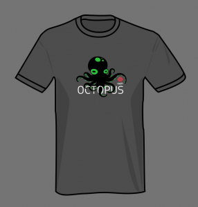

### Announcements

#### Virtual Ceph Days

Thank you to everyone who has participated in our Virtual Ceph Day questionnaire. We are still in the process of finalizing a platform and details. If you were previously selected as a presenter for the planned Cephalocon 2020 event, consider applying for the CFP.

#### Ceph Tech Talk for July 2020: A Different Scale - Running small ceph clusters in multiple data centers

The Ceph community keeps the tech talks going for 2020! We’ve heard introductions to the new release Octopus which brings many new improvements and enhancements; to exciting tales with solving the bug of the year in Ceph.

We decided this month small Ceph clusters needed attention and Yuval Freund has experience with this scale within multiple data centers. Catch us on July 23rd at 17:00 UTC live!

On August 27th hear about the STS ( Secure Token Service) in RGW by Pritha Srivastava.

If the time doesn’t work for you, make sure to subscribe to Ceph on [Youtube](https://www.youtube.com/cephstorage) and review the recording at your convenience.

[Subscribe to the community calendar](https://calendar.google.com/calendar/b/1?cid=OXRzOWM3bHQ3dTF2aWMyaWp2dnFxbGZwbzBAZ3JvdXAuY2FsZW5kYXIuZ29vZ2xlLmNvbQ)

[More on Ceph Tech Talks](https://ceph.io/ceph-tech-talks/)

#### User Survey 2019 Update

The user survey is expected to be released on July 20th. There were 405 responses from 60 different countries. Thank you to everyone who took the time to fill out this information.

#### Ceph Octopus Shirts

Where are they? Your community manager is having a bit of a late start this year, but the process is sort of going. The artwork has been completed; [Spreadshirt](https://www.spreadshirt.com/) will be pressing and shipping them and finally providing us a real storefront!

By the way, did we mention Spreadshirt deploys Ceph for their own internal use?

 If you contributed to Ceph for the Octopus release, you should receive an email to request a free shirt sometime in July.

## Project updates

#### Ceph Admin

- batch backport May (1) ([pr#34893](https://github.com/ceph/ceph/pull/34893), Michael Fritch, Ricardo Marques, Matthew Oliver, Sebastian Wagner, Joshua Schmid, Zac Dover, Varsha Rao)
- batch backport May (2) ([pr#35188](https://github.com/ceph/ceph/pull/35188), Michael Fritch, Sebastian Wagner, Kefu Chai, Georgios Kyratsas, Kiefer Chang, Joshua Schmid, Patrick Seidensal, Varsha Rao, Matthew Oliver, Zac Dover, Juan Miguel Olmo Martínez, Tim Serong, Alexey Miasoedov, Ricardo Marques, Satoru Takeuchi)
- batch backport June (1) ([pr#35347](https://github.com/ceph/ceph/pull/35347), Sebastian Wagner, Zac Dover, Georgios Kyratsas, Kiefer Chang, Ricardo Marques, Patrick Seidensal, Patrick Donnelly, Joshua Schmid, Matthew Oliver, Varsha Rao, Juan Miguel Olmo Martínez, Michael Fritch)
- batch backport June (2) ([pr#35475](https://github.com/ceph/ceph/pull/35475), Sebastian Wagner, Kiefer Chang, Joshua Schmid, Michael Fritch, shinhwagk, Kefu Chai, Juan Miguel Olmo Martínez, Daniel Pivonka)

#### Ceph Volume

- add and delete lvm tags in a single lvchange call ([pr#35452](https://github.com/ceph/ceph/pull/35452), Jan Fajerski)
- add ceph.osdspec\_affinity tag ([pr#35134](https://github.com/ceph/ceph/pull/35134), Joshua Schmid)

#### CephFS

- allow pool names with hyphen and period ([pr#35251](https://github.com/ceph/ceph/pull/35251), Ramana Raja)
- bash\_completion: Do not auto complete obsolete and hidden cmds ([pr#34996](https://github.com/ceph/ceph/pull/34996), Kotresh HR)
- cephfs-shell: Change tox testenv name to py3 ([pr#34998](https://github.com/ceph/ceph/pull/34998), Kefu Chai, Varsha Rao, Aditya Srivastava)
- client: expose Client::ll\_register\_callback via libcephfs ([pr#35150](https://github.com/ceph/ceph/pull/35150), Jeff Layton)
- client: fix Finisher assert failure ([pr#34999](https://github.com/ceph/ceph/pull/34999), Xiubo Li)
- client: only set MClientCaps::FLAG\_SYNC when flushing dirty auth caps ([pr#34997](https://github.com/ceph/ceph/pull/34997), Jeff Layton)
- fuse: add the ‘-d’ option back for libfuse ([pr#35449](https://github.com/ceph/ceph/pull/35449), Xiubo Li)
- mds: Handle blacklisted error in purge queue ([pr#35148](https://github.com/ceph/ceph/pull/35148), Varsha Rao)
- mds: preserve ESlaveUpdate logevent until receiving OP\_FINISH ([pr#35253](https://github.com/ceph/ceph/pull/35253), songxinying)
- mds: take xlock in the order requests start locking ([pr#35252](https://github.com/ceph/ceph/pull/35252), “Yan, Zheng”)
- src/client/fuse\_ll: compatible with libfuse3.5 or higher ([pr#35450](https://github.com/ceph/ceph/pull/35450), Jeff Layton, Xiubo Li)
- vstart\_runner: set mounted to True at the end of mount() ([pr#35447](https://github.com/ceph/ceph/pull/35447), Rishabh Dave)

#### Dashboard

- Support for managing individual OSD settings/characteristics — [https://github.com/ceph/ceph/pull/24606](https://github.com/ceph/ceph/pull/24606)
- UI to configure Cluster-wide OSD Flags — [https://github.com/ceph/ceph/pull/22461](https://github.com/ceph/ceph/pull/22461)
- Ceph dashboard user management from the UI — [https://github.com/ceph/ceph/pull/22758](https://github.com/ceph/ceph/pull/22758)
- Support for changing dashboard configuration settings via the REST API — [https://github.com/ceph/ceph/pull/22457](https://github.com/ceph/ceph/pull/22457)
- A REST API and UI for managing roles — [https://github.com/ceph/ceph/pull/23322](https://github.com/ceph/ceph/pull/23322) and [https://github.com/ceph/ceph/pull/23409](https://github.com/ceph/ceph/pull/23409)
- Added support for managing individual OSD settings in the backend — [https://github.com/ceph/ceph/pull/23491](https://github.com/ceph/ceph/pull/23491)
- Added support for RBD Trash — [https://github.com/ceph/ceph/pull/23351](https://github.com/ceph/ceph/pull/23351)
- Grafana graphs integration with dashboard — [https://github.com/ceph/ceph/pull/23666](https://github.com/ceph/ceph/pull/23666)
- A UI to manage cluster configuration settings — [https://github.com/ceph/ceph/pull/23230](https://github.com/ceph/ceph/pull/23230)
- Ceph Pool management (create/update/delete) — [https://github.com/ceph/ceph/pull/21614](https://github.com/ceph/ceph/pull/21614)
- Grafana dashboard updates and additions — [https://github.com/ceph/ceph/pull/24314](https://github.com/ceph/ceph/pull/24314)
- JWT authentication — [https://github.com/ceph/ceph/pull/22833](https://github.com/ceph/ceph/pull/22833)
- SSO - SAML 2.0 support — [https://github.com/ceph/ceph/pull/24489](https://github.com/ceph/ceph/pull/24489)
- Audit REST API calls — [https://github.com/ceph/ceph/pull/24475](https://github.com/ceph/ceph/pull/24475)
- I18N support — [https://github.com/ceph/ceph/pull/24803](https://github.com/ceph/ceph/pull/24803)
- Erasure Code Profile management — [https://github.com/ceph/ceph/pull/24627](https://github.com/ceph/ceph/pull/24627)
- CRUSH Map Viewer — [https://github.com/ceph/ceph/pull/24766](https://github.com/ceph/ceph/pull/24766)
- Add rbd-image details dashboard ([pr#35247](https://github.com/ceph/ceph/pull/35247), Enno Gotthold)
- Asynchronous unique username validation for User Component ([pr#34849](https://github.com/ceph/ceph/pull/34849), Nizamudeen)
- ECP modal enhancement ([pr#35152](https://github.com/ceph/ceph/pull/35152), Stephan Müller)
- Fix HomeTest setup ([pr#35085](https://github.com/ceph/ceph/pull/35085), Tiago Melo)
- Fix e2e chromium binary validation ([pr#35679](https://github.com/ceph/ceph/pull/35679), Tiago Melo)
- Fix random E2E error in mgr-modules ([pr#35706](https://github.com/ceph/ceph/pull/35706), Tiago Melo)
- Fix redirect after changing password ([pr#35243](https://github.com/ceph/ceph/pull/35243), Tiago Melo)
- Prevent dashboard breakdown on bad pool selection ([pr#35135](https://github.com/ceph/ceph/pull/35135), Stephan Müller)
- Proposed About Modal box ([pr#35291](https://github.com/ceph/ceph/pull/35291), Ngwa Sedrick Meh, Tiago Melo)
- Reduce requests in Mirroring page ([pr#34992](https://github.com/ceph/ceph/pull/34992), Tiago Melo)
- Replace Protractor with Cypress ([pr#34910](https://github.com/ceph/ceph/pull/34910), Tiago Melo)
- Show labels in hosts page ([pr#35517](https://github.com/ceph/ceph/pull/35517), Volker Theile)
- Show table details inside the datatable ([pr#35270](https://github.com/ceph/ceph/pull/35270), Sebastian Krah)
- add telemetry report component ([pr#34850](https://github.com/ceph/ceph/pull/34850), Tatjana Dehler)
- displaying Service detail inside the table ([pr#35269](https://github.com/ceph/ceph/pull/35269), Kiefer Chang)
- fix autocomplete input backgrounds in chrome and firefox ([pr#35718](https://github.com/ceph/ceph/pull/35718), Ishan Rai)
- grafana panels for rgw multisite sync performance ([pr#35693](https://github.com/ceph/ceph/pull/35693), Alfonso Martínez)
- monitoring menu entry should indicate firing alerts ([pr#34822](https://github.com/ceph/ceph/pull/34822), Tiago Melo, Volker Theile)
- redesign the login screen ([pr#35268](https://github.com/ceph/ceph/pull/35268), Ishan Rai)
- remove space after service name in the Hosts List table ([pr#35531](https://github.com/ceph/ceph/pull/35531), Kiefer Chang)
- replace hard coded telemetry URLs ([pr#35231](https://github.com/ceph/ceph/pull/35231), Tatjana Dehler)
- Add troubleshooting guide ([pr#34947](https://github.com/ceph/ceph/pull/34947), Tatjana Dehler)

#### Orchestrator

- Nautilus: Deepsea orchestrator now supports configuring the Ceph Dashboard (v14.2.3)

- Work started on adding container support for the SSH orchestrator

- Rook orchestrator now supports \`ceph orchestrator host ls\`

#### Rados

- \- ceph-bluestore-tool: the ability to add/remove/resize db and wal for an existing bluestore osd
- osd: pg merging has merged
- osd, bluestore: new single osd\_memory\_target option to control osd memory consumption (obsoletes bluestore\_cache\_size)
- mon: track hardware device health for mons, just like osds

#### Rados Block Device

- Live image migration: an in-use image can be migrated to a new pool or to a new image with different layout settings with minimal downtime.
- Simplified mirroring setup: The monitor addresses and CephX keys for remote clusters can now be stored in the local Ceph cluster.
- Initial support for namespace isolation: a single RBD pool can be used to store RBD images for multiple tenants
- Simplified configuration overrides: global, pool-, and image-level configuration overrides now supported
- Image timestamps: last modified and accessed timestamps are now supported

#### Rados Gateway

- add “rgw-orphan-list” tool and “radosgw-admin bucket radoslist …” ([pr#34991](https://github.com/ceph/ceph/pull/34991), J. Eric Ivancich)
- amqp: fix the “routable” delivery mode ([pr#35433](https://github.com/ceph/ceph/pull/35433), Yuval Lifshitz)
- anonomous swift to obj that don’t exist should 401 ([pr#35120](https://github.com/ceph/ceph/pull/35120), Matthew Oliver)
- fix bug where bucket listing end marker not always set correctly ([pr#34993](https://github.com/ceph/ceph/pull/34993), J. Eric Ivancich)
- fix rgw tries to fetch anonymous user ([pr#34988](https://github.com/ceph/ceph/pull/34988), Or Friedmann)
- : fix some list buckets handle leak ([pr#34985](https://github.com/ceph/ceph/pull/34985), Tianshan Qu)
- gc: Clearing off urgent data in bufferlist, before ([pr#35434](https://github.com/ceph/ceph/pull/35434), Pritha Srivastava)
- lc: enable thread-parallelism in RGWLC ([pr#35431](https://github.com/ceph/ceph/pull/35431), Matt Benjamin)
- notifications: fix zero size in notifications ([pr#34940](https://github.com/ceph/ceph/pull/34940), J. Eric Ivancich, Yuval Lifshitz)
- notifications: version id was not sent in versioned buckets ([pr#35254](https://github.com/ceph/ceph/pull/35254), Yuval Lifshitz)
- radosgw-admin: fix infinite loops in ‘datalog list’ ([pr#34989](https://github.com/ceph/ceph/pull/34989), Casey Bodley)
- url: fix amqp urls with vhosts ([pr#35432](https://github.com/ceph/ceph/pull/35432), Yuval Lifshitz)

### Releases

- [Octopus v15.2.4](https://ceph.io/releases/v15-2-4-octopus-released/)
- [Octopus v15.2.3](https://ceph.io/community/v15-2-3-octopus-released/)
- [Octopus v15.2.2](https://ceph.io/community/v15-2-2-octopus-released/)

### Ceph Planet

- [Part - 4: RHCS 3.2 Bluestore Advanced Performance Investigation](https://ceph.io/community/part-4-rhcs-3-2-bluestore-advanced-performance-investigation/)

### Project Meeting Recordings

[All meetings](https://ceph.io/community/meetings/)

#### [**Ceph Tech Talk**](https://www.youtube.com/playlist?list=PLrBUGiINAakM36YJiTT0qYepZTVncFDdc)

- [What’s New In Octopus by Josh Durgin and Lenz Grimmer](https://youtu.be/UGU-rGiEex8)
- [Solving the Bug of the Year by Dan van der Ster](https://www.youtube.com/watch?v=_4HUR00oCGo)

#### [**Ceph Code Walkthrough**](https://www.youtube.com/playlist?list=PLrBUGiINAakN87iSX3gXOXSU3EB8Y1JLd)

- [Overview of the Monitor](https://www.youtube.com/watch?v=5VPXOZzdKSw)

#### [**Ceph Crimson/SeaStor OSD Weekly**](https://www.youtube.com/playlist?list=PLrBUGiINAakOXlMQbSdZB_PoLhqpSa3NU)

- [2020-05-05](https://youtu.be/cx7v0PN4DY0)
- [2020-05-12](https://youtu.be/FU5ZLH5ac0U)
- [2020-05-20](https://youtu.be/3x2_Dk5ZUAM)
- [2020-05-27](https://youtu.be/f8pNbl5Vq_w)
- [2020-06-03](https://www.youtube.com/watch?v=QZdE818V1sw)
- [2020-06-10](https://www.youtube.com/watch?v=bJUbONWtJiU)
- [2020-06-17](https://www.youtube.com/watch?v=w1746flF_8Q)
- [2020-06-24](https://www.youtube.com/watch?v=Eb9v9DWaWOc)
- [Full playlist](https://www.youtube.com/playlist?list=PLrBUGiINAakOXlMQbSdZB_PoLhqpSa3NU)

#### [**Ceph Developers Monthly**](https://www.youtube.com/playlist?list=PLrBUGiINAakNbcSOvOM0IJHqqv5dzusZ6)

- [Ceph Developers Monthly (July 2019)](https://www.youtube.com/watch?v=tK_gIAp7BWA&list=PLrBUGiINAakNbcSOvOM0IJHqqv5dzusZ6&index=36)

#### [**Ceph DocUBetter**](https://www.youtube.com/playlist?list=PLrBUGiINAakNe0PzkhHnr1c54O7Zh--zy)

- [2020-05-13](https://youtu.be/kYLMXkn_Rmo)
- [2020-06-10](https://www.youtube.com/watch?v=JUxB6h63qkA)
- [Full playlist](https://www.youtube.com/playlist?list=PLrBUGiINAakNe0PzkhHnr1c54O7Zh--zy)

#### [**Ceph Performance Weekly**](https://ceph.com/performance-2/)

- [2020-05-07](https://youtu.be/pQclEtdNj0k)
- [2020-05-14](https://youtu.be/aw6HXjn2Des)
- [2020-05-21](https://youtu.be/EZ6gHPthDMs)
- [2020-06-04](https://www.youtube.com/watch?v=oBFduq602vo)
- [2020-06-11](https://www.youtube.com/watch?v=zIQb3KhmMUU)
- [2020-06-18](https://www.youtube.com/watch?v=J8A39vmXT9o)
- [2020-06-25](https://www.youtube.com/watch?v=zL21CJRAHFg)
- [Full playlist](https://www.youtube.com/playlist?list=PLrBUGiINAakN2qXjxSgfmIwCCLqgiyBqw)

#### [**Ceph Orchestration**](https://www.youtube.com/playlist?list=PLrBUGiINAakMAVH7XC1FyE22rjUB4IWYZ)

- [2020-05-04](https://youtu.be/HjhRHgAU0_o)
- [2020-05-11](https://youtu.be/GXr__TG_xME)
- [2020-05-18](https://youtu.be/oKgP9Z2Gdf0)
- [2020-05-25](https://youtu.be/P7pTp0w9GnQ)
- [2020-06-01](https://www.youtube.com/watch?v=4oGb86RNPRs)
- [2020-06-08](https://www.youtube.com/watch?v=M6gS-gvxpek)
- [2020-06-15](https://www.youtube.com/watch?v=h2P0jl3N0QA)
- [2020-06-22](https://www.youtube.com/watch?v=7rJ38EcnC28)
- [2020-06-29](https://www.youtube.com/watch?v=vUAm58Db978)
- [Full playlist](https://www.youtube.com/playlist?list=PLrBUGiINAakMAVH7XC1FyE22rjUB4IWYZ)

#### [**Ceph Science Working Group**](https://www.youtube.com/playlist?list=PLrBUGiINAakM3d4bw6Rb7EZUcLd98iaWG)

- [2020-05-27](https://youtu.be/6p8tHVQNk0Q)
- [Full playlist](https://www.youtube.com/playlist?list=PLrBUGiINAakM3d4bw6Rb7EZUcLd98iaWG)
