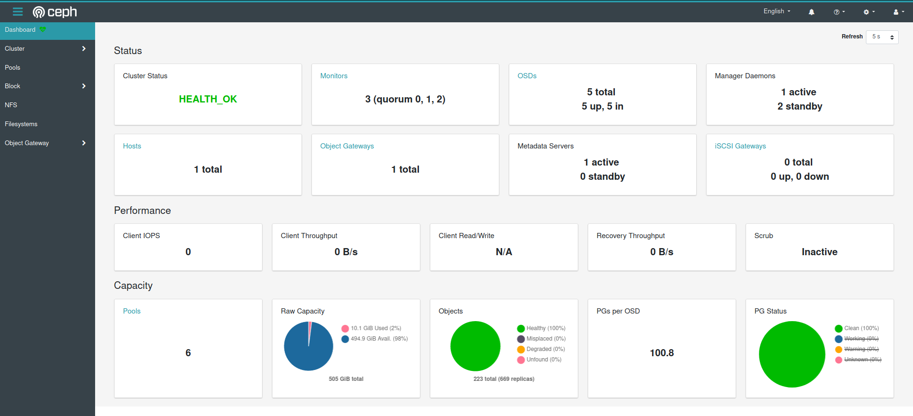
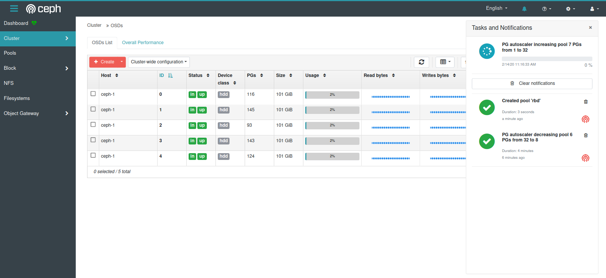
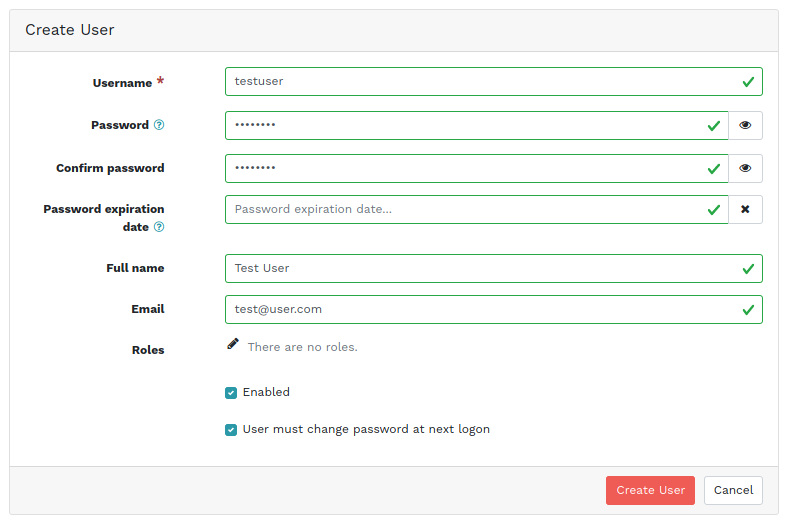
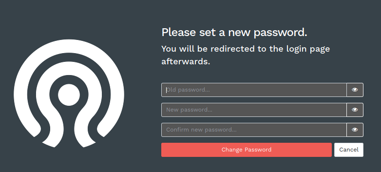
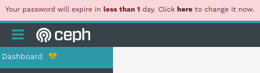
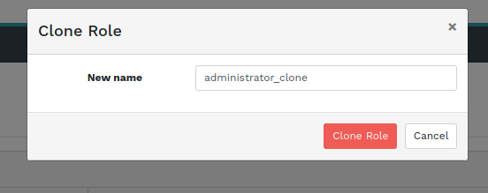

[Ceph Dashboard](https://docs.ceph.com/docs/master/mgr/dashboard/) is a built-in web-based management and monitoring application that is part of the open source Ceph distribution.

Like in previous Ceph releases, the Dashboard developer community has been very active in adding new features and improving existing functionality.

In this article, I'd like to cover the most noteworthy overall user interface enhancements that hopefully help to make the Dashboard easier to use as well as talk about some new features related to the Dashboard's built-in user management.

Ceph Dashboard Landing Page

The first thing you will notice after logging in to the dashboard is the new layout with a vertical navigation bar to the left that can be hidden by clicking the classical "Hamburger Menu" in the top left corner.

The new layout was chosen because we added many new features that made a horizontal navigation bar look too crowded. The possibility to hide it by sliding it to the side creates additional screen real estate that we can use to display more information.

This landing page was specifically designed to display all of your cluster's key metrics and high-level information at a glance, so you can put this screen on an HD monitor in your data center.

Many of the landing page's cards allow you to drill down into further information by clicking on blue labels. This will take you to dedicated pages that will show more information.

Ceph Dashboard Navigation and Notification Bar

This picture shows two other noteworthy changes that we've added. On the right, you can see the unified tasks and notifications bar that shows both ongoing activity and background tasks running in your cluster as well as past notifications. You can either remove them individually or all at once.

The OSD table shows an example of the new multi-row selection feature. Here, you can mark multiple OSDs using the checkbox to the left of each row and then perform a bulk action on all of them.

In addition to usability improvements mentioned above, we also continued adding more functionality and safety features to the dashboard's built-in user account and password management.

Ceph Dashboard User Creation Dialogue

User accounts can now be disabled temporarily or permanently without the need to delete them.

It's now also possible to force users to change their initial password at the first login, and they can also change their passwords via the Dashboard without administrator intervention at any time. The Dashboard can also enforce a variety of password complexity rules if required, or let passwords expire after a configurable amount of time.

Ceph Dashboard Password Change Dialogue

Dashboard Password Expiration Notification

While most of these password features are disabled by default, they can be enabled and configured individually to help adhering to any local password security policies that may be in force.

Last but not least, it's now also possible to clone existing roles to save time when creating new ones that are similar to already existing roles:

Dashboard Clone Role Dialogue

This quickly summarizes the most notable changes to the Ceph Dashboard itself. In a following article I'll focus on the more Ceph-specific changes and new management features in the Ceph Octopus Dashboard. We hope that these features make the Dashboard easier to integrate and use!

If you have any specific suggestions about how to enhance the Dashboard, we're eager to hear from you! You can either submit feedback by [reporting bugs](https://tracker.ceph.com/projects/mgr/issues/new) or by joining us on IRC (#ceph-dashboard) or the dev@ceph.io [mailing list](https://ceph.io/irc/)!
