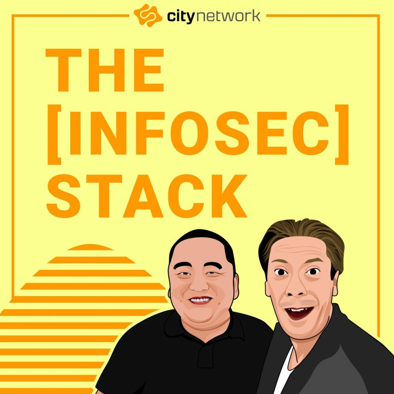

Today we are launching our new English podcast, **The \[InfoSec\] Stack**.

After four years of discussing information security, regulatory compliance, and many other topics in [Swedish](https://citynetwork.se/podcast), it is now time for us to reach a broader audience.

- 
    
- 
    

[Kim Hindart](https://www.linkedin.com/in/kimhindart/) & [Daniel Gustafsson](https://www.linkedin.com/in/daniel-gustafsson-73727120/)

New episodes will be released weekly and you can subscribe to our podcast in most popular podcast apps such as Apple podcasts, Google Podcasts and Spotify.

[

VISIT WEBSITE

](https://citynetwork.eu/podcast)

![The [Infosec] Stack](images/8492474-1600352410764-dbf64feca7ffa-768x768.jpg)

The \[Infosec\] Stack

We discuss, analyze, and educate in the field of information security. Our aim is to touch on all subjects, from regulatory compliance and new laws to current cases, leadership, and business culture.

## Podcast Subscription Menu

- [Visit Website](https://citynetwork.eu/stacken)
- [RSS Feed](https://anchor.fm/s/33371328/podcast/rss)

3\. Mental beer belly

by City Network

The biggest challenge in information security is the human factor. This is why it is equally important to stay mentally active as it is physically.

Join us for some discussions about sudden changes, leadership and mental training.

[https://www.learning-mind.com/mental-laziness-causes-overcome/](https://www.learning-mind.com/mental-laziness-causes-overcome/)

[Podcast webpage](https://citynetwork.eu/podcast)

—

Send in a voice message: https://anchor.fm/the-infosec-stack/message

Search Episodes Clear Search

[3\. Mental beer belly](https://anchor.fm/the-infosec-stack/episodes/3--Mental-beer-belly-ejll09)

September 17, 2020

City Network

[2\. Introduction to group dynamics](https://anchor.fm/the-infosec-stack/episodes/2--Introduction-to-group-dynamics-ejoskv)

September 17, 2020

City Network

[1\. What is information security?](https://anchor.fm/the-infosec-stack/episodes/1--What-is-information-security-ej4gjc)

September 17, 2020

City Network

[Trailer – The \[InfoSec\] Stack](https://anchor.fm/the-infosec-stack/episodes/Trailer---The-InfoSec-Stack-ej37o6)

September 17, 2020

City Network

Search Results placeholder

Previous Episode

Show Episodes List

Next Episode

Show Podcast Information

## About The \[InfoSec\] Stack 

In The \[InfoSec\] Stack, [Daniel Gustafsson](https://www.linkedin.com/in/daniel-gustafsson-73727120/) and [Kim Hindart](https://www.linkedin.com/in/kimhindart/) are analyzing current events and cases, share our experience in IT security, leadership, and workplace culture. We also discuss how new privacy laws and directives affect both businesses and individuals.

What is information security? What are the requirements for regulatory compliance, and what does it mean? Are there any new laws that will affect our continued ability to drive digital transformation? Why will business culture be a decisive factor in making our IT strategy work?

Many things affect our digital stack right now, and it is not always easy to know how to act. If you also find this a bit challenging, this is the podcast for you.

[

VISIT WEBSITE

](https://citynetwork.eu/podcast)

The post [The \[InfoSec\] Stack](https://citynetwork.eu/news/the-infosec-stack/) appeared first on [City Network](https://citynetwork.eu).

Source: Hastexo ([The \[InfoSec\] Stack](https://citynetwork.eu/news/the-infosec-stack/))
