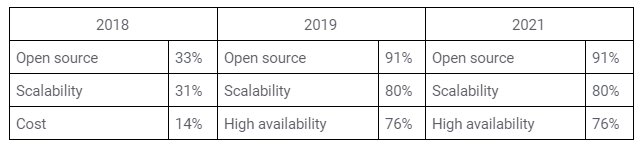
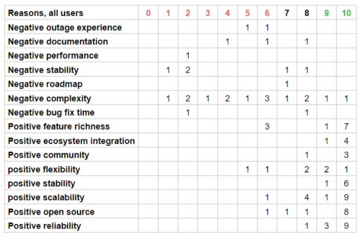

For the third year, we surveyed the population of Ceph users and published that data for the benefit of all interested. Thank you to the 245 respondents who shared your usage, information, and opinions this year. 

The purpose of this survey is to better understand how Ceph technologies have been adopted and to understand our users’ priorities. Participation remains optional, open to the public, anonymous, and self-directed, therefore the validity of the data relies on trusting the community and public to provide accurate information. We cannot claim that the survey is generally representative of the population of Ceph users, but it is interesting and useful to note the consistency in some responses over the years. 

You can find both the report and raw data below.

- [2021 Ceph User Survey Results](attachments/Ceph-User-Survey-2021.pdf) 
- [2021 Ceph User Survey Raw Data](attachments/Ceph-User-Survey-2021-raw-results.csv) 

Because this is the third year, we can provide some insight into how usage patterns and priorities of those who have participated in the survey have changed over time. Here are some of the highlights that I and others in the [User Survey Working Group](https://tracker.ceph.com/projects/ceph/wiki/User_Survey_Working_Group) found insightful.

# Why do you use Ceph?

Sometimes the survey data reveals how the survey has changed over time. In 2018, we asked users to identify their single most important reason for using Ceph, and you can see the results below. In 2019 and 2021, the question asked for all of the reasons why users choose Ceph. 

The results reveal that the value of open source and scalability have consistently remained among the top priorities, and when users are allowed to select multiple usage considerations then high availability becomes the third most important characteristic. Those usage drivers align very well with the stated core values of the project, which Sage reiterated in the recent [Pacific release video](https://ceph.io/releases/v16-2-0-pacific-released/). 

## Top 3 reasons why users choose Ceph

# Who uses Ceph?

Ceph users report deployments across all continents except Antarctica (for now!) and have consistently had this geographic distribution over time. While 2018 asked only for region, 2019 and 2021 asked for country-level information. The distribution of regions has remained relatively consistent across all surveys. If you don’t see your country represented here and didn’t take the survey, please leave a comment below so we can make sure you get an honorable mention.

# What sector(s) of your organizations use Ceph? 

Those who self-identify using Ceph within commercial segments of their organization have remained fairly consistent over the years, with commercial segments representing the overwhelming majority at an average over three years of 64%. While in previous surveys we asked users to identify a single organization type, this year we allowed organizations to select more than one sector which reflects organizations with varied missions. 20% of respondents identified as having multiple missions, typically combinations of commercial, academic, and/or government. You can find this year’s distribution below.

# Where do users want the Ceph Community to focus efforts? 

The survey asked three different kinds of questions to gain insight into Ceph community priorities. Each question provided a different framing language, and the results show some intriguing variations in responses. 

## Based on weighted category prioritization

When asked “Where do you think the Ceph developer community should focus its efforts?” and given a pre-defined set of responses, users rank priorities as seen below, with 'reliability' as the clear top priority and 'performance' and 'documentation' effectively tied for second. 

## Based on net promoter score responses

For the last two years, the survey has included the classic [net promoter score](https://en.wikipedia.org/wiki/Net_Promoter) question “How likely are you to recommend Ceph to a colleague?” and provided an opportunity to share the top reason for picking that answer. 

After recoding the qualitative answers into categories for quantification (which is more of an art than a science, but it’s useful), the heat map for responses looks like this. 

Within the context of this lens, it appears that 'complexity' overwhelmingly drags down user satisfaction, even appearing within the responses of some promoters. Would making Ceph easier to use and understand turn those detractors into promoters? If you were one of those, let us know in the comments! 

While 'reliability' and 'scalability' more frequently appeared as cause for promoter scores (a score of 9 or 10), neither good nor bad performance factored significantly into the decision. 

## Based on open-ended wish list priorities 

We similarly asked users to identify their top wishlist features, another indicator of priorities. In this case, rather than asking users to prioritize feature categories, they were asked to provide a short qualitative response. Encoding the responses (again, some subjectivity in this but a good way to add structure to the data) result in the graph below. 

These results indicate that users are comfortable with the current level of reliability because no feature requests fell into that category, consistent with the NPS responses but inconsistent with the weighted category prioritization. 'Ease of use' (the inverse of complexity?) features appeared as the second-most commonly requested feature, consistent with the NPS responses, but inconsistent with weighted category prioritization. 

Performance-related requests appeared most frequently, consistent with the weighted category prioritization, but inconsistent with the NPS responses. Users seem generally satisfied with the current levels of performance based on the lack of negative NPS responses, but when asked they frequently request performance-related features. I wonder if this is related to an organizational trend to consolidate more workloads or storage service tiers into fewer disparate storage systems. 

# More user behavior insights

The majority of users reported running Nautilus or earlier (71%), which does not match users’ stated upgrade behaviors, with 63% claiming to update major releases within a year or sooner after the release is available. While one might assume that users would run Octopus side-by-side with an earlier release to test prior to rolling the new version, only 19% of users report doing so. 

Usage of AMD CPU usage jumped from nearly non-existent in previous surveys to 29% this year, and ARM saw an increase in usage as well, steadily increasing from 1%, in 2018, to 5% in 2019, and now 12% in the latest survey. 

HDDs continue to represent the most commonly reported kind of storage device in use on Ceph clusters, although SSD appears to be rapidly catching up. NVMe device use has also grown, but not apace with non-NVMe SSDs. 15 users reported using Optane in the 2019 survey, but that number decreased to 3 in 2021. 

23% of users reported using their clusters exclusively for one storage interface, demonstrating that users appreciate the versatility of multiple storage interfaces from a single cluster. This number is reinforced by the fact that 34% of users reported a single-use purpose for their Ceph cluster, the other 66% using the cluster for at least two distinct use cases. 

The most common single-protocol clusters in use provided RBD, with 26 users reporting. Changes in reported Ceph storage interfaces are shown below.

# Limitations, caveats, etc.

I do not claim to have taken an exhaustive look at the survey results, data collection methods, or respondent outreach methods to look for bias or assess how well the data can be used to provide generalizable conclusions. And I don’t want to imply that these results reflect the whole Ceph community. 

In spite of that, I found the data useful for creating some hypotheses about user behaviors. Hopefully you find the data and results insightful or interesting too. 

It is our hope to improve the quality of the survey and the results over time through increased participation from the Ceph community. To that end, please let us know the best ways to reach you and your colleagues by leaving a comment below.
