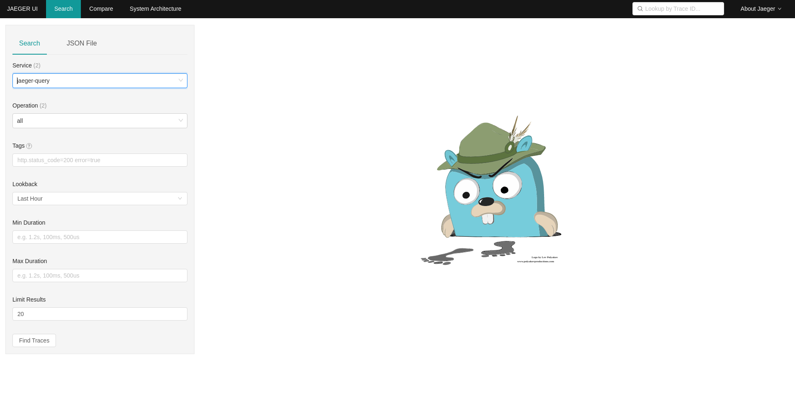
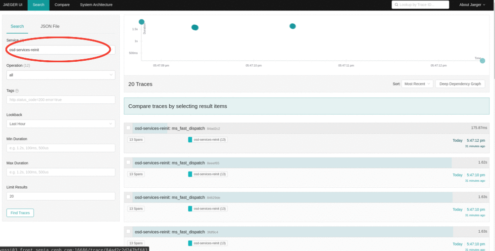
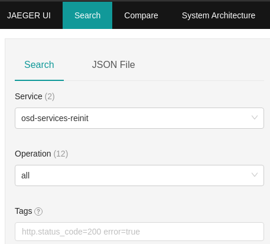
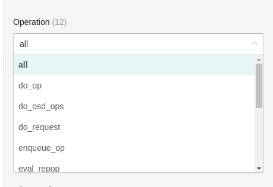
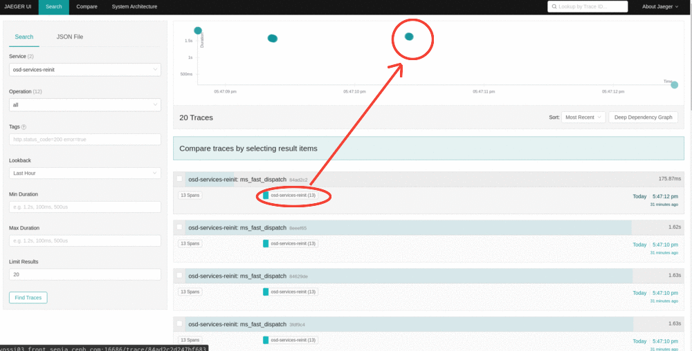
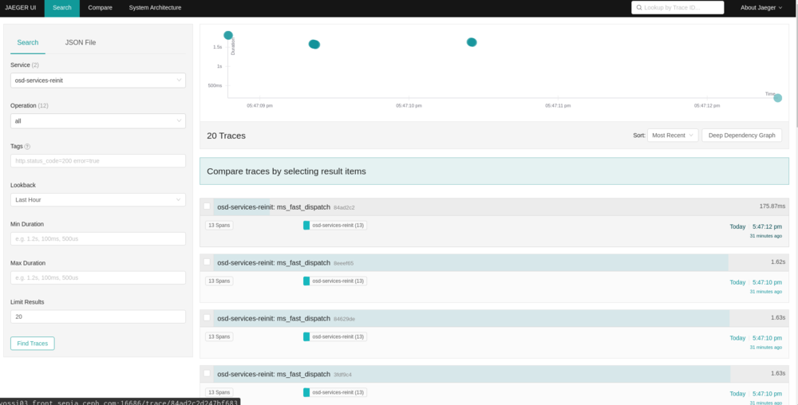
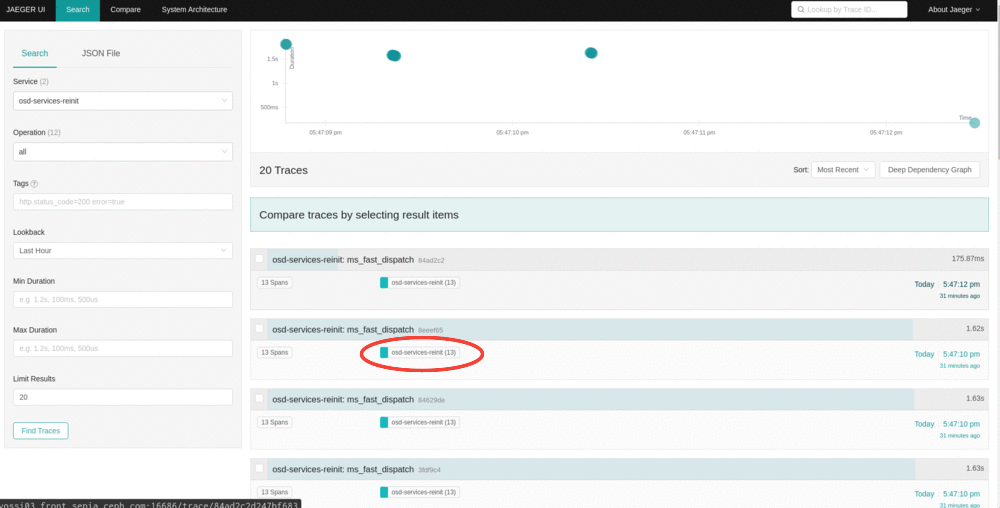
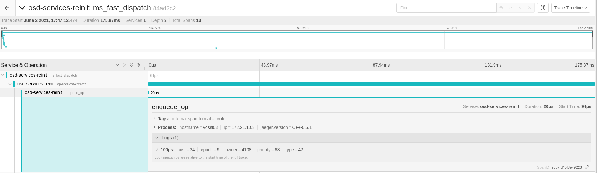
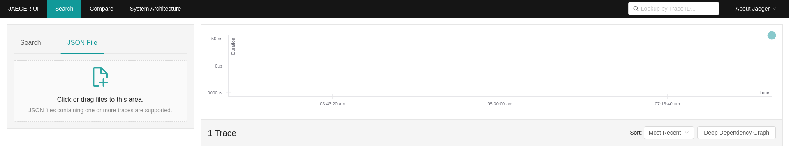

# Jaeger Blog for Pacific

# Distributed Tracing using Jaeger in Ceph

Distributed systems like Ceph can be a nightmare to debug because they do not have a single point of failure. To address this, we have been working on adding a standard distributed tracing solution, Jaeger, to Ceph. Jaeger is a distributed tracing open-source library and a project under CNCF. Jaeger will provide more visibility into Ceph’s distributed background processes and help users identify abnormalities, hence, “**making Ceph more transparent”.**

This blog presents an opportunity to learn about using tracing for debugging Ceph - perfect for those looking to identify performance bottlenecks, latency optimization and abnormalities in distributed transactions.

We are happy to announce initial support for Jaeger in the Pacific release of Ceph!

**How Does It Work?**

[Jaeger](https://www.jaegertracing.io/docs)(tracing backend) along with [Opentracing](https://opentracing.io/docs/supported-tracers/)(API) provides ready-to-use tracing services for distributed systems and is becoming a widely used, de facto standard because of its simplicity.

Jaeger is responsible for the collection of spans. These spans are made with the use of smart pointers. They include a timestamp, TraceID, and other meta info, like a specific tag/log associated with the span, to be uniquely identified across the distributed system. These are then correlated to generate visualizations(trace) of the lifetime of a request.

credits: jaeger documentation

## Let's try it out!

Let's take a look into tracing the core functions involved in Ceph's input-output transactions. Please skip the next section if you have the jaeger backend set up for working with Ceph.

For information on how to set it up, please refer to the documentation: [https://docs.ceph.com/en/latest/dev/developer_guide/jaegertracing/](https://docs.ceph.com/en/latest/dev/developer_guide/jaegertracing/)

## Deploying Jaeger Services

We are going to use vstart for getting started with tracing.

For this please ensure you have:

1. Ceph compiled with `WITH_JAEGER=ON`.
2. deployed jaeger backend services - to deploy the Jaeger Backend service using the vstart development cluster you just need to pass the `--jaeger` option.

By following the above steps, you should be able to set up all the Jaeger services and access the JaegerUI at [http://localhost:16686](http://localhost:16686/).

Read more: [https://www.jaegertracing.io/docs/1.20/getting-started/#all-in-one](https://www.jaegertracing.io/docs/1.20/getting-started/#all-in-one)

(JaegerUI at [http://localhost:16686](http://localhost:16686/) )

If for some reason you are not able to access JaegerUI, retry manually running Jaeger services using:

## Tracing Core Services

Now that we have Jaeger Services up and running, let's take a look into Ceph’s core services tracing.

Ceph currently can trace operations in the OSD I/O path and we'll be it demonstrating here:

We'll perform a simple write operation, for which we are using rados bench write. You can use any other available write interface of your choice.

On refreshing the JaegerUI ([http://localhost:16686](http://localhost:16686/)), you should be able to see osd-services in the services field, which specify the traced OSD processes in a lifetime of a request.

Right below is the Operations field, which lists the spans collected, clicking on which shall give you traces containing it.

we see a list of the traces gathered by our recent write operation, and an x(time)-y(duration) graph with traces as data points.

when you click on any of the traces, it should expand into all the spans and metadata stored in them.

We can store Ceph's metadata in the form of tags and logs while creating a span, as seen below; logs field carrying Ceph's relevant metadata.

There you have your internal processes visualized!

**Exporting Traces as JSON**

These traces are portable! They can be converted into JSON output, which can be rendered on other systems using the JaegerUI.

**Demo**

<iframe
  width="560"
  height="315"
  src="https://bluejeans.com/s/fcnR5lu_lBR"
  title="Quick Demo of using JaegerUI for Ceph"
  frameborder="0"
  allow="accelerometer; autoplay; clipboard-write; encrypted-media; gyroscope; picture-in-picture"
  allowfullscreen
></iframe>

**What’s Next**

This project is still a work in progress, however with the orchestration of the right information as real-time traces, we will be having an end-to-end tracing, which can make debugging much easier, so understanding the internals of Ceph!

We look forward to improving the observability of Ceph overall.

We have some tasks lined up for improving tracing support, extending tracing support to clients( RGW, CephFS, RBD) and integration with OSD traces, improving deployment strategies for always-on monitoring of high-level traces.

If this sounds exciting to you, we welcome contributions in the form of PRs!

Please feel free to reach out over the ceph-devel list or IRC for queries!
