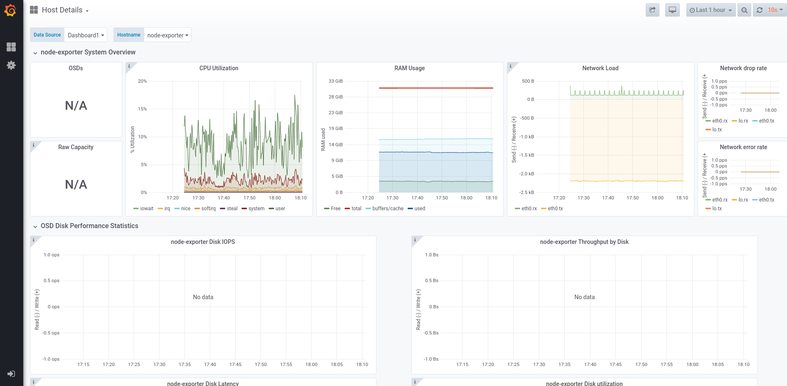
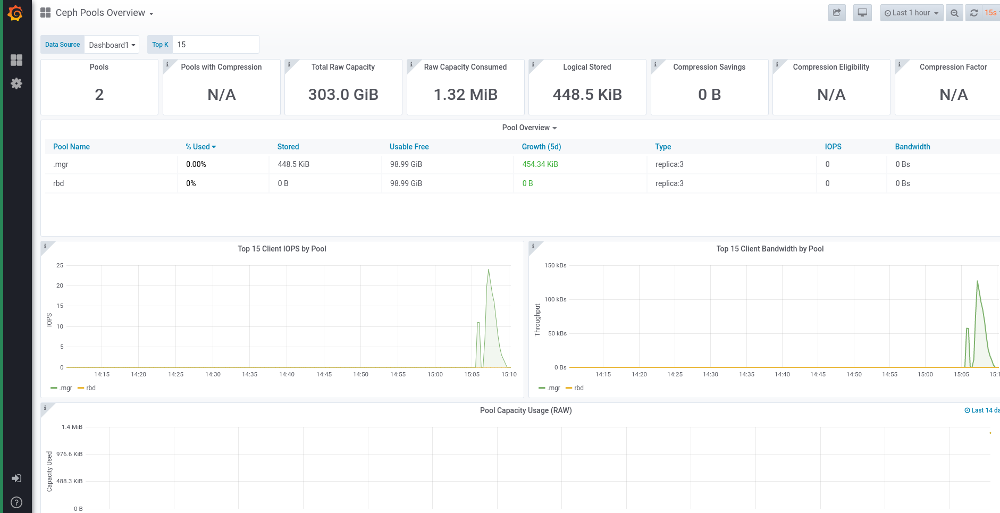

The process of maintaining grafana dashboards or updating the dashboard JSON files can sometimes become a mess as the size of the JSON files becomes too large to debug it. The average lines of code for a normal grafana dashboard json file sometimes exceeds 700-800. The large json files usually comprise of redundant attributes which most of the times have similar values throughout the file. The fact is that we receive most of our external contributions in this area, hence it becomes vital to pay more attention to maintain the grafana dashboard files without much hustle. In this blog you can find out how grafana dashboards can be managed as code using Grafonnet.




## About Grafonnet

Initially, while working on a solution to make grafana dashboards less complicated,I came across [Grafanalib](https://grafanalib.readthedocs.io/en/stable/) - a python library to maintain grafana dashboards. As I went through grafanalib, I found some features missing from it such as - `vonage-status-panel` and `grafana-piechart-panel`. I went through [ceph-mixins](https://github.com/ceph/ceph-mixins) as well which is already there in the Ceph repo and uses pure jsonnet to provide Ceph specific Prometheus rule files, but I couldn't find any reference to grafana dashboards there. So, as an alternative I started exploring Grafonnet which is officially maintained by Grafana. In case you already know what [Grafonnet](https://github.com/grafana/grafonnet-lib) is, it would be easier for you to get going with grafonnet. For those who don’t know: Grafonnet is a [Jsonnet](https://jsonnet.org) library – with Jsonnet being a JSON extension to create files using abstractions such as variables, functions, conditionals and more.Grafonnet consists of different functions we can use to create the JSON objects required to compose Grafana dashboards or panels. The resulting JSON files are then imported into grafana.

## Creating a Dashboard with Grafonnet

The grafonnet library exposes functions we can use to define our Grafana dashboards. First, we need to [import](https://grafana.github.io/grafonnet-lib/getting-started/) Grafonnet. Grafana.libsonnet works as an entry point and exposes all required functions and interfaces from the library files.
The code below is the minimal code required to create a dashboard requiring only a title.

```
local grafana = import 'grafonnet/grafana.libsonnet';
local dashboard = grafana.dashboard;
 
dashboard.new(
  title='Demo dashboard'
)
```

The above code can be compiled with `$ jsonnet -o new.json new.jsonnet` and the resultant json file(new.json) can be imported into Grafana.

## Adding Template Variables

Grafonnet library provides the functions `addTemplate() and addTemplates()`, which either take a template object or an array of them.

```
local template = grafana.template;
 
dashboard.new(
  title='Demo Dashboard'
)
.addTemplate(
  template.new(
    name='service',
    datasource='LocalPrometheus',
    query='label_values(service)',
    allValues=null,
    current='all',
    refresh='load',
    includeAll=true,
    multi=true,
  )
)
```

## Adding Panels

Panel objects are being added similar to template variables, by using `addPanel() or addPanels()`. In addition to creating the panel objects, we specify their position by adding a `gridPos` attribute. Below is the additional code for adding one text and graph panel.
By using `addTarget()` which is exposed by the panel object we can add a target object.

```
local prometheus = grafana.prometheus;

local template = grafana.template;
 
dashboard.new(
  title='Demo Dashboard'
)

.addAnnotation(addAnnotationSchema(1, '-- Grafana --', true, true, 'rgba(0, 211, 255, 1)', 'Annotations & Alerts', 'dashboard'))
.addRequired(type='grafana', id='grafana', name='Grafana', version='5.0.0')

// template object
.addTemplate(
  template.new(name='service',datasource='LocalPrometheus',query='label_values(service)',allValues=null,current='all',refresh='load',includeAll=true,
  multi=true)
)
 
// dashboard panel
.addPanels([
  textPanel.new(
    mode='html',
    content='<p2 align=\"center\">Services</p2>',
  ) + {gridPos: {h: 1, w: 0, x: 8, y: 0}},
  graphPanel.new(
    title='RGW Sync Overview',
    fill=2,
    formatY1='percentunit',
    datasource='Prometheus',
  )
  .addTargets([
    prometheus.target(
      expr='ceph_health_status == 2',
      intervalFactor=1,
      legendFormat='time_series',
    )
  ]) + {gridPos: {h: 0, w: 0, x: 8, y: 9}},
])
```

Below is the equivalent json code for the above jsonnet code:

<details>
<summary>Display json code</summary>

```json

{
   "__inputs": [ ],
   "__requires": [
      {
         "id": "grafana",
         "name": "Grafana",
         "type": "grafana",
         "version": "5.0.0"
      },
      {
         "id": "graph",
         "name": "Graph",
         "type": "panel",
         "version": "5.0.0"
      }
   ],
   "annotations": {
      "list": [
         {
            "builtIn": 1,
            "datasource": "-- Grafana --",
            "enable": true,
            "hide": true,
            "iconColor": "rgba(0, 211, 255, 1)",
            "name": "Annotations & Alerts",
            "showIn": 0,
            "tags": [ ],
            "type": "dashboard"
         }
      ]
   },
   "editable": false,
   "gnetId": null,
   "graphTooltip": 0,
   "hideControls": false,
   "id": null,
   "links": [ ],
   "panels": [
      {
         "aliasColors": { },
         "bars": false,
         "dashLength": 10,
         "dashes": false,
         "datasource": "$datasource",
         "fill": 1,
         "gridPos": {
            "h": 7,
            "w": 8,
            "x": 0,
            "y": 0
         },
         "id": 2,
         "legend": {
            "alignAsTable": false,
            "avg": false,
            "current": false,
            "max": false,
            "min": false,
            "rightSide": false,
            "show": true,
            "sideWidth": null,
            "total": false,
            "values": false
         },
         "lines": true,
         "linewidth": 1,
         "links": [ ],
         "nullPointMode": "null as zero",
         "percentage": false,
         "pointradius": 5,
         "points": false,
         "renderer": "flot",
         "repeat": null,
         "seriesOverrides": [ ],
         "spaceLength": 10,
         "stack": true,
         "steppedLine": false,
         "targets": [
            {
               "expr": "sum by (source_zone) (rate(ceph_data_sync_from_zone_fetch_bytes_sum[30s]))",
               "format": "time_series",
               "intervalFactor": 1,
               "legendFormat": "{{source_zone}}",
               "refId": "A"
            }
         ],
         "thresholds": [ ],
         "timeFrom": null,
         "timeShift": null,
         "title": "Replication (throughput) from Source Zone",
         "tooltip": {
            "shared": true,
            "sort": 0,
            "value_type": "individual"
         },
         "type": "graph",
         "xaxis": {
            "buckets": null,
            "mode": "time",
            "name": null,
            "show": true,
            "values": [ ]
         },
         "yaxes": [
            {
               "format": "Bps",
               "label": null,
               "logBase": 1,
               "max": null,
               "min": 0,
               "show": true
            },
            {
               "format": "short",
               "label": null,
               "logBase": 1,
               "max": null,
               "min": 0,
               "show": true
            }
         ]
      },
   ],
   "refresh": "15s",
   "rows": [ ],
   "schemaVersion": 16,
   "style": "dark",
   "tags": [
      "overview"
   ],
   "templating": {
      "list": [
         {
            "allValue": null,
            "current": { },
            "datasource": "$datasource",
            "hide": 2,
            "includeAll": true,
            "label": null,
            "multi": false,
            "name": "rgw_servers",
            "options": [ ],
            "query": "prometehus",
            "refresh": 1,
            "regex": "",
            "sort": 1,
            "tagValuesQuery": "",
            "tags": [ ],
            "tagsQuery": "",
            "type": "query",
            "useTags": false
         },
         {
            "current": {
               "text": "default",
               "value": "default"
            },
            "hide": 0,
            "label": "Data Source",
            "name": "datasource",
            "options": [ ],
            "query": "prometheus",
            "refresh": 1,
            "regex": "",
            "type": "datasource"
         }
      ]
   },
   "time": {
      "from": "now-1h",
      "to": "now"
   },
   "timepicker": {
      "refresh_intervals": [
         "5s",
         "10s",
         "15s",
         "30s",
         "1m",
         "5m",
         "15m",
         "30m",
         "1h",
         "2h",
         "1d"
      ],
      "time_options": [
         "5m",
         "15m",
         "1h",
         "6h",
         "12h",
         "24h",
         "2d",
         "7d",
         "30d"
      ]
   },
   "timezone": "",
   "title": "RGW Sync Overview",
   "uid": "rgw-sync-overview",
   "version": 0
}
```
</details>

As you can clearly see from the above example that using Grafonnet reduces the lines of coding from aprox. 200 lines to aprox. 40 lines, thereby reducing it by nearly 85-90%.

## Custom functions for Reusability

Using reusable functions will make the code not just easier to read but easier to maintain as well.Below is an example of making custom functions which take properties such as title, uid etc. and these functions can be reused if you want to create a number of dashboards by just passing the parameters.

```
local dashboardSchema(title, uid, time_from, refresh, schemaVersion, tags,timezone, timepicker) =
  g.dashboard.new(title=title, uid=uid, time_from=time_from, refresh=refresh, schemaVersion=schemaVersion, tags=tags, timezone=timezone, timepicker=timepicker);

local graphPanelSchema(title, nullPointMode, stack, formatY1, formatY2, labelY1, labelY2, min, fill, datasource) =
  g.graphPanel.new(title=title, nullPointMode=nullPointMode, stack=stack, formatY1=formatY1, formatY2=formatY2, labelY1=labelY1, labelY2=labelY2, min=min, fill=fill, datasource=datasource);

```

## Migration

If you wish to migrate from your existing Grafana JSON Dashboards to Grafonnet, all you need to do is install [jsonnet](https://pkgs.org/search/?q=jsonnet) package in your application. The other thing you need to do is clone the Grafonnet library, the link for which I have mentioned in the about section. Some prior knowledge of how to code in jsonnet will benefit a lot. If not, you can get some idea from this link - [jsonnet](https://jsonnet.org/). You can start coding your dashboards in jsonnet and generate equivalent json files from that and import them to your existing Grafana Dashboards.

## Results

If using Grafana UI to generate dashboards is too tiring or time expensive, Grafonnet might be worth considering when using lots of similar dashboards or panels as long as you find the right balance between customizing and reusing your custom templates. On the other hand, all changes will need to be done within the Jsonnet files since changes within the UI won’t change the corresponding file.