Photo by <a href="https://unsplash.com/@sonika_agarwal?utm_source=unsplash&utm_medium=referral&utm_content=creditCopyText">Sonika Agarwal</a> on <a href="https://unsplash.com/s/photos/ganesha?utm_source=unsplash&utm_medium=referral&utm_content=creditCopyText">Unsplash</a>

## A bit of History

In the early days, the only way to manage NFS exports was through Ceph-Ansible / OpenStack Manila.

Ceph Dashboard implemented its own NFS export management on Nautilus release that was capable of creating
exports using both storage backends: CephFS and Object Gateway (RGW).

With the advent of the Octopus v15.2.4, the mgr volume module also implemented the NFS management
in a similar manner so the user could manage exports via the Orchestrator/Cephadm, but only able to manage
exports with CephFS as storage backend. Later, in Pacific v16.2.5 the NFS management was segregated to the nfs module
and became the official interface. At this point, the nfs module was able to also manage exports with Object Gateway as storage backend.

So 2 ways of creating exports co-existed: the official implementation (nfs module) and the deprecated ones.
It was clear that convergence was needed in order to provide a unified and consistent way of managing NFS exports.

## The Convergence is here

Now in Pacific v16.2.7 we achieved that convergence so the Dashboard conforms to the nfs module behavior and both
the GUI and CLI reflect the same information.

Let's do a quick walkthrough of the Dashboard NFS section.

### NFS service deployment

When you deploy a cluster, you can go to **Dashboard > NFS > Create Export**. If you don't have any Cluster (NFS service) running, you'll be notified about this:

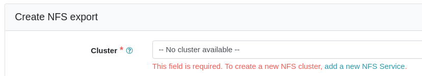

So let's go to **Cluster > Services** and create an NFS service:

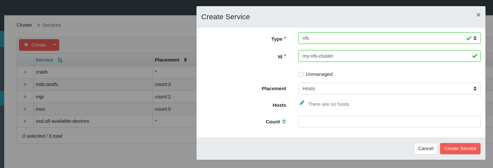

The NFS service is running:

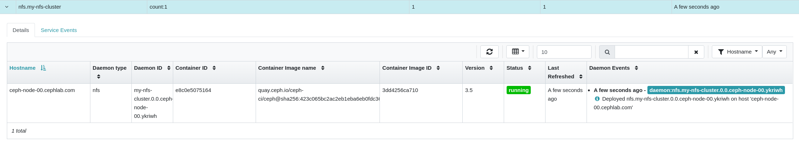

### NFS export over CephFS

We return to **Dashboard > NFS > Create Export** and create an export with CephFS as the Storage Backend:

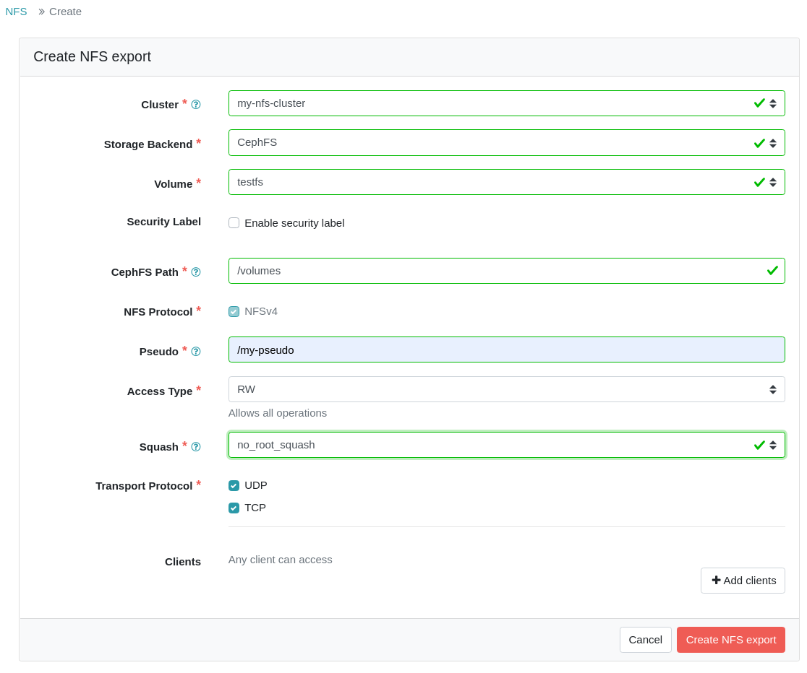

We click on **Create NFS Export** button and the export is created. We can see the export details:

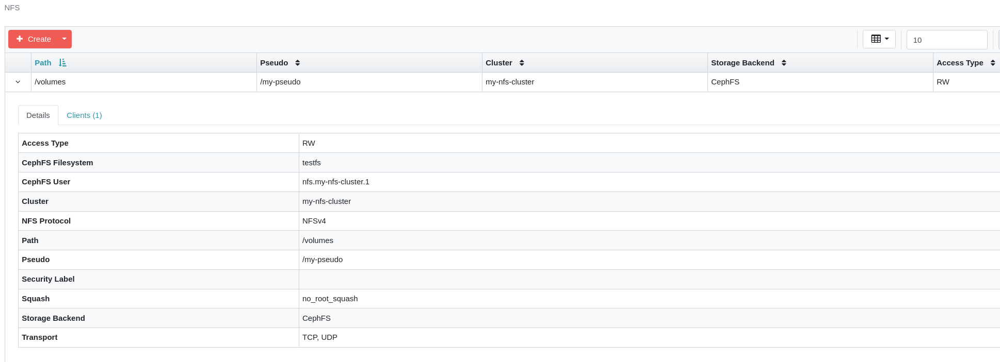

### NFS export over Object Gateway (RGW)

Now let's create an export with Object Gateway as Storage Backend. If there is no Object gateway service running, you'll be notified:

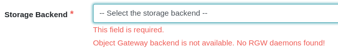

We deploy the Object Gateway service:

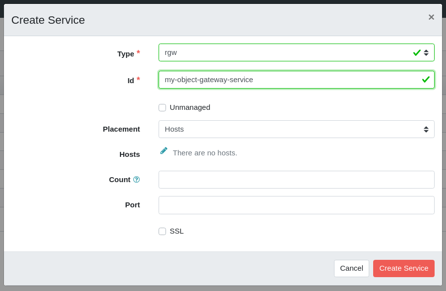
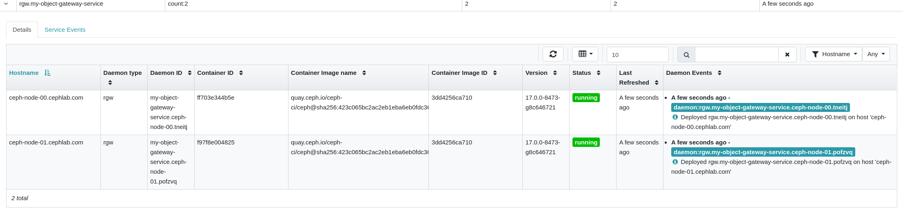

Then we create a bucket for the export:

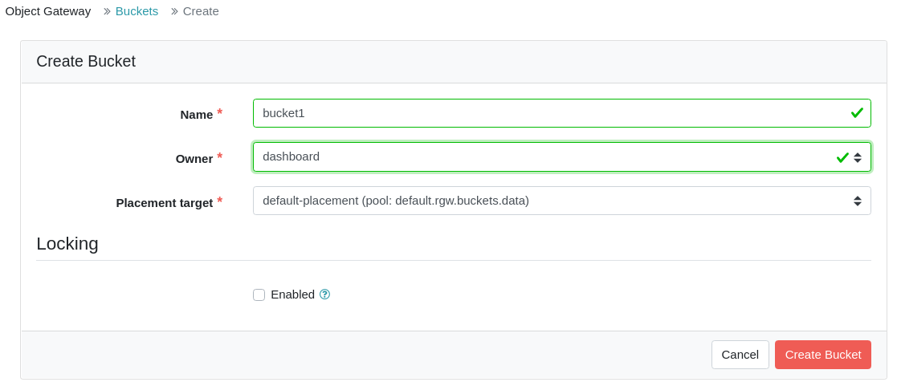

We return to **Dashboard > NFS > Create Export** and create the export:

Now we can see the export details:

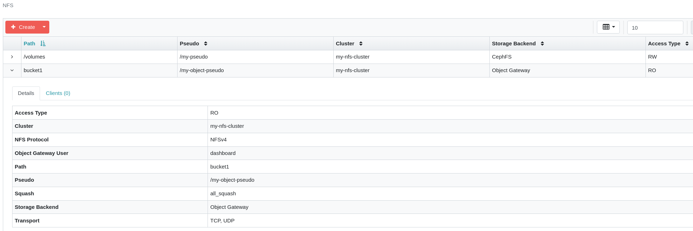

If we go to the CLI we can see that the same info is displayed:

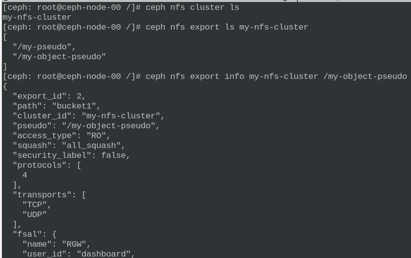

## Migration

The exports' migration should be done fully automated by Orchestrator/Cephadm, but in case there is some problem, see the [manual steps](https://github.com/ceph/ceph/pull/44252/files).

