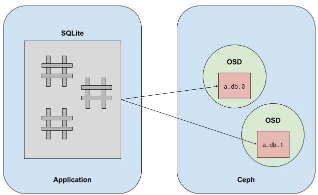

[A new _libcephsqlite_ library is available in Pacific](https://docs.ceph.com/en/pacific/rados/api/libcephsqlite/) that provides a _ceph_ SQLite3 _Virtual File System_ (VFS). The VFS implements backend support for SQLite3 to store and manipulate a database file on Ceph’s distributed object store, RADOS. Normal unmodified applications using SQLite can switch to this new VFS with trivial reconfiguration.

  
SQLite was chosen as a SQL engine for Ceph due to wide recognition as a flexible and robust application data store. It is even reasonably considered the [“most deployed and used database engine”](https://www.sqlite.org/mostdeployed.html) in the world. Aside from that, its _Virtual File System_ architecture also makes it attractive and easy to port. A simple glue library is all that’s required to get SQLite talking to alternative storage systems.

For Ceph, this glue library functions by translating reads, writes, and file locks to corresponding operations on a series of objects in Ceph’s RADOS. This mostly involves _striping_ the SQLite database file over a number of objects in Ceph. (This is something we already regularly do in CephFS and RBD.)

# Usage

To use SQLite on RADOS, you simply need to have the application load the plugin library, _libcephsqlite_. That is done through the [extension loading API](https://sqlite.org/c3ref/load_extension.html) or via the sqlite3 utility command:

`.LOAD libcephsqlite.so`

Once the VFS is loaded, you are able to open or create a SQLite database stored on RADOS. The conventional way to do so is via a URI:

`.OPEN file:///mypool:mynamespace/main.db?vfs=ceph`

This stores the SQLite database on pool _mypool_, in RADOS namespace _mynamespace_, in a series of objects collectively called _main.db_. Which Ceph config, keyring, and client identifier to use can be configured with environment variables, please [see the documentation](https://docs.ceph.com/en/pacific/rados/api/libcephsqlite/#usage).

Once configured this way, the application can continue using SQLite as it would normally with only minimal [caveats](https://docs.ceph.com/en/pacific/rados/api/libcephsqlite/#temporary-tables).

# Serial Writer Only

The _ceph_ VFS performs transactions by obtaining RADOS exclusive locks on the first object of the database. This is the same behavior as on a regular POSIX file system where POSIX file locks are used to ensure exclusive access during modification. For this reason, SQLite on RADOS only supports serial write transactions: you can have multiple writers to the database but each transaction is performed serially.

  
Parallel reader support is [planned](https://tracker.ceph.com/issues/49958).

# Performance Tuning

Naturally, storing a database file on RADOS will be slower than a local SSD. Even so, there are a number of performance optimizations that can be done to get satisfactory performance. The first optimization that should always be explored is improving transaction efficiency in your application. Small transactions involve excessive locking and synchronization points with the distributed object store. Larger transactions will significantly improve performance. Following that, you can:

- [Modify the page size for more efficient writes and reads.](https://docs.ceph.com/en/pacific/rados/api/libcephsqlite/#page-size)
- [Increase the cache size to minimize repetitive reads.](https://docs.ceph.com/en/pacific/rados/api/libcephsqlite/#cache)
- [Persist the journal rather than delete for each transaction.](https://docs.ceph.com/en/pacific/rados/api/libcephsqlite/#journal-persistence)
- [Change the locking mode to exclusive access for the duration of the SQLite connection.](https://docs.ceph.com/en/pacific/rados/api/libcephsqlite/#exclusive-lock-mode)
- [Use the SQLite WAL journaling mode when in exclusive locking mode.](https://docs.ceph.com/en/pacific/rados/api/libcephsqlite/#wal-journal)

Finally, read the performance notes in the [documentation](https://docs.ceph.com/en/pacific/rados/api/libcephsqlite/#performance-notes). A properly tuned database connection on a production cluster can achieve transactions on the order of 1-5 milliseconds and saturate a network link with reads and writes.

# Benefits of putting SQLite on RADOS

Storing a SQLite database on RADOS provides typical benefits of moving data into a distributed storage system. The data becomes more available, faster to access in parallel, and easier to scale in size. Strong use-cases will utilize SQLite for storing tabular data outside of typical Ceph services, such as CephFS or RGW. For example, a series of SQLite databases could be used as an easily indexed blob store by multiple clients. (However, note that [parallel reader support is yet to be implemented](https://tracker.ceph.com/issues/49958).)

# Alternative storage format for metadata

One of the driving motivations for this new SQLite plugin was to shift applications (including some internal Ceph services) from using the RADOS omap storage to a fast, scalable, and robust SQL store. It had become common practice to see applications use a single object’s omap as a generic key/value store for some application data. Unfortunately, this does not scale past a certain number of key/value pairs and the API for manipulating the key/value pairs is unfriendly for higher level applications. (RADOS omap was never intended for trivial application metadata.) SQLite allows us to bridge this gap.

Within Ceph, we have changes in progress to use SQLite for storing the Ceph manager module state. Ceph clusters beginning with the Quincy release will use a new dedicated pool (“`.mgr`”) that stores each module’s persistent database. The [changes required](https://github.com/ceph/ceph/pull/40740) were refreshingly simple. For example, the `devicehealth` module will be the first module to use SQLite and only required a net increase of 36 LOC.

# Conclusions

Before using SQLite on Ceph, please carefully review [how to not corrupt your database](https://docs.ceph.com/en/pacific/rados/api/libcephsqlite/#how-to-corrupt-your-database) through misuse. It’s especially important when building a highly available client-authoritative database on Ceph that built-in protections are not ignored. With that said, we believe that this will be a popular alternative storage medium on Ceph. Developers are eager for feedback on how well the plugin works and what kind of performance you see for your applications.
