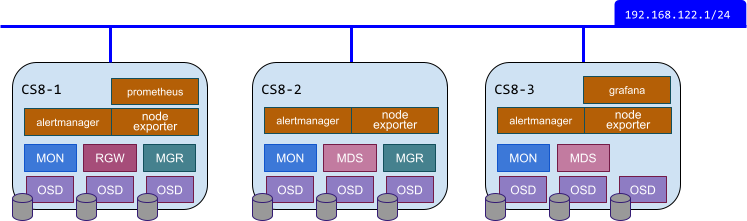

Starting with the Ceph Octopus release, Ceph provides its own configuration and management control plane in the form of the ‘mgr/orchestrator’ framework. This feature covers around 90% of the configuration and management requirements for Ceph. Why not 100%...well, there are some tasks like preparing hosts and purging a cluster that need to be performed from outside of the cluster! For those tasks take a look at [cephadm-ansible](https://github.com/ceph/cephadm-ansible/) and [ceph-salt](https://github.com/ceph/ceph-salt).

Installation, on the other hand, is **completely covered** by the orchestrator!

First a bit of background. The orchestrator/cephadm framework uses ssh under the covers. Typically, you don’t want the ssh user account used by the orchestrator module to be the root account - so you’ll need a user account set up on each node that has sudo privileges (just like in a Ansible controlled environment). This account must be able to issue commands and login, without a password. In this article, we'll be using an account called `cephadmin`, and will use the ssh keys on the bootstrap node’s cephadmin account for Ceph.

We’ll be using CentOS 8 Stream VMs with podman. There are a few niggles with podman support, so head on over to the [compatibility](https://docs.ceph.com/en/latest/cephadm/compatibility/) page to double check the versions available to your host. For CentOS, or RHEL deployments, downgrading podman to v3.0 is covered in this Red Hat BZ [1946982](https://bugzilla.redhat.com/show_bug.cgi?id=1946982), specifically this [comment](https://bugzilla.redhat.com/show_bug.cgi?id=1946982#c13). We're not covering deploying and configuring the OS, but it's worth reiterating 3 key requirements;

1. The following packages must be installed: ssh, python3, podman(or docker), lvm2 and chrony (or ntp)
2. Ensure your hosts are resolvable by DNS (it’s just easier that way!)
3. (_OPTIONAL_) ensure your sudo user account is available

Ceph installation consists of a multi-step workflow that starts with a ‘bootstrap’ phase. The bootstrap process effectively brings the orchestrator into play, enabling all the other hosts and daemons to be deployed. Ceph components may now be managed as Services, governed by a [spec](https://docs.ceph.com/en/latest/cephadm/service-management/#service-specification) which introduces some default behaviours...more on that in a minute.

On your first VM grab the cephadm binary and install it (docs are [here](https://docs.ceph.com/en/latest/cephadm/install/)). With cephadm in place, and the `cephadmin` sudo user account configured on each node we're ready to bootstrap the cluster.

```sh
cephadm --image myregistry:5000/ceph/ceph:v16 bootstrap \
  --mon-ip 192.168.122.174 \
  --ssh-private-key /home/cephadmin/.ssh/id_rsa \
  --ssh-public-key /home/cephadmin/.ssh/id_rsa.pub \
  --ssh-user cephadmin \
  --skip-monitoring-stack
```

You can see we're using the `--image` override. This allows us to pull the Ceph container image from a local registry instead of reaching out to docker hub everytime!

Once the bootstrap is complete, the service specifications for mon and mgr daemons use a 'count' based placement policy. This means that the orchestrator will place these daemons anywhere to meet the number of instances defined by the count. This is normally fine, but for the purposes of this post we're opting to be as pedantic as possible and control everything! To do that, we must modify the default specs for the mon and mgr, through cephadm shell.

```console
[ceph: root@cs8-1 ~]# ceph orch apply mon --placement=1
[ceph: root@cs8-1 ~]# ceph orch apply mgr --placement=1
```

Now the mon and mgr services are limited to a single daemon, which means I can add more hosts and not have a mon or mgr pop up where I don’t want them to! Let’s add the additional cluster hosts now.

```console
[root@cs8-1 ~]# for host in cs8-2 cs8-3; do cephadm shell -- ceph orch host add ${host}; done
```

NB. there are more options available to you when adding hosts. Check out the [docs](https://docs.ceph.com/en/pacific/cephadm/host-management/), for
more information.

Here’s a picture of the target environment we're aiming for.



Now we can assemble a single yaml file containing the specs which determine the desired state of the cluster. The root directory for ceph daemon configurations is /var/lib/ceph/\<fsid\>. This directory contains a `home` directory, which is passed through to your cephadm shell automatically... which makes it an ideal place to create our configuration files :)

Create a file called ‘cluster.yaml’, that looks like this;

```yaml
---
service_type: mon
service_id: mon
placement:
  hosts:
    - cs8-1
    - cs8-2
    - cs8-3
---
service_type: mgr
service_id: mgr
placement:
  hosts:
    - cs8-1
    - cs8-2
---
service_type: osd
service_id: default_drive_group
placement:
  host_pattern: "*"
data_devices:
  all: true
---
service_type: prometheus
service_id: prometheus
placement:
  hosts:
    - cs8-1
---
service_type: grafana
service_id: grafana
placement:
  hosts:
    - cs8-3
---
service_type: alertmanager
service_id: alertmanager
placement:
  count: 3
---
service_type: node-exporter
service_id: node-exporter
placement:
  host_pattern: "*"
---
service_type: mds
service_id: myfs
placement:
  hosts:
    - cs8-2
    - cs8-3
---
service_type: rgw
service_id: rgw
placement:
  hosts:
    - cs8-1
spec:
  rgw_frontend_port: 8080
```

&nbsp;

<!--- this image is just the UTF character denoted by &#128161; --->


In this example, we're declaring specific hosts for service/daemon placement, but you could also use host labels. The orchestrator will use host labels to guide daemon placement, which can help make your configuration more tolerant to change. For more information take a look [here](https://docs.ceph.com/en/latest/cephadm/service-management/)

&nbsp;

Now all that’s left is to give our desired state to the orchestrator to act upon.

```console
[ceph: root@cs8-1 ~]# ceph orch apply -i ./cluster.yaml
Scheduled mon update...
Scheduled mgr update...
Scheduled osd.default_drive_group update...
Scheduled prometheus update...
Scheduled grafana update...
Scheduled alertmanager update...
Scheduled node-exporter update...
Scheduled mds.cephfs update...
Scheduled rgw.rgw update...
```

You can monitor your deployment through the orchestrator (`ceph orch ls`) or via `ceph -s`

```console
  progress:
    Updating grafana deployment (+1 -> 1) (0s)
      [............................]
```

&nbsp;


A key thing to remember about this service based approach, is that the orchestrator **continually reconciles against the desired state defined by the Service specs**. In past Ceph releases, you may have had to manually rerun your configuration management tool to ensure things are where, and what, they should be. With the orchestrator this is done for you!

&nbsp;

Once the deployment is complete, there are a couple of post deployment steps that we need to take care of before we can declare victory. Start a cephadm shell, then follow these steps;

1. The mgr/prometheus module will need enabling and the Prometheus server updating

```console
[ceph: root@cs8-1 ~]# ceph mgr module enable prometheus
[ceph: root@cs8-1 ~]# ceph orch reconfig prometheus
```

_Note: This step is temporary, since there is a [pull request](https://github.com/ceph/ceph/pull/42682) underway to handle this automagically._

2. Although we can see that the mds daemons have been deployed where we wanted them to be - there isn’t a pool or corresponding filesystem yet. At this point a `ceph fs status` will show both mds daemons in standby mode). To complete the configuration of our ‘myfs’ filesystem run this command from within the cephadm shell

```console
[ceph: root@cs8-1 ~]# ceph fs volume create myfs
```

_This will automatically create the pools required for the myfs volume, called `cephfs.myfs.meta` and `cephfs.myfs.data`_

3. Let’s not leave block storage users out.

```console
[ceph: root@cs8-1 ~]# ceph osd pool create rbd replicated
[ceph: root@cs8-1 ~]# ceph osd pool application enable rbd rbd
```

So what have we done?

&#10004; We have a shiny, new Ceph Pacific cluster defined over 3 hosts

&#10004; Ceph services and daemons **have been hand placed on specific hosts**, according to our plan.

&#10004; The Ceph GUI is enabled, and secured with https by default

&#10004; Integrated monitoring and alerting is active (Prometheus, AlertManager and Grafana)

&#10004; Storage can be consumed over **any protocol**: block, file or object
