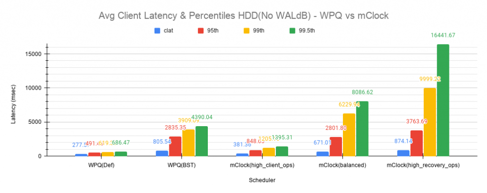
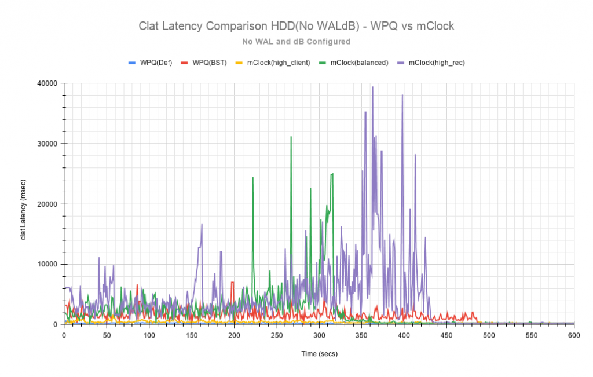
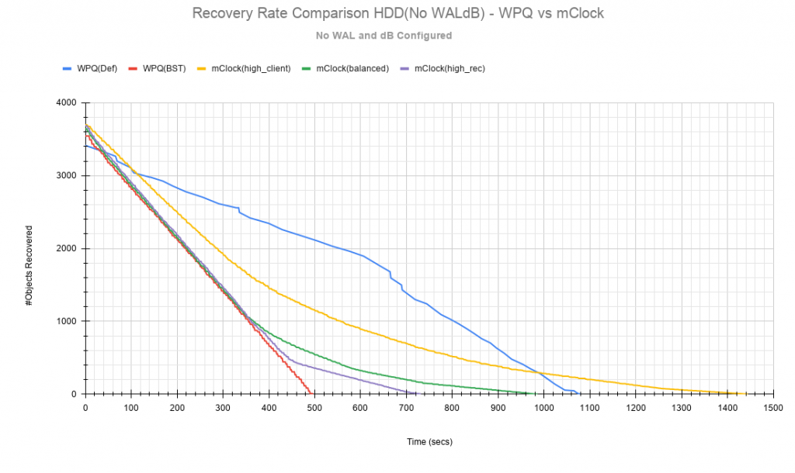

## Introduction

Ceph's use of mClock was primarily experimental and approached with an exploratory mindset. This is still true with other organizations and individuals continuing to either use the code base or modifying it according to their needs.

DmClock exists in its own [repository](https://github.com/ceph/dmclock). Prior to the Ceph Pacific release, mClock could be enabled by setting the `osd_op_queue` Ceph option to "mclock\_scheduler". Additional parameters like _reservation_, _weight_ and _limit_ for each service type could be set using Ceph options. For example, `osd_mclock_scheduler_client_[res,wgt,lim]` is one such option. See the [OSD config reference](https://docs.ceph.com/en/latest/rados/configuration/osd-config-ref/#qos-based-on-mclock) for more details. Even with all the mClock options set, the full capability of mClock could not be realized due to,

- unknown OSD capacity in terms of throughput (IOPS).
- no limit enforcement. In other words, services using mClock were allowed to exceed their limits which resulted in the desired QoS goals not being met.
- share of each service type not distributed across the number of operational shards.

To resolve the above, refinements were made to the mClock scheduler in the Ceph code base. See [mClock config reference](https://docs.ceph.com/en/latest/rados/configuration/mclock-config-ref/). With the refinements, the usage of mClock is a bit more user friendly and intuitive. This is one step of many to refine and optimize the way mClock is used in Ceph.

## Overview

A comparison study was performed as part of efforts to refine the mClock scheduler. The study involved running tests with client ops and background recovery operations in parallel with the two schedulers. The results were collated and then compared. The following statistics were compared between the schedulers from the test results:

- external client
    - average throughput(IOPS),
    - average and percentile(95th, 99th, 99.5th) latency,
- background recovery
    - average recovery throughput,
    - number of misplaced objects recovered per second

## Test Environment

1. **Software Configuration**: CentOS 8.1.1911 Linux Kernel 4.18.0-193.6.3.el8\_2.x86\_64
2. **CPU**: 2 x Intel® Xeon® CPU E5-2650 v3 @ 2.30GHz
3. **nproc**: 40
4. **System Memory**: 64 GiB
5. **Tuned-adm Profile**: network-latency
6. **CephVer**: 17.0.0-2125-g94f550a87f (94f550a87fcbda799afe9f85e40386e6d90b232e) quincy (dev)
7. **Storage**:
    - Intel® NVMe SSD DC P3700 Series (SSDPE2MD800G4) \[4 x 800GB\]
    - Seagate Constellation 7200 RPM 64MB Cache SATA 6.0Gb/s HDD (ST91000640NS) \[4 x 1TB\]

## Test Methodology

Ceph [cbt](https://github.com/ceph/cbt) was used to test the recovery scenarios. A new recovery test to generate background recoveries with client I/Os in parallel was created. See the next section for the detailed test steps. For comparison purposes, the test was executed 3 times with the default _Weighted Priority Queue (WPQ)_ scheduler. This was done to establish a credible mean value to compare the results with the mClock scheduler at a later point.

Post this, the same test was executed with mClock scheduler and with different mClock profiles i.e. _high\_client\_ops_, _balanced_ and _high\_recovery\_ops_ and the results collated for comparison. With each profile, the test was executed 3 times and the average of those runs are reported in this study.

**NOTE:**

Tests with HDDs was performed with and without the bluestore WAL and dB configured. The charts discussed further below help bring out the comparison across the schedulers and their configurations.

## Establish Baseline Client Throughput(IOPS)

Before the actual recovery tests, the baseline throughput was established for both the SSDs and the HDDs on the test machine by following the steps mentioned in the [mClock config reference](https://docs.ceph.com/en/latest/rados/configuration/mclock-config-ref/) document under “[Benchmarking Test Steps Using CBT](https://docs.ceph.com/en/latest/rados/configuration/mclock-config-ref/#benchmarking-test-steps-using-cbt)” section. For this study, the following baseline throughput for each device type was determined:

| Device Type | Baseline Throughput(@4KiB Random Writes) |
| --- | --- |
| **NVMe SSD** | 21500 IOPS (84 MiB/s) |
| **HDD (with bluestore WAL & dB)** | 340 IOPS (1.33 MiB/s) |
| **HDD (without bluestore WAL & dB)** | 315 IOPS (1.23 MiB/s) |

Table 1: Baseline Throughput for Different Device Types @4KiB Random Writes

**NOTE**

The `bluestore_throttle_bytes` and `bluestore_throttle_deferred_bytes` for SSDs was determined to be 256 KiB. For HDDs, it was 40MiB. The above throughput was obtained by running 4 KiB random writes at a queue depth of 64 for 300 secs.

## Factoring I/O Cost in mClock

The services using mClock have a cost associated with them. The cost can be different for each service type. The mClock scheduler factors in the cost during tag calculations for parameters like _reservation_, _weight_ and _limit_. The tag calculations determine when the next op for the service type can be dequeued from the operation queue. In general, the higher the cost, the longer an op remains in the operation queue.

A cost modelling study was performed to determine the cost per I/O and the cost per byte for SSD and HDD device types. These are set as Ceph options and used under the hood by mClock,

- `osd_mclock_cost_per_io_usec`
- `osd_mclock_cost_per_io_usec_hdd`
- `osd_mclock_cost_per_io_usec_ssd`
- `osd_mclock_cost_per_byte_usec`
- `osd_mclock_cost_per_byte_usec_hdd`
- `osd_mclock_cost_per_byte_usec_ssd`

See [mClock config reference](https://docs.ceph.com/en/latest/rados/configuration/mclock-config-ref/) for more details on the values set for each of the above options.

## MClock Profile Allocations

The low-level mClock shares per profile are shown in the tables below. For parameters like _reservation_ and _limit_, the shares are represented as a percentage of the total OSD capacity. For the _high\_client\_ops_ profile, the _reservation_ parameter is set to 50% of the total OSD capacity. Therefore, for the NVMe(baseline 21500 IOPS) device a minimum of 10750 IOPS is reserved for client operations. These allocations are made under the hood once a profile is enabled.

The weight parameter is unitless. See [OSD config reference](https://docs.ceph.com/en/latest/rados/configuration/osd-config-ref/#qos-based-on-mclock).

### high\_client\_ops(default)

This profile allocates more reservation and limit to external clients ops when compared to background recoveries and other internal clients within Ceph. This profile is enabled by default.

| Service Type | Reservation | Weight | Limit |
| --- | --- | --- | --- |
| client | 50% | 2 | MAX |
| background recovery | 25% | 1 | 100% |
| background best effort | 25% | 1 | MAX |

### balanced

This profile allocates equal reservations to client ops and background recovery ops. The internal best effort client get a lower reservation but a very high limit so that they can complete quickly if there are no competing services.

| Service Type | Reservation | Weight | Limit |
| --- | --- | --- | --- |
| client | 40% | 1 | 100% |
| background recovery | 40% | 1 | 150% |
| background best effort | 20% | 1 | MAX |

### high\_recovery\_ops

This profile allocates more reservation to background recoveries when compared to external clients and other internal clients within Ceph. For example, an admin may enable this profile temporarily to speed-up background recoveries during non-peak hours.

| Service Type | Reservation | Weight | Limit |
| --- | --- | --- | --- |
| client | 30% | 1 | 80% |
| background recovery | 60% | 2 | 200% |
| background best effort | 1 (MIN) | 1 | MAX |

### custom

The custom profile allows the user to have complete control of the mClock and Ceph config parameters. To use this profile, the user must have a deep understanding of the workings of Ceph and the mClock scheduler. All the _reservation_, _weight_ and _limit_ parameters of the different service types must be set manually along with any Ceph option(s). This profile may be used for experimental and exploratory purposes or if the built-in profiles do not meet the requirements. In such cases, adequate testing must be performed prior to enabling this profile.

## Recovery Test Steps

Before bringing up the Ceph cluster, the following mClock configuration parameters were set appropriately based on the obtained baseline throughput from the previous section:

- `osd_mclock_max_capacity_iops_hdd`
- `osd_mclock_max_capacity_iops_ssd`
- `osd_mclock_profile`

### Test Steps(Using cbt)

1. Bring up the Ceph cluster with 4 osds.
2. Configure the OSDs with replication factor 3.
3. Create a recovery pool to populate recovery data.
4. Create a client pool and prefill some objects in it.
5. Create the recovery thread and mark an OSD down and out.
6. After the cluster handles the OSD down event, recovery data is prefilled into the recovery pool. For the tests involving SSDs, prefill 100K 4MiB objects into the recovery pool. For the tests involving HDDs, prefill 5K 4MiB objects into the recovery pool.
7. After the prefill stage is completed, the downed OSD is brought up and in. The backfill phase starts at this point.
8. As soon as the backfill/recovery starts, the test proceeds to initiate client I/O on the client pool on another thread using a single client.
9. During step 8 above, statistics related to the client latency and bandwidth are captured by cbt. The test also captures the total number of misplaced objects and the number of misplaced objects recovered per second.

To summarize, the steps above creates 2 pools during the test. Recovery is triggered on one pool and client I/O is triggered on the other simultaneously. Statistics captured during the tests are discussed below.

### Non-Default Ceph Recovery Options

Apart from the non-default bluestore throttle already mentioned above, the following set of Ceph recovery related options were modified for tests with both the WPQ and mClock schedulers.

- `osd_max_backfills` = 1000
- `osd_recovery_max_active` = 1000
- `osd_async_recovery_min_cost` = 1

The above options puts a high limit on the number of concurrent local and remote backfill operations per OSD. It is under these conditions that the capabilities of the mClock scheduler is tested and discussed below.

## Test Results

### Test Results With NVMe SSDs

#### Client Throughput Comparison

Fig 1 shows the average client throughput comparison across the schedulers and their respective configurations.

Fig 1: Average Client Throughput NVMe SSDs

WPQ(def) in the chart shows the average client throughput obtained using the WPQ scheduler with all other Ceph configuration settings set to default values. The default setting for `osd_max_backfills` limits the number of concurrent local and remote backfills or recoveries per OSD to 1. As a result, the average client throughput obtained is impressive at just over 18000 IOPS when compared to the baseline value which is 21500 IOPS.

However, with WPQ scheduler along with non-default options mentioned above, things are quite different as shown in the chart for WPQ(BST). In this case, the average client throughput obtained drops dramatically to only 2544 IOPS. The non-default recovery options clearly had a significant impact on the client throughput. In other words, recovery operations overwhelm the client operations. Sections further below discuss the recovery rates under these conditions.

With the non-default options, the same test was executed with mClock and with the default profile(_high\_client\_ops_) enabled. As per the profile allocation, the reservation goal of 50% (10750 IOPS) is being met with an average throughput of 11209 IOPS during the course of recovery operations. This is more than 4x times the throughput obtained with WPQ(BST).

Similar throughput with the _balanced_(11017 IOPS) and _high\_recovery\_ops_ (11153 IOPS) profile was obtained as seen in the chart above. This clearly demonstrates that mClock is able to provide the desired QoS for the client with multiple concurrent backfill/recovery operations in progress.

#### Client Latency Comparison

Fig 2 shows the average completion latency (_clat_) along with the average 95th, 99th and 99.5th percentiles across the schedulers and their respective configurations.

Fig 2: Average Client Latency & Percentiles NVMe SSDs

The average _clat_ latency obtained with WPQ(Def) was 3.535 msec. But in this case the number of concurrent recoveries was very much limited at an average of around 97 objects/sec or ~388 MiB/s and a major contributing factor to the low latency seen by the client.

With WPQ(BST) and with the non-default recovery options, things are very different with the average _clat_ latency shooting up to an average of almost 25 msec which is 7x times worse! This is due to the high number of concurrent recoveries which was measured to be ~350 objects/sec or ~1.4 GiB/s which is close to the maximum OSD bandwidth.

With mClock enabled and with the default _high\_client\_ops_ profile, the average _clat_ latency was 5.688 msec which is impressive considering the high number of concurrent active background backfill/recoveries. The recovery rate was throttled down by mClock to an average of 80 objects/sec or ~320 MiB/s according to the minimum profile allocation of 25% of the maximum OSD bandwidth thus allowing the client operations to meet the QoS goal.

With the other profiles like _balanced_ and _high\_recovery\_ops_, the average client _clat_ latency didn’t change much and stayed between 5.7 - 5.8 msec with variations in the average percentile latency as observed from the chart above.

Fig 3: Clat Latency Comparison NVMe SSD

Perhaps a more interesting chart is the comparison chart shown in Fig 3 that tracks the average _clat_ latency variations through the duration of the test. The chart shows the differences in the average latency between the WPQ and mClock profiles). During the initial phase of the test, for about 150 secs, the differences in the average latency between the WPQ scheduler and across the profiles of mClock scheduler are quite evident and self explanatory. The _high\_client\_ops_ profile shows the lowest latency followed by _balanced_ and _high\_recovery\_ops_ profiles. The WPQ(BST) had the highest average latency through the course of the test.

#### Recovery Statistics Comparison

Another important aspect to consider is how the recovery bandwidth and recovery time are affected by mClock profile settings. Fig 4 outlines the recovery rates and times for each mClock profile and how they differ with the WPQ scheduler. The total number of objects to be recovered in all the cases was around 75000 objects as observed in the chart below.

Fig 4: Recovery Rate Comparison NVMe SSD

Intuitively, the _high\_client\_ops_ should impact recovery operations the most and this is indeed the case as it took an average of 966 secs for the recovery to complete at 80 Objects/sec. The recovery bandwidth as expected was the lowest at an average of ~320 MiB/s.

Fig 5: Average Recovery Throughput NVMe SSD

The _balanced_ profile provides a good middle ground by allocating the same reservation and weight to client and recovery operations. The recovery rate curve falls between the _high\_recovery\_ops_ and _high\_client\_ops_ curves with an average bandwidth of ~480 MiB/s and taking an average of ~647 secs at ~120 Objects/sec to complete the recovery.

The _high\_recovery\_ops_ profile provides the fastest way to complete recovery operations at the expense of other operations. The recovery bandwidth was nearly 2x the bandwidth at ~635 MiB/s when compared to the the bandwidth observed using the _high\_client\_ops_ profile. The average object recovery rate was ~159 objects/sec and completed the fastest in approximately 488 secs.

### Test Results With HDDs (WAL and dB configured)

The recovery tests were performed on HDDs with bluestore WAL and dB configured on faster NVMe SSDs. The baseline throughput measured was 340 IOPS.

#### Client Throughput & latency Comparison

The average client throughput comparison and latency for WPQ and mClock and its profiles are shown in Fig 6 & 7.

Fig 6: Average Client Throughput HDD(WALdB)

With WPQ(Def), the average client throughput obtained was ~308 IOPS since the the number of concurrent recoveries was very much limited. The average _clat_ latency was ~208 msec.

However for WPQ(BST), due to concurrent recoveries client throughput is affected significantly with 146 IOPS and an average _clat_ latency of 433 msec.

Fig 7: Average Clat Latency & Percentiles HDD(WALdB)

With the _high\_client\_ops_ profile, mClock was able to meet the QoS requirement for client operations with an average throughput of 271 IOPS which is nearly 80% of the baseline throughput at an average _clat_ latency of 235 msecs.

For _balanced_ and _high\_recovery\_ops_ profiles, the average client throughput came down marginally to ~248 IOPS and ~240 IOPS respectively. The average _clat_ latency as expected increased to ~258 msec and ~265 msec respectively.

Fig 8: Clat Latency Comparison HDD(WALdB)

The _clat_ latency comparison chart in Fig 8 provides a more comprehensive insight into the differences in latency through the course of the test. As observed with the NVMe SSD case, _high\_client\_ops_ profile shows the lowest latency in the HDD case as well followed by the _balanced_ and _high\_recovery\_ops_ profile. It’s fairly easy to discern this between the profiles during the first 200 secs of the test.

#### Recovery Statistics Comparison

The charts in Fig 9 & 10 compares the recovery rates and times. The total number of objects to be recovered in all the cases using HDDs with WAL and dB was around 4000 objects as observed in the chart below.

Fig 9: Recovery Rate Comparison HDD(WALdB)

As expected, the _high\_client\_ops_ impacts recovery operations the most as it took an average of ~1409 secs for the recovery to complete at ~3 Objects/sec. The recovery bandwidth as expected was the lowest at ~11 MiB/s.

Fig 10: Average Recovery Throughput HDD(WALdB)

The _balanced_ profile as expected provides a decent compromise with an an average bandwidth of ~16.5 MiB/s and taking an average of ~966 secs at ~4 Objects/sec to complete the recovery.

The _high\_recovery\_ops_ profile is the fastest with nearly 2x the bandwidth at ~21 MiB/s when compared to the _high\_client\_ops_ profile. The average object recovery rate was ~5 objects/sec and completed in approximately 747 secs. This is somewhat similar to the recovery time observed with WPQ(Def) at 647 secs with a bandwidth of 23 MiB/s and at a rate of 5.8 objects/sec.

### Test Results With HDDs (No WAL and dB configured)

The recovery tests were also performed on HDDs without bluestore WAL and dB configured. The baseline throughput measured was 315 IOPS.

This type of configuration without WAL and dB configured is probably rare but testing was nevertheless performed to get a sense of how mClock performs under a very restrictive environment where the OSD capacity is at the lower end. The sections and charts below are very similar to the ones presented above and are provided here for reference.

#### Client Throughput & latency Comparison

The average client throughput, latency and percentiles are compared as before in the set of charts shown below.

Fig 11: Average Client Throughput HDD(No WALdB)

Fig 12: Average Client Latency & Percentiles HDD(No WALdB)

Fig 13: Clat Latency Comparison HDD(No WALdB)

#### Recovery Statistics Comparison

The recovery rates and times are shown in the charts below.

Fig 14: Average Object Recovery Throughput HDD(WALdB)

Fig 15: Recovery Rate Comparison HDD(No WALdB)

## Key Takeaways and Conclusion

- mClock is able to provide the desired QoS using profiles to allocate proper _reservation_, _weight_ and _limit_ to the service types.
- By using the cost per I/O and the cost per byte parameters, mClock is able to perform the tag calculations for the different device types(SSD/HDD).

The study so far shows promising results with the refinements made to the mClock scheduler. Further refinements to mClock and profile tuning are planned. Further improvements will also be based on feedback from broader testing on larger clusters and with different workloads.
