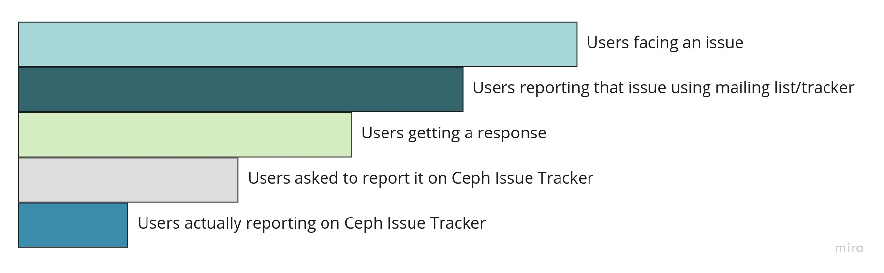
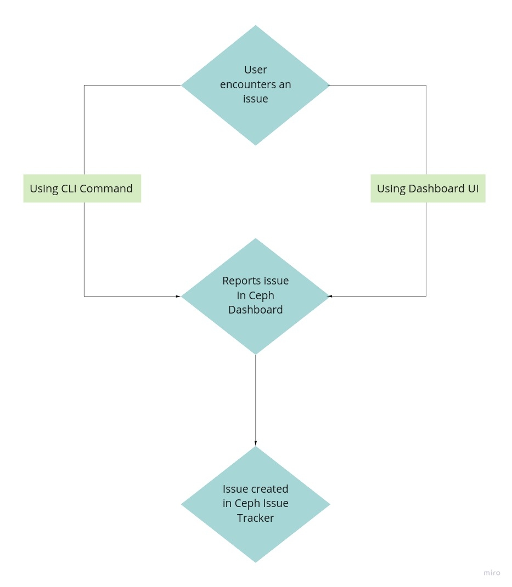
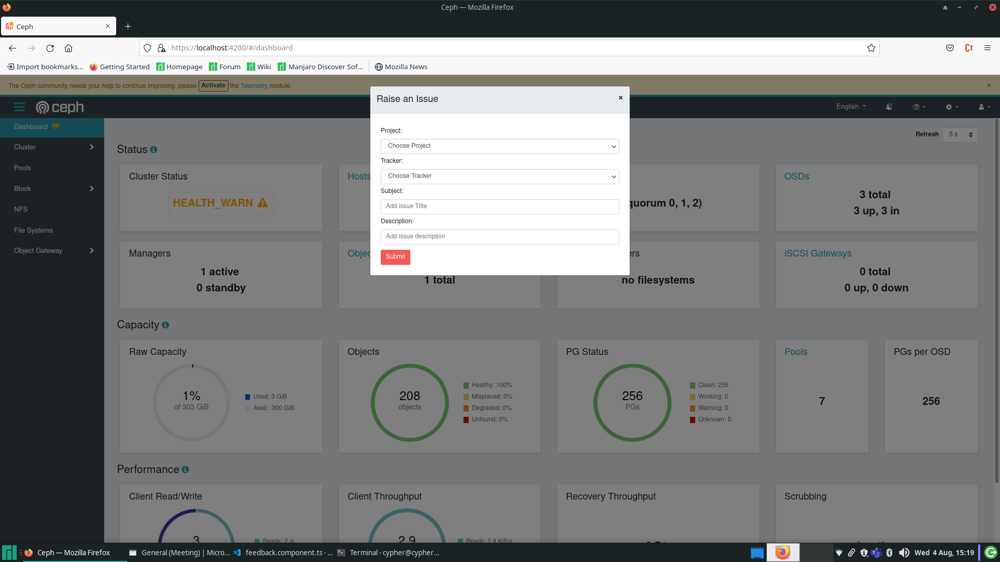

Hey! Shreyaa this side. I'm an GSoC 2021 student developer at Ceph. This blog series is about my journey with Ceph Organisation. I've been working with the dashboard team since June 6th, the start of GSoC coding period. I was mentored by Ernesto Puerta and Alfonso Martínez.

I would like to thank my mentors and the entire dashboard team at Ceph for their constant support and guidance throughout the summer. They’ve always been there to help me whenever I was stuck and motivated me to follow good practices to code. Throughout the program they've guided me to make better design choices and constantly helped me improve as a developer with constructive feedback.

## My Project

My GSoC project was integrating Ceph Issue Tracker with the Ceph Dashboard.

### Problem Statement

When a Ceph user encounters a bug, faces an issue or has a feature request to make, he/she has to go to the Ceph Issue Tracker to report or request for the same. This leads to a several problems such as:

1. Bad user experience  
   The user's work flow is disrupted. They have to collect the relevant information from one site and visit another site to create a new issue.

2. Funnel decreases
   When a user encounters a problem he/she generally reach out to the ceph user or developer mailing list to enquire about the same. Not all of the users get a reply back. Let's say out of 100 users reporting, only 75% get a reply back (Rough figures, only for the purpose of explanation). Out of those 75 getting a reply, about 50 of them are asked to create a new issue on the Ceph Issue Tracker. Out of those asked to create an issue, not all of them end up visiting the Ceph Issue Tracker due to the inconvenience at every stage of this process. Thus the number of users actually reporting an issue at last is significantly small. We can understand this better using the below diagram:

### Proposed Solution

The solution we came up with was to integrate Ceph Issue Tracker with the Ceph Dashboard. Ceph Dashboard is the frontend component of teh Ceph project. It can be used to monitor and update the services running in the Ceph environment.

The user should be able to report issues from the Ceph CLI as well as the Ceph Dashboard.

## My Work

The Ceph Issue Tracker is based on Redmine. Ceph Issue Tracker has exposed endpoints that can be used to create, fetch and update issues. I added endpoints in the Ceph Dashboard module that call services which internally use these exposed Ceph Issue tracker endpoints. The user can fetch issues using an issue number and create new issues as well.

To create an issue a user has to have an account on the Ceph Issue Tracker. This is mandatory to avoid spamming on the issue tracker.

Under the `my account` tab, the API access key is stored. This API key is used for authentication and authorization of the user.

Available components to create an issue in:

1. dashboard
2. block (rbd)
3. object (rgw)
4. file_system (cephfs)
5. ceph_manager
6. orchestrator
7. ceph_volume
8. core_ceph

Available tracker types to create:

1. bug
2. feature

### Using CLI

The user sets this key in the Ceph cluster using the command

`ceph dashboard set-issue-tracker-api-key -i <file-containing-key>`

The user can then get an issue using:

`ceph dashboard get issue <issue_number>`

_This command can run without setting the API access key_

To create a new issue:

`ceph dashboard create issue <component-name> <tracker-type> <subject> <description>`

### Using Dashboard

On clicking the settings icon at the top right of the window, in the navbar the user needs to click on raise an issue. This would open a modal that looks like:

The user has to choose the component and tracker from list of respective drop down menus. Then they can enter the title and description of the issue. They can then proceed to create an issue in the ceph issue tracker. The modal that opens after that has the detail of the issue created and the option to redirect to the Ceph Issue tracker or stay on the current page.

## Challenges faced

I initially used the `python-redmine` library to create issues and familiarize myself with the redmine based issue tracker. But I couldn't proceed with this library since it is not packaged for CentOS which is a supported OS for Ceph.

I then decided to proceed with raw API requests, but the documentation on [redmine](https://www.redmine.org/projects/redmine/wiki/Developer_Guide) was not accurate. I wasn't able to create an issue using the curl calls and request body description given in the documentation.

The next approach was to dump the request sent by `python-redmine` library. For that I used wireshark, but since post requests are encrypted, and the library only sends requests to `https` secured links, that didn't work. Spending endless hours on stackoverflow, I came across these logging lines, which helped me enough to find out that some arguments were being sent as query parameters. The raw requests worked after that.

The Ceph Issue Tracker, by default, creates a bug. I was not able to create a feature using this. I then found out about [webhook.site](https://webhook.site/) which logs the request that is sent on a uniquely generated API endpoint. So I logged a feature creation request sent using  
`python-redmine` library and sent a similar body in my raw request. The feature creation was now working!
