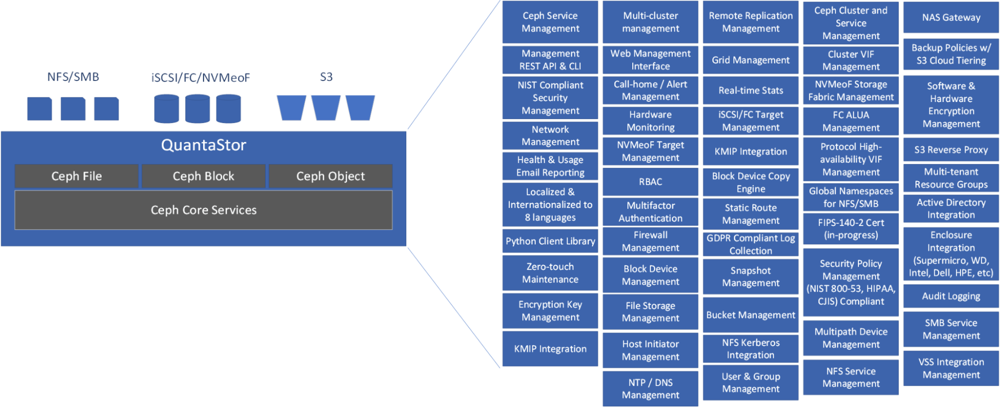
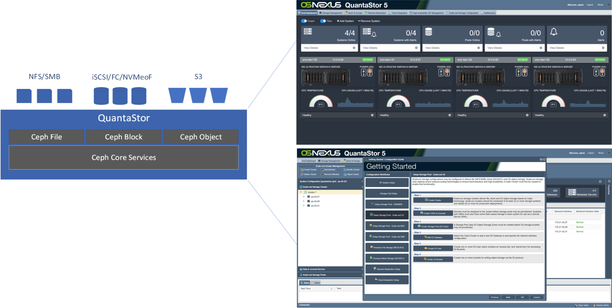
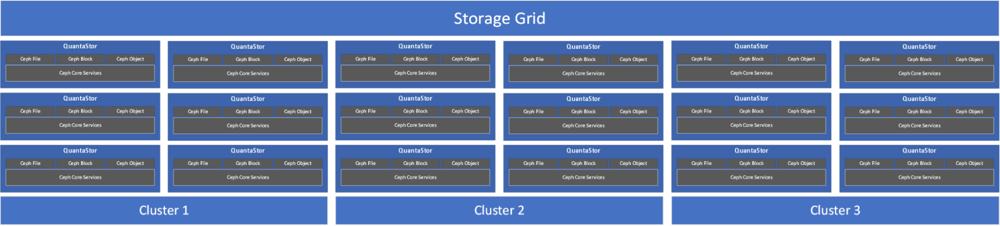

This month we’ve added a new software vendor to the Ceph Foundation,
[OSNexus](https://www.osnexus.com). OSNexus has been developing
their software-defined storage platform, QuantaStor, since 2010
and started working with and integrating Ceph into their platform
all the way back in 2014.

## About OSNexus

OSNexus is working to expand the use cases for Ceph and bring more
organizations to Ceph by simplifying everything from the cluster
design process to the day to day operations. This diagram shows
some of the internal components of QuantaStor so that organizations
can get a better idea of the added value. QuantaStor is available
on RedHat and Ubuntu and is provided as an ISO image (Ubuntu based)
for bare-metal installation or as an upgrade script for organizations
using RHEL.

The result is that Ceph can be delivered as a storage system platform
that helps organizations more familiar with storage systems to adopt
and get the benefits of Ceph.

QuantaStor also has an interesting Storage Grid technology that makes
it so that multiple Ceph clusters can be managed together.
This simplifies setting up new clusters and things that cross cluster
boundaries like remote replication and management users and security
policies.

Community Edition licenses to QuantaStor are available from the
[osnexus.com](https://www.osnexus.com) web site and they have
developed a nice web tool for designing Ceph clusters which
we’ll cover in a follow-up blog post.
