_Disclaimer: This article proclaims Loki as a hero._

## What are we trying to solve?

Ceph, as a distributed system, usually generates a lot of logs. And these logs can be from MONs, MGRs, OSDs, or any of the other clients of Ceph.

In most scenarios, Ceph does a good job of handling its issues. Self-healing is one of the interesting qualities of Ceph. In addition to that, Ceph
Dashboard contributes a lot to the observability of the cluster. It immediately alerts users that needed his attention by utilizing the alertmanager.
We also efficiently utilize the monitoring tools like grafana and prometheus to showcase all the cluster-related metrics in easily understandable graphs.

And lastly, we have the logs. It is what we look at if we find something unusual going on in the cluster. Or if you like reading, it is a fun place to be 😜.
In any case, we'll want to check through logs from different clients, which are unavailable from a single source. It's all distributed as it is intended.

## Enter Loki.

Thankfully, the Loki we are dealing with is not an Asgardian God(imagine the chaos). Our Loki is a log aggregation system designed to store and
query the logs. In fact, it is not just Loki; it is [Grafana Loki](https://grafana.com/oss/loki/).

We have a Promtail too.


[Promtail](https://grafana.com/docs/loki/latest/clients/promtail/) is an agent that ships the contents of local logs to a private Grafana Loki instance.

Let's make it simple. We introduced a feature called Centralized Logging, where we can go to a particular section in the Ceph Dashboard and see the
logs from all the clients in just one place. Cool, isn't it?

## How to set it up?

First, we have to make sure that Grafana is configured on our cluster.

Then, go to the **Cluster > Services** page, and **Create** the two services - Loki and Promtail.

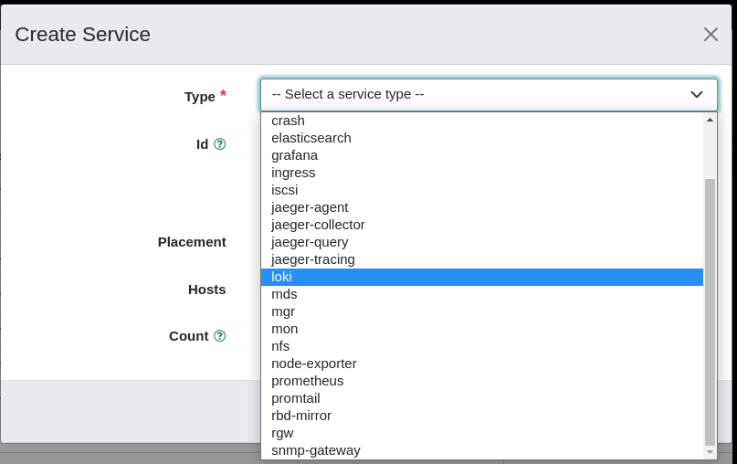

If successful, we can see all the daemons are **running**.

##### Status of Loki Daemon

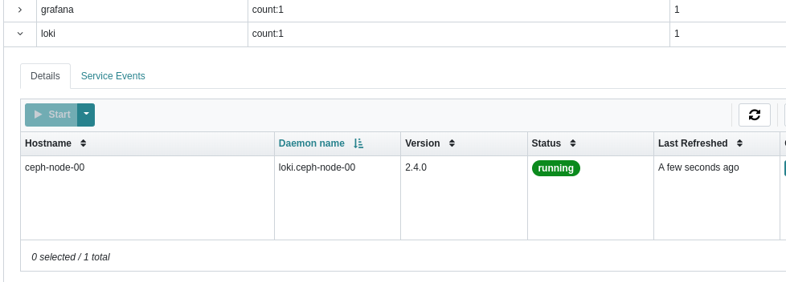

##### Status of Promtail Daemons

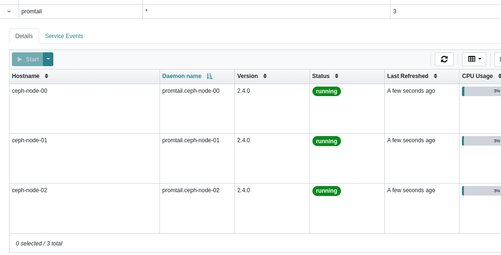

Now we need to enable logging to the files. For that, we can go to **Cluster > Configurations**,
search for the **log_to_file** and **mon_cluster_log_to_file**, in the search area

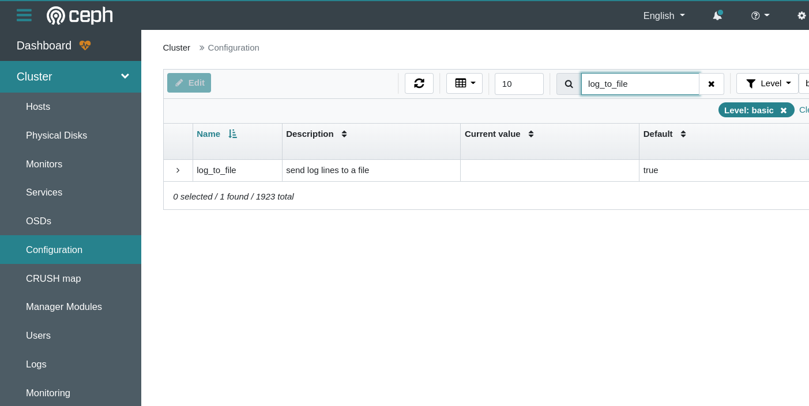

Just select and **Edit** the option. And select the value of **global** to true

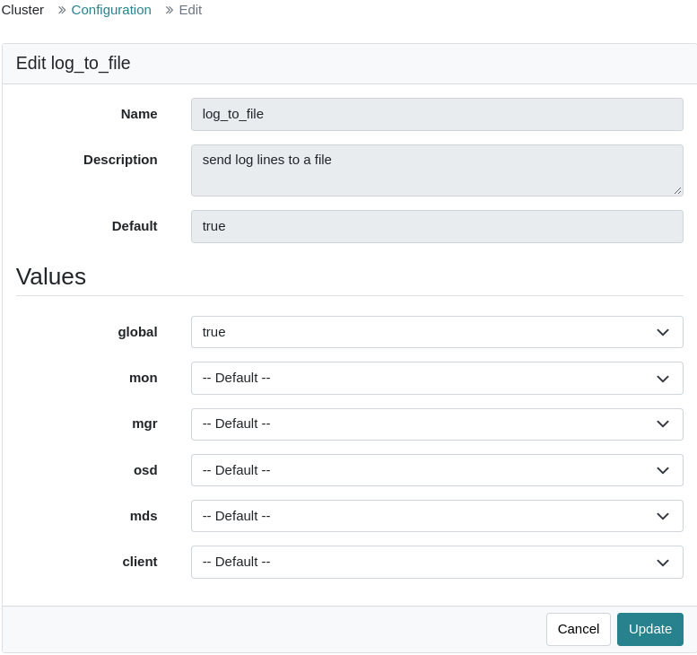

We have to do the same for **mon_cluster_log_to_file** as well.

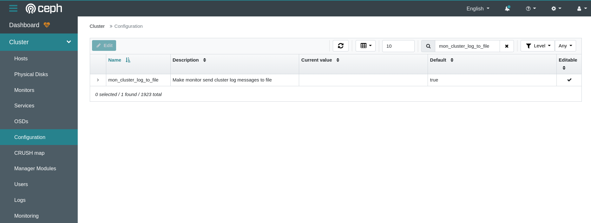

If you can't find the item you searched for, then you can just **clear the filter** and it will bring you the configuration option that you searched for.
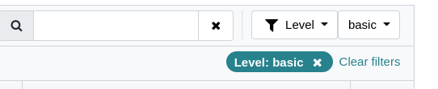

### Viewing the Logs

Go to **Cluster > Logs** and go to the **Daemon Logs** tab. That is where we find the Centralized logs.

If you see a screen like the below image, then you have to sign in to Grafana and just reload the page again.

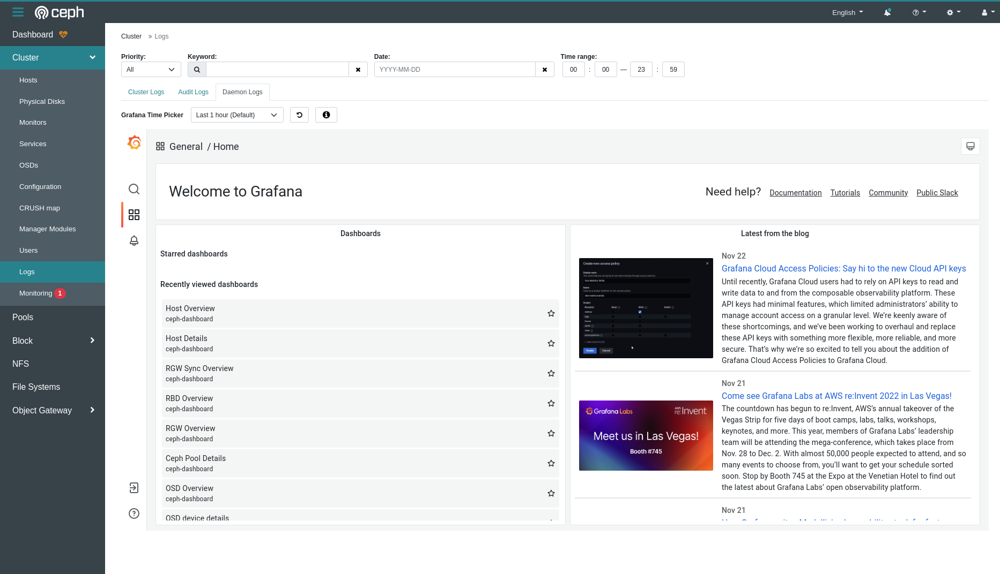

If you are signed in, then you can see the logs view directly.

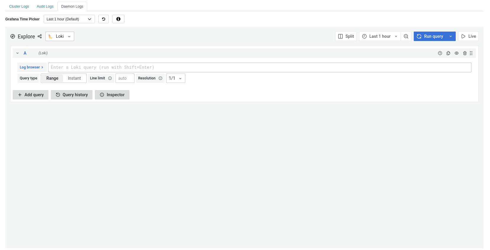

We can use the log browser to view the log.

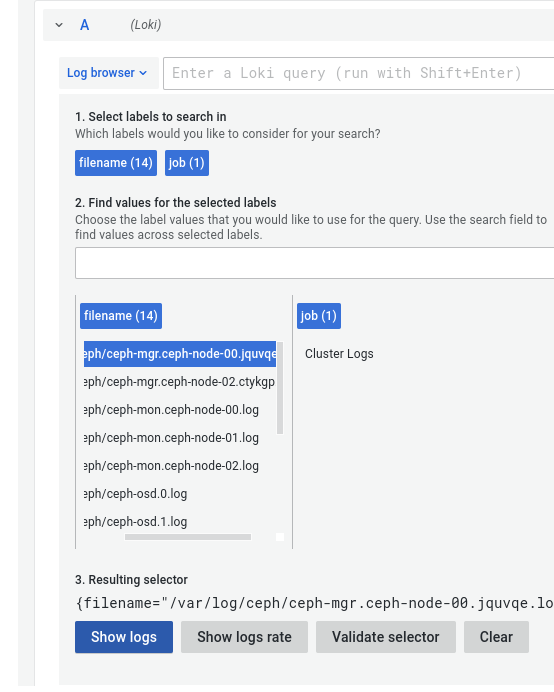

Once you select the file and hit **Show logs**, it'll show the whole log from that file.

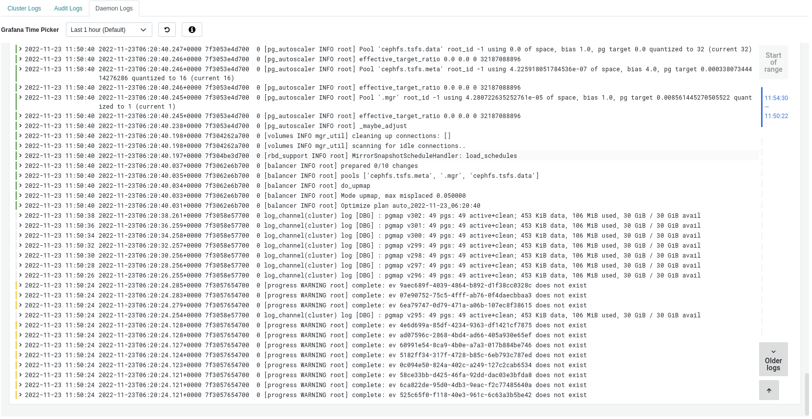

### Monitor the logs in real-time

There is an option in Loki to view the logs in real-time. The option is called **Live**, and when we make it Live we can monitor the logs instantly and
in real-time.

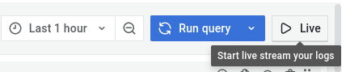

Additionally, if we want to watch the debug logs, then we need to explicitly enable the debug logs in CLI using

```
ceph config set mgr mgr/cephadm/log_to_cluster_level debug
```

This feature is available in the latest quincy (v17.2.z) releases.

To learn more about centralized logging, view the [cephadm documentation](https://docs.ceph.com/en/quincy/cephadm/services/monitoring/#cephadm-monitoring-centralized-logs).

Check the dashboard documentation to see more about the [configuration](https://docs.ceph.com/en/quincy/mgr/dashboard/#enable-centralized-logging-in-dashboard)](https://docs.ceph.com/en/quincy/mgr/dashboard/#enable-centralized-logging-in-dashboard).

If you have any questions, reach out to us at ceph-users@ceph.io or on IRC at #ceph-dashboard OFTC channel.
