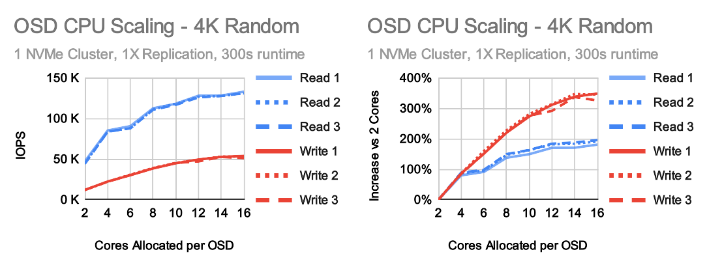
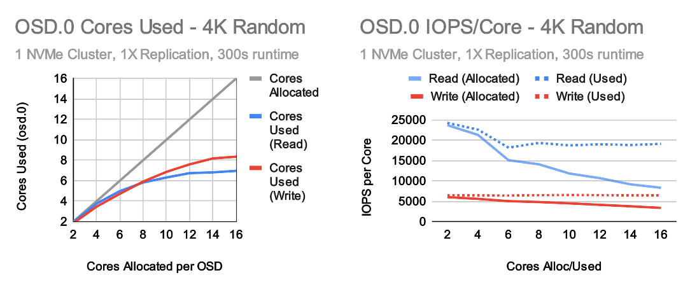
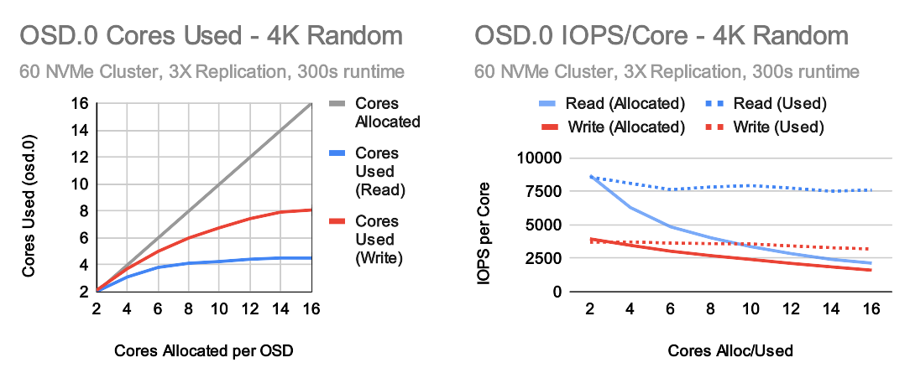
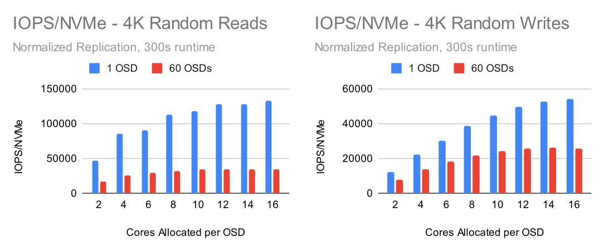

# Introduction

Ceph does a lot of things very well, but it's never been known to have incredibly low resource consumption.  It takes work to ensure that data is consistent and placed securely where it needs to go.  We have multiple efforts underway to optimize Ceph's data path, but the reality is that Ceph historically has needed quite a bit of CPU to achieve high performance on fast storage devices like NVMe drives.  Earlier this summer a user approached our team with concerns about performance at low CPU core counts.  They had been given a recommendation that when using NVMe drives, 2 cores should be allocated per OSD.  That recommendation came with no explanation as to why.  They decided to purchase hardware, though with only half of the NVMe drive bays populated (IE they had 4 cores available per OSD).  The performance was acceptable in that configuration, but the user was rightly concerned about what might happen when they fully populate their servers with NVMe drives.  Sadly, I had to inform them that it was likely they would only see a capacity increase and not a performance increase by adding more drives.  The original recommendation wasn't entirely without merit.  If a user isn't primarily concerned about the performance of small random IO, 2 cores per OSD might be a good value proposition.  There are many benefits to running Ceph on NVMe drives beyond increasing small random IO performance.  For this user however, small random IO was a concern and that's precisely the case when CPU resources are most important.

Sadly this isn't the first time this issue has come up and there has been a lot of confusion about the topic.  2 years ago we updated the upstream Ceph documentation to try and provide better guidance in [this](https://github.com/ceph/ceph/pull/32093) PR. At the time, our rough guidance was (before replication!):

- 1 core per 200-500 MB/s
- 1 core per 1000-3000 IOPS

The most important aspect here though is IOPS performance.  This article will focus on how Ceph small random IOPS performance scales as CPU resources increase.

# Cluster Setup 

Nodes | 10 x Dell PowerEdge R6515
-- | --
CPU | 1 x AMD EPYC 7742 64C/128T
Memory | 128GiB DDR4
Network | 1 x 100GbE Mellanox ConnectX-6
NVMe | 6 x 4TB Samsung PM983
OS Version | CentOS Stream release 8
Ceph Version | Pacific V16.2.9 (built from source)

All nodes are located on the same Juniper QFX5200 switch and connected with a single 100GbE QSFP28 link.  Clusters were built and fio tests were performed using [CBT](https://github.com/ceph/cbt/).  Unless otherwise noted, Each node was configured to host up to 6 OSDs and had 4 colocated fio processes using the librbd engine.  An important OS level optimization on Intel systems is setting the tuned profile to either "latency-performance" or "network-latency".  This primarily helps by avoiding latency spikes associated with CPU C/P state transitions.  AMD Rome based systems do not appear to be as sensitive in this regard, however the tuned profile was nevertheless set to "network-latency" for these tests.

# Testing Setup

CBT was configured to deploy Ceph with a couple of modified settings versus stock.  Primarily, rbd cache was disabled, each OSD was given an 8GB memory target, and msgr V1 was used with cephx disabled.  In more recent testing, we've seen that Msgr V2 with the default cephx authentication appears to perform similarly, though enabling over-the-wire encryption can have up to a 30-40% performance penalty with similar or higher CPU usage on both servers and clients. Fio was configured to first pre-fill RBD volumes with large writes, followed by 3 iterations of 4K random reads followed by 4K random writes at iodepth=128 for 5 minutes each.  CBT Allows OSDs to be wrapped with other programs or environment variables and numactl was used to control how many cores OSDs could utilize on the system.  Initial tests were performed with a single OSD and 1X replication.  Multi-OSD tests were performed with multiple OSDs and 3x replcation.

# Single OSD Tests

On multi-OSD clusters, ceph places data determinsitically in a pseudo-random fashion.  There are likely to be hotspots at given points in time.  Some OSDs will be doing more work than others and aggregate performance can suffer as a result.  Ultimately the overall cluster performance is limited by the performance of the slowest OSD in the cluster.  Testing against a single OSD eliminates this behavior and further removes additional replication latency and overhead ensuring that the OSD is working at peak efficiency.  Testing a single OSD does not represent what a real cluster can do, but it does show how a given OSD can perform under optimal conditions.

The first thing to note here is that performance increases by roughly 100% between 2 and 4 cores.  It's nearly a linear improvement.  After 4 cores though, the gains begin to slow.  Going from 4 to 16 cores yields only another 100% with the gains almost completely leveling off at 10 cores.  Write performance scales higher though, topping out at around 350% at 14-16 allocated cores.  But is the Ceph OSD really using all of those cores in these tests?

It turns out that allocating more cores for OSDs consistently improves performance up to 14-16 cores, but at high core counts OSDs will not consistently use all of the cores they are given.  This is especially true for reads.  More cores means higher performance, but efficiency degrades the higher you go. The IOPS per core used however remains relatively flat.  Why is this and what are the limits? By default, Ceph OSDs have 80+ threads per OSD, but the most important ones from a resource consumption perspective are:

- 16 OSD worker threads (8 shards with 2 threads each)
- 3 async messenger threads
- 1 bluestore key/value thread
- 1 bluestore "finisher" thread
- RocksDB flush (high priority) and compaction (low priority) background threads

Without getting too deep into the details here (we'll save that for a later blog post), the practical maximum core usage of a stock OSD is probably around 23 cores.  The highest usage we've achieved in the lab with stock thread counts over a 5 minute period is around 18-19 cores for 4K random writes with no limits imposed on the OSD and RocksDB's write-ahead-log disabled.  So why don't we see that in these tests?  The likely answer is that ceph simply can't keep all of the 16 worker threads busy all the time.  IE, there are short periods of time when worker threads are waiting on something before they can do more work.  While an OSD on average might use 6 or 8 cores, it may perform best when it can burst up to 16+ cores for short periods of time while other times it may only need 3-4 cores.  This is one scenario where running Ceph on bare metal may have advantages over running Ceph in containers or VMs if a hard core limit is imposed. 

# 60 OSD Cluster Tests

Do the trends that were observed in the single OSD tests happen when a full cluster is deployed?

A couple of things immediately stand out when looking at the 60 OSD cluster test results.  While the curves look similar to the single OSD tests, performance tops out at around 8-10 cores per OSD for reads and about 12 cores per OSD for writes.  In the single OSD test read and write gains topped out at roughly 200% and 350% respectively.  In the full cluster configuration, the gains topped out at 100% and 250%. 

Simply looking at OSD.0, it looks like OSDs in the larger cluster are utilizing even fewer cores in the random read tests.  Simultaneously, both the IOPS per core allocated, and IOPS per core used numbers are also much lower.  On the write side, 3x replication is being used now.  To be able to compare against the the single OSD tests we have to look at the IOPS delievered by OSDs with replication factored in.  Even doing this, the per-core write performance is also quite a bit lower than in the single OSD tests.  The good news is that the estimates in the documentation appear to be fairly valid.  On the read side Ceph is delivering around 7500 IOPS per core used and anywhere from 2400 to 8500 IOPS per core allocated depending on how many cores are assigned to OSDs.  On the write side, Ceph is delivering around 3500 IOPS per core used and anywhere from 1600 to 3900 IOPS per core allocated.  These numbers are a little better than what we claimed 2 years ago and we've made further improvements in the recent Quincy release. 

# Single OSD vs Multi-OSD NVMe Performance

Another question that comes up fairly often is how well Ceph can utilize NVMe drives.  Usually this is accompanied by benchmarks of data being written or read directly from a locally attached drive and a user wants to know why Ceph is slower despite being backed by more drives.  The short answer is that Ceph is indeed slower than just doing straight writes to disk, and there are a number of reasons as to why.  Some of the top ones:

1) Latency introduced for computing crush placement, checksums, encryption, erasure coding, network overhead, etc.
2) Processing data (encode/decode/etc) and allocating/copying/moving data in memory between threads and even RocksDB.
3) Ceph doesn't just write data, but writes out metadata about that data.  This can be significant when performing small writes.
4) Allowing threads to go to sleep when there is no work and waking them up when work arrives.  This is done to reduce CPU overhead during quiet periods, hwoever it can have a significant impact on performance when threads go to sleep and wake up too quickly.  A later blog post will talk about this in more detail.

Some of these things are difficult to improve without significant work.  Ceph is always going be limited to some extent by overhead communicating over the network and dealing with a network stack (though things like dpdk can help).  Crush will always introduce some latency to figure out where data lives, and there will always be some level of additional latency caused by crc32, encoding/decoding, etc.  Having said that, there is a very big performance difference between the single OSD and multi-OSD tests.

 

Looking at these charts is a little rough.  Even though the 60 OSD cluster is delivering around 2 million random read IOPS, a solitary OSD is capable of delivering nearly 4 times the per-NVMe performance at better efficiency.  On the write side things are a little closer, but a single OSD is still roughly 2 times faster per-NVMe.  All is not lost however.  In Ceph Quincy we worked hard to improve the write path performance.  Between improvements in the Ceph Quincy release and selective RocksDB tuning, we achieved over a 40% improvement in 4K random write IOPS on the full 60 OSD cluster vs a stock Ceph Pacific installation.

To find out how we got these results, see the RocksDB Tuning Deep Dive blog post [here](https://ceph.io/en/news/blog/2022/rocksdb-tuning-deep-dive/).

# Conclusion

Ultimately there is still significant headroom to achieve higher performance both at the cluster level and inside the OSD.  In a future blog post, I will dig into some of the issues that are limiting performance at low and at high core counts and ideas regarding how Ceph can be further improved.  Until then, there are trade-offs when chosing how many cores to assign to OSDs that are backed by NVMe drives.  At 2-4 cores per OSD Ceph can mostly utilize all cores during small reads and small writes.  Adding additional cores (even up to 16+ per OSD) can increase performance but with lower gains for every core added.  Efficiency per core used remains fairly constant, but OSDs become less consistent about fully utilizing all avaiable cores at all times when higher core counts are assigned.  This has an effect on upfront purchasing decisions, but also on infrastructure decisions regarding things like power and cooling and even decisions about container/VM resource utilization restrictions.

Finally, this post focused on Ceph Pacific, but both the efficiency and top end performance of Ceph has improved since then.  These curves likely look at bit different for Quincy, and almost certainly will look different again in Reef.  These tests were also run on a fresh cluster and may not look the same on a full cluster with a significant amount of aging.  I hope however, that this post has at least provided a starting point for how CPU resources impact Ceph on modern NVMe drives.  Thanks for reading! 
