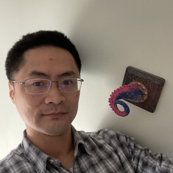

## Cephalocon 2022 Postponed

We can’t wait to gather the Ceph community again in person, and we’re sure you feel the same way. We had hoped to do this April 5-7, but unfortunately, given the current COVID-19 pandemic wave, we feel that this may not be the right time to gather in person.

We want to ensure a safe experience onsite for participants, and make sure as many people that want to join us feel safe in doing so. Thus, we’ve made the difficult decision to postpone Cephalocon 2022 until later this year. We are reviewing date options with the venue and our partners, and will share the new event dates shortly. In the meantime, we are excited to announce the schedule is live!

## Ceph 2022 User Survey Now Available

The [User Survey working group](https://tracker.ceph.com/projects/ceph/wiki/User_Survey_Working_Group) has created a new survey based on learnings from the previous survey and feedback from the community. Please consider taking the survey as the feedback helps inform the community of how Ceph is used and where development is spent. [Take the survey](https://ceph.io/en/users/survey)

## New Tentacle Award members

The team recognizes the outstanding contributions of some former and present members of the Ceph Community with the Tentacle Award.

### Kefu Chai for Crimson / Bluestore contributions

### Patrick Donnelly for serving as CephFS Lead

[See all award members](https://ceph.io/en/community/team/tentacle-award/)

## Ceph Blog

- [Caching mgr Modules](https://ceph.io/en/news/blog/2022/mgr-ttlcache/)
- [Managing Grafana Dashboards with Grafonnet](https://ceph.io/en/news/blog/2021/managing-grafana-dashboards-with-grafonnet/)
- [Managing NFS Exports With Dashboard](https://ceph.io/en/news/blog/2021/managing-nfs-exports-with-dashboard/)
- [Submit your own post!](https://ceph.io/en/news/contribute)

## Release Notes

- [v16.2.7 Pacific](https://ceph.io/en/news/blog/2021/v16-2-7-pacific-released/)

## Upcoming Conferences

- [SRECon March 14-16th](https://www.usenix.org/srecon)
- [Ceph CFP coordination pad](https://pad.ceph.com/p/cfp-coordination)

## Ceph Jobs

<table>
  <tr>
   <td>Company
   </td>
   <td>Position
   </td>
  </tr>
  <tr>
   <td>Scaleway
   </td>
   <td><a href="https://scaleway-25152556.hubspotpagebuilder.eu/freelance-golang-ceph">Freelance Golang backend developer with Ceph experience</a>
   </td>
  </tr>
  <tr>
   <td>Bloomberg
   </td>
   <td><a href="https://careers.bloomberg.com/job/detail/81144?qe=Senior+Software+Engineer+-+Storage+Engineering">Senior Software Engineer - Storage Engineer</a>
   </td>
  </tr>
  <tr>
   <td>SUSE
   </td>
   <td><a href="https://jobs.suse.com/us/en/job/71001487/Senior-Quality-Assurance-Engineer-Software-Defined-Storage">Senior Quality Assurance Engineer, Software Defined Storage</a>
   </td>
  </tr>
  <tr>
   <td>SUSE
   </td>
   <td><a href="https://jobs.suse.com/us/en/job/71001486/Senior-Software-Engineer-Software-Defined-Storage">Senior Software Engineer, Software Defined Storage</a>
   </td>
  </tr>
  <tr>
   <td>Safespring
   </td>
   <td><a href="https://www.safespring.com/career/ceph-engineer/">Ceph Engineer - Infrastructure Team</a>
   </td>
  </tr>
  <tr>
   <td>Canonical
   </td>
   <td><a href="https://canonical.com/careers/3326693/linux-engineering-open-source-remote">Senior Software Engineer - Linux Engineering</a>
   </td>
  </tr>
  <tr>
   <td>Canonical
   </td>
   <td><a href="https://canonical.com/careers/1861978/software-engineer-ceph-and-distributed-storage-remote">Software Engineer, Ceph & Distributed Storage</a>
   </td>
  </tr>
  <tr>
   <td>Canonical
   </td>
   <td><a href="https://canonical.com/careers/3039369/ceph-and-software-defined-storage-product-manager-remote">Ceph and software-defined storage product manager</a>
   </td>
  </tr>
</table>

[Submit your job posting](https://ceph.io/en/community/jobs/)

[Header picture attribution](https://www.freepik.com/photos/storm)
