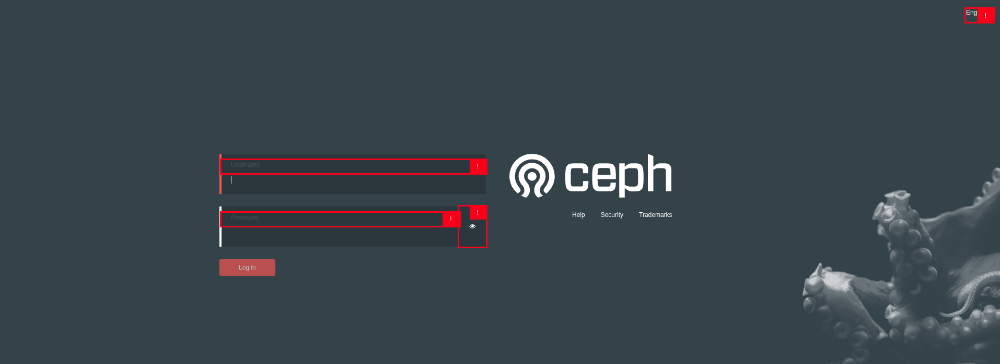
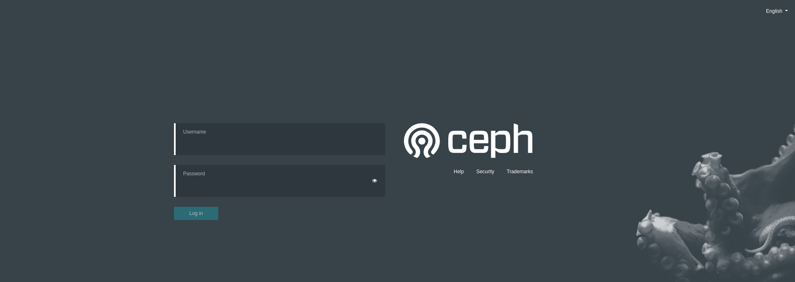
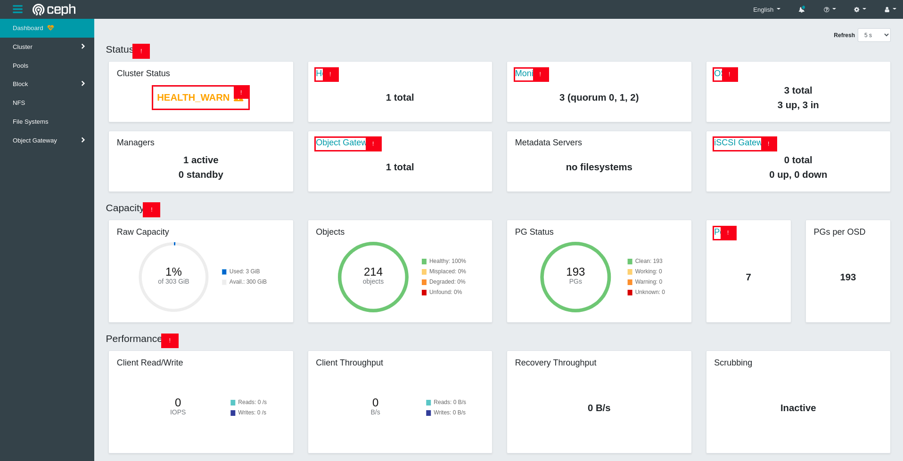
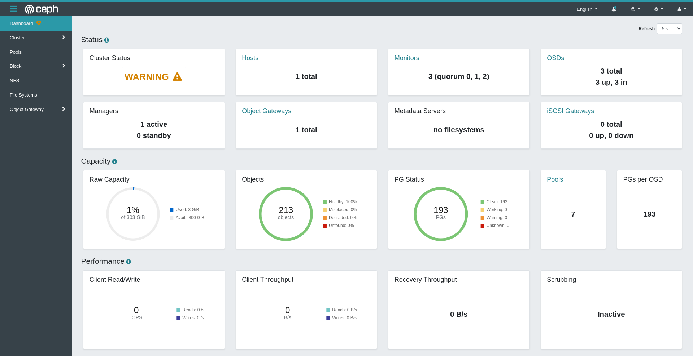
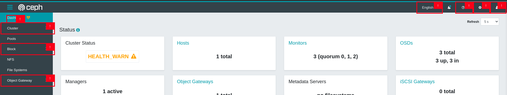
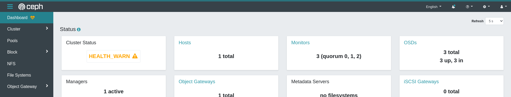
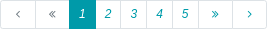
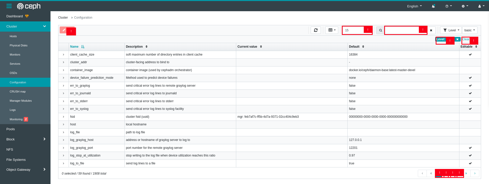
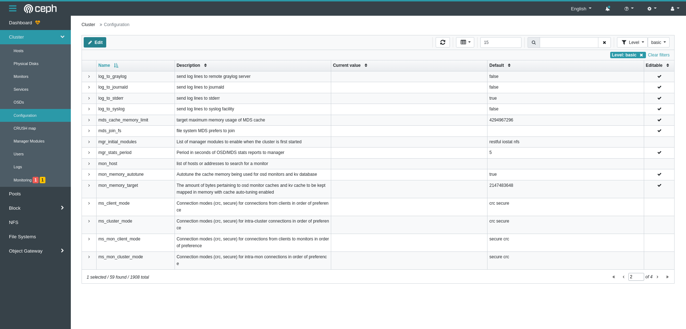
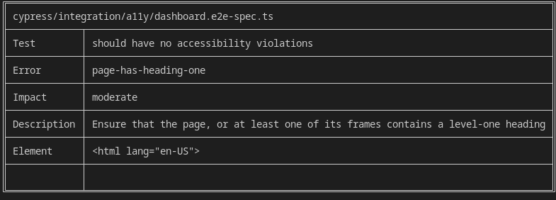

## Introduction

Web accessibility, or e-accessibility, is the inclusive practice of ensuring there are no barriers
that prevent interaction with, or access to, websites on the World Wide Web by people with
physical disabilities, situational disabilities, and socio-economic restrictions on bandwidth and
speed. When sites are correctly designed, developed and edited, more users have equal access
to information and functionality. ([Wikipedia](https://en.wikipedia.org/wiki/Web_accessibility))

The Ceph Dashboard is a built-in web-based Ceph management and monitoring application through which you can inspect and administer various aspects and resources within the cluster.

## Problem description

While it's very likely that the Ceph Dashboard meets some accessibility guidelines (ARIA attributes, alt text, etc), we currently ignore its level of conformance to WCAG 2.1 standard (levels A, AA and AAA).

In a recent article published by the World Bank on [disability inclusion](https://www.worldbank.org/en/topic/disability#1), disabilities affect about 1
billion people world wide. These people use web technologies in a variety of ways. Some
primarily navigate sites by means of a keyboard alone, while others with vision disabilities rely
on assistive technologies like screen readers.

By ensuring the Dashboard meets WCAG 2.1 level A compliance, blind and visually impaired Ceph users will not be left out and will be able to manage their Ceph clusters comfortably.

## Project

For the past few months we have been working on updating the Dashboard to meet WCAG 2.1 level A conformance so that blind and visually impaired Ceph users can also use it comfortably to manage and monitor their Ceph clusters.

To achieve this goal, we had to:

1. Test and identify areas of the Dashboard in need of an accessibility update
2. Apply fixes based on WCAG 2.1 guidelines
3. Add automated testing to prevent regressions

### Identifying accessibility issues

After testing several recommended [accessibilty checkers](https://www.w3.org/WAI/ER/tools/?q=wcag-21-w3c-web-content-accessibility-guidelines-21) by the W3C, we chose the [accessibility insights plugin](https://accessibilityinsights.io/docs/en/web/overview/) to help quickly identify the most common accessibility issues for each page of the the Dashboard.

### Accessibility improvements

Based on the identified issues, we improved the accessibility of several key components including:

#### Login Page

By improving the color contrast of the login form, input fields users can now clearly read the labels and use the keyboard to navigate the inputs.

Login Page before:



Login Page after:



#### Health Page

The Dashboard health page displays key monitoring information about cluster status, capacity and performance. We improved on the following aspects:

- Updated the cluster labels (`HEALTH_OK`,`HEALTH_WARN`, `HEALTH_ERROR`) to be more descriptive (`OK`,`WARNING`, `ERROR`)

- Updated label colors to make them more legible

  | Old                                            |                     New                     |
  | ---------------------------------------------- | :-----------------------------------------: |
  | <span style="color:#0b0">HEALTH_OK</span>      |     <span style="color:#0b0">OK</span>      |
  | <span style="color:#ffa500">HEALTH_WARN</span> | <span style="color:#d48200">WARNING </span> |
  | <span style="color:#f00">HEALTH_ERROR</span>   |   <span style="color:#f00">ERROR </span>    |

- Added accessible names to informative icon buttons for screen readers

  ```html
  <button aria-label="learn more" i18n-aria-label>
    <i [ngClass]="[icons.infoCircle, icons.large]"></i>
  </button>
  ```

Health Page before:



Health Page after:



#### Navigation

The navigation component enables quick access to all the Dashboard's sections. I was able to make the following accessibility updates:

- Add accessible roles for all dropdown menus for easier detection by screen readers

  ```html
  <a role="button">
    <ng-container i18n>Cluster</ng-container>
  </a>
  ```

- Used a darker background <span style="background-color:#25828e;padding:0.5rem; color:white;">color</span> and increased label font size for better legibility

Navigation before:



Navigation after:



#### Datatables

The datatable component is widely used in the Dashboard to display more detailed information. The improvements made here include:

- Added accessible labels for row selection checkboxes for better identification by screen readers

  ```html
  <input
    type="checkbox"
    [attr.aria-label]="isSelected ? 'selected' : 'select'"
  />
  ```

- Created a custom pagination component with better UX and accessibility

  Old pagination

  

  New pagination

  

- Changed table action button label colors from <span style="color:red;">red</span> to <span style="color:#25828e;">cyan</span> for better legibility and focus

Datatable before:



Datatable after:



Many more sub-components were also updated and can be found on [GitHub](https://github.com/ceph/ceph/pulls?q=is%3Apr+author%3Ansedrickm+label%3A%22GSoC+%2F+Outreachy%22+no%3Aclosed).

### Accessibility testing

To prevent future regressions, we added end to end accessibility tests for high impact components like the health page and navigation. If any future regressions on these components occurs, a tabulated error description is generated and added to the Cypress log for debugging.



More information on accessibility e2e testing can be found in the Dashboard developer [documentation](https://docs.ceph.com/en/latest/dev/developer_guide/dash-devel/#accessibility).

## Challenges faced

While working on this project, I ran into several challenges. Actually tracking down the code where fixes needed to be made was quite a task most times, given how large the Ceph codebase is. Using `grep` helped me find code sections a lot faster.

Also, some components like the datatable are actually provided by a third party library. This made it a bit challenging to improve on the accessibility of certain parts. Fortunately, we could develop and use custom templates instead with better accessibility. In some extreme cases, whole components had to be replaced like the table pagination component.

In addition, some of the updates I made altered the QA tests currently in place for the Dashboard. This earned me several days of debugging to figure out what I was doing wrong and how to seek help when stuck.

## Conclusion

Accessibility is quite important and should be considered for every application used by a wide audience. Even though not all the pull requests have been merged at the time of writing this blog post, we can be certain that in next Ceph release, the Dashboard will be more WCAG 2.1 level A compliant and therefore improved for blind and visually impaired Ceph users.

This was truly an engaging experience for me, I learned a lot while also contributing substantially to Ceph. I would like to thank my mentors Laura Flores and Ernesto Puerta and the entire Dashboard team for all their relentless support and guidance.

Not only have I picked up new technical skills like Cypress and e2e testing, but I have also learned how to communicate, contribute to discussions and also seek help when stuck on challenges.

## Pending updates

While we aimed to also add a dark mode feature to the Dashboard during this period, we unfortunately could not due to time constraints. Not to worry, it sure is planned and will be added in the future. I remain a Ceph contributor and will continue to make improvements wherever I can.

You can always reach out to me on my email me at: [nsedrick101@gmail.com](mailto:nsedrick101@gmail.com) or on Github [@nsedrickm](https://github.com/nsedrickm).

## Useful Links

- [Documentation](https://docs.ceph.com/en/latest/dev/developer_guide/dash-devel/#accessibility)

- [Accessibility Issue trackers](https://tracker.ceph.com/projects/dashboard/agile/board?utf8=%E2%9C%93&set_filter=1&f%5B%5D=status_id&op%5Bstatus_id%5D=o&f%5B%5D=category_id&op%5Bcategory_id%5D=%3D&v%5Bcategory_id%5D%5B%5D=219&f%5B%5D=&c%5B%5D=tracker&c%5B%5D=assigned_to)

- [Link to all PRs](https://github.com/ceph/ceph/pulls?q=is%3Apr+author%3Ansedrickm+label%3A%22GSoC+%2F+Outreachy%22+no%3Aclosed)

- [Video demos](https://youtube.com/playlist?list=PLgmx216AWZHLva5b3ZzdI3RkxE0TFoL-Z)

Thanks for reading 👋
