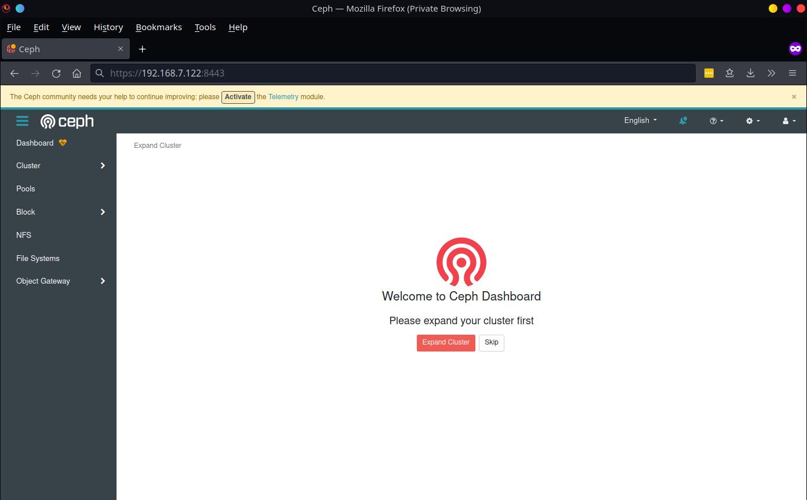
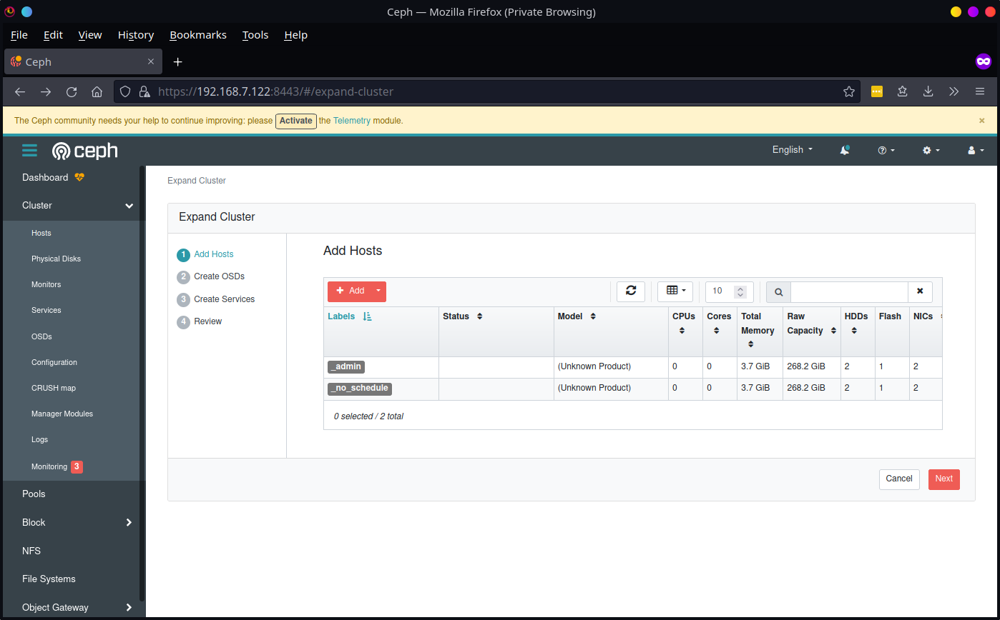
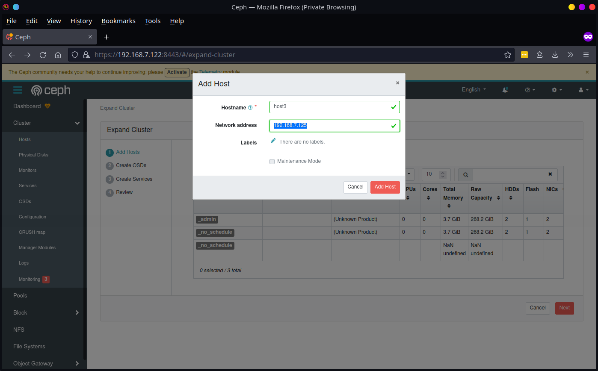
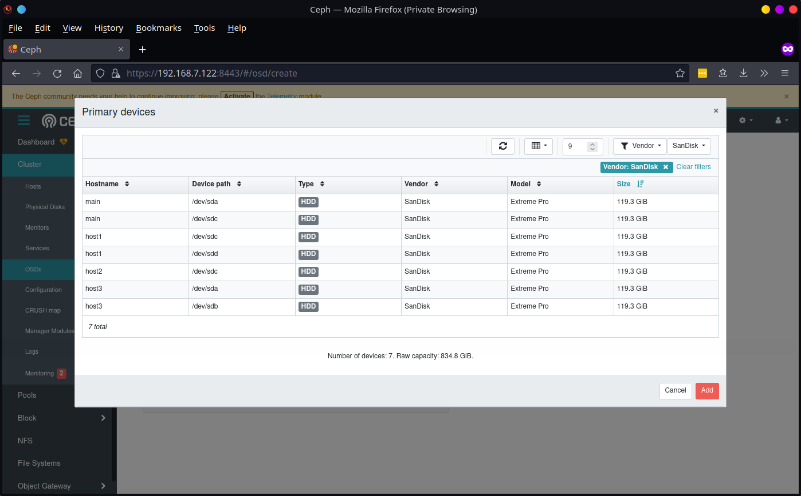
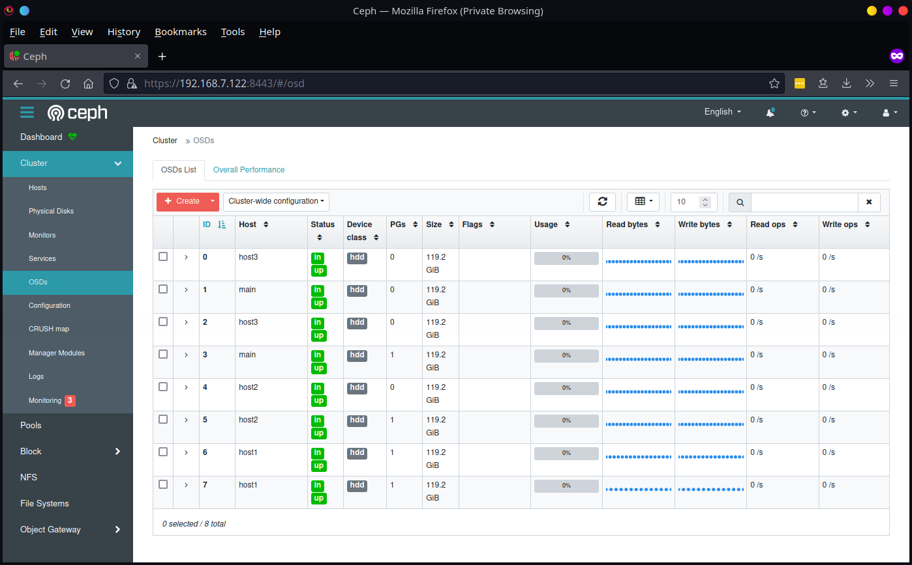
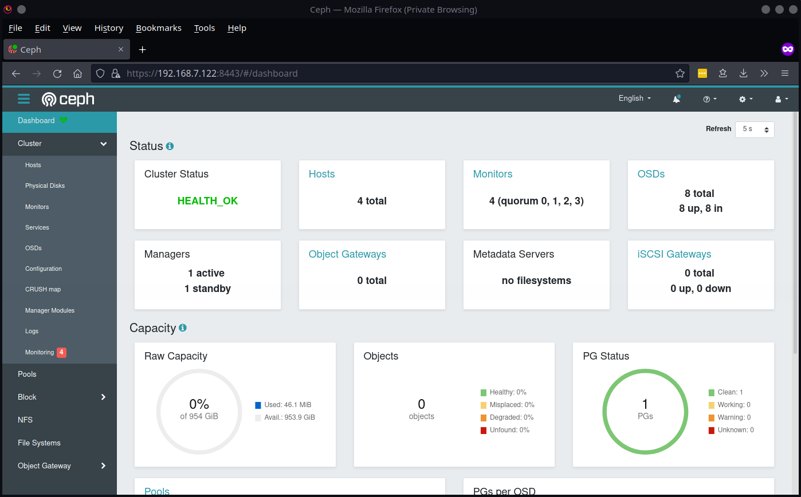

[Cephadm](https://docs.ceph.com/en/pacific/cephadm/) was introduced in the Octopus release to deploy and manage the full lifecycle of a Ceph cluster.

This works over SSH to add or remove Ceph daemons in containers from hosts. Since Cephadm was introduced in Octopus, some functionality might be under development.

The [Ceph Dashboard](https://docs.ceph.com/en/pacific/mgr/dashboard/) is a web-based management and monitoring application to administer various things in the Ceph cluster.

For this tutorial, we will:

- Bootstrap a Ceph cluster of Raspberry PIs with Cephadm.
- Finish the installation with Ceph Dashboard
  - Add additional hosts
  - Add Object Storage Daemons (OSDs)
- Verify a healthy cluster with available storage capacity

## Hardware List

- 4x Raspberry PI 4B 4GB models
- 4x 64GB microSD cards
- 8x USB flash drives
- 4x PoE hats
- 4x Ethernet cords
- A network switch
- Raspberry PI enclosure with fans

## Image

I'll be using the [Fedora server ARM image](https://arm.fedoraproject.org/), and as I write this, it contains the latest [Pacific release](https://ceph.io/en/news/blog/2021/v16-2-0-pacific-released/)!

To make this setup easier, I used the arm-image-installer, which will inject an SSH key as it's writing the image to the SD card.

```
$ dnf install arm-image-installer

$ arm-image-installer --image Downloads/Fedora-Server-35-1.2.aarch64.raw.xz --addkey desktop.pub  --resizefs --target rpi4 --media /dev/sda

 ***********************************************************
 ** WARNING: You have requested the image be written to sda.
 ** /dev/sda is usually the root filesystem of the host.
 ***********************************************************
 ** Do you wish to continue? (type 'yes' to continue)
 ***********************************************************
 = Continue? yes

...

= Raspberry Pi 4 Uboot is already in place, no changes needed.
= Adding SSH key to authorized keys.

= Installation Complete! Insert into the rpi4 and boot

```

## Initial Setup

Once each SD card is imaged, and the PIs are booted, we'll need to do some initial setup to get Cephadm working properly.

On each host, we will:

- Update packages
- Set the hostname

```
$ dnf update

$ hostnamectl set-hostname host1
```

Install Cephadm on whichever PI you pick to be the manager.

```
$ dnf install cephadm
```

## Bootstrap a new cluster

Bootstrapping the cluster is as easy as one command. I set the mon-ip to the manager host.

```
# cephadm bootstrap --mon-ip 192.168.7.122
Creating directory /etc/ceph for ceph.conf
Verifying podman|docker is present...
Verifying lvm2 is present...
Verifying time synchronization is in place...

...

Adding key to root@host1 authorized_keys...
Adding host host1...
Deploying mon service with default placement...
Deploying mgr service with default placement...
Deploying crash service with default placement...
Deploying prometheus service with default placement...
Deploying grafana service with default placement...
Deploying node-exporter service with default placement...
Deploying alertmanager service with default placement...
Enabling the dashboard module...
Waiting for the mgr to restart...
Waiting for mgr epoch 9...
mgr epoch 9 is available
Generating a dashboard self-signed certificate...
Creating initial admin user...
Fetching dashboard port number...
firewalld ready
Enabling firewalld port 8443/tcp in current zone...
Ceph Dashboard is now available at:

             URL: https://host1:8443/
            User: admin
        Password: ck4qri2zye

Enabling client.admin keyring and conf on hosts with "admin" label
You can access the Ceph CLI with:

        sudo /usr/sbin/cephadm shell --fsid bc2e207c-8ded-11ec-8986-dca6327c3ae4 -c /etc/ceph/ceph.conf -k /etc/ceph/ceph.client.admin.keyring

Please consider enabling telemetry to help improve Ceph:

        ceph telemetry on

For more information see:

        https://docs.ceph.com/docs/pacific/mgr/telemetry/

Bootstrap complete.
```

With the Ceph public keys generated, we can copy them to each host so cephadm and Ceph modules can communicate with other hosts.

```
$ ssh-copy-id -f -i /etc/ceph/ceph.pub root@192.168.7.123
/usr/bin/ssh-copy-id: INFO: Source of key(s) to be installed: "/root/ceph.pub"

Number of key(s) added: 1

Now try logging into the machine, with:   "ssh 'root@192.168.7.123'"
and check to make sure that only the key(s) you wanted were added.
```

## Expanding the Cluster With the Dashboard

Now that the bootstrap is complete, we have one host running the Manager, Monitor, Dashboard modules.

We have additional Pis we need to configure. You could finish expanding the cluster with Cephadm, but for fun let's look at how this is done with the dashboard.

### Login

The output from the bootstrap command gives us an address and login information for our dashboard. We will be prompted on the first login to change the password.

Once logged in, the dashboard detects we haven't done much yet. Let's build out more hosts to expand the cluster.



### Walkthrough Wizard

The dashboard presents a walkthrough wizard to expand our cluster in separate steps.



### Add Additional Hosts

For each PI, enter its hostname and IP address. The hostname entered here **must** match the hostname exactly on the host.



### Add Object Storage Daemons (OSDs)

In the second step, we have to add OSDs. This is where most of the data is stored in Ceph. Each OSD is backed by a storage device such as HDD or SSD. In our case, it's the USB flash drives we have connected.

Once the PIs are registered hosts, the storage devices that are available to be backed by an OSD will be shown. The dashboard makes it easy to use all available devices.



Once all OSDs are up, the dashboard gives us their activity.



## Reviewing Cluster Health

For now, we will skip the 3rd step of the wizard to add additional services. In the end, we have a healthy Ceph cluster running on Raspberry Pis.



The health status can also be checked through the Ceph CLI.

```
$ cephadm shell
Inferring fsid ab8f0a02-8f59-11ec-807d-dca6327c3ae4
Using recent ceph image quay.io/ceph/ceph@sha256:da66bfcc6259123f9f5d4a55f43d46c55d93a9b8ddd636250de82cd50ee22243
[ceph: root@host1 /]# ceph status
  cluster:
    id:     ab8f0a02-8f59-11ec-807d-dca6327c3ae4
    health: HEALTH_OK

  services:
    mon: 3 daemons, quorum main,host1,host3 (age 46s)
    mgr: main.vpowaz(active, since 14s), standbys: host3.wexybt
    osd: 8 osds: 8 up (since 30s), 8 in (since 24h)

  data:
    pools:   5 pools, 105 pgs
    objects: 192 objects, 5.3 KiB
    usage:   67 MiB used, 954 GiB / 954 GiB avail
    pgs:     105 active+clean

  io:
    client:   1.5 KiB/s wr, 0 op/s rd, 0 op/s wr
```

## Conclusion

In the next blog post within this series, we will explore the feature-rich [Ceph Block Device](https://docs.ceph.com/en/pacific/rbd/) to create RADOS Block Device (RBD) images that can be mounted and read/written from a client.
