## Introduction

This blog is a follow up blog to [‘Comparison of WPQ and mClock Schedulers with Background and Recovery operations - Part 1’](https://ceph.io/en/news/blog/2022/mclock-vs-wpq-testing-with-background-ops-part1/).
The blog explains a comparison study done between the Weighted Priority Queue and mClock Scheduler with regard to background scrub operations. The goal of this study is to observe the effect of background operations on client operations and to see which mClock and Ceph parameters we can tune to achieve better overall performance. The study involved running background scrub operations in parallel with client operations and summarizing these results.

## Overview

This study aimed to answer the following questions:

- How do the default mClock profiles handle scrub operations in comparison to WPQ?
- What parameters can we fine-tune to increase or decrease the time taken for scrubbing?
- How are client operations affected when scrub and client operations run in parallel?
- How are client and recovery operations affected when scrub, recovery and client operations run in parallel?

We have run the following tests against all mClock profiles and WPQ:

- Client and scrub operations running in parallel on separate pools
- Client, scrub and recovery operations running in parallel on separate pools

We have used the following metrics to compare our results:

- External client
  - Average Throughput (IOPS)
  - Average and percentile latency
- Background Scrub
  - Average scrub throughput (MiB/s)
  - Scrub Duration (s)
- Background Recovery
  - Average recovery throughput
  - Number of misplaced objects recovered per second

## Test Environment

A single node with the following configuration was used for the tests:

- Software Configuration: CentOS Stream release 8 Linux Kernel 5.9.1-1.el8.elrepo.x86_64
- CPU: 2 x Intel(R) Xeon(R) Platinum 8276M CPU @ 2.20GHz
- nproc: 40
- System Memory: 64 GiB
- Tuned-adm Profile: network-latency
- CephVer: ceph version 17.2.0-176-g6551f450487 (6551f450487afe6c3f7bdd7a7c9c891e447045ed) quincy (stable)
- Storage: Intel® NVMe SSD DC P4510 Series (SSDPE2KX080T8)

All the Ceph pools were configured with a replication factor of 3. A total of 4 OSDs were configured on the node for the tests.

## Test Methodology

We used the CBT testing framework to run the tests mentioned above. We added 2 new tests to CBT:

1.  To run scrub and client operations in parallel
2.  To run scrub, recovery and client options in parallel

These tests were first run with osd_op_queue set to WPQ in order to establish a benchmark which we could use to compare the mClock test results against.
We then ran the test with the osd_op_queue set to mClock scheduler.
There were 3 repeatability runs carried out with WPQ and mClock each, and we compared the average of these results to avoid any outliers.

## Establish Baseline Client Throughput (IOPS)

For the tests, NVMe SSDs were used as the backing device for the OSDs. A 1:1 mapping of an OSD to the device was set up. But before the actual tests, the baseline throughput was established by running a ‘fio’ benchmark on a RBD pool configured with the same OSDs to be used in the tests and with a replication factor of 3. For this study, an average baseline client throughput of around 15K IOPS (58.6 MiB/s) @ 4KiB random writes was established using the benchmark test. The bluestore throttle parameters, namely [bluestore_throttle_bytes](https://docs.ceph.com/en/latest/rados/configuration/bluestore-config-ref/#confval-bluestore_throttle_bytes) and [bluestore_throttle_deferred_bytes](https://docs.ceph.com/en/latest/rados/configuration/bluestore-config-ref/#confval-bluestore_throttle_deferred_bytes) were determined to be 2 MiB using [these](https://ceph--46700.org.readthedocs.build/en/46700/rados/configuration/mclock-config-ref/#benchmarking-test-steps-using-osd-bench) steps (Note that ‘fio’ tool was used instead of OSD bench).

| Device Type | Number of OSDs |          RBD Pool  Configuration          | Baseline Throughput (@4KiB Random Writes, QD: 64) |
| :------------: | :---------------: | :------------------------------------------: | :--------------------------------------------------: |
|    NVMe SSD    |         4         | Replication Factor: 3 / pg_num & pgp_num: 64 |            15007.16965 IOPS (58.6 MiB/s)             |

The OSD capacity determination was done by the [automated](https://docs.ceph.com/en/latest/rados/configuration/mclock-config-ref/#osd-capacity-determination-automated) procedure. This represents the raw capacity of an individual OSD and is usually higher. This is used by the mClock profiles to calculate the QoS allocations for each class of service in the OSDs (e.g. client, recovery and other background ops).

## mClock Configuration Parameters

For the tests, we have used the mClock built-in profiles. Details regarding these profiles are available in the [mClock built-in profiles](https://docs.ceph.com/en/latest/rados/configuration/mclock-config-ref/#built-in-profiles) section.
We have also experimented with the mClock custom profile in some sections and the details of the profile have been mentioned below.

## Other Ceph Configuration Parameters

The [osd_scrub_sleep](https://docs.ceph.com/en/quincy/rados/configuration/osd-config-ref/#confval-osd_scrub_sleep) option is disabled with mClock.

For the tests below, we have also modified [osd_max_scrubs](https://docs.ceph.com/en/quincy/rados/configuration/osd-config-ref/#confval-osd_max_scrubs) to 5. The option puts a limit on the number of concurrent scrubs. The default value of osd_max_scrubs is 1, and it was modified to get a better understanding of how mClock handles concurrent scrubs.

In order to run scrub and recovery options in parallel, it was necessary to set [osd_scrub_during_recovery](https://docs.ceph.com/en/quincy/rados/configuration/osd-config-ref/#confval-osd_scrub_during_recovery) to true.

## Client Ops with Background Scrub Ops

### Test Steps

1. Bring up the Ceph cluster with 4 OSDs
2. Create a client RBD pool with a replication factor of 3 and prefill some objects into it.
3. Create a RADOS scrub pool with replication factor 3
4. Prefill the scrub pool with 10 million objects of 32 KiB size
5. Initiate deep scrub on the scrub pool
6. Initiate I/O on the client pool for 14 minutes using fio
7. While the client I/O and deep scrub are running, the test collects statistics related to client throughput and latency. The test also collects scrub statistics, such as the number of objects scrubbed and scrub duration, which were added for the better understanding of scrub progress.

### Test Results

#### Client Throughput Comparison

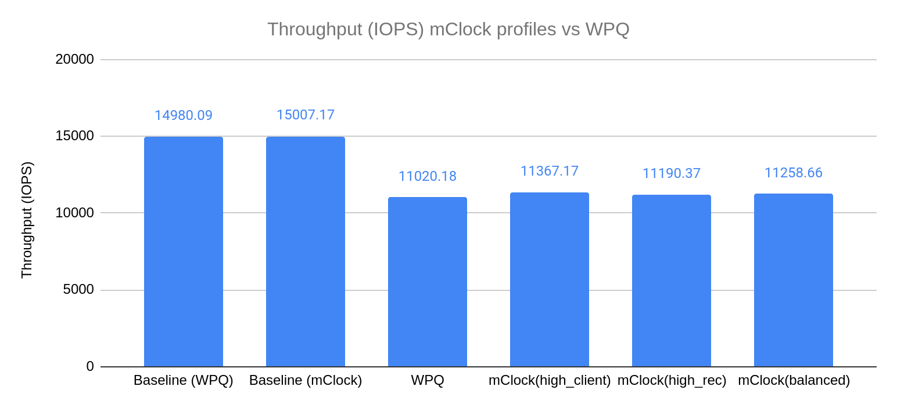

The chart above shows the average client throughput comparison between the different mClock profiles and WPQ. The client throughput plotted is the average client throughput we get from the fio test that runs in parallel with scrub. The duration of the fio test is 840 seconds. The total time taken for deep scrub to complete is a subset of this duration,
We established the baseline IOPS to be roughly around 15k IOPS by running fio (4KiB random write) on the client pool.

The graph shows us that WPQ sees a decrease of 27% in the client IOPS when scrub and client operations run in parallel. In comparison, we see a smaller decrease in client IOPS of about 24% with the high_client_ops profile of the mClock scheduler. This can be attributed to the high reservation given to client operations in this profile.
Taking a look at the other mClock profiles, we see a slightly bigger drop in average client IOPS. These profiles allocate lower reservations to client operations and the difference is visible in the graph.

These results help us make the inference that average client throughput is higher with the mClock profiles than with WPQ. mClock is able to provide the desired QoS for client operations with background scrub operations running concurrently.

#### Client Latency Comparison

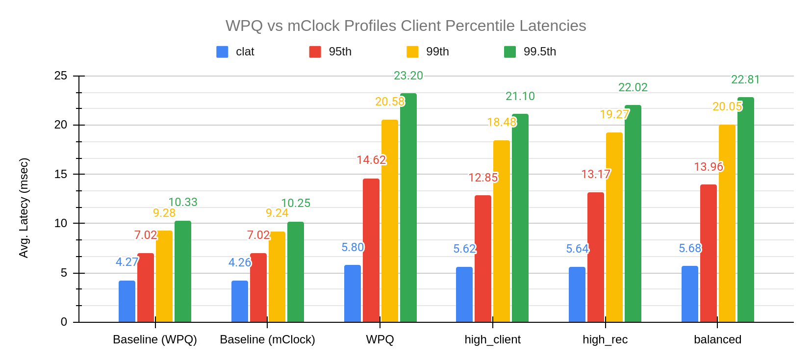

The chart above shows the average completion latency (clat) along with the average 95th, 99th and 99.5th percentiles for the WPQ scheduler and the mClock scheduler profiles.
Overall we can see that the mClock profiles have a lower average completion latency compared to WPQ.
If we look at the high_client_ops profile in particular, the average completion latency is 5.62 msec, which is about 3% lower than WPQ.
To get a better understanding of what the client latencies look like while scrubbing is going on, we can refer to the graph below where we can see that high_client_ops has lower latency than WPQ throughout the duration of the test.

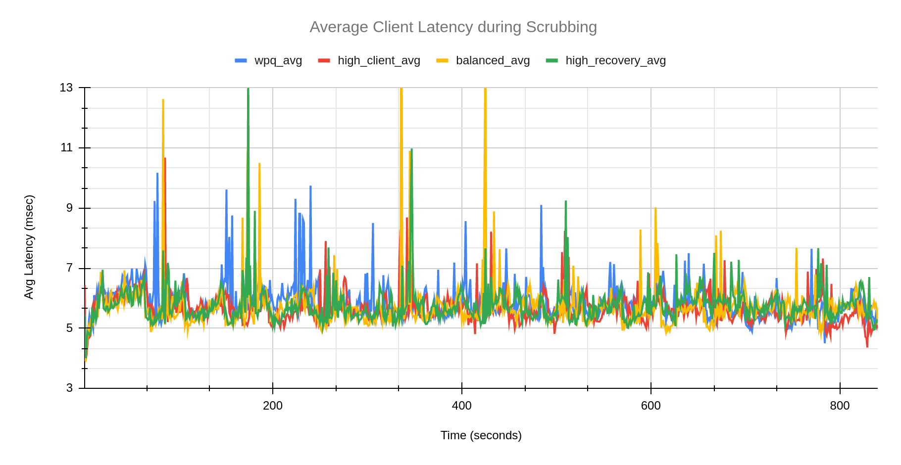

#### Scrub Comparison

In this section we will take a look at how scrub performs with the various mClock profiles and WPQ.
From the initial testing, it was evident that WPQ finishes a deep scrub faster than any of the default mClock profiles. After taking a deeper look into what could be contributing to this, we realized that while mClock treats a scheduled scrub and a requested scrub in a similar manner, whereas WPQ does not. The priority given to a [scheduled scrub](https://docs.ceph.com/en/quincy/rados/configuration/osd-config-ref/#confval-osd_scrub_priority) is 5, whereas the priority for a [requested scrub](https://docs.ceph.com/en/quincy/rados/configuration/osd-config-ref/#confval-osd_requested_scrub_priority) is 120! As the test triggers a requested scrub, the difference between WPQ scrub time and mClock scrub time was considerable. In order to continue using the test to compare scheduled deep scrubs, we set the osd_requested_scrub_priority to 5, which is the priority of a scheduled scrub. All tests below use this value.

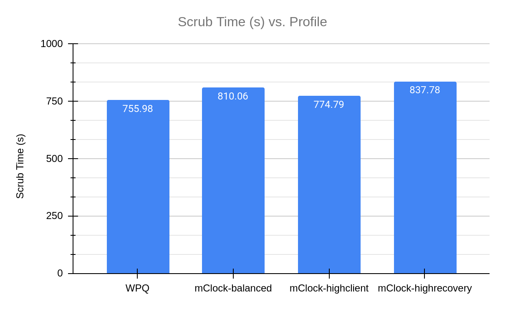

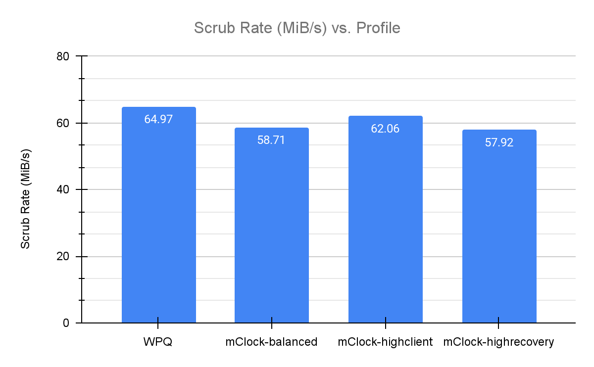

The graphs above show the comparison of the duration of deep scrub across the various mClock profiles and WPQ and the average scrub rate.

We observed that WPQ finished scrubbing in the least amount of time. The mClock high_client_ops profile had the closest scrub time to WPQ. This can be attributed to the background best effort having the highest reservation (25%) in this profile.
As the balanced profile provides a reservation of 20% for background operations, it takes less time to complete scrub in comparison to the high recovery profile that makes minimum reservation (1) for background best effort.
These results also coincide with what we saw in the previous sections where the high_client_ops profile has a lower average client latency and higher throughput than WPQ.
To get a better understanding of how scrub looks like over the duration of the test, we can refer to the graph below.

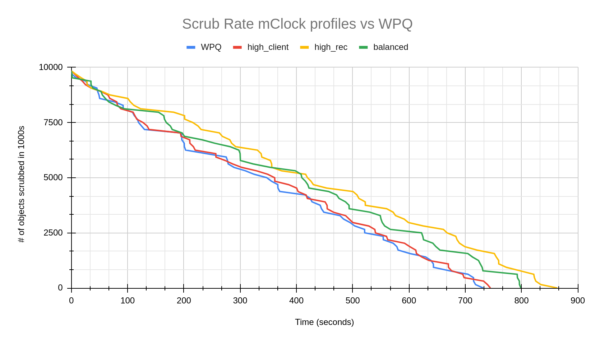

#### Experimenting with the mClock Custom Profile

Our next step was to tune mClock profiles to finish scrubs faster than WPQ. The idea was to have an option that prioritizes scrubs over client operations if needed, similar to how the high_recovery_ops profile gives higher reservations for recovery operations.
After several modifications to various mClock parameters, we found a profile with which scrub duration was lower than WPQ and the scrub rate was higher.
The following are the modified parameters we used:

|      Service Type      | Reservation | Weight | Limit |
| :--------------------: | :---------: | :----: | :---: |
|         client         |      1      |   1    |  80%  |
|  background recovery   |     5%      |   1    | 100%  |
| background best effort |     90%     |   2    |  MAX  |

The graph below shows how the scrub looks over time in comparison to the default mClock profiles and WPQ.

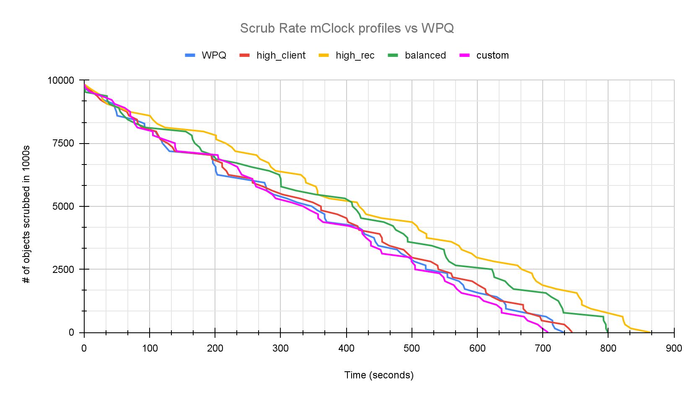

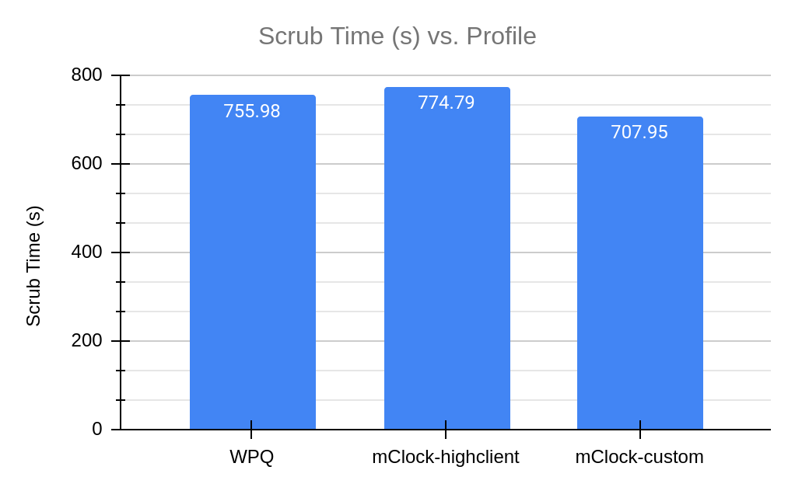

From the graphs above we can clearly see that the custom profile is finishing scrub faster than WPQ and the high client profile.
While this proved that mClock parameters can be tuned to give us the desired result, the custom profile is not a reasonable profile option for client and recovery options since they had to be strictly limited and have been given very low reservations.
This led us to explore the existing scrub configuration parameters in Ceph. In the next section we take a look at how these parameters worked with WPQ and how we can tune them to work better with mClock and achieve lower scrub time without compromising client latency and throughput.

#### Experimenting with Scrub Configuration Parameters

The idea behind this experiment is to find out which existing scrub parameters can be tuned to finish scrub faster and how they affect client latency and throughput.
In order to achieve lower scrub duration we looked into the following scrub configuration parameters:

1. [osd_max_scrubs](https://docs.ceph.com/en/quincy/rados/configuration/osd-config-ref/#confval-osd_max_scrubs)
2. [osd_scrub_cost](https://github.com/ceph/ceph/blob/97d9de3340864c6ae55ba59cd7c8ea31f2a5cda0/src/common/options/global.yaml.in#L3607-L3614)

osd_max_scrubs controls the maximum number of simultaneous scrub operations for an OSD. By default, this value is 1. For the tests in the previous sections we modified it to 5 as mentioned before.
We will now take a look at the repercussions of making it higher.
osd_scrub_cost is the cost assigned to the scrub operation. By default, this cost is 50 MiB. With WPQ, an operation having a lower cost has a higher chance of being picked. The osd_scrub_cost works similarly with the mClock scheduler. We will be analyzing test results where the scrub cost has been decreased to 20 MiB.

##### Increasing osd max scrubs

The graphs below show the results obtained from increasing the number of concurrent scrubs to 10. As we would have expected, the total scrub duration has become half of what we saw with osd max scrubs as 5.

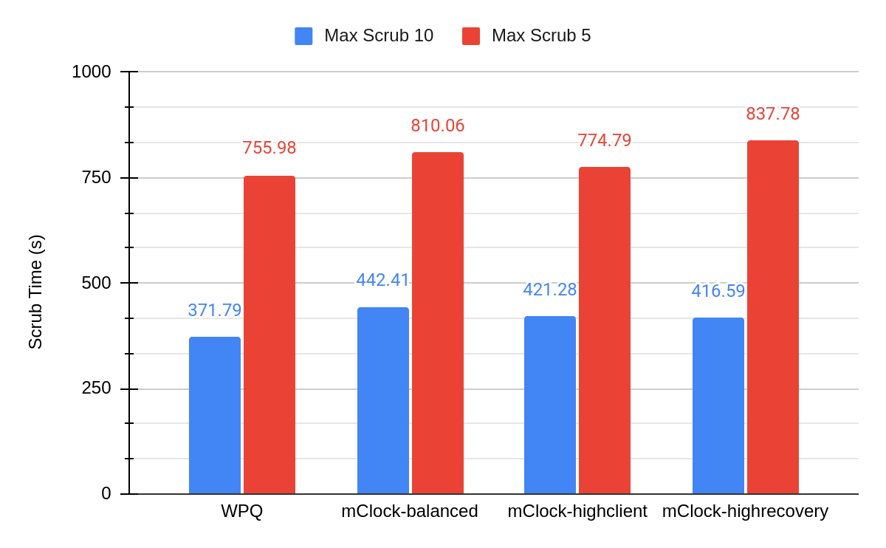

The difference in the average throughput can be seen in the graph below.

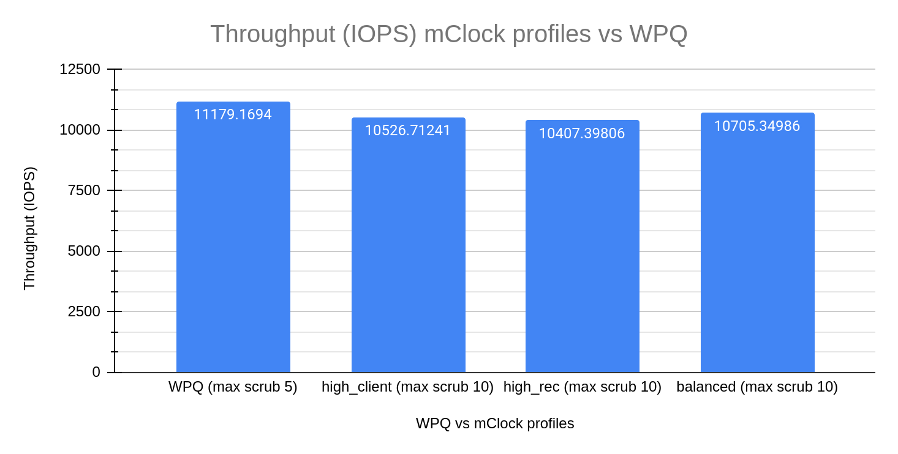

A comparison between the average client latency of high client profile (osd max scrubs = 10) and WPQ shows us the increase in latency while scrub is in progress.

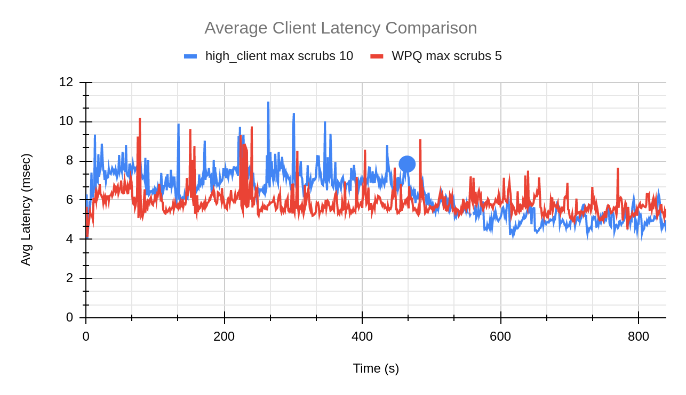

The blue dot in the graph above indicates the point at which scrub finished for the high client profile test with max scrubs set to 10.

From the above graphs we can see the effect of the number of concurrent scrubs increasing on the client throughput and latency. If we take a closer look at the numbers, the client throughput (high client profile) has decreased by 6% when compared to WPQ. The average client latency for just the duration of the scrub with the high client profile is about 7 msec. This is a 20% increase from the average client latency of WPQ (5.8 msec). Meanwhile we see a decrease of 44% in the total scrub duration.
In conclusion, this experiment proves that increasing osd_max_scrubs to reduce scrub duration is a viable option, but that the user should be careful not to increase the concurrent scrubs to a very high number since this affects the client throughput and latency.

##### Reducing scrub cost

Every operation has a cost associated with it. As discussed in the beginning of this section, the lower the cost of the operation, the higher are the chances of it getting dequeued faster. The scrub operations, by default, have a cost of 50 MiB.
WPQ uses a combination of priority and cost to decide which operations are dequeued. Due to this, it is easy to control operations such as scrub. For example, the osd_requested_scrub_priority is 120. This means that when a user explicitly asks for a scrub instead of waiting for the scheduled scrub, WPQ is able to prioritize scrub operations over client operations (priority of 63). We are looking at the cost parameter with the hope that it could do the same for mClock.

For all the mClock tests mentioned below, we have reduced the scrub cost to 20 MiB. For the WPQ tests, we have used the default osd_requested_scrub_priority of 120.

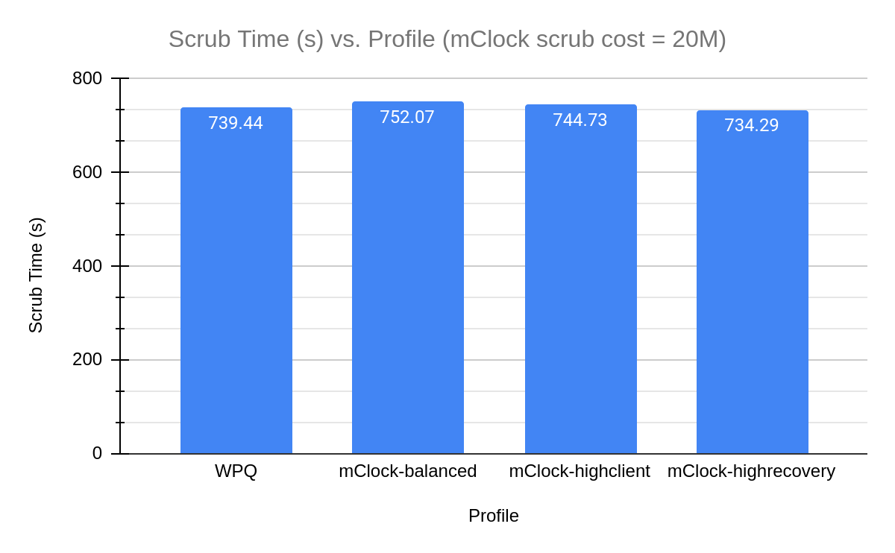

In the above graph we can see the decrease in scrub duration for the mClock profiles. The scrub performance for the profiles looks similar to that of WPQ (with scrub priority = 120).
We can see the same in the graphs comparing the average client latency and scrub rate over the test duration where the trends for high recovery profile and WPQ look similar.

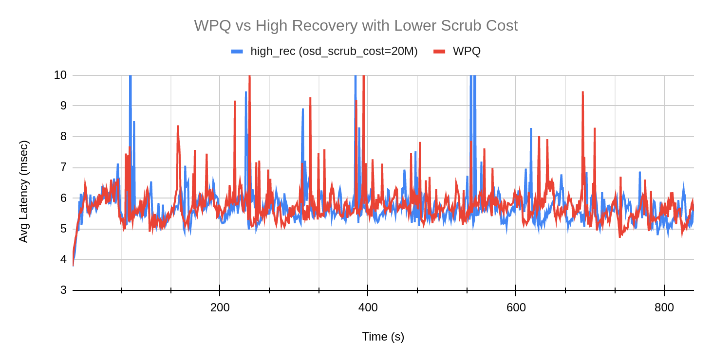

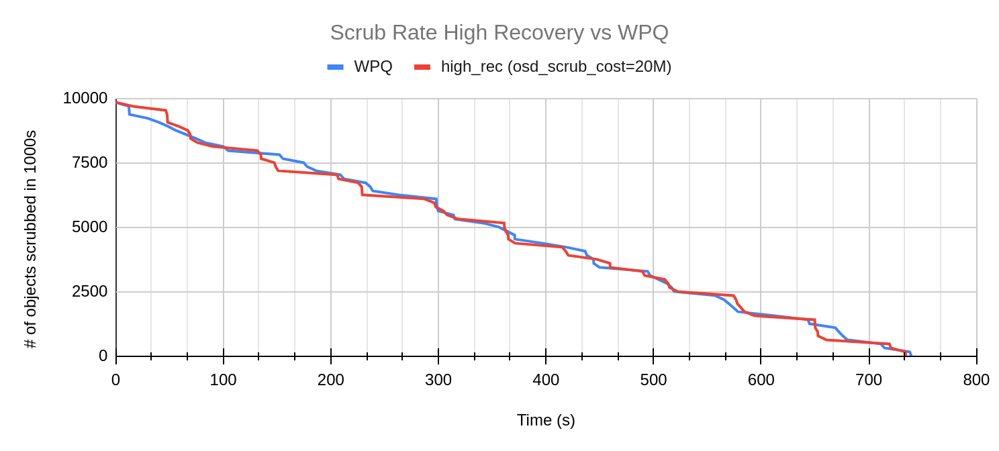

While we see a better scrub performance by mClock profiles, let’s take a look at how the average throughput changes in comparison to WPQ. In the graph below, it is evident that the mClock profiles have better throughput than WPQ. In particular, the high client profile continues to give higher throughput than the other profiles and WPQ.
Decreasing the osd scrub cost has helped the mClock profiles provide scrub performance that is comparable to WPQ’s user requested scrub. And without any loss in client throughput and latency!

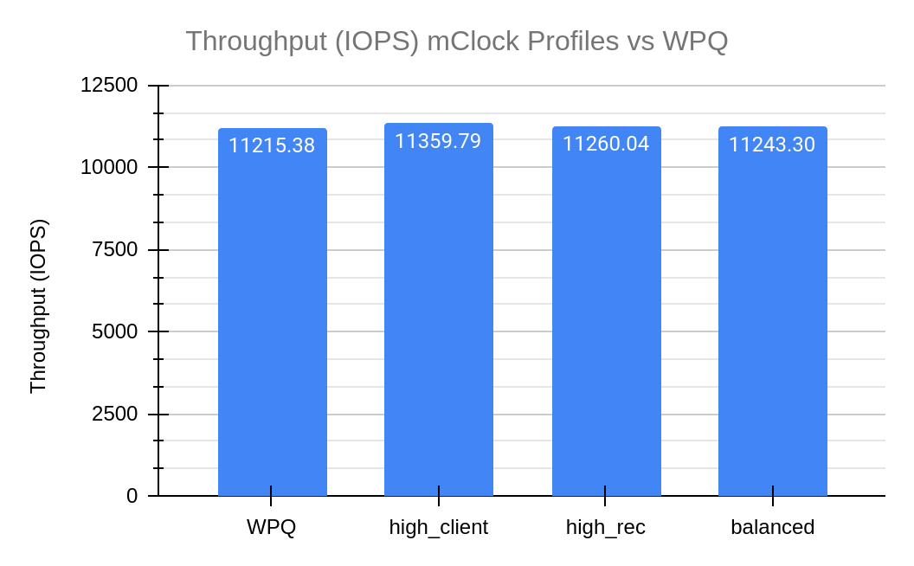

## Client Ops with Background Scrub & Recovery

### Test Steps

1. Bring up the Ceph cluster with 4 OSDs
2. Create a client RBD pool with replication factor of 3 and prefill some objects into it.
3. Create a RBD recovery pool with replication factor 3.
4. Mark an OSD down and out. After the cluster handles the OSD down event, 50K 4MiB objects are pre-filled into the recovery pool.
5. Create a RADOS scrub pool with replication factor 3
6. Temporarily disable recovery and backfill ops.
7. Bring up the downed OSD from step 4
8. Prefill the scrub pool with 100000 objects of 4 MiB size
9. Initiate deep scrub on the scrub pool and enable recovery and backfill at the same time
10. Initiate I/O on the client pool for 9 minutes using fio
11. While the client I/O and deep scrub are running, the test collects statistics related to client throughput and latency. The test also collects scrub statistics such as number of objects scrubbed and scrub duration and recovery statistics.

### Test Results

#### Client Throughput Comparison

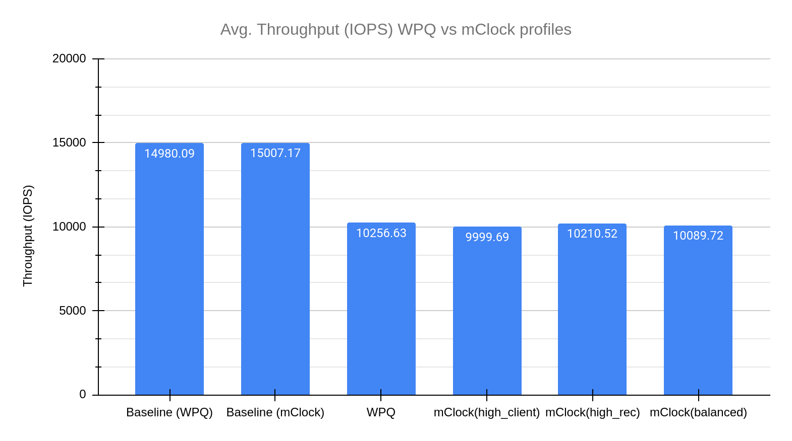

The graph above displays the drop in client throughput with recovery and scrub happening in parallel. All the profiles have a similar drop in throughput, and the difference between them is not significant. To get a better understanding, we will compare the client latencies in the next sections.

#### Client Latency Comparison

The graph below describes how average client latency varies for the various profiles over the duration of the test.

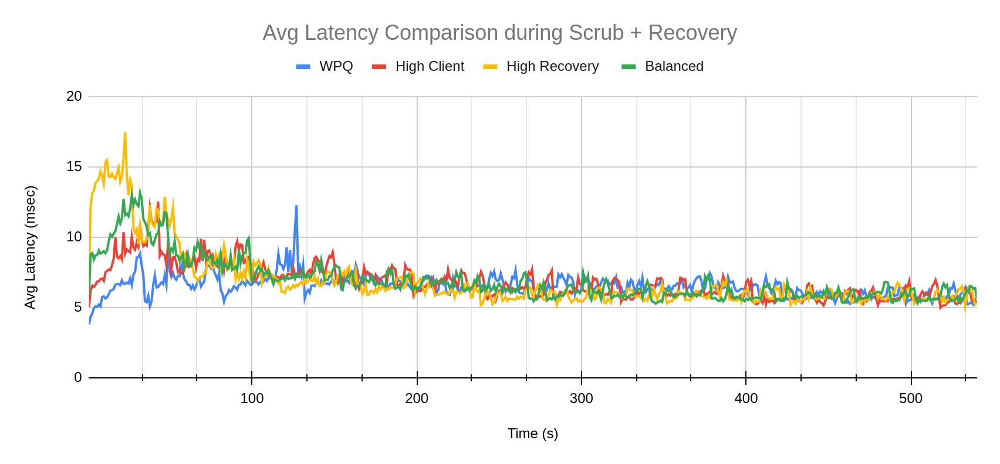

There is a jump in client latency for the mClock profiles in the beginning of the test. This can be attributed to the beginning of recovery. As we will see in the next section, recovery rate is much higher for mClock profiles as compared to WPQ.
Over time, this spike flattens out, and we can see client latency returning to a normal trend -- at times even lower than WPQ.

#### Scrub and Recovery Comparison

The graphs below show the scrub and recovery rate over the duration of the test. In the scrub rate comparison, mClock profiles take some time to start scrub whereas with WPQ we can see that scrub starts almost immediately.

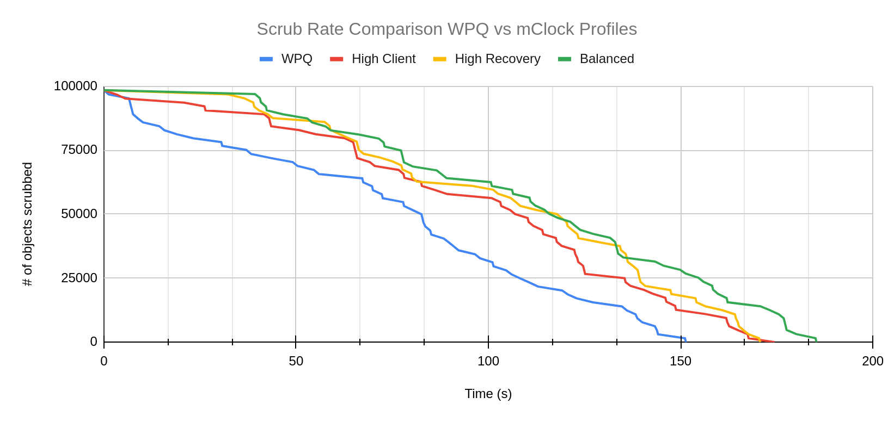

Almost the opposite trend can be observed in the graph comparing recovery rates. The number of objects recovered starts decreasing rapidly for all the mClock profiles. WPQ seems to have a slow start and eventually takes much longer to complete recovery than the mClock profiles.

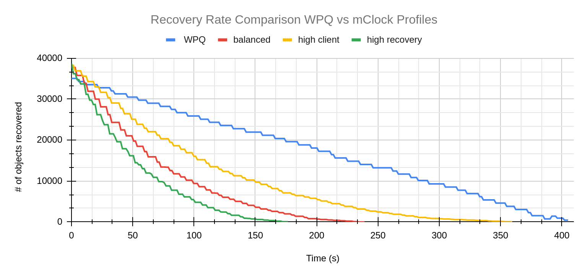

The above behavior can be attributed to:

- mClock reserving more IOPS for recovery operations
- Scrub operations having a much higher cost of 50 MiB compared to recovery operations that cost 20 MiB

## Conclusion

To summarize, after taking a look at how the default mClock profiles handle background operations such as scrubbing and recovery, we can say that mClock profiles attempt to finish recovery faster than a scrub.
In addition to this, the experiments with the mClock custom profile proved that with higher allocations, we can achieve a faster scrub. Other than mClock parameters, we also explored the existing Ceph configuration parameters that can be tuned to give us better scrub performance with mClock.
The mClock scheduler is the default osd_op_queue in the Quincy release. Let us know how your experience with mClock goes, and thank you for reading! For any queries please do reach out to ceph-users@ceph.io.
