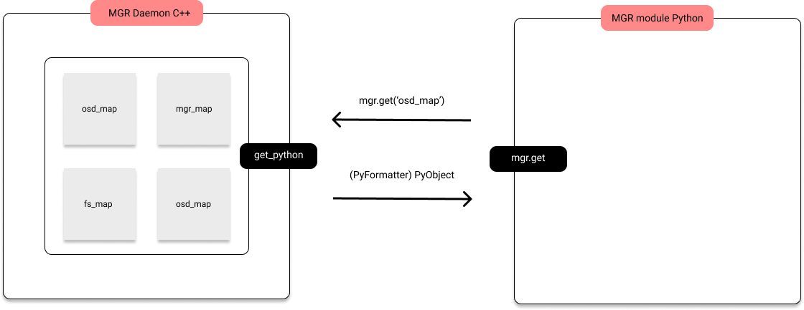
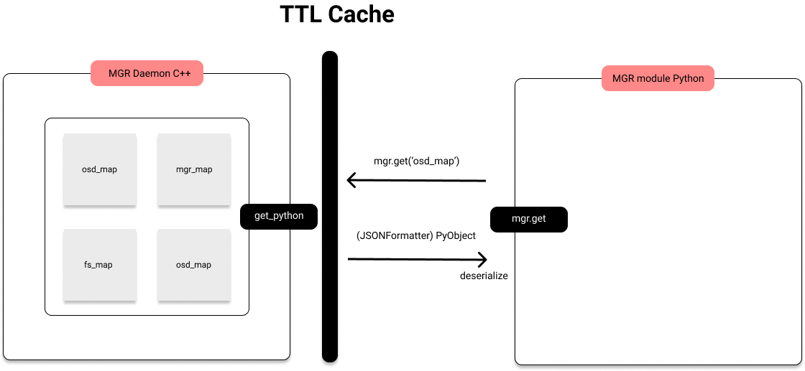
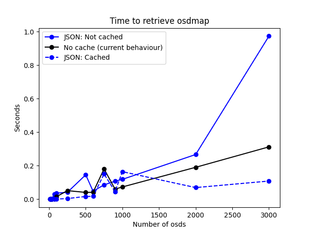

## Introduction

A while ago problems have been arising related to the scalability of the mgr daemon and the underlying tightly
coupled (to the daemon) structure of python modules like the dashboard, prometheus, pg_autoscaler, orchestrators and many more.

Cluster data is requested on demand by the modules every certain time in order to keep the cluster
status updated in these modules. For example, the dashboard will periodically request health data updates
to the daemon to display if the cluster is healthy.

There are instances of data structures where scalability is a problem. Osds for example can increase up to thousands, therefore,
structures like OSDMap will increase proportionally in size and thus, increasing the latency of modules when
they try to retrieve the newest data.

## Adding a cache layer

There have been talks on what to do to solve this problem, but we agreed that a cached mgr could help by decreasing the latency
on large clusters which suffer from these problems.

_A grosso modo_, mgr modules are connected like:

As you can see, the daemon holds most of the maps of the cluster. When something is requested,
for example `get('osd_map')`, it will start to transform the OSDMap to a PyObject with what we call Formatters (PyFormatter in this instance).
Caching a PyObject is difficult since we would have to make a copy for each python module so, we used a simpler approach where we would transform
the structure to json (With JsonFormatter) where we only have to worry about serializing and deserializing.

With json serialization in place, a shared TTL Cache between modules and the daemon was added:

Not everything is cached as it might seem in the diagram but most of the problematic calls are. Serializing with JSON itself
is not a great improvement but, if we cache the serialized object we see **2.8x improvement with 3000 osds**.

In the following line chart a clear distinction is made between the current behaviour and the cache with json serialization. This
benchmarks were run by requesting the OSDMap 5000 times for each number of osds. These are the results:

The blue dashed line represents the improvement in latency to retrieve and osdmap, the black line is the usual behaviour and the blue line,
the results without caching json objects.

Moreover, the cache is available in master/quincy and soon to be backported to pacific. It can be enabled by running:

`ceph config set mgr mgr ttl_cache_expire_seconds 10`

That will set a 10 seconds _time to live_ to each cached object.

## Conclusion

With a disabled cache the usual behaviour is still faster; nevertheless, we see a clear improvement of almost 3x on larger clusters with
the cache enabled and using a simple serialization tool like json.

The mgr daemon has been unattended for a while and a lot of improvements are needed to have a more scalable mgr. This cache is an improvement
that alleviates some of the workload, but there is more work to be done addressing scalability, debuggabilitty, subinterpreters... Stay tuned!
