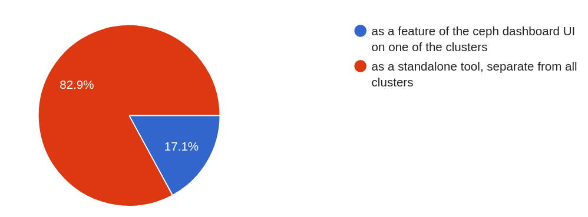
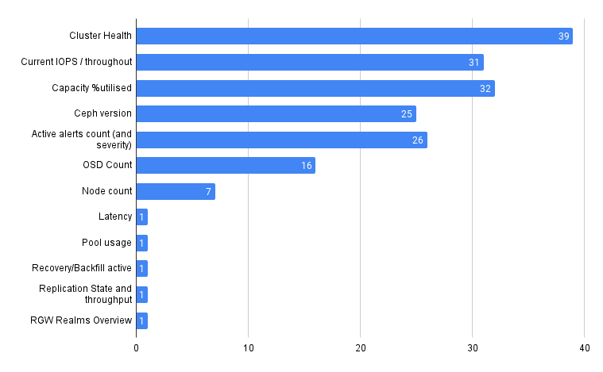
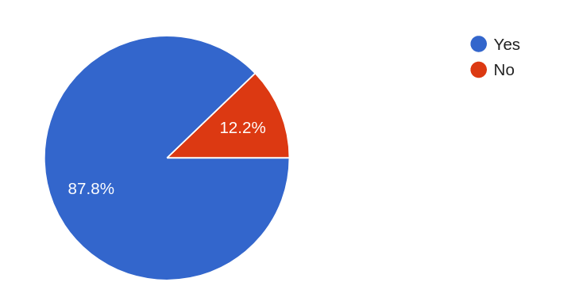
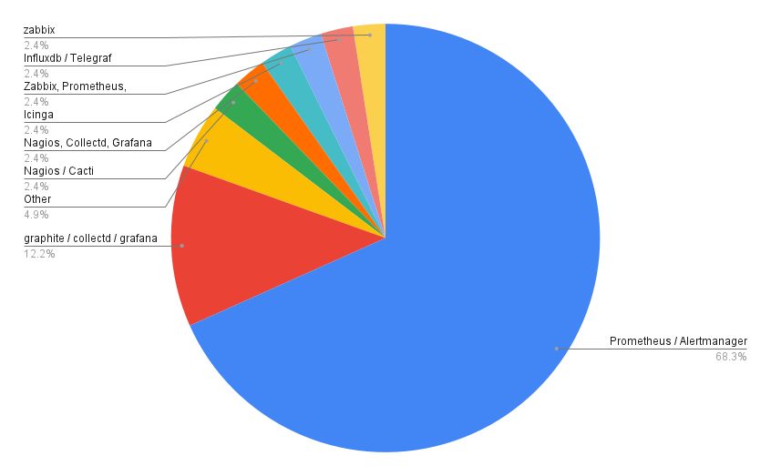
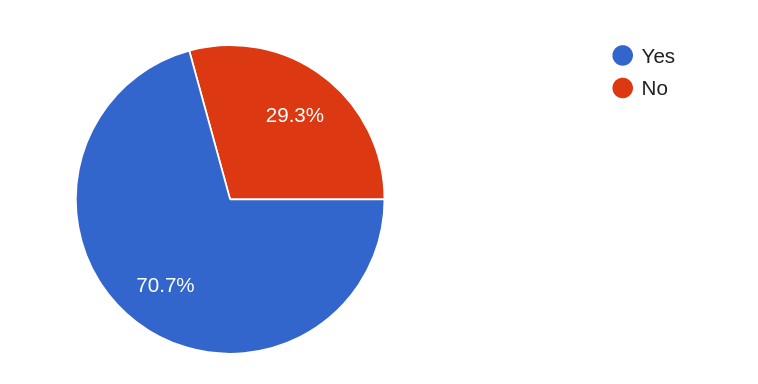

Usability has been a key theme for Ceph developers for a number of releases, but so far the focus has been on single cluster usability. To date, users that deploy multiple Ceph clusters have been developing their own solutions to meet their needs, but there may be common themes and capabilities that the Ceph developers could learn from.

To this end, we started a small survey of 13 questions to help the developers better understand the multi-cluster management use case, and the kinds of features needed.

Huge thanks to the 41 respondents for taking the time to share their knowledge and experience.

The full results of the survey, in PDF and CSV format, can be found below.

- [Mult-Cluster Management Survey Results (PDF)](attachments/Ceph-Multi-Cluster-Management-Survey.pdf)
- [Mult-Cluster Management Survey Raw Data (CSV)](attachments/Ceph-Multi-Cluster-Management-Survey-RAW.csv)

However, if you're short on time, here's my top-5 of the most interesting insights from the survey.

## Where should a multi-cluster feature reside?

Although Ceph already provides an integrated UI, the necessity to monitor and view across all clusters whilst remaining unaffected by individual cluster issues seems to resonate with most people.

## What kinds of attributes do you think are important when getting a high-level understanding of a Ceph cluster?

There is a clear set of attributes that resonate with most respondents. However, it's also interesting to see requirements emerging relating to the visibility of cross cluster activity like RGW multi-site and replication.

## Should the interface provide an aggregated view of alerts?

This could be a timesaver, and may help admins better prioritize any remediation of current issues across the Ceph 'fleet'. (And yes we should all have a fleet of Ceph clusters!)

## Assuming alert visibility across your clusters is important, what are the monitoring stacks the feature should integrate with?

This is an interesting result since the Prometheus/Alertmanager stack is already fully integrated into a Ceph cluster.

## Should Capacity Planning be a component of the feature?

There's no surprises with this result. Once you gain visibility across all your ceph clusters from a single point, handling capacity planning and forecasting becomes the next logical step.

## Where to from here?

That's a good question!

The goal for the survey was to help developers better understand the requirements surrounding Multi-cluster management. I think it did that!

Next step is to attract developers that are interested in working on this capability. So, if you're a developer, a sysadmin or just passionate about multi-cluster management, reach out to the <dev@ceph.io> mailing list and let's see what we can do!
