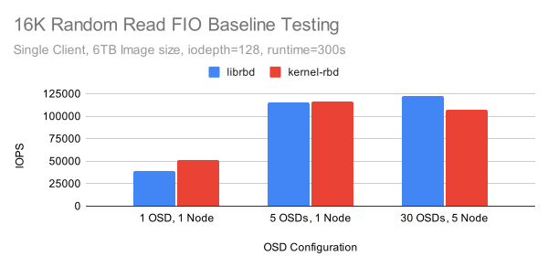
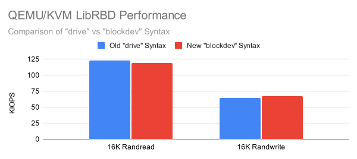
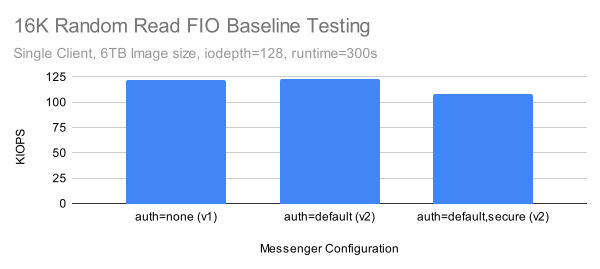

# Introduction

The Ceph team was recently asked what the highest performing QEMU/KVM setup that has ever been tested with librbd is.  While VM benchmarks have been collected in the past, there were no recent numbers from a high performing setup.  Typically Ceph engineers try isolate the performance of specific components by removing bottlenecks at higher levels in the stack.  That might mean testing the latency of single OSD in isolation with syncronous IO via librbd, or using lots of clients with high IO depth to throw a huge amount of IO at a cluster of OSDs on bare metal.  In this case, the request was to drive a single QEMU/KVM VM backed by librbd with a high amount of concurrent IO and see how fast it can go.  Read on to find out just how fast QEMU/KVM was able to perform when utilizing Ceph's librbd driver.

# Acknowledgements

Thank you to Red Hat and Samsung for providing the Ceph community with the hardware used for this testing.  Thank you to Adam Emerson and everyone else on the Ceph team who work on the client side performance improvements that made these results possible.  Finally, thank you to QEMU maintainer Stefan Hajnoczi for providing expertise regarding QEMU/KVM and reviewing a draft copy of this post.

# Cluster Setup 

Nodes | 10 x Dell PowerEdge R6515
-- | --
CPU | 1 x AMD EPYC 7742 64C/128T
Memory | 128GiB DDR4
Network | 1 x 100GbE Mellanox ConnectX-6
NVMe | 6 x 4TB Samsung PM983
OS Version | CentOS Stream release 8
Ceph Version | Pacific V16.2.9 (built from source)
qemu-kvm Version | qemu-kvm-6.2.0-20.module_el8.7.0+1218+f626c2ff.1

All nodes are located on the same Juniper QFX5200 switch and connected with a single 100GbE QSFP28 link.  While the cluster has 10 nodes, various configurations were evaluated before deciding on a final setup.  Ultimately 5 nodes were used to serve as OSD hosts with 30 NVMe backed OSDs in aggregate.  The expected aggregate performance of this setup is around 1M random read IOPs and at least 250K random write IOPS (after 3x replication) which should be enough to test the QEMU/KVM performance of a single VM.  One of the remaining nodes in the cluster was used to serve as the VM host.  Before configuring the VM though, several test clusters were built with [CBT](https://github.com/ceph/cbt/) and a test workload was run using fio's librbd engine to get a baseline result.

# Baseline Testing

CBT was configured to deploy Ceph with a couple of modified settings vs stock.  Primarily, rbd cache was disabled(1), each OSD was given an 8GB OSD memory traget, and msgr V1 was used with cephx disabled for the initial testing (but cephx was enabled using msgr V2 in secure mode for later tests).  After cluster creation, CBT was configured to create a 6TB RBD volume using fio with the librbd engine, then perform 16KB random reads via fio with iodepth=128 for 5 minutes.  As it's very easy to recreate clusters and run multiple baseline tests with CBT, several different cluster sizes were tested to get baseline results for both the librbd engine and the libaio engine on top of kernel-rbd.

1. Disabling RBD cache at the cluster level will be respected by fio using the librbd engine, but will not be respected by QEMU/KVM's librbd driver.  Instead cache=none must be passed explicitly via qemu-kvm's drive section.



Kernel-RBD performed very well when reading from a single OSD, but Librbd in the full 30 OSD configuration achieved the highest performance at just over 122K IOPS.  Both librbd and kernel-rbd performed nearly as well on the 5 OSD setup.  Still, further testing was performed on the 5 node, 30 OSD configuration. This setup better mimics what users might see on a small but realisticly provisioned NVMe backed Ceph cluster.

# VM Deployment

Deploying and booting a QEMU image with RBD is fairly straightforward once you know what to do.

### 1. Download an Image.
A CentOS8 Stream qcow2 image is used and with a root password and public key injected for easy access:
```
wget https://cloud.centos.org/centos/8-stream/x86_64/images/CentOS-Stream-GenericCloud-8-20220913.0.x86_64.qcow2
virt-sysprep -a ~/CentOS-Stream-GenericCloud-8-20220913.0.x86_64.qcow2 --root-password password:123456 --ssh-inject root:file:/home/nhm/.ssh/id_rsa.pub 
```
### 2. Create, Initialize, and Setup LibVirt Authentication for an RBD Image Pool
This is used to store the RBD images.
```
sudo /usr/local/bin/ceph osd pool create libvirt-pool 
sudo /usr/local/bin/rbd pool init libvirt-pool
sudo /usr/local/bin/ceph auth get-or-create client.libvirt mon 'profile rbd' osd 'profile rbd pool=libvirt-pool'  
```
### 3. Convert the qcow2 Image into a Ceph RBD Image and Resize
Resize it so there is some space for the benchmark!
```
qemu-img convert -f qcow2 -O raw ./CentOS-Stream-GenericCloud-8-20220913.0.x86_64.qcow2 rbd:libvirt-pool/CentOS8 
qemu-img resize rbd:libvirt-pool/CentOS8 6000G 
```
### 4. Finish Setting up the VM and Prefill the Benchmark Data 
Finally, boot the VM from RBD, log into it, setup the partition, and prefill an FIO file to test against.  In this case only a 20GB portion of the image is being used, but don't worry.  Later on there will be results for a much larger (2TB) file on a real XFS filesystem.
```
/usr/libexec/qemu-kvm -m 16384 -smp 16,sockets=1,cores=16,threads=1 -drive format=raw,file=rbd:libvirt-pool/CentOS8 -net nic -net user,hostfwd=tcp::2222-:22
ssh -p 2222 root@localhost
sudo yum install fio
cfdisk /dev/sda # Create a 2TB partition here (maximum size due to the partition type for image, oh well)
fio --ioengine=libaio --rw=write --numjobs=1 --bs=4M --iodepth=128 --size=20G --name=/dev/sda2 
```
# Benchmarking the VM

### 1. The Default Case

It is well known that there is a fairly dramatic performance difference between qemu devices such as ide and virtio-blk.  What is the performance like QEMU/KVM is configured to use it's defaults?

```
/usr/libexec/qemu-kvm -m 16384 -smp 16,sockets=1,cores=16,threads=1 -drive format=raw,file=rbd:libvirt-pool/CentOS8 -net nic -net user,hostfwd=tcp::2222-:22

fio --ioengine=libaio --direct=1 --bs=16384 --iodepth=128 --rw=randread --norandommap --size=20G --numjobs=1 --runtime=300 --time_based --name=/dev/sda2 
```
```
read: IOPS=2484, BW=38.8MiB/s (40.7MB/s)(11.4GiB/300001msec) 
```
Pretty terrible!  How does virtio-blk do?

### 2. Using virtio-blk-pci
```
/usr/libexec/qemu-kvm -m 16384 -smp 16,sockets=1,cores=16,threads=1 -drive format=raw,id=rbd0,if=none,file=rbd:libvirt-pool/CentOS8 -device virtio-blk-pci,drive=rbd0,id=virtioblk0 -net nic -net user,hostfwd=tcp::2222-:22

fio --ioengine=libaio --direct=1 --bs=16384 --iodepth=128 --rw=randread --norandommap --size=20G --numjobs=1 --runtime=300 --time_based --name=/dev/vda2
```
```
read: IOPS=24.9k, BW=390MiB/s (409MB/s)(114GiB/300005msec) 
```

A big improvment.  Now it's time to add a separate iothread.

### 3. Adding a Separate IO Thread
```
/usr/libexec/qemu-kvm -m 16384 -smp 16,sockets=1,cores=16,threads=1 -drive format=raw,id=rbd0,if=none,file=rbd:libvirt-pool/CentOS8 -object iothread,id=iothread0 -device virtio-blk-pci,iothread=iothread0,drive=rbd0,id=virtioblk0 -net nic -net user,hostfwd=tcp::2222-:22

fio --ioengine=libaio --direct=1 --bs=16384 --iodepth=128 --rw=randread --norandommap --size=20G --numjobs=1 --runtime=300 --time_based --name=/dev/vda2 
```
```
read: IOPS=26.0k, BW=407MiB/s (426MB/s)(119GiB/300005msec) 
```

Better, but still pretty slow.  At this point I profiled QEMU/KVM with ([uwpmp](https://github.com/markhpc/uwpmp/)).  There were a variety of issues including mismatched debug symbols and other irritating problems.  Several dozen tests were run before any luck was had.  The thing that finally moved the testing forward was an observation based on the wallclock profile that QEMU was invoking librbd's cache layer.  I then remembered that the librbd driver in QEMU overrides whatever is set in Ceph's global configuration.  To disable RBD cache in QEMU/KVM (which is important on fast clusters), cache=none must be set explicitly in qemu-kvm's drive configuration.

### 4. Disabling LibRBD Drive Cache
```
/usr/libexec/qemu-kvm -m 16384 -smp 16,sockets=1,cores=16,threads=1 -drive format=raw,id=rbd0,if=none,cache=none,file=rbd:libvirt-pool/CentOS8 -object iothread,id=iothread0 -device virtio-blk-pci,iothread=iothread0,drive=rbd0,id=virtioblk0 -net nic -net user,hostfwd=tcp::2222-:22

fio --ioengine=libaio --direct=1 --bs=16384 --iodepth=128 --rw=randread --norandommap --size=20G --numjobs=1 --runtime=300 --time_based --name=/dev/vda2 
```
```
read: IOPS=53.5k, BW=836MiB/s (876MB/s)(245GiB/300003msec) 
```

Disabling LibRBD cache resulting in a pretty big win, but luckily that is not the end.  When running the wallclock profiler, I noticed that not only was a lot of time spent in rbd cache, but also libc memory allocation routines.  Ceph's memory model often involves the creation of many small temporary objects that fragment memory and are incredibly hard on memory allocators.  TCMalloc (and JEMalloc) tend to handle Ceph's behavior better than libc malloc.  Luckily, it is possible to inject TCMalloc via a LD_PRELOAD directive.

### 5. Switching the Memory Allocator to TCMalloc
```
LD_PRELOAD="/usr/lib64/libtcmalloc.so" /usr/libexec/qemu-kvm -m 16384 -smp 16,sockets=1,cores=16,threads=1 -drive format=raw,id=rbd0,if=none,cache=none,file=rbd:libvirt-pool/CentOS8 -device virtio-blk-pci,drive=rbd0,id=virtioblk0 -net nic -net user,hostfwd=tcp::2222-:22

fio --ioengine=libaio --direct=1 --bs=16384 --iodepth=128 --rw=randread --norandommap --size=20G --numjobs=1 --runtime=300 --time_based --name=/dev/vda2 
```
```
read: IOPS=80.0k, BW=1250MiB/s (1311MB/s)(366GiB/300003msec) 
```

Another really big win, but can it go even faster?

### 6. Utilizing the new version of LibRBD

So far the system version of librbd that came with CentOS Stream8 has been used in this testing.  It is quite old and there have been noteable improvements since.  These primarily relate to the boost::asio IO path rework written by Adam Emerson and implemented in RBD by Jason Dillaman.  LD_LIBRARY_PATH can be set to tell qemu-kvm to use the new version of librbd that was installed in /usr/local when Ceph (v16.2.9) was compiled.

```
LD_LIBRARY_PATH=/usr/local/lib:/usr/local/lib64
LD_PRELOAD="/usr/lib64/libtcmalloc.so" /usr/libexec/qemu-kvm -m 16384 -smp 16,sockets=1,cores=16,threads=1 -drive format=raw,id=rbd0,if=none,cache=none,aio=native,file=rbd:libvirt-pool/CentOS8 -object iothread,id=iothread0 -device virtio-blk-pci,iothread=iothread0,drive=rbd0,id=virtioblk0 -net nic -net user,hostfwd=tcp::2222-:22

fio --ioengine=libaio --direct=1 --bs=16384 --iodepth=128 --rw=randread --norandommap --size=20G --numjobs=1 --runtime=300 --time_based --name=/dev/vda2
```
```
read: IOPS=126k, BW=1964MiB/s (2060MB/s)(575GiB/300002msec) 
```

The new version of librbd improved performance dramatically and the results are now slightly faster than the baseline fio test using librbd directly!

# Bigger Tests

Up until now only a small (20G) dataset directly on the RBD block device has been used for testing.  To make these tests a little more realistic and closer in size to our baseline tests, an XFS filesystem can be installed and prefilled with 2TB worth of data (sadly limited by the previously mentioned partition size restriction).

```
mkfs.xfs /dev/vda2
mount /dev/vda2 /mnt
fio --ioengine=libaio --direct=1 --rw=write --numjobs=1 --bs=4M --iodepth=16 --size=2000G --name=/mnt/foo 
```
```
write: IOPS=607, BW=2429MiB/s (2547MB/s)(2000GiB/843305msec); 0 zone resets 
```

Not bad.  Even with a fairly modest iodepth=16, fio is able to fill the RBD volume at roughly NVMe speed.  How about the 16K randread workload?

### 16K Random Reads

```
fio --ioengine=libaio --direct=1 --bs=16384 --iodepth=128 --rw=randread --norandommap --size=2000G --numjobs=1 --runtime=300 --time_based --name=/mnt/foo 
```
```
read: IOPS=123k, BW=1916MiB/s (2009MB/s)(561GiB/300002msec) 
```

...And just for fun, how about 16K random writes?

### 16K Random Writes


```
fio --ioengine=libaio --direct=1 --bs=16384 --iodepth=128 --rw=randwrite --norandommap --size=2000G --numjobs=1 --runtime=300 --time_based --name=/mnt/foo 
```
```
write: IOPS=64.1k, BW=1001MiB/s (1050MB/s)(293GiB/300003msec); 0 zone resets 
```

Not quite as fast as a local NVMe drive, but not bad for a single VM.  Of note is that all three of Ceph's async msgr threads were running at 100% CPU during the random read test.  Looking at the qemu-kvm process with ([uwpmp](https://github.com/markhpc/uwpmp/)) while the tests were running showed a fairly wide array of work being done with no obvious areas for quick optimization on the librbd side.  It is likely however that bringing boost::asio deeper into the stack could provide additional improvements.

### Further QEMU Optimizations?

After the above testing was completed I reached out to QEMU maintainer Stefan Hajnoczi to get his take on the results.  He offered a couple of additional options to try:

- The newer --blockdev rbd,node-name=rbd0,cache.direct=on,pool=libvirt-pool,image=CentOS8 syntax omits the 'raw' driver for a tiny speed-up...I/O requests go directly from the emulated virtio-blk device to the rbd driver with this new syntax.
- Use -M q35 to get a modern machine type.

It turns out that testing this is quite easy and we can just relaunch qemu-kvm with the new syntax:

```
LD_LIBRARY_PATH=/usr/local/lib:/usr/local/lib64
LD_PRELOAD="/usr/lib64/libtcmalloc.so" /usr/libexec/qemu-kvm -m 16384 -smp 16,sockets=1,cores=16,threads=1 --blockdev rbd,node-name=rbd0,cache.direct=on,pool=libvirt-pool,image=CentOS8 -M q35 -object iothread,id=iothread0 -device virtio-blk-pci,iothread=iothread0,drive=rbd0,id=virtioblk0 -net nic -net user,hostfwd=tcp::2222-:22 
```



Ultimately the performance was very close with potentially slightly slower reads and slightly faster writes using the new syntax, though further testing is needed to know if the results are statistically relevant.

# Msgr V2 and AES Encryption

So far these tests have all used Msgr V1 with CephX completely disabled.  This isn't a very realistic way to run a real cluster.   The only time a cluster should be configured like this is if it is well protected from the outside and clients are trusted implicitly.  Ceph's default authentication mode allows for both authentication and protects against man-in-the-middle attacks.  Ceph can also run in a "secure" mode that additionally provides AES-128-GCM over-the-wire encryption.  This can be enabled by setting several Ceph configuration options to "secure":

```
ms_client_mode = secure
ms_cluster_mode = secure
ms_service_mode = secure
ms_mon_client_mode = secure
ms_mon_cluster_mode = secure
ms_mon_service_mode = secure
```

How much do these settings affect client performance in the baseline test?



The drop here doesn't appear to be too bad, but repeating the QEMU/KVM random read test from the "Bigger Tests" section above resulted in a score of around 87K IOPS vs 123K IOPS without encryption.  The async msgr threads are still pegged at 100% in the qemu-kvm process, but this time the (inverse) wallclock profile looks a little different:

```
+ 14.00% _aesni_ctr32_ghash_6x
|+ 14.00% aesni_gcm_decrypt
| + 14.00% aes_gcm_cipher
|  + 14.00% EVP_DecryptUpdate
|   + 14.00% ceph::crypto::onwire::AES128GCM_OnWireRxHandler::authenticated_decrypt_update(ceph::buffer::v15_2_0::list&)
|    + 14.00% ceph::msgr::v2::FrameAssembler::disasm_remaining_secure_rev1(ceph::buffer::v15_2_0::list*, ceph::buffer::v15_2_0::list&) const 
```

Each async msgr thread is spending at least 14% of it's time in libssl's EVP_DecryptUpdate function as part of the frame assembly work.  Notably libssl appears to be properly using AES-NI instructions even on this AMD Rome processor.  Looking closely at the code, it appears that for every frame, Ceph walks over every segment and decrypts indivdiual buffers (potentially multiple per segment!) sequentially.  IE the pseudo code appears to look something like this:

```
Disassemble first segment
Disassemble remaining segments
  For each Segment in Segments:
    For each buffer in Segment:
      convert buffer to c string
      call EVP_DecryptUpdate on c string 
```

Perhaps if larger chunks of data could be decrypted at once, AES-NI overhead could be reduced here.  But what sizes really matter?  Openssl provides a speed test that can help narrow things down:

```
openssl speed -evp aes-128-gcm -decrypt
```
type | 16 bytes | 64 bytes | 256 bytes | 1024 bytes | 8192 bytes | 16384 bytes
-- | -- | -- | -- | -- | -- | --
aes-128-gcm | 321729.96k | 1099093.40k | 2269449.47k | 3429211.27k | 3995912.87k | 4038464.85k

It appears that on this processor we should be able to do up to nearly 4GB/s (256K chunks/second) when processing only 16K chunks and utilizing a full core just for AES decryption.  Even 1-8K chunks process quickly, but very small chunks have a significant impact on decryption performance.  That may help explain the performance loss when secure mode is enabled.  If each of the 3 IO threads are spending 14-20% of their time in libssl functions (not all were shown in the profile snippet above), the expectation is that 120-130K IOPS should be achievable based on the openssl speed test.  It's also possible that if contention can be reduced between msgr threads, additional msgr threads may be able to scale performance higher at the expense of increased CPU usage.

# Conclusion

This post covered how to tune the performance of QEMU/KVM and librbd for VM storage.  For 16K IOs, qemu+librbd could achieve 64-67K random write IOPS and 123K random read IOPS from a single VM after careful tuning.  Enabling 128bit over-the-wire AES encryption in Ceph has a significant (30%+) performance impact, even when using libssl's AES-NI support.  In both the encrypted and unencrypted cases, performance primarily appeared to be limited by saturated msgr threads.  There were some indications that contention between threads may be playing a role in limiting single-client performance.  In the case where AES encryption was enabled, performance may have been impacted by how frame segments are broken up and decrypted sequentially.  There did not appear to be evidence that virtio-blk-pci has yet hit it's ceiling indicating there is more room for improvement.  Thank you for reading!
