# Introduction

Tuning Ceph can be a difficult challenge. Between Ceph, RocksDB, and the Linux kernel, there are literally thousands of options that can be tweaked to improve performance and efficiency. Due to the complexity involved, popular configurations are often spread on blog posts or mailing lists without an explanation of what those settings actually do or why you might want to use or avoid them. A particularly common example of this phenomena are tweaks to Ceph’s BlueStore RocksDB settings. This document will attempt to explain what these options actually do and why you might want to tune them or leave them alone. It will also showcase updated performance results based on modern versions of Ceph under several different configurations.

# Acknowledgements

Thank you to Red Hat and Samsung for providing the Ceph community with the hardware used for this testing. Thank you as well to the many folks in Red Hat and the community that reviewed and provided feedback for the draft copy of this article. Thank you to Micron and Red Hat for trying out alternate RocksDB tuning options. Finally, thank you to the Ceph developers who have been working tirelessly to make Ceph better and continually improve Ceph performance from release to release.

# A Brief History

Over the past decade, Ceph’s object storage daemons have relied on two objectstore implementations to write user data out to disk. This first (now deprecated) objectstore was FileStore. In 2016 we began writing a new objectstore called BlueStore. While FileStore used an existing filesystem to store object data, BlueStore stores object data directly on a block device and object metadata in RocksDB. Early in BlueStore’s development process we observed that the overhead of storing metadata in RocksDB had a huge effect on performance. This was especially true for small random writes, where metadata can be nearly as big as the object data. In the fall of 2016 we started tweaking RocksDB and zeroed in on 3 settings that had a large effect on performance and write amplification:

1. **_max_write_buffer_number_**<br />Before RocksDB writes key value pairs into the database, it writes them to a write-ahead-log and also stores them in in-memory buffers called memtables. This setting controls the maximum number of memtables that can accumulate in memory. Note that this setting is not global across the entire database. Instead, it is applied to separate database partitions called “column families”. When BlueStore was originally written all data was stored in a single column family. Now we partition data across multiple column families which can mean significantly more in-memory buffers and data unless a global limit is also applied.

2. **_write_buffer_size_**<br />How much data in bytes can be written to a memtable before it is marked immutable and data is written to a new memtable.

3. **_min_write_buffer_number_to_merge_**<br />The minimum number of memtables that need to fill up before those memtables are flushed into level 0 of the database.

The way that these settings interact with each other has a huge effect on performance and write amplification as we discovered in [back in 2016](https://drive.google.com/uc?export=download&id=0B2gTBZrkrnpZRFdiYjFRNmxLblU). For brevity, we’ll only focus on a small sample of the test cases we ran:

| Max Write Buffer Number | Min Write Buffer Number to Merge | Write Buffer Size | 4K Random Write IOPS                     | Data Written to RocksDB                    |
| ----------------------- | -------------------------------- | ----------------- | ---------------------------------------- | ------------------------------------------ |
| 32                      | 8                                | 32MiB             | 64004                                    | 51569                                      |
| 32                      | 1                                | 32MiB             | <span style="color:red">**40256**</span> | <span style="color:red">**118022**</span>  |
| **4**                   | **1**                            | **256MiB**        | **62105**                                | <span style="color:green">**41374**</span> |

Large memtables generally showed lower write amplification than smaller memtables. If small memtables were used, it was necessary to let several accumulate before flushing them to the database. Aggregating a large number of small memtables per flush resulted in a small performance gain, but at the expense of additional write overhead and wear on the drive versus using large memtables. For that reason we ultimately chose to go with (up to) 4 256MiB memtables that were flushed immediately when full. Those values persist as part of BlueStore’s RocksDB tuning to this day.

# Modern Ceph

Since the initial RocksDB testing was performed, flash drives have gotten much faster, BlueStore has changed dramatically, and we’ve learned a lot more about how our usage of RocksDB affects performance. BlueStore doesn’t just write object metadata to RocksDB for example. It stores internal BlueStore state as well. This includes data like pglog updates, extents, and disk allocations. Some of this data is very short lived: It may be written and then deleted almost immediately. The way RocksDB handles this is by initially writing data to the in-memory memtable and also appending it to an on-disk write-ahead-log. When a request is made for that data to be deleted, RocksDB writes a "tombstone" indicating that the data should be removed. When a write and a subsequent delete are flushed at the same time, only the most recent update persists into the database. However when those two operations land in different flush groups (perhaps because small memtables are being used), both operations may be persisted into the database leading to increased write amplification and lower performance. It turns out that this plays a big role in why we saw higher performance and lower write amplification with our initial rocksdb tuning.

As time progressed, various other rocksdb settings were tweaked or added, ultimately resulting in the following default configuration as of Ceph Pacific:

```
bluestore_rocksdb_options = compression=kNoCompression,max_write_buffer_number=4,min_write_buffer_number_to_merge=1,recycle_log_file_num=4,write_buffer_size=268435456,writable_file_max_buffer_size=0,compaction_readahead_size=2097152,max_background_compactions=2,max_total_wal_size=1073741824
```

The additional options are summarized below:

- **_compression_=kNoCompression**<br />Do not compress the database. Chosen very early in bluestore’s development process over concerns about CPU overhead and latency.
- **_recycle_log_file_num_=4**<br />This option was submitted to RocksDB by Sage Weil fairly early in BlueStore’s development to improve performance of WAL writes. Unfortunately in 2020, RocksDB developers discovered that it was not safe to use with many of their stronger recovery modes. As of [RocksDB PR #6351](https://github.com/facebook/rocksdb/pull/6351) this option is often silently disabled by RocksDB itself. [Ceph PR #36579](https://github.com/ceph/ceph/pull/36579) attempted to switch to a different recovery mode in RocksDB to re-enable recycling of log files but ultimately was closed as unsafe. So far we have not removed this option in case the RocksDB developers ever found a way to re-enable it behind the scenes, but this now seems unlikely.

- **_writable_file_max_buffer_size_=0**<br />In very old versions of RocksDB, WritableFileWriter always allocates 64K of buffer by default. Ceph does not need or use this memory, but has to copy it when writing data out to BlueFS. [RocksDB PR #1628](https://github.com/facebook/rocksdb/pull/1628) was implemented for Ceph so that the initial buffer size can be set smaller than 64K.

- **_compaction_readahead_size_=2097152**<br />This option was added in [Ceph PR #14932](https://github.com/ceph/ceph/pull/14932) to greatly improve performance during compaction. Prior to setting this option, the CompactionIterator would issue a read for every Next() call. Because the reads are sequential, a 2MB readahead is very efficient at reducing read overhead.

- **_max_background_compactions_=2**<br />This option was added in [Ceph PR #29027](https://github.com/ceph/ceph/pull/29027) after testing showed that it did not hurt RBD or rados write workloads while improving heavy OMAP write workload performance by around 50%. This option does not apply to compactions happening in Level 0, but will potentially allow parallel compactions in other levels. RocksDB now recommends using the _max_background_jobs_ setting instead to control compaction and flush behavior.

- **_max_total_wal_size_=1073741824**<br />This option limits the total size of data in the write-ahead-log. After RocksDB column family sharding was merged, it was observed that the RocksDB WAL was consuming significantly more space. This almost certainly is due to the fact that each column family can have up to 4 256MiB buffers and we now have more than 1 column family. This option was added in [Ceph PR #35277](https://github.com/ceph/ceph/pull/35277) to keep the overall WAL size restricted to 1GB which was the maximum size it previously could grow to with 4 256MB buffers.

# Alternate Tuning

In an effort to try to improve the OSD performance on NVMe drives, a commonly shared RocksDB configuration has been circulating around on the Ceph mailing list and blog posts for the last couple of years:

```
bluestore_rocksdb_options = compression=kNoCompression,max_write_buffer_number=32,min_write_buffer_number_to_merge=2,recycle_log_file_num=32,compaction_style=kCompactionStyleLevel,write_buffer_size=67108864,target_file_size_base=67108864,max_background_compactions=31,level0_file_num_compaction_trigger=8,level0_slowdown_writes_trigger=32,level0_stop_writes_trigger=64,max_bytes_for_level_base=536870912,compaction_threads=32,max_bytes_for_level_multiplier=8,flusher_threads=8,compaction_readahead_size=2MB
```

Beyond the options already described, the alternate tuning is also adjusting:

- **_target_file_size_base_**<br />This is the base size of sst files in level 1. Each subsequent level applies an additional multiplier of _target_file_size_multiplier_ to this base file size.

- **_level0_file_num_compaction_trigger_**<br />This controls the number of files that can accumulate in level 0 before compaction to level 1 is triggered. The total size of level 0 is governed by:<br />_write_buffer_size_ \* _min_write_buffer_number_to_merge_ \* _level0_file_num_compaction_trigger_

- **_level0_slowdown_writes_trigger_**<br />The number of files that can accumulate in level 0 before writes are throttled.

- **_level0_stop_writes_trigger_**<br />The number of files that can accumulate in level 0 before writes are stalled.

- **_max_bytes_for_level_base_**<br />This is the total size of level 1 and the base size for other levels. According to the RocksDB tuning guide, level 1 should optimally be configured to be the same size as level 0. Each subsequent level applies an additional multiplier of _max_bytes_for_level_multiplier_ to this base level size.

- **_max_bytes_for_level_multiplier_**<br />This is the byte multiplier for subsequent levels after level 1. IE if _max_bytes_for_level_base_=200MB and _max_bytes_for_level_multiplier_=10, then level 1 can contain up to 200MB, level 2 can contain up to 2000MB, level 3 can contain 20000MB, and so on.

- **_flusher_threads_**<br />The number of threads in RocksDB’s high priority pool used for flushing memtables to the database. RocksDB now recommends controlling compaction and flush behavior with the _max_background_jobs_ option.

Some of the options in this alternate tuning look a little suspect. Typically Ceph OSDs only utilize a maximum of 6-10 cores and often are configured to use even fewer. These settings allow RocksDB to spawn up to 32 low priority threads for compaction and 8 high priority threads for flushing. Based on the initial RocksDB testing that was performed when BlueStore was written, small memtables with more frequent flushes might be more prone to higher write-amplification in the database. Also, this tuning is missing some of the options added to RocksDB for Ceph and global WAL limits that were introduced after column family sharding was added.

# Pacific Testing (RBD)

To test this alternate rocksdb tuning versus the stock BlueStore options, a 10 nodes cluster was setup using hardware in the upstream Ceph community lab that represents what we see in moderately high performance NVMe setups:

| Nodes        | 10 x Dell PowerEdge R6515           |
| ------------ | ----------------------------------- |
| CPU          | 1 x AMD EPYC 7742 64C/128T          |
| Memory       | 128GiB DDR4                         |
| Network      | 1 x 100GbE Mellanox ConnectX-6      |
| NVMe         | 6 x 4TB Samsung PM983               |
| OS Version   | CentOS Stream release 8             |
| Ceph Version | Pacific V16.2.9 (built from source) |

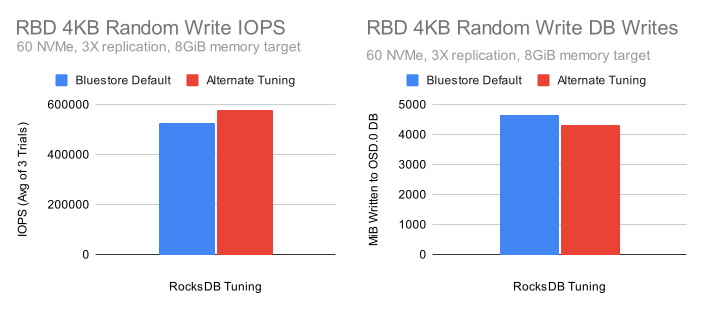

Despite the smaller memtable sizes and lower flush size (i.e. 1x256MIB vs 2x64MiB buffers), the alternate tuning shows higher performance and slightly lower write amplification! But why is this the case when our initial testing showed significantly higher write amplification with small memtables? To answer this, we must look individually at the options being changed. Let’s look at what happens when we change some of the BlueStore default tuning parameters to match what the alternate tuning is using:

| RocksDB Configuration                               | IOPS (Avg of 3 Trials)                      | DB Writes (MB)                            |
| --------------------------------------------------- | ------------------------------------------- | ----------------------------------------- |
| Default Tuning (4\*256MB Buffers)                   | <span style="color:red">**527603**</span>   | <span style="color:green">**4652**</span> |
| Default + 16\*64MB Buffers                          | 559768                                      | <span style="color:red">**17215**</span>  |
| Default + 16\*64MB Buffers + 2 Min Buffers to Merge | <span style="color:green">**574837**</span> | <span style="color:red">**8800**</span>   |
| Alternate Tuning                                    | <span style="color:green">**577384**</span> | <span style="color:green">**4303**</span> |

By modifying just a couple of options we can get very close to the performance of the alternate tuning. The database write overhead however remains nearly twice as high. After several dozen additional tests, it turns out that the final pieces to the puzzle are _level0_file_num_compaction_trigger_ and _max_bytes_for_level_base_. Increasing these options reduces the amount of write amplification in the database to near stock levels while maintaining performance gains. This could indicate that a significant portion of our write-amplification in the database with small memtables is due to deletions being flushed all the way into Level 1 and increasing the size of L0 and L1 helps avoid that behavior.

### Profiling an OSD

Earlier I described why shrinking the memtables can increase write amplification in some cases, but why do smaller memtables improve performance? First, it’s important to understand that while BlueStore has multiple worker and messenger threads, it only uses a single thread for syncing metadata to RocksDB. When flash storage is used this thread can often become the bottleneck constraining small random write performance. So why do smaller memtables yield performance gains? By default, RocksDB uses a skiplist datastructure for memtables, and skiplists maintain ordering for the elements stored in them. The bigger the skiplist, the more expensive it is to maintain ordering. We can verify this by using a wallclock profiler to see how time is being spent in the bstore_kv_sync thread during heavy random write IO that generates heavy metadata traffic for RocksDB:

```
sudo unwindpmp -p 916383 -n 10000 -b libdw -v -t 0.1
```

After searching through the output and adding up instances of skiplist overhead in the bstore_kv_sync thread, we arrive at the following table:

| <!-- -->                                            | BlueStore Default | Alternate Tuning                            |
| --------------------------------------------------- | ----------------- | ------------------------------------------- |
| rocksdb::InlineSkipList<...>::Insert                | 13.48%            | <span style="color:green">**10.49%**</span> |
| rocksdb::InlineSkipList<...>::RecomputeSpliceLevels | 12.61%            | <span style="color:green">**9.55%**</span>  |
| rocksdb::MemTable::KeyComparator::operator()        | 3.21%             | 3.55%                                       |

Keep in mind that these reductions in overhead are happening despite higher performance with the alternate tuning vs the default tuning. It really makes a significant difference.

### New Tuning Candidate

Now that we know what options are primarily responsible for improving performance while also keeping database write amplification down, let’s try crafting a new set of options based on what we’ve learned. To start, let’s define some high level goals:

1. Ensure the 1GB WAL limit since users already have WAL partitions configured.
2. Utilize RocksDB best practices where applicable.
3. Use options that we know are helpful to Ceph.
4. Stop using options that are deprecated or have no effect.

To start we’ll continue to set _writable_file_max_buffer_size_ to 0 to reduce memory copies. We’ll also continue to set a 2MB compaction readahead as it provided significant gains when introduced. Instead of setting the number of background compactions and flushes, we’ll set a modest number of _max_background_jobs_ and allow RocksDB to control the specifics. A stand-alone RocksDB instance might have this set higher, but typically Ceph OSDs are set up to use under 10 cores each even for NVMe drives.

| Option                          | RocksDB Default | New     |
| ------------------------------- | --------------- | ------- |
| _writable_file_max_buffer_size_ | 1048576         | 0       |
| _compaction_readahead_size_     | 0               | 2097152 |
| _max_background_jobs_           | 2               | 4       |

Allowing for 8 files to accumulate in level 0 appeared to help reduce write-amplification based on the earlier results with alternate tuning. Since we are now letting more data sit in L0, we’ll follow the [RocksDB Tuning Guide](https://github.com/facebook/rocksdb/wiki/RocksDB-Tuning-Guide#level-style-compaction) recommendation and adjust the size of L1 to be similar to L0. According to the guide, L0’s stable state size can be estimated as:

_write_buffer_size_ \* _min_write_buffer_number_to_merge_ \* _level0_file_num_compaction_trigger_

We’ll try to keep flushes (ie _write_buffer_size_ \* _min_write_buffer_number_to_merge_) to 128MB, similar to what the alternate tuning is doing. Using the formula from the guide, the base level1 size should be set to 128MiB \* 8 = 1GiB. Since we are dramatically increasing the base level size, we’ll also slightly reduce the level byte multiplier to compensate.

| Option                               | RocksDB Default | New        |
| ------------------------------------ | --------------- | ---------- |
| _level0_file_num_compaction_trigger_ | 4               | 8          |
| _max_bytes_for_level_base_           | 268435456       | 1073741824 |
| _max_bytes_for_level_multiplier_     | 10              | 8          |

Finally, we now know that we can get away with smaller memtables without a huge write-amplification penalty so long as we allow more files to accumulate in L0 and properly set the size of L1 to match. We don’t know how small we can get away with though. Maybe we can go even smaller than what’s used in the alternate tuning? Let’s try a couple of combinations that result in an overall 1GB WAL size. We will no longer set _recycle_log_file_num_ however given that the option no longer has any effect with the recovery mode that we use.

| Option                             | RocksDB Default | New A | New B | New C | New D |
| ---------------------------------- | --------------- | ----- | ----- | ----- | ----- |
| _max_write_buffer_number_          | 2               | 16    | 32    | 64    | 128   |
| _min_write_buffer_number_to_merge_ | 1               | 2     | 4     | 8     | 16    |
| _write_buffer_size_                | 64MiB           | 64MiB | 32MiB | 16MiB | 8MiB  |
| _max_total_wal_size_               | None            | 1GiB  | 1GiB  | 1GiB  | 1GiB  |

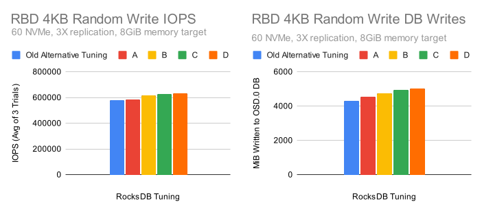

Using smaller memtable sizes while keeping the flush size constant shows significant performance gains. The amount of data that is written to the database grows as well, but that is primarily due to writing data out faster during the test. Performance continues to improve all the way to the “D” configuration, though the gains slow between “C” and “D” indicating significant additional improvements are unlikely.

### Performance Comparison

Let’s see how a new tuning candidate using the "D" configuration stacks up against the competition. Here’s the new tuning we’ll use:

```
bluestore_rocksdb_options = compression=kNoCompression,max_write_buffer_number=128,min_write_buffer_number_to_merge=16,compaction_style=kCompactionStyleLevel,write_buffer_size=8388608,max_background_jobs=4,level0_file_num_compaction_trigger=8,max_bytes_for_level_base=1073741824,max_bytes_for_level_multiplier=8,compaction_readahead_size=2MB,max_total_wal_size=1073741824,writable_file_max_buffer_size=0
```

Compared to the RocksDB, BlueStore, and the old alternate tuning:

| Option                               | RocksDB Default       | BlueStore Default     | Old Alternate Tuning  | New Tuning            |
| ------------------------------------ | --------------------- | --------------------- | --------------------- | --------------------- |
| _compression_                        | kSnappyCompression    | kNoCompression        | kNoCompression        | kNoCompression        |
| _max_write_buffer_number_            | 2                     | 4                     | 32                    | 128                   |
| _min_write_buffer_number_to_merge_   | 1                     | 1                     | 2                     | 16                    |
| _recycle_log_file_num_               | 0                     | 4                     | 32                    | 0                     |
| _kCompactionStyle_                   | kCompactionStyleLevel | kCompactionStyleLevel | kCompactionStyleLevel | kCompactionStyleLevel |
| _write_buffer_size_                  | 64MiB                 | 256MiB                | 64MiB                 | 8MiB                  |
| _target_file_size_base_              | 64MiB                 | 64MiB                 | 64MiB                 | 64MiB                 |
| _writable_file_max_buffer_size_      | 1MiB                  | 0B                    | 1MiB                  | 0B                    |
| _max_background_compactions_         | None                  | 2                     | 31                    | None                  |
| _level0_file_num_compaction_trigger_ | 4                     | 4                     | 8                     | 8                     |
| _level0_slowdown_writes_trigger_     | 20                    | 20                    | 32                    | 20                    |
| _level0_stop_writes_trigger_         | 36                    | 36                    | 64                    | 36                    |
| _max_bytes_for_level_base_           | 256MiB                | 256MiB                | 512MiB                | 1GiB                  |
| _compaction_threads_                 | None                  | 2                     | 32                    | None                  |
| _max_bytes_for_level_multiplier_     | 10                    | 10                    | 8                     | 8                     |
| _flusher_threads_                    | None                  | 1                     | 8                     | None                  |
| _compaction_readahead_size_          | 0                     | 2MiB                  | 2MiB                  | 2MiB                  |
| _max_total_wal_size_                 | None                  | 1GiB                  | None                  | 1GiB                  |
| _max_background_jobs_                | 2                     | None                  | None                  | 4                     |

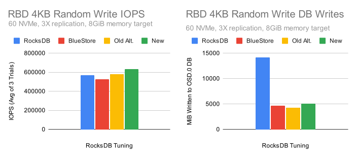

The new configuration provided the highest level of performance while maintaining roughly the same write-amplification reduction as the other tuned configurations.

# Pacific Testing (RGW)

Many of the publicly available test results for tweaking RocksDB settings focus on RBD, but what about RGW?

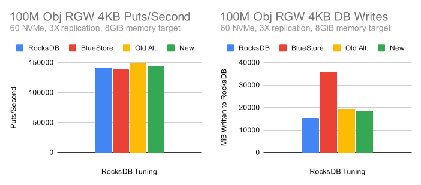

Put performance is fairly even across the board, but why is the default RocksDB tuning resulting in less database write traffic? It turns out that this is due snappy compression being enabled by default, while all of the other configurations are turning compression off. To illustrate this effect more concretely, let’s look at what happens when we use a single OSD:

### The effects of Compression


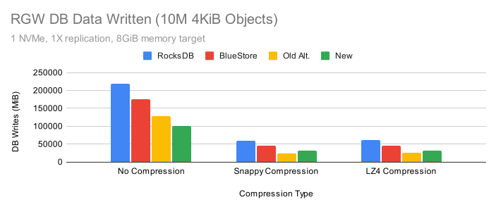

The new tuning is showing the highest write performance with low write traffic pretty much across the board. The compression options are looking pretty good here, but we’ve gotten feedback from users that have tested these options that compression can affect other aspects of performance, especially reads.

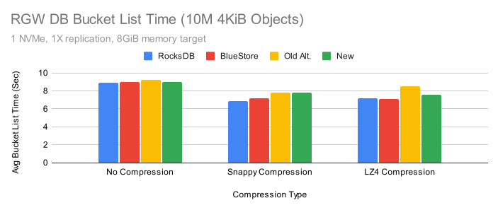
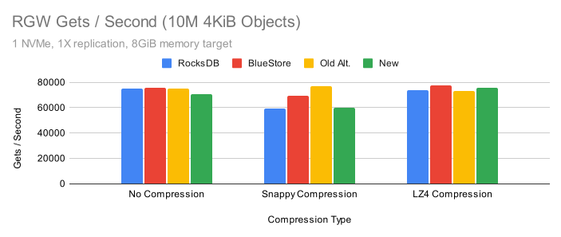
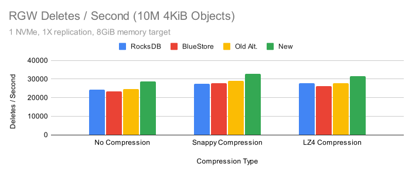

Turning compression on generally improved bucket list times. Get performance may have degraded in some cases with Snappy compression, but apparently not with LZ4 compression. Delete performance appeared to improve with both the new tuning and when either Snappy or LZ4 compression was enabled. So far the results are looking pretty good, so why the fuss?

### The Effects of Limiting CPU

Another concern with compression is that it may hurt performance in CPU limited scenarios. To evaluate that, let’s look at a similar set of tests when the single OSD we are testing is limited to 2 cores.

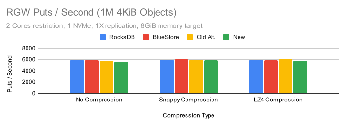
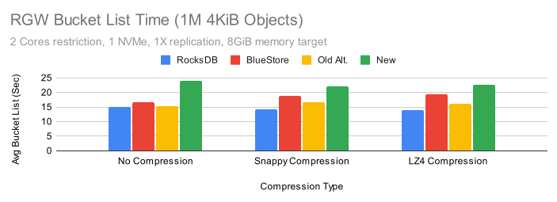
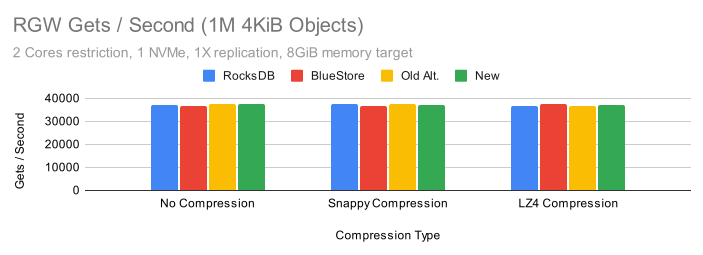
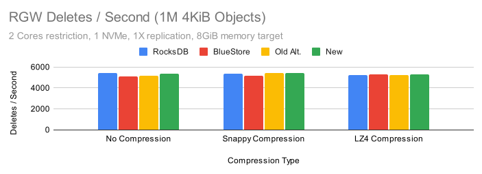

When limited to 2 cores, performance is fairly even across all of the configurations except when performing bucket listing. In that case all of the tuned configurations showed varying degrees of performance loss, though the new configuration suffered the biggest impact. The result is repeatable, however it does not appear to happen when more CPU is available for the OSD.

# Quincy Testing

Quincy is the fastest release of Ceph yet. In addition to many general improvements, Red Hat developer Gabriel Benhanokh was able to remove BlueStore allocation information from RocksDB to reduce metadata overhead during writes. This typically yields between 10-20% performance improvement when BlueStore’s KV sync thread is the bottleneck. Given these changes, do these alternate RocksDB tunings still make sense in quincy?

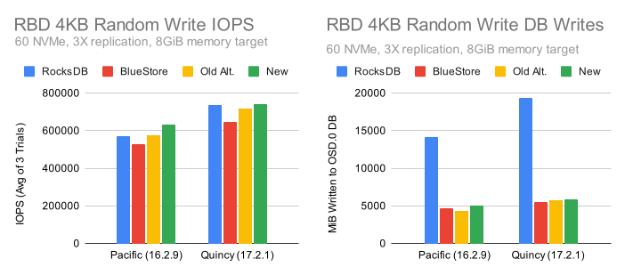
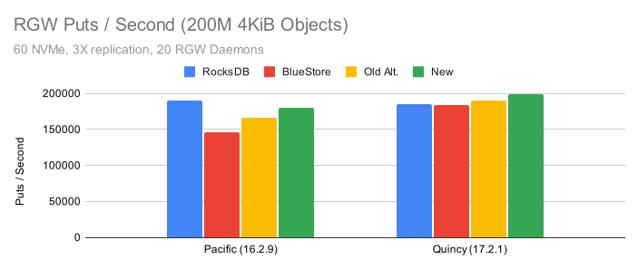
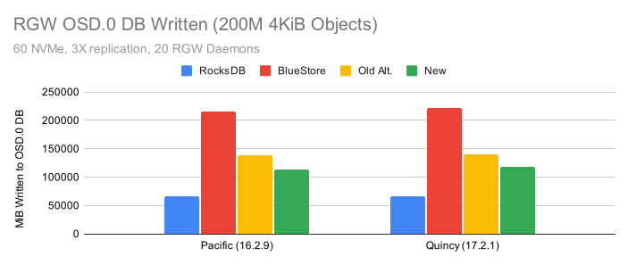

Quincy’s write performance advantage over Pacific is evident in both the RBD and RGW tests. The same general tuning trends seem to hold for Quincy as well, with the newer tunings showing better performance. The only question that remains is whether or not to enable compression by default. Is the database write amplification (and likely size amplification) advantage in RGW worth the expense of possibly slower reads and higher CPU usage?

# Conclusion

Tuning Ceph can be a difficult challenge. Between Ceph, RocksDB, and the Linux kernel, there are literally thousands of options that can be tweaked to improve performance and efficiency. In this article we focused on Ceph’s default RocksDB tuning and compared it to several other configurations. We looked at how these settings affect write amplification and performance on NVMe drives, and attempted to showcase how complex the interactions between different configuration options can be. It appears that with the right combination of options, higher performance can be achieved without significantly increasing write amplification. Enabling compression may in some cases decrease write amplification with a moderate performance impact in some tests. The generally highest performing configurations in these tests appeared to be:

No Compression:

```
bluestore_rocksdb_options = compression=kNoCompression,max_write_buffer_number=128,min_write_buffer_number_to_merge=16,compaction_style=kCompactionStyleLevel,write_buffer_size=8388608,max_background_jobs=4,level0_file_num_compaction_trigger=8,max_bytes_for_level_base=1073741824,max_bytes_for_level_multiplier=8,compaction_readahead_size=2MB,max_total_wal_size=1073741824,writable_file_max_buffer_size=0
```

LZ4 Compression (Lower RGW write-amp, performance impact for bucket listing):

```
bluestore_rocksdb_options = compression=kLZ4Compression,max_write_buffer_number=128,min_write_buffer_number_to_merge=16,compaction_style=kCompactionStyleLevel,write_buffer_size=8388608,max_background_jobs=4,level0_file_num_compaction_trigger=8,max_bytes_for_level_base=1073741824,max_bytes_for_level_multiplier=8,compaction_readahead_size=2MB,max_total_wal_size=1073741824,writable_file_max_buffer_size=0
```

Given these results, should you change the default Ceph RocksDB tuning? BlueStore’s default RocksDB tuning has undergone thousands of hours of QA testing over the course of roughly 5 years. These non-default configurations are definitely showing promise, but have not yet undergone significant testing. Over the coming months we’ll run these configurations through QA and may consider changing the default for the next release of Ceph.

# Afterword

One of the motivations for writing this article was to examine whether or not the RocksDB tuning used in previously published performance articles and blog posts had an impact on modern versions of Ceph. Namely, there are three articles that showed performance results for Ceph on NVMe drives with Alternate RocksDB tunings:

| Publisher      | Link                                                                                                                                                                                                                                       |
| -------------- | ------------------------------------------------------------------------------------------------------------------------------------------------------------------------------------------------------------------------------------------ |
| Micron         | [Micron® 9200 MAX NVMe™ SSDs + Ceph® Luminous 12.2.8 + BlueStore](https://www.micron.com/-/media/client/global/documents/products/other-documents/micron_9200_max_ceph_12,-d-,2,-d-,8_luminous_bluestore_reference_architecture.pdf?la=en) |
| Micron         | [Micron® 9300 MAX NVMe™ SSDs + Red Hat® Ceph Storage](https://www.micron.com/-/media/client/global/documents/products/other-documents/micron_9300_and_red_hat_ceph_reference_architecture.pdf)                                             |
| Red Hat (2019) | [Part - 1 : BlueStore (Default vs. Tuned) Performance Comparison](https://ceph.io/en/news/blog/2019/bluestore-default-vs-tuned-performance-comparison/)                                                                                    |

Beyond just looking at RocksDB tunings though, we can get a sense from these articles of how Ceph was performing back in 2018/2019 versus our recent releases. If we compare the results from those articles to the new results presented here, we arrive at the following table:

| Publisher            | Ceph Release    | RocksDB Tuning    | NVMe Count | Replication | Peak RBD 4K Randwrite IOPS |
| -------------------- | --------------- | ----------------- | ---------- | ----------- | -------------------------- |
| Micron               | Luminous 12.2.8 | Alternate         | 40         | 2X          | 479882                     |
| Micron               | RHCS 3.2        | Alternate         | 40         | 2X          | 477029                     |
| Red Hat (2019 Tests) | RHCS 3.2        | BlueStore Default | 35         | 2X          | 170600                     |
| Red Hat (2019 Tests) | RHCS 3.2        | Alternate         | 35         | 2X          | 398700                     |
| Red Hat (New Tests)  | Pacific 16.2.9  | BlueStore Default | 60         | 3X          | 527603                     |
| Red Hat (New Tests)  | Pacific 16.2.9  | New               | 60         | 3X          | 632513                     |
| Red Hat (New Tests)  | Quincy 17.2.1   | BlueStore Default | 60         | 3X          | 648620                     |
| Red Hat (New Tests)  | Quincy 17.2.1   | New               | 60         | 3X          | 741228                     |

We have more NVMe drives in this test cluster, but we also are seeing significantly higher cluster-wide IOPS despite using 3X replication instead of 2X. What I find really exciting is what happens if you normalize the per-NVMe throughput given the number of NVMe drives and replication factor:

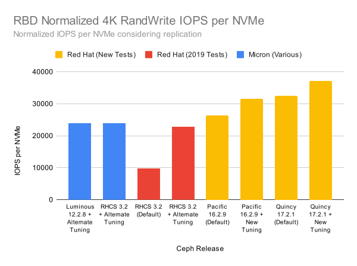

Both of the older articles were using fewer, higher density, servers. Still, all of the setups had enough cores that availability of CPU resources was not likely to have been the limiting factor. These gains are similar to the ones that we've seen in-house across releases as well. One final point I will note is that there are some settings used in the previous articles that we would not recommend using on real production clusters. You absolutely should not drop the number of pglog and tracked dup entries to 10 unless you know exactly what you are doing. Doing this can increase performance in benchmarks, but may have significant impacts on cluster recovery. There are some cases where disabling the priority cache manager can be beneficial, but primarily when you've set small static cache sizes for BlueStore and want to avoid thrashing in tcmalloc. There can be advantages when tweaking the default settings, but there are dangers as well. Be careful and take everything with a grain of salt (including what you read here!). If you've made it all the way to the end, thank you for reading, and keep tuned as we continue to improve Ceph performance!
