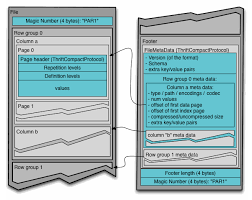

## What is ceph/s3select?
In July 2020, s3select was introduced to [Ceph upstream](https://github.com/ceph/s3select), an open-source package.
S3select is another S3 request that enables the client to push down an SQL statement(according to AWS spec) into Ceph storage.

## Why do we need that? What is it good for?
To answer that, It needs to elaborate a bit on the push-down paradigm.
The push-down paradigm is about moving(“pushing”) operations close to the data.
It's contrary to what is commonly done, i.e. moving the data to the “place” of operation.
In a big-data ecosystem, it makes a big difference. 

In order to execute 
```SQL
select sum( x + y) from s3object where a + b > c
```

This SQL query must fetch the entire object to the client side and only then perform the operation with an analytical application,
With push-down(s3-select) the entire operation is executed on the server side, and only the result is returned to the client side.

It should be noted that pushing down operations close to data is not an easy “thing” to do; the storage is usually fragmented, and broken into random pieces.
It makes it difficult to execute single-query on top of many random pieces. Moreover, the type of these objects could be binary, in some cases.

## What is s3select capable of?
Ceph S3 select is an SQL-like engine. Its properties can be reviewed [here](https://docs.ceph.com/en/latest/radosgw/s3select/#).

S3select does not turn S3 storage into a database, but it greatly improves the efficiency of SQL processing.

S3select property is embedded into the GetObject module, which makes it highly efficient for the push-down operation.

Upon an SQL query being pushed-down, the object is fetched (the same as with the GetObject request), and each fragment of the object is processed by the s3select module.
(in the case of Parquet, the object is not fetched. It will be explained later).

Since S3select is embedded into the S3 system, there are no redundant copies of bytes, the object is processed immediately, and the results are sent back to the client.

The different data-source readers for CSV, JSON, and Parquet are decouple from the SQL engine, thus, the same SQL engine is processing these different object types.
It enables faster introduction of other readers (ORC for one example).

## Why use SQL?
the question to ask is,    __what is needed for machine learning?__

SQL serves as the querying language for machine learning since it is the standard language for accessing and manipulating data.

It should be noted that SQL is a domain-specific language (more than 40 years!) and was designed initially for manipulating data.

In a machine learning workflow, data is the primary source and its accuracy and relevance are critical for successful modeling and pattern detection. 
Thus, it is essential to ensure that data is properly formatted for use by machine learning algorithms. 

Further more, in a subsequent paragraph, there is a discussion of an analytical tool called Trino that can perform pushdown operations on SQL statements, enabling them to be executed as S3-select requests. 
This minimizes significantly network consumption and enhances overall performance.

Given its ability to read and process common data sources such as CSV, JSON, and Parquet, S3Select is a valuable tool for machine learning purposes.

## Why s3 storage? 
S3-storage is reliable, efficient, cheap, scaleable, and already contains [trillions of objects](https://www.zdnet.com/article/aws-s3-storage-now-holds-over-100-trillion-objects/). It contains many CSV, JSON, and Parquet objects, and these objects contain a huge amount of data to analyze.

A typical Ceph user may accumulate a significant number of objects over time. 
These objects contain vast amounts of both structured and unstructured data that are stored in a "cold" state. 
Despite the potential value of this data, extracting it from storage can be costly in terms of both network and CPU resources.

Using s3select may reduce that cost dramatically.

Our goal is to turn CEPH object storage more attractive for analytical operations, Not just for storing data.

## Parquet vs CSV and JSON


Apache Parquet is a columnar storage file format designed for efficient data storage and processing in big data environments.
Parquet stores data in columns rather than rows. 

This means that data of the same data type is stored together, making it easier to compress and query the data. 

Each column is divided into row groups, which are further divided into pages. 
The pages are compressed using a compression algorithm to save storage space.

Upon processing CSV or JSON objects, the whole object must be scanned. 
There is no way to fetch only the relevant columns and rows.

With the Parquet object, it's different. 
The engine analyzes the query, and fetches only the relevant columns, using the s3-range-request and the apache-parquet-reader.

In that way, it reduces the amount of read-operations on the server side.

## Integrating Trino with Ceph s3select

Recently we have been exploring the Trino application and the advantages of integrating it with Ceph/s3select.

The advantages of Trino are quite obvious. 

It's a complete SQL engine.

Its engine is able to push down s3select requests; this point is worth further explanation, upon issuing an SQL statement, the Trino engine identified parts of the SQL statement that will be cost-effective to run on the server side.

In essence, Trino utilizes the optimization rules of Ceph/s3select to enhance its performance. 

By leveraging Ceph's scalability, Trino has the ability to divide the original object into multiple equal parts, execute s3select requests for each part, and merge the results. This approach can significantly enhance query performance.

Recent [publications](https://aws.amazon.com/blogs/storage/run-queries-up-to-9x-faster-using-trino-with-amazon-s3-select-on-amazon-emr/) of AWS/Trino suggest that running queries using Trino with Amazon S3 Select on Amazon EMR, increases performance up to 9x.

