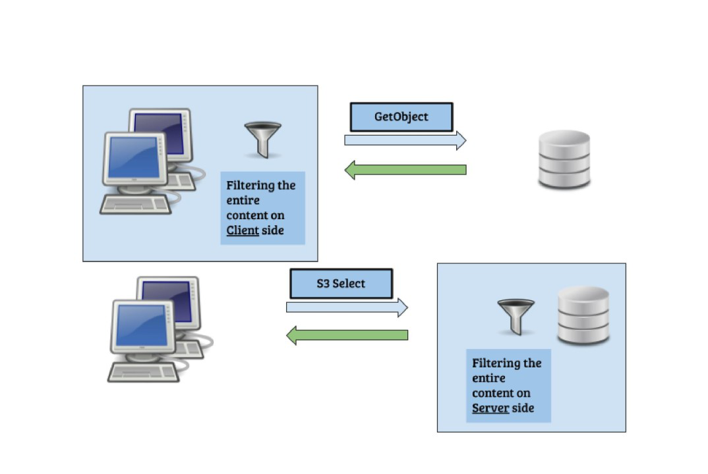

## What is ceph/s3select?
In July 2020, s3select was introduced to [Ceph upstream](https://github.com/ceph/s3select), an open-source package.
S3select is another S3 request, that enables the client to push down an SQL statement(according to AWS spec) into Ceph storage.

## Why do we need that? What is it good for?
To answer that, It needs to elaborate a bit on the push-down paradigm.
The push-down paradigm is about moving(“pushing”) operations close to the data.
It's contrary to what is commonly done, i.e. moving the data to the “place” of operation.
In a big-data ecosystem, it makes a big difference. 

In order to execute 
```SQL
select sum( x + y) from s3object where a + b > c
```

This SQL query must fetch the entire object to the client side and only then perform the operation with an analytical application,
With push-down(s3-select) the entire operation is executed on the server side and only the result is returned to the client side.

It should be noted that pushing down operations, close to data is not an easy “thing” to do, the storage is usually fragmented, and broken into random pieces.
It makes it difficult to execute single-query on top of many random pieces, moreover, the type of these objects could be binary, in some cases.

## What is s3select capable of?
Ceph S3 select is an SQL-like engine, its properties can be reviewed [here](https://docs.ceph.com/en/latest/radosgw/s3select/#).

S3select does not turn S3 storage into a database, but it greatly improves the efficiency of SQL processing.

S3select property is embedded into the GetObject module which makes it highly efficient for the push-down operation.

Upon an SQL query being push-down, the object is fetched (the same as with the GetObject request), and each fragment of the object is processed by s3select module.
(in the case of Parquet, the object is not fetched. it will be explained later).

Since S3select is embedded into the S3 system, there are no redundant copies of bytes, the object is processed immediately, and the results send back to the client.

Moreover, s3select system is capable of processing CSV, JSON, and Parquet format objects.

The same engine is processing these different object types.

## Why using SQL?
the question to ask is,    __what is needed for machine learning?__

SQL is needed for machine learning since in practice this is the language for querying data. 

it should be noted that SQL is a domain-specific language (more than 40 years!) and was designed initially for manipulating data.

In a machine learning workflow, the data is the main thing, it is the source.

The more relevant and accurate the data you have, the better your modeling and pattern detection will be.

You should keep in mind that the data must be formatted so that it can be used by machine learning algorithms for improved pattern detection.

All of this makes the SQL the starting point for machine learning.

Adding the capability to read and process different and common data sources such as CSV,JSON and Parquet, 
makes the s3select a powerful tool for machine learning.

## Why s3 storage? 
S3-storage is reliable, efficient, cheap, and already contains [trillions of objects](https://www.zdnet.com/article/aws-s3-storage-now-holds-over-100-trillion-objects/), It contains many CSV, JSON, and Parquet objects, and these objects contain a huge amount of data to analyze.

An ETL may convert these objects into efficient format such as Parquet and later run queries on these converted objects.

But it comes with an expensive price, getting all of these objects.

S3select engine that resides on s3-storage can do these jobs for many use cases, saving time and resources.

These semi-structured data reside on S3 storage as “cold” data and as mentioned in huge numbers, with S3select this “locked” data can be accessed efficiently. 

## Parquet vs CSV and JSON
Upon processing CSV or JSON objects, the whole object must be scanned, there is no way to fetch only the relevant columns and rows.

With the Parquet object, it's different, the engine analyzes the query, and fetches only the relevant columns, using the s3-range-request and the apache-parquet-reader.

In that way, it reduces the IOPS on the server side.

And finally … 

S3select Repo is growing, we keep adding new features, and planning new ones.

We will be happy to hear your comments and ideas.

