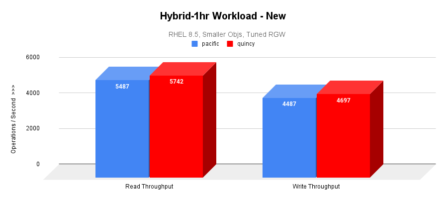
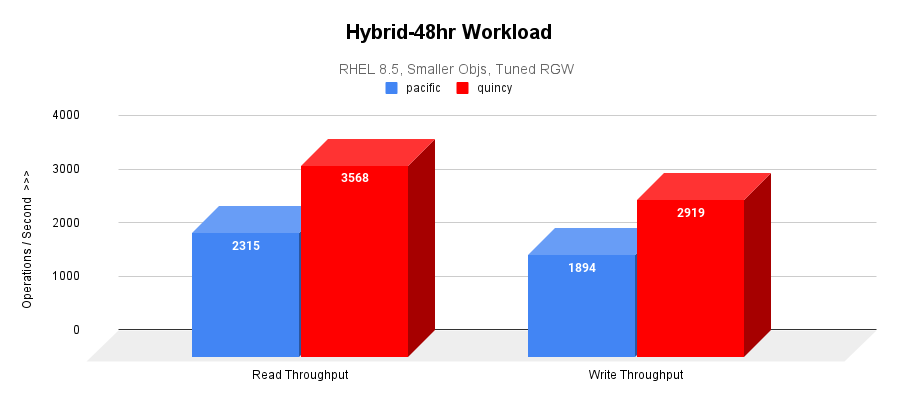
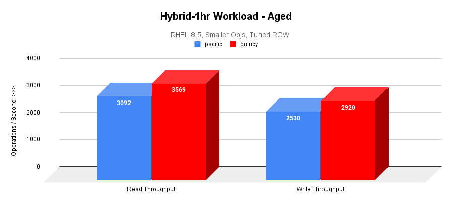

## Introduction

The time leading up to a new Ceph release exposes new insights and ideas that pave the way
for future Ceph releases. Leading up to the first release of Quincy, we saw a need for large-scale
testing – the idea being to validate Quincy’s new features, performance, and resilience against 1000+
OSD clusters. 

The need for large-scale testing goes beyond the capabilities of our current small-scale integration
testing scenarios. Testing Quincy at scale would allow us, for the first time, to identify bugs and
bottlenecks that only occur on sizable clusters. We would also be able to evaluate a large cluster’s
behavior in different environments, such as hardware, resource limitations, and workload patterns.

In this blog post, we introduce three large-scale test clusters we worked with and outline the challenges
and outcomes we encountered for each one. We also explain performance results that came as a result of our
testing efforts. 

## Gibba Upstream Cluster: Logical Large Scale

The Gibba cluster is a large-scale test cluster that Ceph engineers periodically use to test upgrades and
new features. Backed by Cephadm, the Gibba cluster holds a total of 975 OSDs (SSD) and 40 hosts. It also
has 13 TiB of raw capacity.

Initial challenges with the Gibba cluster included converting upstream teuthology nodes into a large-scale
test cluster, dealing with limited CPU and memory resources, figuring out how to use tools like [CBT](https://github.com/ceph/cbt)
(the Ceph Benchmarking Tool) at scale, and addressing bugs that led to redeployment.

From our work on the Gibba cluster, we derived best tunings to continue large-scale testing, tested fresh
deployments with Cephadm, fixed multiple bugs that were not caught in integration testing before releasing
17.2.0, and made it possible for developers to perform large-scale tests on future releases.

### Testing on Cephadm

We encountered several challenges and outcomes on Gibba that were specific to Cephadm. The three main challenges
we dealt with were 1) Rolling upgrades on a large scale from 16.2.7 to Quincy, 2) Managing upgrades with low
resources, and 3) Running orch commands on many OSDs and hosts.

To combat these challenges, we set up an Ansible playbook to install the Cephadm binary on each host to ensure
that the hosts had the dependencies they needed, such as podman and lvm. We also tested a Cephadm purge at scale,
which provided us with better knowledge of how to do this in future customer situations. Lastly, we identified and
fixed six notable bugs in Cephadm, BlueStore, and manager modules that were not caught in upstream integration
testing. See the [Tracker Index](#gibba%3A-testing-on-cephadm) for details.

### Testing Telemetry

After upgrading Gibba’s managers to Quincy, we were able to check the behavior of Telemetry’s new
[opt-in flow](https://github.com/ceph/ceph/pull/44251) and the performance channel, both of which
were new features added to Quincy. We also observed how the module behaved on a large scale.

From our observations, we confirmed that the opt-in flow works as expected after an upgrade, fixed several bugs in
the performance, device, and crash channels, introduced some fixes for the Dashboard behavior, and addressed an
anonymization issue in the performance channel See the [Tracker Index](#gibba%3A-testing-telemetry) for details.

### Testing QoS (mClock)

With the Cephadm and Telemetry bug fixes also came some new developments in the QoS mClock scheduler. Concerning
mClock, we were mainly curious about the behavior of its profiles on a large scale. We also hoped to test the
effect of mClock profiles on recovery and client I/O, as well as the effect on background operations like scrub,
snaptrim, and PG deletes.

After testing, we verified that mClock profiles are able to provide the desired QoS for recovery and client I/O.
This includes tests performed with 3 clients and recovery in parallel, testing with scrubs, recovery, and client
I/O in progress, testing with snaptrim and client I/O next in the queue, and additional stats added for performance
evaluation.

For the future, we hope to introduce a new mClock profile that optimizes background operations like scrubs, snaptrim,
and PG deletes over recoveries and client I/O based on findings from the Gibba cluster.

## Scalelab "Logical Large Scale" at Red Hat: Logical Scaling to 8,000 OSDs

The Scalelab “Logical Large Scale” cluster is a cluster we used to observe Cephadm’s scalability and other performance
aspects. The Scalelab cluster has 127 Red Hat-supplied servers, 8,134 OSDs (NVMe backed nbd), a 25 Gb network (VLANs),
and a 75% full capacity utilization.

A notable challenge of the Scalelab cluster was inconsistent monitoring past 3,776 OSDs due to a large performance counter
payload that was getting sent to Prometheus every 10 seconds. Also observed were intermittent delays in the manager CLI due
to stats collection every 5 seconds.

In response to these challenges, a workstream was initiated to better distribute perf counter collection, review and
reduce data sent to the manager, align stats collection to cluster size, and improve the ability to control metrics
collection.

During testing, we also found the Cephadm-ansible playbooks used for pre-flight and purge to be successful. The
scalability of Cephadm was confirmed to be 8,134 OSDs.

## Scalelab at Red Hat: Cephadm Upgrade

The Scalelab cluster (not to be confused with the Scalelab “Logical Large Scale” cluster) is a cluster we used to
perform a Cephadm upgrade, test RGW’s performance, and compare the results of varying workloads. Managed by Cephadm,
the Scalelab cluster has 13 Red Hat-provided servers, 832 OSDs (NVMe backed nbd), a 25 Gb network (VLANs), a Canary
RBD workload (R/W), and a 75% full capacity utilization.

During a Cephadm upgrade, we experienced a [pg\_autoscaler bug](https://tracker.ceph.com/issues/54263) where the autoscaler
scaled pgs from 32 to 32,768 pgs on a cephfs meta pool. We also noticed a high ingest rate outpacing the mgr and autoscaler,
leading to a temporary OSD utilization skew.

Despite these initial challenges, the upgrade proved successful; it took a total of 9 hours for 832 OSDs. In response
to the autoscaler bug, we created a Tracker issue for it and resolved the root cause. We also found that the Cephadm
upgrade had a minimal impact on the Canary workload.

### RGW S3 Object Workload on Scalelab

In addition to the Cephadm upgrade, we used Scalelab to test an early version of Quincy on an RGW S3 object workload.
The goal of this effort was to verify Quincy’s functionality and to test its baseline performance at scale.

Our scale environment included:
  - 3x MON/MGR nodes
      - Dell R640 server
      - 2 Intel Xeon Gold 5218 processors (32 total cores, 64 threads)
      - 384 GB RAM
  - 8x OSD/RGW colocated servers
  - Supermicro 6048R
  - 2 Intel E5-2660 v4 processors (28 total cores, 56 threads)
  - 256 GB RAM
  - 192 OSDs (bluestore). HDD for data (24 HDD and 2x NVMe for WAL/DB per OSD node)
  - Pool default.rgw.buckets.data = EC 4+2, pgcnt=4096

### Nature of RGW S3 Workload

Two sets of object sizes are typically employed in RGW S3 testing. The generic sized workload uses:
   - 50% 1KB objs, 15% 64KB objs, 15% 8MB objs, 15% 64MB objs, and 5% 1024MB objs

While the smaller sized workload uses :
   - 25% between 1KB and 2KB objs, 40% between 2KB and 4KB objs, 25% between 4KB and 8KB objs, and 10% between 8KB and 256KB objs

These two sets of object sizes were then executed as follows:
   - Cluster fill (COSBench prepare) - @4hrs
   - 1hr COSBench hybrid measurement of new cluster 
   - 44% reads, 36% writes, 15% lists, 5% deletes
   - 3 buckets performing writes/deletes, 3 performing lists/reads
   - 48hr COSbench hybrid aging workload
   - 1hr COSBench hybrid measurement of aged cluster

### Tunings and Issues

While the generic sized object testing executed without issues and provided expected results, the smaller object
workload observed a blocking issue ([Tracker 54124](https://tracker.ceph.com/issues/54124)) that was resolved by
adjusting (in this case doubling) the default values of rgw\_thread\_pool\_size and rgw\_max\_concurrent\_requests.

We also saw a huge performance boost for small object workloads in quincy 17.2.0 as compared to 17.2.1. An investgation
revealed the difference to be that [bluestore zero block detection](https://github.com/ceph/ceph/pull/43337) was enabled
by default in 17.2.0, but disabled in 17.2.1. Bluestore zero block detection, a feature meant to be used in large-scale
synthetic testing, had unintended effects on some RBD and CephFS features in 17.2.0, which is why it was disabled in 17.2.1.
There is ongoing investigation (tracked in [Tracker 56640](https://tracker.ceph.com/issues/56640)) on how we can safely achieve
the same performance boost for future Ceph versions.

To test at scale, the following non default settings were applied:
   - osd\_memory\_target  = 7877291758
   - osd\_memory\_target\_autotune = false
   - rgw\_max\_concurrent\_requests = 2048
   - rgw\_thread\_pool\_size = 1024

See the [Tracker Index](#scalelab-at-red-hat%3A-tunings-and-issues) for a list of bugs we encountered and fixed.

### Comparison with Pacific

When comparing between Pacific 16.2.7 and Quincy 17.2.1 with the RGW S3 small object workload, we observed that:

   - The cluster fill workload throughput performance is almost identical between both the versions.
   - Quincy is outperforming Pacific by 50% in hybrid 48-hr workloads.
   - Quincy is outperforming Pacific by 15% in hybrid 1-hr aged workloads.

### Fill Workload Result

The following image graphs the I/O throughput and average response times over a 4-hr cluster fill (prepare) workload.

### Hybrid-1hr (New) Result

Only after the cluster is filled to the desired capacity, a 1-hr hybrid workload is executed as a baseline measurement
for later comparisons. This graph plots both the read and write throughput of the hybrid workload.

### Hybrid-48hr Result

48-hr hybrid workload is executed to stress and age the cluster. The average read and write throughputs are graphed below.

### Hybrid-1hr (Aged) Result

A second 1-hr measurement workload highlights the effect of extended use of the cluster on performance.

## Focus Areas

The resounding conclusion from all of our scale-testing efforts is that scale testing is very valuable! For future
releases, we plan to increase the frequency of performance and scale testing we do to catch further bugs and performance
bottlenecks. Any help with hardware is extremely welcome.

Currently, we make regular use of the Gibba cluster to identify upstream regressions early, build clusters of different
scales based on feature testing requirements, and perform continuous upgrades.

Finally, we plan to introduce a new suite to our teuthology integration tests that will run large-scale synthetic tests
on upstream pull requests prior to merging.

## Tracker Index

### Gibba: Testing on Cephadm

   - [Tracker 53610](https://tracker.ceph.com/issues/53610) - 'Inventory' object has no attribute 'get\_daemon'
        - Ruled out as a true Cephadm bug; labeled “Can’t reproduce”
   - [Tracker 53624](https://tracker.ceph.com/issues/53624) - cephadm agent: set\_store mon returned -27: error: entry size limited to 65536 bytes
        - Pinpointed the cause as too much device info on dense nodes
   - [Tracker 53693](https://tracker.ceph.com/issues/53693) - ceph orch upgrade start is getting stuck in gibba cluster
        - Resolved by Adam King by removing gibba045, a problematic node
   - [Tracker 54132](https://tracker.ceph.com/issues/54132) - ssh errors too verbose
        - Fixed by Melissa Li in [PR 45132](https://github.com/ceph/ceph/pull/45132)
   - [Tracker 53923](https://tracker.ceph.com/issues/53923) - [Upgrade] mgr FAILED to decode MSG\_PGSTATS
        - Fixed by Aishwarya Mathuria in [PR 45694](https://github.com/ceph/ceph/pull/45694)
   - [Tracker 55145](https://tracker.ceph.com/issues/55145) - Bogus assert in SimpleBitmap
        - Fixed by Gabriel BenHanokh in [PR 45733](https://github.com/ceph/ceph/pull/45733)

### Gibba: Testing Telemetry

   - [Tracker 53985](https://tracker.ceph.com/issues/53985) - mgr/telemetry: down osds result in empty perf report fields
        - Fixed by Laura Flores in [PR 44746](https://github.com/ceph/ceph/pull/44746)
   - [Tracker 53603](https://tracker.ceph.com/issues/53603) - mgr/telemetry: list index out of range in gather\_device\_report
        - Fixed by Yaarit Hatuka in [PR 44327](https://github.com/ceph/ceph/pull/44327)
   - [Tracker 53604](https://tracker.ceph.com/issues/53604) - mgr/telemetry: list assignment index out of range in gather\_crashinfo
        - Fixed by Yaarit Hatuka in [PR 44328](https://github.com/ceph/ceph/pull/44328)
   - [Tracker 53831](https://tracker.ceph.com/issues/53831) - mgr/dashboard/telemetry: reduce telemetry dashboard preview size
        - Fixed by Laura Flores in [PR 44523](https://github.com/ceph/ceph/pull/44523)
   - [Tracker 54120](https://tracker.ceph.com/issues/54120) - mgr/dashboard: dashboard turns telemetry off when configuring report
        - Fixed by Sarthak Gupta in [PR 44985](https://github.com/ceph/ceph/pull/44985)
   - [Tracker 55229](https://tracker.ceph.com/issues/54120) - mgr/telemetry: anonymize host names in perf counters in perf channel
        - Fixed by Laura Flores and Yaarit Hatuka in [PR 45819](https://github.com/ceph/ceph/pull/45819)

### Scalelab at Red Hat: Tunings and Issues

   - [Tracker 53906](https://tracker.ceph.com/issues/53906) - BlueStore.h: 4158: FAILED ceph\_assert(cur >= fnode.size)
   - [Tracker 53907](https://tracker.ceph.com/issues/53907) - BlueStore.h: 4148: FAILED ceph\_assert(cur >= p.length)
        - Both issues above were observed only in hybrid OSD(DB on NVMe and block on HDD)
        - Both fixed in latest quincy
   - [Tracker 53924](https://tracker.ceph.com/issues/53924) - EC PG stuck recovery\_unfound+undersized+degraded+remapped+peered
        - No longer reproducible
   - [Tracker 53956](https://tracker.ceph.com/issues/53956) - pacific radosgw-admin binary reports incorrect stats on quincy cluster
        - No longer reproducible
   - [Tracker 54124](https://tracker.ceph.com/issues/54124) - smaller object workloads wane and terminate after a few hours
        - Needed to tune rgw_thread_pool_size and rgw_max_concurrent_requests
   - [Tracker 54142](https://tracker.ceph.com/issues/54142) - quincy cephadm-purge-cluster needs work
   - [Tracker 55383](https://tracker.ceph.com/issues/55383) - monitor cluster logs(ceph.log) appear empty until rotated
        - Fixed by 胡玮文 in [PR 46124](https://github.com/ceph/ceph/pull/46124)
   - [Tracker 56640](https://tracker.ceph.com/issues/56640) - RGW S3 workload has a huge performance boost in quincy 17.2.0 as compared to 17.2.1

** Note: Title image is from [Biodiversity Heritage Library](https://www.biodiversitylibrary.org).
