Hello Ceph community!  Over the past year or so we've been hearing from more and more people who are interested in using encryption with Ceph but don't know what kind of performance impact to expect.  Today we'll look at both Ceph's on-disk and over-the-wire encryption performance under a couple of different workloads.  For our readers who may not be familiar what what these terms mean, let's review:

1) On-Disk encryption: This is also sometimes called encryption-at-rest.  Data is encrypted when it is written to persistent storage.  In Ceph, this is done using [LUKS](https://en.wikipedia.org/wiki/Linux_Unified_Key_Setup) and [dm-crypt](https://en.wikipedia.org/wiki/Dm-crypt) to fully encrypt the underlying block device(s) that BlueStore uses to store data.  This fully encrypts all data stored in Ceph regardless of wheter it's block, object, or file data.

2) Over-the-wire encryption: Data is encrypted when it is sent over the network.  In Ceph, this is done by optionally enabling the "secure" ms mode for messenger version 2 clients.  As of Ceph Reef v18.2.0, ms secure mode utilizes 128-bit AES encryption.

Encryption can also be performed at higher levels.  For instance, RGW can encrypt objects itself before sending them to the OSDs.  For the purposes of this article however, we'll be focusing on RBD block performance and will utilize the two options listed above.

# Acknowledgments

First, thank you to [Clyso](https://www.clyso.com) for funding this work to benefit the Ceph community.  Thank you as well to [IBM](https://ibm.com)/[Red Hat](https://redhat.com) and [Samsung](https://samsung.com) for providing the upstream Ceph community with the hardware used for this testing.  Thank you as well to all of the Ceph developers who have worked tirelessly to make Ceph great!  Finally, a special thank you to Lee-Ann Pullar for reviewing this article!

# Cluster Setup 

Nodes | 10 x Dell PowerEdge R6515
-- | --
CPU | 1 x AMD EPYC 7742 64C/128T
Memory | 128GiB DDR4
Network | 1 x 100GbE Mellanox ConnectX-6
NVMe | 6 x 4TB Samsung PM983
OS Version | CentOS Stream release 8
Ceph Version | Reef v18.2.0 (built from source)

Five of the nodes were configured to host OSDs and 5 of the nodes were configured as client nodes.  All nodes are located on the same Juniper QFX5200 switch and connected with a single 100GbE QSFP28 link.  Ceph was deployed and FIO tests were launched using [CBT](https://github.com/ceph/cbt/).  An important OS-level optimization on Intel systems is setting the TuneD profile to either "latency-performance" or "network-latency".  This primarily helps by avoiding latency spikes associated with CPU C/P state transitions.  AMD Rome-based systems do not appear to be as sensitive in this regard, and I have not confirmed that TuneD is actually restricting C/P state transitions on AMD processors.  The TuneD profile was nevertheless set to "network-latency" for these tests.

# Testing Setup

CBT was configured to deploy Ceph with several modified settings.  OSDs were assigned a 16GB osd_memory_target to guarantee a high onode hit rate and eliminate confounding performance impacts.  RBD cache was disabled as it can hurt rather than help performance with OSDs backed by fast NVMe drives.  Secure mode for msgr V2 was enabled for associated tests using the following configuration options:


```
ms_client_mode = secure
ms_cluster_mode = secure
ms_service_mode = secure
ms_mon_client_mode = secure
ms_mon_cluster_mode = secure
ms_mon_service_mode = secure
```

Three sets of tests were performed as follows with the cluster rebuilt between each set of tests:

Test Set | Client Processes | io_depth
-- | -- | --
Multi-client | 10 fio processes per node, 5 client nodes | 128 per process
Single-client | 1 fio process on 1 client node | 128
Single-client sync | 1 fio process on 1 client node | 1

OSDs were allowed to use all cores on the nodes.  FIO was configured to first pre-fill RBD volume(s) with large writes, followed by 4MB and 4KB IO tests for 300 seconds each. Certain background processes, such as scrub, deep scrub, PG autoscaling, and PG balancing were disabled.  Finally, an RBD pool with a static 16384 PGs (higher than typically recommended) and 3x replication was used.

# Ceph LUKS Tuning - 4MB IOs

Ceph utilizes a tool called [LUKS](https://en.wikipedia.org/wiki/Linux_Unified_Key_Setup) to encrypt the block device(s) that BlueStore writes data to.  There are several tuning options available that may help improve performance.  Before diving into the full set of tests, let's look at a couple of those options.

Option | Description
-- | --
`--perf-submit_from_crypt_cpus` | Disable offloading writes to a separate thread after encryption.  There are some situations where offloading write bios from the encryption threads to a single thread degrades performance significantly.  The default is to offload write bios to the same thread.  This option is only relevant for open action. <br><br>NOTE:  This option is available only for low-level dm-crypt performance tuning, use only if you need a change to default dm-crypt behavior.  Needs kernel 4.0 or later.
`--sector-size <bytes>` | Set sector size for use with disk encryption.  It must be a power of two and in range 512 - 4096 bytes. The default is 512 bytes sectors.  This option is available only in the LUKS2 mode.
`--perf-no_read_workqueue`<br>`--perf-no_write_workqueue` | Bypass  dm-crypt internal workqueue and process read or write requests synchronously.  This option is only relevant for open action.<br><br>NOTE:  These options are available only for low-level dm-crypt performance tuning, use only if you need a change to default dm-crypt behavior. Needs kernel 5.9 or later.

Unfortunately, the kernel available in Centos Stream 8 does not support disabling the read and write workqueues. Thus We were not able to test those options.  We were however able to test the others and did so with an initial focus on the multi-client test configuration. 

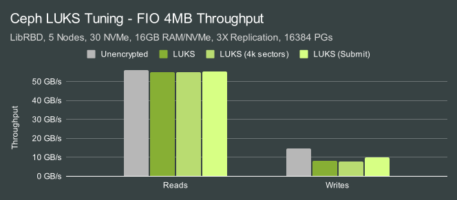
IO Size | Configuration | Random Reads | Random Writes
-- | -- | -- | --
4MB | Unencrypted | 100.00% | 100.00%
4MB | LUKS | 98.31% | 54.72%
4MB | LUKS, 4k sectors | 98.56% | 52.67%
4MB | LUKS, submit_from_crypt_cpus | 98.87% | 69.26%

Right out of the gate, we see that deploying OSDs on LUKS has only a minor impact on 4MB read performance but a major impact on write performance.  This may be slightly misleading since we are network-limited in the read tests at ~11GB/s per node.  For write tests, however, the performance impact is significant.  The good news is that using the `--perf_submit_from_crypt_cpus` option mitigates some of the performance loss.

While we couldn't test the workqueue related performance options in these tests, there is already a [PR](https://github.com/ceph/ceph/pull/49554) in Ceph to enable those options that has been tested by Josh Baergen:

* "At low load, latency does not appear affected much by these changes. Any differences don't really exceed our error bars."
* "At high load that includes writes, the larger the write, the more effective this change is. For example, OSD node CPU usage dropped by almost half for 4m sequential writes, with substantial improvements in latency (p90 reads were two orders of magnitude faster)."
* "Large block read-only loads might have had slightly worse latency, but hard to tell for certain."

One of the observations that Josh made is that the workqueue options may help improve CPU usage.  While we don't have those numbers, let's look at CPU usage in the tests we were able to run.

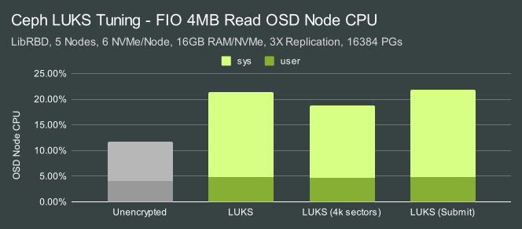
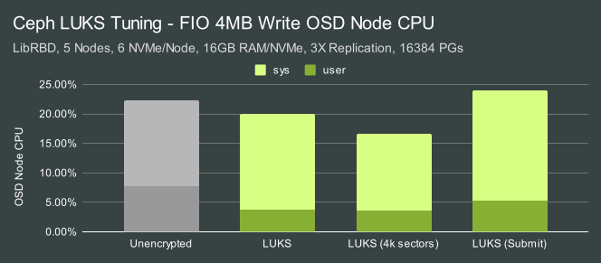

During reads, system CPU usage increases dramatically when LUKS is utilized (up to 2X CPU usage)  In the write tests the overall CPU consumption appears to be similar or even lower, but not when performance is taken into account.  The CPU usage per IO is actually higher overall.  In both the read and write tests, utilizing a 4K sector size for LUKS appears to result in a slight CPU usage drop.

# Ceph LUKS Tuning - 4KB IOs

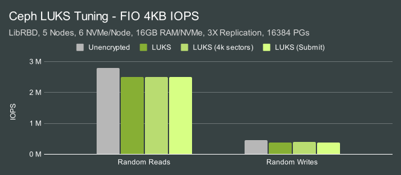
IO Size | Configuration | Random Reads | Random Writes
-- | -- | -- | --
4KB | Unencrypted | 100.00% | 100.00%
4KB | LUKS | 89.63% | 83.19%
4KB | LUKS, 4k sectors | 89.73% | 84.14%
4KB | LUKS, submit_from_crypt_cpus | 89.35% | 83.04%

The performance impact for 4KB random IOs was lower than for larger 4MB IOs.  4KB reads suffered roughly a 11-12% hit while writes took closer to a 20% hit.


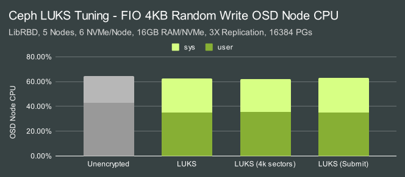

Aggregate CPU usage was pretty close, however, system usage was slightly higher while user usage was lower (correlated with the lower performance when LUKS is enabled).

The general takeaway from these tests is that the `--perf-submit_from_crypt_cpus` option can improve LUKS large write throughput and is likely worth using and we'll be using it for the remainder of the tests in this article.  4K sectors may also be worth enabling for devices that support them natively and may help slightly improve CPU usage in some cases.

# Multi-Client Tests - 4MB IOs

Now that we've done some base-level testing for LUKS, let's see what effect the msgr V2 secure mode has with the same high concurrency workload.

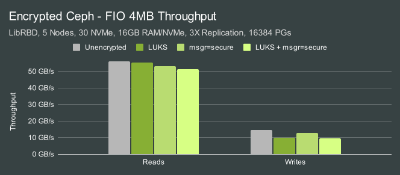
IO Size | Configuration | Random Reads | Random Writes
-- | -- | -- | --
4MB | Unencrypted | 100.00% | 100.00%
4MB | LUKS | 98.87% | 69.26%
4MB | LUKS, 4k sectors | 94.90% | 87.43%
4MB | LUKS, submit_from_crypt_cpus | 91.54% | 64.63%

There is an additive overhead associated with enabling msgr v2 secure mode, however, the bigger effect in these tests is from LUKS.

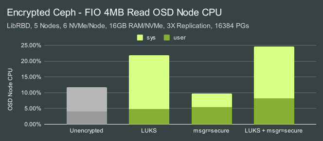
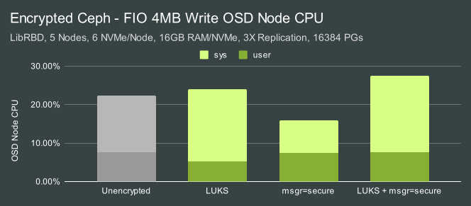

LUKS again results in significant CPU usage overhead.  Interestingly, enabling secure messenger appears to decrease system CPU consumption when using unencrypted block volumes (IE no LUKS).  It's not entirely clear why this is the case, though potentially a slight reduction in IO workload hitting the block layer might explain it.

# Multi-Client Tests - 4KB IOs

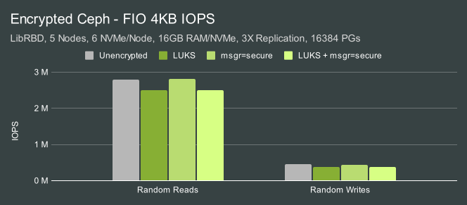
IO Size | Configuration | Random Reads | Random Writes
-- | -- | -- | --
4KB | Unencrypted | 100.00% | 100.00%
4KB | LUKS | 89.35% | 83.04%
4KB | LUKS, 4k sectors | 100.25% | 94.96%
4KB | LUKS, submit_from_crypt_cpus | 89.18% | 81.82%

The biggest effect is again from LUKS.  

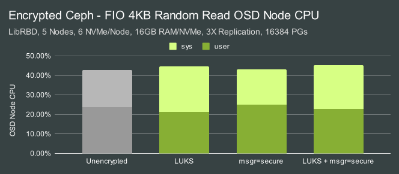
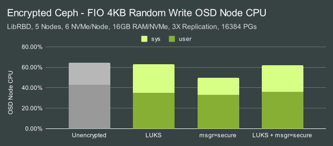

The biggest CPU usage effects also come from LUKS, with slightly more system CPU and slightly less user CPU (in association with lower performance).


One of the effects of throwing so much IO at this cluster is that we see high-latency events.  In this case, we are actually pushing things a little harder on the read side and seeing worst cast latencies as high as ~900ms.  The good news is that neither LUKS nor secure mode are having a significant effect on tail latency in this saturation workload.  We also know from our previous article [Ceph Reef - 1 or 2 OSDs per NVMe?](https://ceph.io/en/news/blog/2023/reef-osds-per-nvme/) that putting multiple OSDs on a single NVMe drive can significantly reduce tail latency at the expense of higher resource consumption.

# Single-Client Tests - 4MB IOs

Last year we looked at [QEMU/KVM]() performance with Msgr V2 AES Encryption and saw that encryption did have a notable effect on single-client performance.  We ran several single-client tests here to verify if that is still the case in Reef.

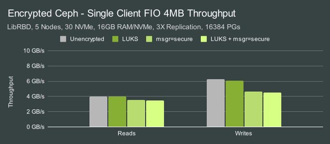
IO Size | Configuration | Random Reads | Random Writes
-- | -- | -- | --
4MB | Unencrypted | 100.00% | 100.00%
4MB | LUKS | 98.80% | 96.65%
4MB | LUKS, 4k sectors | 87.51% | 73.84%
4MB | LUKS, submit_from_crypt_cpus | 87.36% | 72.01%

Earlier in the multi-client tests we observed that LUKS generally was having the biggest impact.  It greatly increased CPU consumption for large IOs and degraded the performance of large writes and small random IO.  In these single-client large IO workloads, LUKS is having very little impact.  Enabling messenger encryption however, is having a significant impact on single-client performance while it had a much smaller impact on overall cluster performance in the multi-client tests.

# Single-Client Tests - 4KB IOs

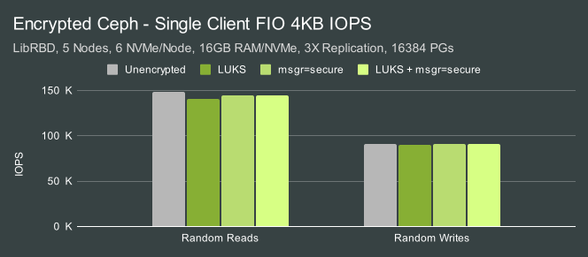
IO Size | Configuration | Random Reads | Random Writes
-- | -- | -- | --
4KB | Unencrypted | 100.00% | 100.00%
4KB | LUKS | 94.95% | 98.63%
4KB | LUKS, 4k sectors | 97.68% | 99.92%
4KB | LUKS, submit_from_crypt_cpus | 96.54% | 99.49%

The impact of both LUKS and messenger-level encryption on single-client small IO however is minimal, usually only a couple of percent.  What about latency?


The previous multi-client tests showed significant latency spikes due to how hard we were pushing the OSDs.  In these single-client tests, latency is far more even.  Typical latency for reads hovers right around 0.9ms with spikes not exceeding 1.15ms.  The write case is more interesting.  Latency was still significantly lower, typically around 1.5ms.  Spikes were typically below 2.5ms, though in the case where both on-disk and messenger level encryption was used grew closer to 3.5ms.  The nature of the spikes appears to be cyclical over time, however, and that pattern repeats across multiple tests on completely rebuilt clusters.  This effect warrants additional investigation.

# Single-Client Tests - 4KB SYNC IOs

In the previous single-client tests we still utilized a high io_depth to allow many IOs to stay in flight.  This allows multiple OSDs to service IOs concurrently and improve performance.  Some applications however require that IOs be handled sequentially.  One IO must complete before the next one can be written or read.  The etcd journal is a good example of this kind of workload and is typically entirely latency-bound.  Each IO must complete at least one round-trip network transfer along with whatever other overhead is required for servicing it from the disk.

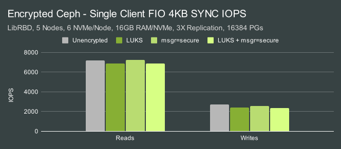
IO Size | Configuration | Random Reads | Random Writes
-- | -- | -- | --
4KB | Unencrypted | 100.00% | 100.00%
4KB | LUKS | 95.87 | 87.88%
4KB | LUKS, 4k sectors | 100.89% | 94.64%
4KB | LUKS, submit_from_crypt_cpus | 95.29% | 86.31%

The biggest effect in this case came from LUKS.  4KB sync reads were slightly slower, while 4KB sync writes showed larger degradation.


Latency followed a similar pattern, with the unencrypted results showing slightly faster response times than the encrypted ones.  Read latencies hovered around 0.13ms, while write latencies hovered around 0.4ms with occasional spikes up to around 0.5ms.

# Conclusion

In this article we looked at Ceph performance with both on-disk and over-the-wire encryption in a variety of different RBD test scenarios.  The results of those tests showcased several nuanced conclusions.

On-disk Encryption (LUKS) | Over-the-wire Encryption (secure msgr)
-- | --
\* 2x OSD CPU Usage for large IOs | \* Low effect on CPU consumption
\* High large write cluster impact | \* Low-Moderate cluster impact
\* Moderate small IO cluster impact | \* High single-client large IO impact
\* Low single-client impact (high io_depth) | \* Low small sync IO impact
\* Moderate small sync write impact |
\* Partially mitigated with tuning |

In general, we expect users to see increased CPU consumption when using on-disk encryption. The greatest impact is expected to be on large IOs.  Thankfully, Ceph typically uses more CPU during small IO workloads.  Customers who have designed their OSD CPU specifications around IOPS requirements will not likely suffer a serious performance impact due to a lack of CPU.  Large writes do see a significant performance impact with on-disk encryption, however, this can be partially mitigated and there is on-going work that may mitigate it further.  On-disk encryption also has a moderate effect on small synchronous write performance.  Over-the-wire encryption's biggest performance impact is on maximum single-client throughput.  It does have a small performance impact in other cases as well, though the effect is usually minor.  As always, I encourage you to test for yourself and see if your findings match what we saw here.  Thank you for reading, and if you have any questions or would like to talk more about Ceph performance, please feel free to [reach out](mailto:mark.nelson@clyso.com).
