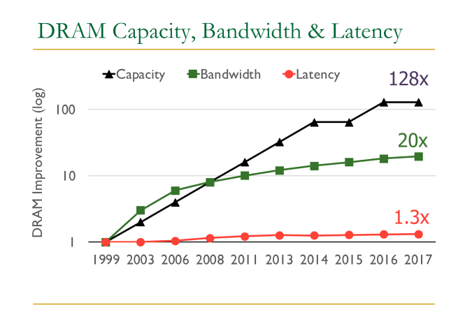
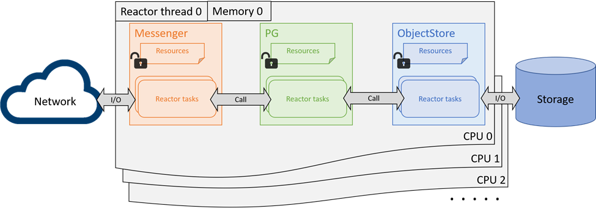
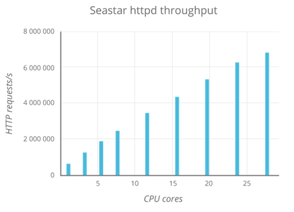
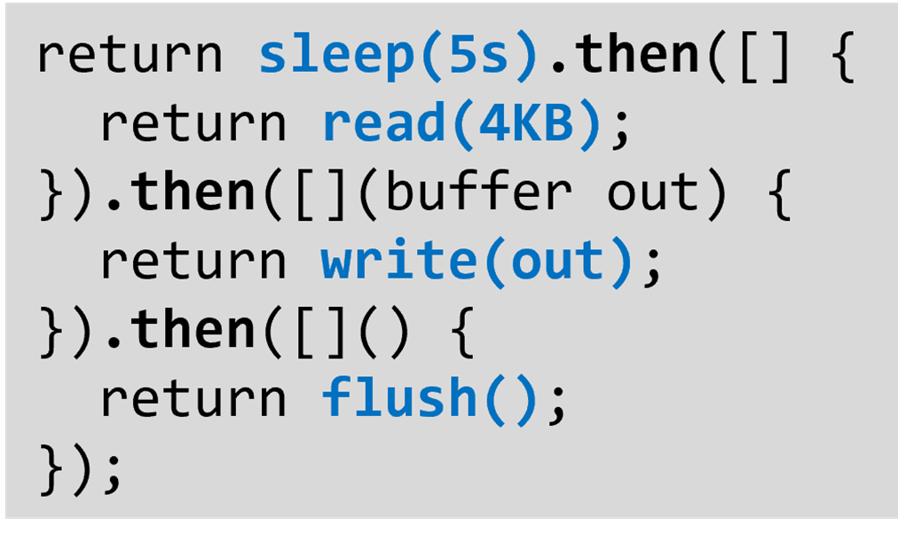
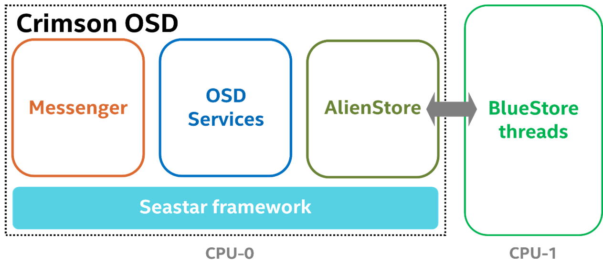
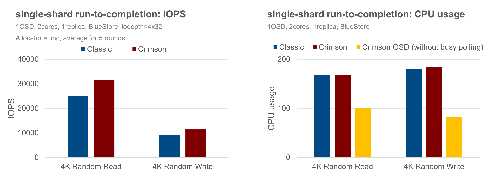
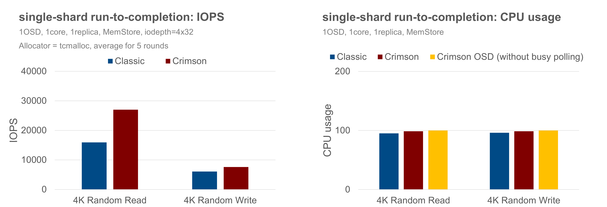
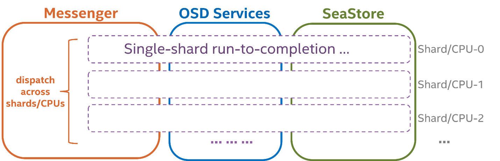

_The author list is in alphabetical order._

# Background

The landscape of bare-metal hardware for storage software has been constantly changing.

On one hand, memory and IO technologies have been developing rapidly. At the time when Ceph was originally designed, it was deployed generally on spinning disks capable of a few hundreds of IOPS with tens of gigabytes of disk capacity. Modern NVMe devices now can serve millions of IOPS and support terabytes of disk space. DRAM capacity has increased 128 times in about 20 years<a href="#ref1">1</a>. And for Network IO, a NIC device is now capable of delivering speeds upwards of 400Gbps compared to 10Gbps just a few years ago.

On the other hand, single-core performance has plateaued as the CPU frequency and single-thread performance of CPU cores has remained in the same range for about a decade now<a href="#ref2">2</a>. In contrast, the number of logical cores has grown quickly with the increasing transistor scale.

It has been challenging for Ceph performance to keep up with the pace of modern hardware development, as its architecture was shaped more than a decade ago – its dependence on single core performance limits its ability to take full advantage of the growing capabilities of IO devices. In particular, classic Ceph object storage daemon (OSD)’s reliance on thread pools to handle different portions of an IO incurs significant latency costs due to cross-core communications. Reducing or eliminating those costs is the core goal of the Crimson project.

The Crimson project was initiated to rewrite the Ceph OSD with the shared-nothing design and run-to-completion model to address the demanding scaling requirements, and at the same time, be compatible with the existing clients and components.

To understand how Crimson OSD is re-designed for CPU scaling, we compare the architectural differences between Classic and Crimson OSD to explain how and why the design has been altered. Then we discuss why Crimson builds on the Seastar framework, and how each major component is implemented for scaling. Finally, we share the latest status towards this goal, and with meaningful performance results that might be helpful to illustrate the final vision.

# Crimson vs Classic OSD Architecture

Ceph OSD is a part of Ceph cluster responsible for providing object access over the network, maintaining redundancy and high availability and persisting objects to a local storage device. As a rewritten version of the Classic OSD, the Crimson OSD is compatible with the existing RADOS protocol from the perspective of clients and other OSDs, providing the same set of interfaces and features. Ceph OSD modularity such as Messenger, OSD services, and ObjectStore are unchanged in their responsibilities, but the form of cross-component interactions and internal resource management are vastly refactored to apply the shared-nothing design and user-space task scheduling bottom up.

The architecture of the Classic OSD isn’t friendly to multiple cores with worker thread pools in each component and shared queues among them. In a simplified example, a PG operation requires to be firstly processed by a messenger worker thread to assemble or decode raw data stream into a message, then put into a message queue for dispatching. Later, a PG worker thread picks up the message, after necessary processing, hands over the request to the ObjectStore in the form of transactions. After the transaction is committed, the PG will complete the operation and send the reply through the sending queue and the messenger worker thread again. Although the workload is allowed to scale to multiple CPUs by adding more threads into the pool, these threads are by default sharing the resources and thus require locks which introduce contentions. And the reality is more complicated as further thread pools are implemented inside each component, and the data path is longer if there are replications across the OSDs.

A major challenge of the Classic architecture is that lock contention overhead scales rapidly with the number of tasks and cores, and every locking point may become the scaling bottleneck under certain scenarios. Moreover, these locks and queues incur latency costs even when uncontended. There have been considerable efforts over the years on profiling and optimizations for finer-grained resource management and fast path implementations to skip queueing. There will be less low-hanging fruits in the future and the scalability seems to be converging into a certain multiplicator under a similar design. There are other challenges as well. The latency issue will deteriorate with thread pools and task queues, as the bookkeeping effort delegates tasks between the worker threads. And locks can force context-switches which make things even worse.

The Crimson project wishes to address the CPU scalability issue with the shared-nothing design and run-to-completion model. Basically, the design is to enforce each core, or CPU, to run one pinned thread and schedule non-blocking tasks in user space. Requests as well as their resources are sharded by cores, so they can be processed in the same core until completion. Ideally, all the locks and context-switches are no longer needed as each running non-blocking task owns the CPU until it completes or cooperatively yields. No other threads can preempt the task at the same time. If there is no need to communicate with other shards in the data path, the ideal performance will scale linearly with number of cores until the IO device reaches its limit. This design fits the Ceph OSD very well because, at the OSD level, all IOs are already sharded by PGs.

Although cross-shard communications cannot be eliminated entirely, those are usually for OSD global status maintenance and not in the data path. A major challenge here is that the expected changes are fundamental to core OSD operation – a considerable part of the existing locking or threading code cannot be reused, and needs to be redesigned while backward compatibility is maintained. Redesign requires holistic understanding of the code with inherent caveats. It is another challenge to implement low-level thread-per-core and user-space scheduling using shared-nothing architecture. Crimson seeks to build the redesigned OSD based on Seastar, an asynchronous programming framework with all the ideal characteristics to meet the above goals.

# Seastar Framework

Seastar<a href="#ref3">3</a> is ideal for the Crimson project because it not only implements the one-thread-per-core shared-nothing infrastructure in C++, but also provides a comprehensive set of features and models that have been proven to be effective for performance and scaling in other applications. Resources are by-default not shared between shards, and Seastar implements its own memory allocator for lockless allocations. The allocator also takes advantage of the NUMA topology to assign the closest memory to the shard. For some inevitable cross-core resource sharing and communications, Seastar enforces them to be handled explicitly: If a shard owns resources from another core, it must hold them by foreign pointers; And if a shard needs to communicate with other shards, it must submit and forward the tasks to them. This forces the programmers to restrain their needs to go cross-core and helps to reduce the analysis scope for the CPU scalability issues. Seastar also implements high-performance non-blocking primitives for the inevitable cross-core communications.

The conventional program with asynchronous events and callbacks is notoriously challenging to implement, understand and debug. And non-blocking task scheduling in user space requires implementation to be pervasively asynchronous. Seastar implements the futures, promises and continuations (f/p/c) as the building blocks to organize the logic. The futures and promises makes code easier to write and read by grouping logically connected, asynchronous constructs together, rather than scattering them in plain callbacks. Seastar also provides higher level facilities for loops, timers, and to control lifecycles and even CPU shares based on the futures. To further simplify applications, Seastar encapsulates both networking and disk accesses to the world of shared-nothing and f/p/c-based design. The complexity and nuanced control to adopt different I/O stacks (such as epoll, linux-aio, io-uring, DPDK, etc) are transparent to the application code.

# Run-to-completion performance

The Crimson team has implemented most of the critical features of OSD for read and write workloads from RBD clients. The effort includes re-implementations of the messenger V2 (msgr2) protocol, heartbeat, PG peering, backfill, recovery, object-classes, watch-notify, etc., with continuous stabilization efforts to add CI test suites. Crimson has reached a milestone where we can validate run-to-completion design in a single shard with sufficient stability.

Considering fairness and reality, the single-shard run-to-completion is validated by comparing Classic and Crimson OSD with the BlueStore backend, under the same random 4KB RBD workload, and without replication. Both OSDs are assigned 2 CPU resources. The Crimson OSD is special because Seastar requires an exclusive core to run the single-shard OSD logic in the reactor. It implies that the BlueStore threads must be pinned to the other core, with AlienStore introduced to bridge the boundary between the Seastar thread and BlueStore threads and to submit IO tasks between the two worlds. In contrast, the Classic OSD has no restrictions to use the assigned 2 CPUs.

The performance result shows that with BlueStore, the Crimson OSD has roughly 25% better performance for random-reads and has about 24% better IOPS than the Classic OSD for the random-write case. Further analysis shows that the CPU is underutilized in the random-write scenario, as ~20% CPU is consumed in busy-polling, suggesting Crimson OSD is not the likely bottleneck here.

There is also extra overhead for the Crimson OSD to submit and complete IO tasks, and synchronize between the Seastar and BlueStore threads. So, we repeat the same set of experiments against the MemStore backend, with both OSDs assigned 1 CPU. Crimson OSD delivers about 70% better IOPS in random-read and is about 25% better than the Classic OSD in the random-write case, as shown below, agreeing with the assertion in the previous experiment that Crimson OSD could do better.

Although the above scenarios cover only the experimental single-shard cases, the results establish that there are performance benefits to the use of Seastar framework–eliminating locks, dropping context-switches by user-space task scheduling, assigning memory closer to the CPU, and so on. Moreover, it is important to restate that the goal of the run-to-completion model is better CPU scaling and eliminating software as a bottleneck in extracting maximum performance from modern hardware.

# Multi-shard Implementation

The path towards a multiple-shard implementation is clear. Since IO in each PG is already logically sharded, there is no significant change to the IO path. The major challenge is to identify places where cross-core communication is inevitable, and design new solutions to minimize the exposure and its impact to the IO path, which will need to be on a case-by-case basis. In general, when an IO operation is received from the Messenger, it will be directed to the OSD shard according to the PG-core mapping, and will run in the context of the same shard/CPU until completion. Note that in the current phase the design choice not to modify the RADOS protocol has been made for simplicity.

## Messenger

Messenger plays an important role in making sure the solution is scalable. There are some restrictions that need to be considered carefully. One restriction is from the RADOS protocol, which defines only one connection per peer client or OSD. A connection must be living on a specific core to decode and encode the messages efficiently and locklessly according to its state. The shared connection to an OSD peer means that the cross-core message delivery to multiple PG shards is unavoidable in the current phase unless the protocol can be adjusted to allow exclusive connections to every shard.

Another restriction of the Seastar framework is that it does not allow moving a Seastar socket to another core after it has been accept()ed or connect()ed. This is a challenge for lossless connections (msgr2)<a href="#ref4">4</a> because it can impact the interaction between the Messenger and OSD service where a connection can jump to another core preemptively due to reconnection on a network failure.

Most of the work to extend the Messenger is to optimally scale messaging work load (encode, decode, compress, encrypt, buffer management, etc) to multiple cores before IO operations are dispatched to a PG shard, and to minimize the cross-core message deliveries along the IO path, ideally keeping it at most 1-hop for each message send and receive operation, under the above constraints.

## OSD

OSD is responsible for maintaining global status and activities shared between PG shards, including heartbeat, authentication, client management, osdmap, PG maintenance, access to the Messenger and ObjectStore, and so on.

A simple principle towards a multi-core Crimson OSD is to keep all processing relating to shared state on a dedicated core. If an IO operation wants to access the shared resource, it either needs to access the dedicated core in order, or to access an exclusive copy of the shared information that is kept synchronized.

There are two major steps to achieve this goal. The first step is to allow IO operations to run in multiple OSD shards according to the PG sharding policy, with all the global information including PG status maintained in the first shard. This step enables sharding in the OSD but requires all the decisions about IO dispatching to be made in the first shard. Even if the Messenger can run in multiple cores at this step, messages will still need to be delivered to the first shard for preparation (PG peering, as an example) and determining the correct PG shard before being submitted to that shard. This can result in extra overhead and unbalanced CPU utilization (the first OSD shard is busy and other shards are starved, etc). So, the next step is to extend the PG-core mapping to all the OSD shards, so that the received message can be dispatched to the correct shard directly.

## ObjectStore

There are three ObjectStore backends supported for Crimson: AlienStore, CyanStore and SeaStore. AlienStore provides backward compatibility with BlueStore. CyanStore is a dummy backend for tests, implemented by volatile memory. SeaStore is a new object store designed specifically for Crimson OSD with shared-nothing design. The paths towards multiple shard support are different depending on the specific goal of the backend.

### AlienStore

AlienStore is a thin proxy in the Seastar thread to communicate with BlueStore that uses POSIX threads, (alien world from a Seastar perspective). There is no special work to do towards multiple OSD shards because the IO tasks are already synchronized for alien world communications. There are no Crimson specific customizations in the BlueStore because it is impossible to truly extend the BlueStore into shared-nothing design as it depends on the 3rd party RocksDB project which is still threaded. However, it is acceptable to pay reasonable overhead in exchange for a sophisticated storage backend solution, before Crimson can come up with a native storage backend solution (SeaStore) which is optimized and stable enough.

### CyanStore

CyanStore in Crimson OSD is the counterpart of MemStore in the Classic OSD. The only change towards multiple-shard support is to create independent CyanStore instances per shard. One goal is to make sure the dummy IO operation can complete in the same core to help identify OSD-level scalability issues if there are any. The other goal is to do direct performance comparisons with the Classic at the OSD level without complex impacts from the ObjectStore.

### SeaStore

SeaStore is the native ObjectStore solution for Crimson OSD, which is developed with the Seastar framework and adopts the same design principles.

Although challenging, there are multiple reasons why Crimson must build a new local storage engine. Storage backend is the major CPU resource consumer, and the Crimson OSD cannot truly scale with cores if its storage backend cannot. Our experiment also proves that the Crimson OSD is not the bottleneck in the random write scenario.

Second, the CPU-intensive metadata managements with transaction support in the BlueStore are essentially provided by RocksDB, which cannot run in the native Seastar threads without reimplementation. Rather than re-implementing the common purpose key-value transactional storage for BlueStore, it is more reasonable to rethink and customize the according designs at a higher level - the ObjectStore. Issues can be solved more easily in the native solution than in the 3rd-party project which must be general to all the use cases that may be even unrelated.

The third consideration is to bring up native support to heterogeneous storage devices as well as hardware accelerators that will allow users to balance costs and performance according to their requirements. It will be more flexible for Crimson to simplify the solution to deploy the combination of hardware if it has better controls over the entire storage stack.

SeaStore is already functional in terms of single shard reads and writes, although there are still efforts left for stability and performance improvement. The current efforts are still focused on the architecture rather than corner-case optimizations. Its design for the multiple-shard OSD is clear. Like the CyanStore, the first step is to create independent SeaStore instances per OSD shard, each running on a static partition of the storage device. The second step is to implement a shared disk space balancer to adjust the partitions dynamically, which should be fine to run in the background asynchronously because the PGs have already distributed the user IO in a pseudo random way. The SeaStore instances may not need to be equal to the number of OSD shards, adjusting this ratio is expected as the third step according to the performance analysis.

# Summary and Test configurations

In this article, we have introduced why and how the Ceph OSD is being refactored to keep up with the hardware trends, design choices made, performance results for single-shard run-to-completion implementation, and the considerations to make Crimson OSD truly multi-core scalable.

The test result is subject to change according to different commit versions, software, and hardware configurations. To make sure our tests are reproducible and can be revisited later for future evaluations, we list all the settings and considerations that might have an impact.

We deployed a local Ceph cluster for both Crimson and Classic OSDs and performed FIO tests using CBT<a href="#ref5">5</a>. Crimson still has issues working with _tcmalloc_, so we configure both OSDs to use _libc_ for fairness. We use BlueStore. RBD cache is disabled. The number of BlueStore threads is set to 4 for better results. When deploying Crimson, _ceph-osd_cmd_ needs to be specified (_crimson-osd_). CPU-binding is specified through _crimson_cpusets_ in the CBT configuration file, and BlueStore threads are configured via _crimson_alien_thread_cpu_cores_ and _crimson_alien_op_num_threads_. To deploy Classic OSD, _numactl_ is used to control the CPU-binding. Remainder of the deployment procedure is unchanged according to the CBT repository.

Test scenarios:

- Client: 4 FIO clients
- IO mode: random write and then random read
- Block size: 4KB
- Time: 300s X 5 times to get the average results
- IO-depth: 32 X 4 clients
- Create 1 pool using 1 replica
- 1 RBD image X 4 clients
- The size of each image is 256GB

Test environment:

- Ceph version (SHA1): 7803eb186d02bb852b95efd1a1f61f32618761d9
- Ubuntu 20.04
- GCC-12
- 1TB NVMe SSD as the BlueStore block device
- 50GB memory for MemStore and CyanStore

## Reference

1. <a name = "ref1" href="https://www.arxiv-vanity.com/papers/2012.03112/#:~:text=A%20Modern%20Primer%20on%20Processing%20in%20Memory%201,Intelligent%20Memory%20Controllers%20to%20Enhance%20Memory%20Scaling%20">A Modern Primer on Processing in Memory</a>

2. <a name = "ref2" href="https://github.com/karlrupp/microprocessor-trend-data">Microprocessor trend data</a>

3. <a name = "ref3" href="https://seastar.io/">Seastar</a>

4. <a name = "ref4" href="https://docs.ceph.com/en/latest/dev/msgr2/">msgr2</a>

5. <a name = "ref5" href="https://github.com/ceph/cbt">The Ceph Benchmarking Tool</a>
