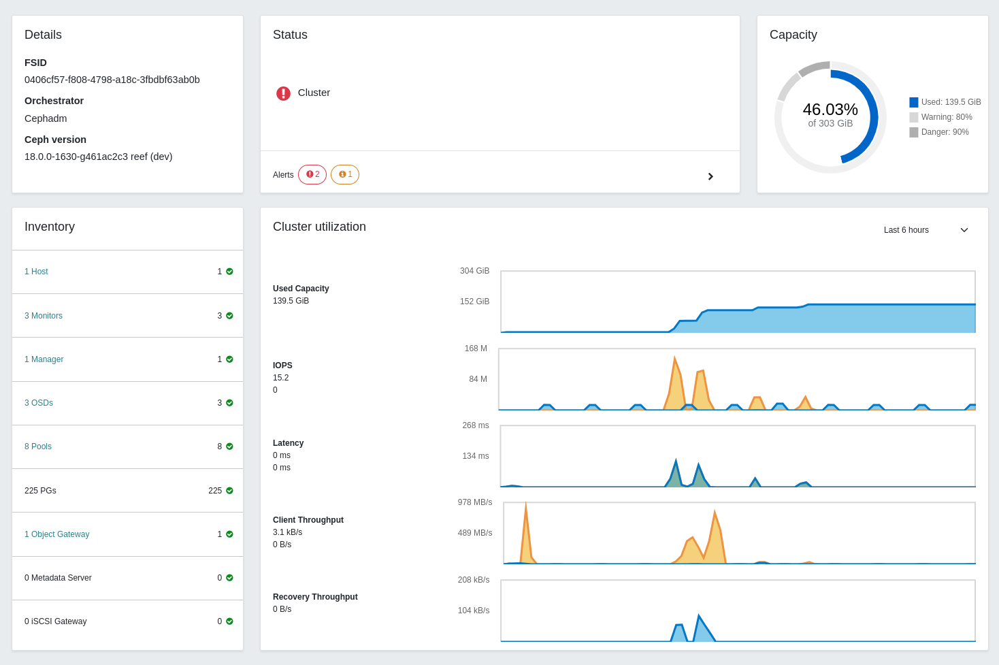
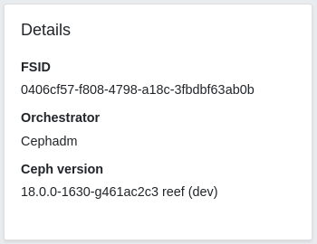
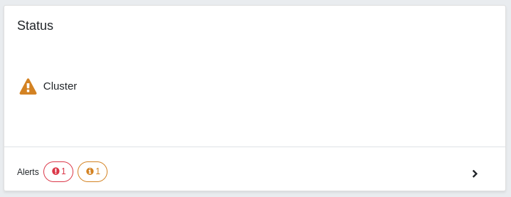
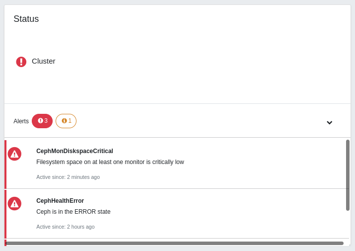
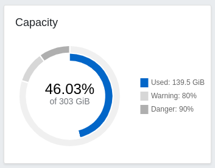
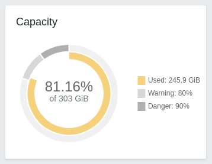
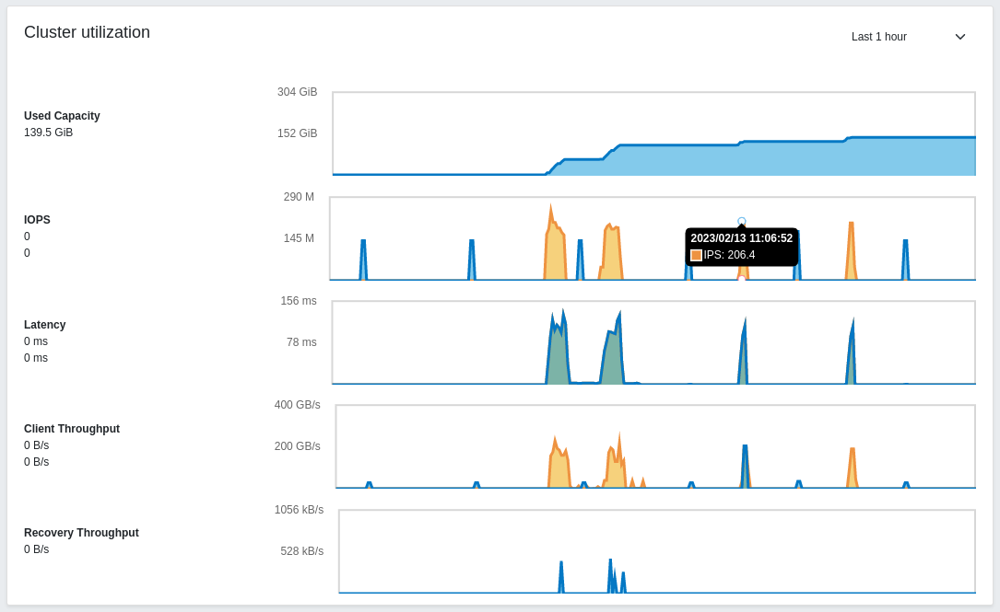

## Ceph Dashboard and The Landing page

Ceph Dashboard is a web-based management and monitoring application through which you can inspect and control various aspects and resources within a Ceph cluster. It is implemented as a Ceph Manager Daemon module and it is an integral part of it. Learn more about it [here](https://docs.ceph.com/en/quincy/mgr/dashboard/#overview).

The landing page of Ceph Dashboard serves as the home page and features metrics such as the overall cluster status, performance, and capacity. It provides real-time updates on any changes in the cluster and allows quick access to other sections of the dashboard.

As the Ceph Dashboard adds new features and capabilities, the landing page has been updated to keep pace. We are excited to present the latest version of the landing page:

## Goals

The goal of this project is to enhance the user experience of the landing page. This will be achieved through a combination of preserving existing features, introducing new ones, presenting information in a clear and organized manner, and crafting a user-friendly interface. By following these guidelines, we aim to make the landing page a powerful tool for monitoring the cluster with ease.

To accomplish this, the main focus of development was on:

- **Maintain Existing Features**
- **Enhance Additional Features**
- **Layout re-arrangement**
- **Maintain Structured Content**
- **User-Centered Design**

## Components

In this section, we will take a closer look at the individual components or "cards" that make up the layout of this dashboard.

### Details card

The Details Card provides an overview of the cluster configuration, displaying various critical aspects of the cluster.

### Status card

The Status Card provides a visual indication of cluster health. It also displays cluster alerts grouped by severity (Danger and Warning) for easy interpretation.

### Capacity card

The Capacity Card displays the total and used capacity of the cluster using a double doughnut chart. The outer ring of the chart represents the near-full and full-ratio thresholds configured for the OSDs, while the inner blue ring shows the used capacity. This chart helps you to keep track of the total used capacity of the cluster and monitor whether it remains below the configured thresholds.

The used capacity, displayed with the inner blue ring, will turn yellow and red after passing the warning and danger thresholds respectively:

### Inventory card

The Inventory Card serves as an inventory of the cluster and allows you to keep track of all assets within the cluster. You can directly access each item from this card by clicking on its link, which will redirect you to the corresponding page.

### Cluster utilization card

The Cluster Utilization Card shows you the current performance of your cluster:

- **Used capacity:** Total capacity used of our cluster. The maximum value of the chart is the maximum capacity of the cluster.
- **IOPS (Input/Output Operations Per Second):** It represents the number of read and write operations that the cluster is handling.
- **Latency:** Refers to the amount of time that it takes to process a read or a write request.
- **Client throughput:** It measures the amount of data that clients read or write to the cluster.
- **Recovery Throughput:** similar to the above, but for cluster recovery reads and writes.

The data is retrieved directly from Prometheus and allows you to set up different timeframes ranging from 5 minutes to 7 days.
All the charts are updated in real-time, so you can keep track of the different operations of your cluster.

Moreover, by hovering over any graph, you can quickly access its values - a tooltip will appear displaying the time and value at that moment.

On the left side you can find the name of every chart and below that the latest value. You can move the mouse over them to distinguish between read and write operations.
