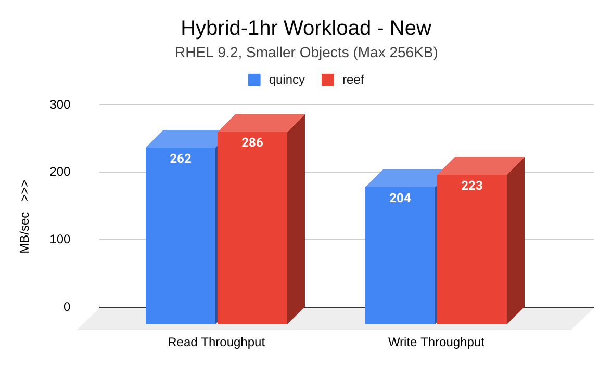
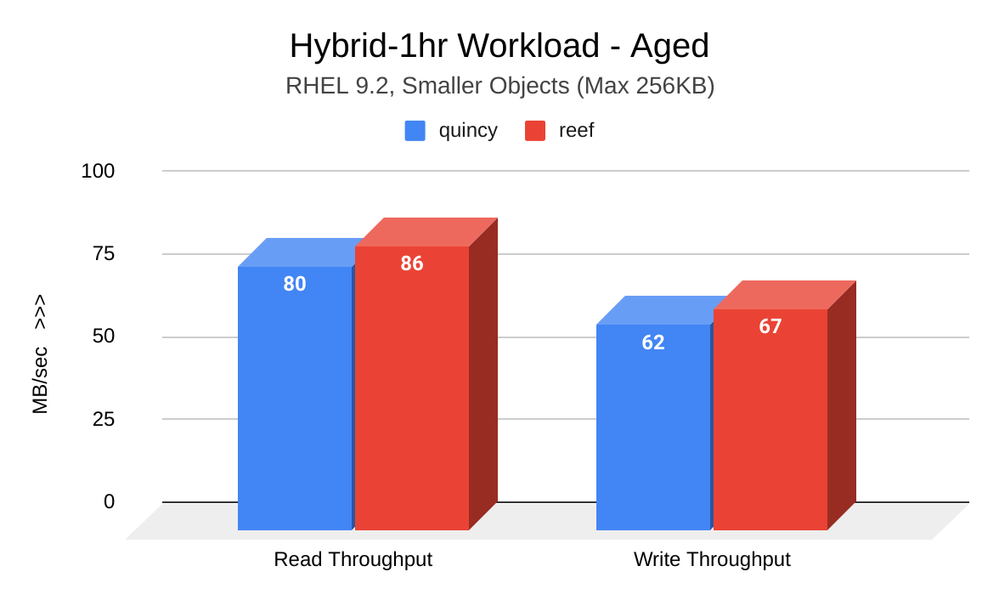
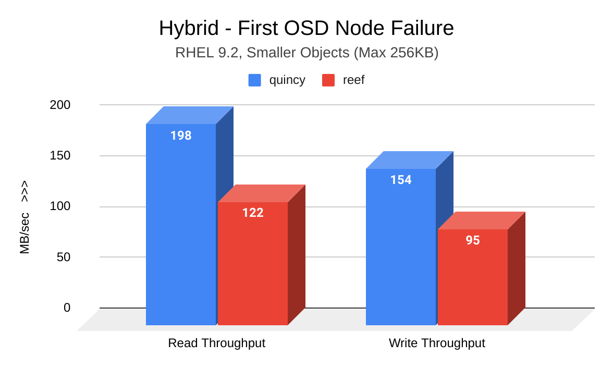
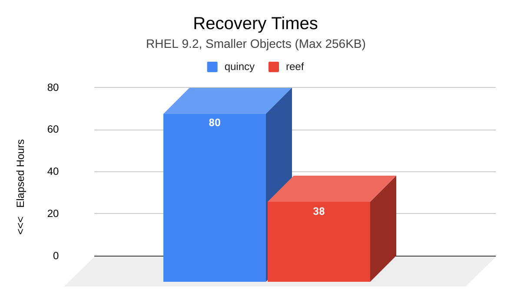
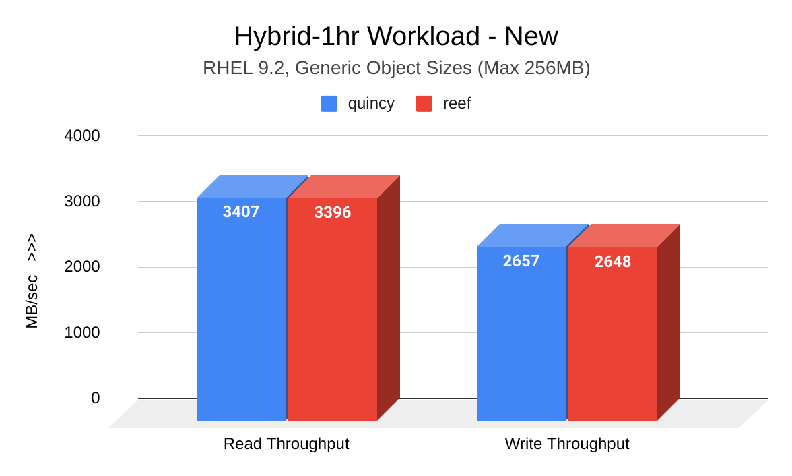
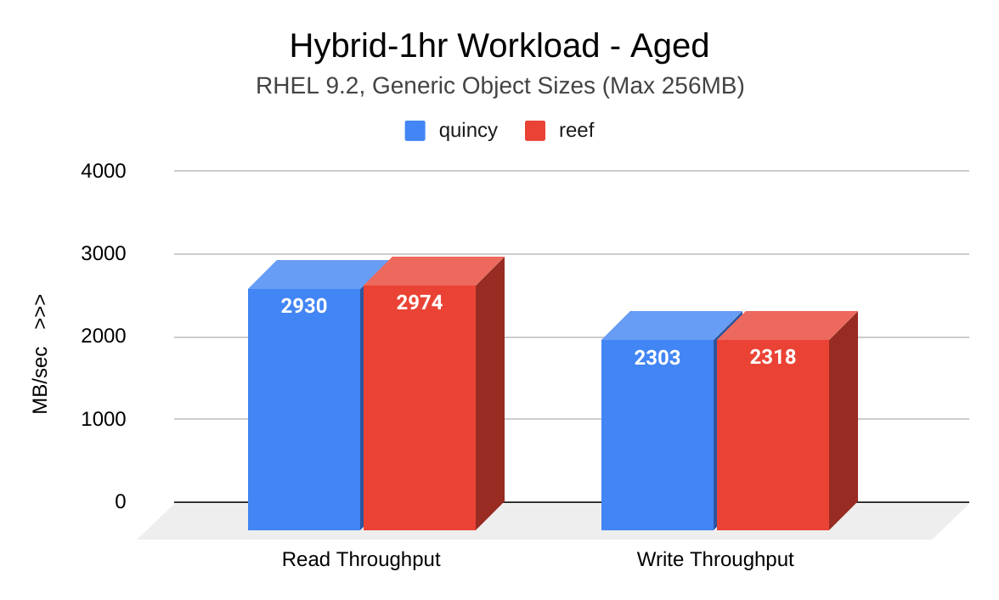
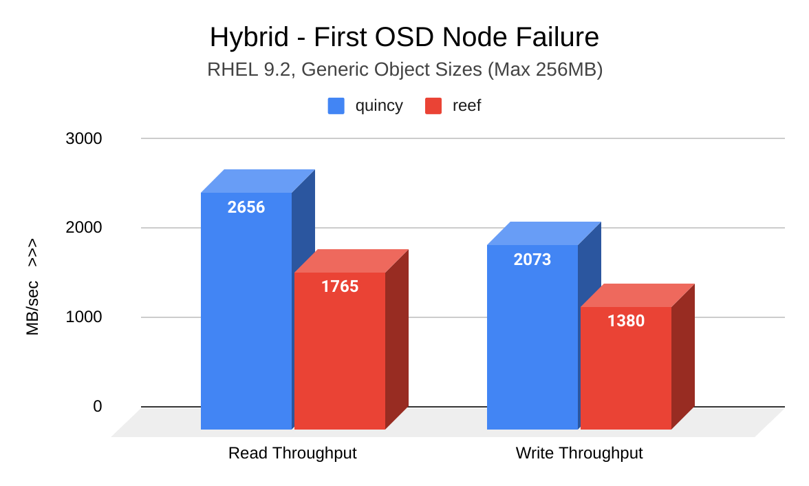
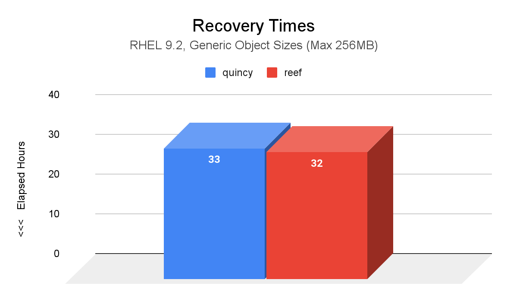
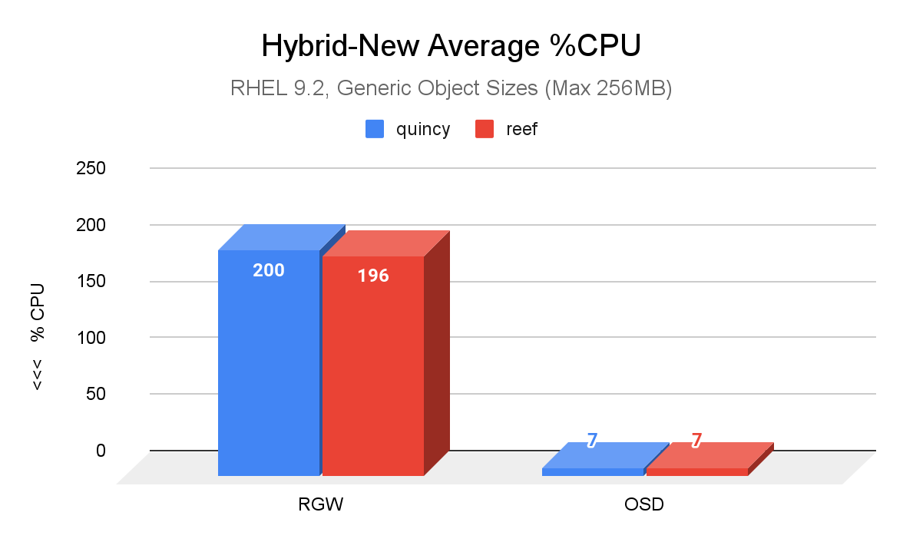

## Introduction

We invite you to read the first installment of a blog series called “Putting Reef to the Test” - a
series in which we explain how we tested upstream Reef in a diverse set of scenarios to
measure its functionality and performance against Quincy baselines.

All results in this article are courtesy of the Storage Workload DFG team. Read on to see how
we put Reef to the test by filling RGW clusters, aging them, inducing node failure, and
kickstarting recovery to gather the latest throughput and recovery results.

## Test Plan

The following set of tests were designed to verify RADOS and RGW functionality as well as to
measure baseline performance at scale. All tests were performed on an upstream version of
Reef (18.1.2) and repeated on an upstream version of Quincy (17.2.6) for comparison purposes.
Two sets of object sizes were employed: The **smaller** object sized workload uses five Warp
drivers with a range of fixed sizes (1KB, 4KB, 8KB, 64KB, 256KB), one size per bucket, as
opposed to more **generic sized** objects (1MB, 4MB, 8MB, 64MB, 256MB).

### Test Cycle 1: RGWtest Workload

This test cycle fills an RGW cluster and measures performance when the cluster is new, and
after the cluster has aged for a few hours. This test cycle was performed on small and generic
sized objects. The following points describe each step of the test cycle:

1. Cluster fill - @4hrs
2. 1hr hybrid workload measurement of new cluster (45% reads, 35% writes, 15% stats, 5% deletes)
3. hybrid aging workload
    1. same operation ratio
    2. 24hrs for smaller sized objects, 12hrs for generic
4. 1hr hybrid workload measurement of **aged** cluster

### Test Cycle 2: OSDfailure Workload

This test cycle fills an RGW cluster and measures performance and recovery time in various node-failure
scenarios. This test cycle was performed on small and generic sized objects. The following points describe
each step of the test cycle:

1. Cluster fill - @4hrs
2. 2hr hybrid workload - no failure
3. 2hr hybrid workload - One OSD node (24 OSDs) stopped
4. 2hr hybrid workload - Another OSD node (24 OSDs) stopped
5. 2hr hybrid workload - Missing OSDs started
6. Monitor recovery until all PGs are active+clean

## Test Environment

The following points show the hardware, software, and tools that were used in our testing scenarios.
Tests were run on two clusters, each with 8 OSDs and 4096 PGs. We ran each test scenario on the latest
upstream Quincy version (17.2.6) to gather baselines, and then on Reef upstream (18.2.1) to gather comparison
results. Results were generated and gathered with the [minio warp](https://github.com/minio/warp) tool.

#### Hardware

- 3x MON / MGR nodes
  - Dell R630
  - 2x E5-2683 v3 (28 total cores, 56 threads)
  - 128 GB RAM
- 8x OSD / RGW nodes
  - Supermicro 6048R
  - 2x Intel E5-2660 v4 (28 total cores, 56 threads)
  - 256 GB RAM
- 192x OSDs (bluestore): 24 2TB HDD and 2x 800G NVMe for WAL/DB per node
- Pool: site{1,2}.rgw.buckets.data = EC 4+2, pgcnt=4096
- Five warp driver nodes each running multiple clients

#### Software 

- RHEL 9.2  (5.14.0-284.11.1.el9\_2.x86\_64)
- Quincy upstream (17.2.6) for comparison with Reef upstream (18.1.2)
- Non-default settings
  - log\_to\_file true
  - mon\_cluster\_log\_to\_file true
  - rgw\_thread\_pool\_size 2048
  - rgw\_max\_concurrent\_requests 2048
  - osd\_memory\_target 7877291758
  - osd\_memory\_target\_autotune false
  - ceph balancer off
  - PG autoscaler pg\_num\_min
    - 4096 data 
    - 256 index
    - 128 log/control/meta

#### Tools Used

- Warp v0.6.9-without-analyze
- RGWtest
- OSDfailure

## Results

During cluster fill and aging scenarios, we saw significant throughput improvement in Reef, especially for small object
workloads. During OSD failure scenarios, we saw Reef’s throughput decrease for both object sizes; however, this decrease
was largely won out by faster recovery times, especially for small object workloads.

### RGWtest - Small Object Sizing

The cluster fill and aging workloads performed in this test cycle revealed significantly improved throughput results in Reef.

The following image shows a comparison of read and write throughput (MB/sec) between Quincy (blue) and Reef (red) when the
cluster was new. Reef shows significant improvement:

The following image shows a comparison of read and write throughput (MB/sec) between Quincy (blue) and Reef (red) after the
cluster was aged. Reef shows significant improvement:

### OSDfailure - Small Object Sizing

Although induced OSD node failure workloads revealed a decrease in Reef’s throughput, the loss came as a result of significant
recovery time improvements.

The following image shows a comparison of read and write throughput (MB/sec) between Quincy (blue) and Reef (red) after the first
induced OSD node failure. Reef shows a decrease in throughput:

The following image shows a comparison of recovery time (hours) between Quincy (blue) and Reef (red) after two induced OSD node
failures. Compared to Quincy, PGs in Reef took significantly less time to reach an active+clean state. At a total of 38 hours,
Reef’s recovery time took 42 less hours than Quincy’s recovery time of 80 hours.

### RGWtest Test Cycle - Generic Object Sizing

The cluster fill and aging workloads performed in this test cycle also showed that Reef's throughput was as good, or slightly better,
than Quincy's.

The following image shows a comparison of read and write throughput (MB/sec) between Quincy (blue) and Reef (red) when the cluster
was new. Reef's results are comparable to Quincy's:

The following image shows a comparison of read and write throughput (MB/sec) between Quincy (blue) and Reef (red) after the cluster
was aged. Reef shows a slight improvement:

### OSDfailure Test Cycle - Generic Object Sizing

As with small objects, generic object OSD node failure workloads revealed a decrease in Reef’s throughput. This loss, however, was
also accompanied by an improvement in recovery time.

The following image shows a comparison of read and write throughput (MB/sec) between Quincy (blue) and Reef (red) after the first
induced OSD node failure. Reef shows a decrease in throughput:

The following image shows a comparison of recovery time (hours) between Quincy (blue) and Reef (red) after two induced OSD node
failures. Compared to Quincy, PGs in Reef took 1 hour less to reach an active+clean state.

### Resource Consumption

CPU utlilization was also measured during cluster fill and aging workloads, as well as during the OSD failure scenarios. These
results proved to be comparable across releases for both small and generic object sizes.

The most notable difference is shown in the following image, which is a comparison of average percent CPU usage between Quincy (blue)
and Reef (red) in a new cluster with generic object sizes. Reef’s RGW CPU usage showed a slight improvement compared to Quincy’s.

## Conclusion
Overall, upgrading to Reef means significant throughput improvements in most cases, especially for small object workloads. Although
throughput may decrease during OSD failure scenarios, recovery time is much quicker in Reef compared to Quincy, particularly for small
object workloads.

As more and more users upgrade to Reef, we welcome any and all performance feedback from the community. Make your voice heard on the
[ceph-users](https://lists.ceph.io/postorius/lists/ceph-users.ceph.io/) mailing list, or join us in [Slack](ceph-storage.slack.com)! 

