Hello Ceph community!  It's that time again for another blog post!  Recently, a user on the ceph subreddit [asked](https://www.reddit.com/r/ceph/comments/14ztb22/is_10k_iops_achievable_with_nvmes/) whether Ceph could deliver 10K IOPs in a combined random read/write FIO workload from one client.  The setup consists of 6 nodes with 2 4GB FireCuda NVMe drives each.  They wanted to know if anyone would mind benchmarking a similar setup and report the results.  Here at [Clyso](https://clyso.com) we are actively working on improving the Ceph code to achieve higher performance.  We have our own tests and configurations for evaluating our changes to the code, but it just so happens that one of the places we do our work (the upstream ceph community performance lab!) appears to be a good match for testing this user's request.  We decided to sit down for a couple of hours and give it a try.  [u/DividedbyPi](https://www.reddit.com/user/DividedbyPi/), one of our friends over at [45drives.com](https://www.45drives.com/), wrote that they are also going to give it a shot and report the results on their youtube channel in the coming weeks.  We figure this could be a fun way to get results from multiple vendors.  Let's see what happens! 

# Acknowledgements

First, thank you to [Clyso](https://www.clyso.com) for funding this work to benefit the Ceph community.  Thank you as well to [IBM](https://ibm.com)/[Red Hat](https://redhat.com) and [Samsung](https://samsung.com) for providing the upstream Ceph community with the hardware used for this testing.  Thank you to all of the Ceph developers that have worked tirelessly to make Ceph great.  Finally, thank you to [/u/nNaz](https://www.reddit.com/user/nNaz/) for reaching out and driving some new Ceph benchmarking!

# User Setup

The user indicated in the original Reddit post for this article that they have 6 nodes that each have 2 4TB Seagate FireCuda NVMe drives and 64GB of memory.  They didn't mentioned what kind of CPUs or networking they have, but both are potentially important for this test.  Conveniently, they already had an FIO invocation in mind that they wanted to evaluate:

```fio --randrepeat=1 --ioengine=libaio --direct=1 --gtod_reduce=1 --name=test --filename=test --bs=4k --iodepth=64 --size=150G --readwrite=randrw --rwmixread=75``` 

While we don't have any FireCuda drives in the upstream lab, we do have nodes that have multiple 4TB Samsung PM983 drives and 128GB of memory each.

# Cluster Setup 

Nodes | 10 x Dell PowerEdge R6515
-- | --
CPU | 1 x AMD EPYC 7742 64C/128T
Memory | 128GiB DDR4
Network | 1 x 100GbE Mellanox ConnectX-6
NVMe | 6 x 4TB Samsung PM983
OS Version | CentOS Stream release 8
Ceph Version 1 | Pacific v16.2.13 (built from source)
Ceph Version 2 | Quincy v17.2.6 (built from source)
Ceph Version 3 | Reef v18.1.0 (built from source)
<br>

To match the user's setup as closely as possible, we only used 6 of the nodes in the cluster with 2 OSDs running on a single NVMe drive each for Ceph. The remaining nodes were used as client nodes.  All nodes are located on the same Juniper QFX5200 switch and connected with a single 100GbE QSFP28 link.  Ceph was deployed and FIO tests were launched using [CBT](https://github.com/ceph/cbt/).  An important OS level optimization on Intel systems is setting the TuneD profile to either "latency-performance" or "network-latency".  This primarily helps by avoiding latency spikes associated with CPU C/P state transitions.  AMD Rome based systems do not appear to be as sensitive in this regard, and I have not confirmed that tuned is actually restricting C/P state transitions, however the tuned profile was nevertheless set to "network-latency" for these tests.

# Testing Setup

CBT was configured to deploy Ceph with a couple of modified settings versus stock.  Each OSD was given an 8GB memory target (which we think is reasonable given that the user's nodes have 64GB for 2 OSDs).  Kernel RBD volumes were used with Msgr V1 and cephx was disabled.  FIO was configured to first pre-fill RBD volume(s) with large writes, followed by the user's random read/write test.  Certain background processes, such as scrub, deep scrub, pg autoscaling, and pg balancing were disabled.  An RBD pool with a static 4096 PGs (higher than typically recommended) and 3x replication was used.  The user only requested a test with a single FIO volume with a single 150GB file.  We tested that as requested, but in order to push the cluster a little harder also ran tests with 16 separate FIO processes writing to dedicated RBD volumes spread across 4 client nodes with a 16GB file each.

To match the user's FIO settings, support for the ```gtod_reduce``` option had to be added to cbt's FIO benchmark wrapper.  the ```gtod_reduce``` option can improve performance by dramatically reducing the number of [gettimeofday(2)](https://man7.org/linux/man-pages/man2/settimeofday.2.html) calls FIO has to make, but it also disables certain features such as the collection of op latency information during the test.  To evaluate the impact, we ran tests with ```gtod_reduce``` both enabled and disabled:

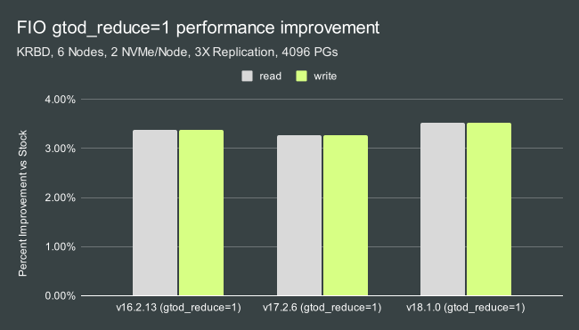

Based on the results, we decided to leave ```gtod_reduce``` disabled so that we could report latency data as well.  Just be aware that about a 3-4% improvement can be had by enabling this FIO option.  Other than that, all other options were either available in CBT or already default in FIO.  As an example, the CBT YAML file's benchmark section contained the following settings for the single-client test:

```
benchmarks:
  fio:
    client_endpoints: 'fiotest'
    op_size: [4096]
    iodepth: [64]
    size: 153600 # data set size per fio instance in KB
    mode: ['randrw']
    rwmixread: 75 
    procs_per_endpoint: [1]
    osd_ra: [4096]
    log_avg_msec: 100
    cmd_path: '/usr/local/bin/fio'
```

This resulted in an FIO line that was similar to the user's but with a couple of differences mostly related to recording iops/latency data over the course of the test:

```
fio --ioengine=libaio --direct=1 --bs=4096 --iodepth=64 --rw=randrw --rwmixread=75 --rwmixwrite=25 --size=153600M --numjobs=1 --name=/tmp/cbt/mnt/cbt-rbd-kernel/0/`hostname -f`-0-0 --write_iops_log=/tmp/cbt/00000000/Fio/output.0 --write_bw_log=/tmp/cbt/00000000/Fio/output.0 --write_lat_log=/tmp/cbt/00000000/Fio/output.0 --log_avg_msec=100 --output-format=json,normal > /tmp/cbt/00000000/Fio/output.0
```

# Single and Multi Client IOPS

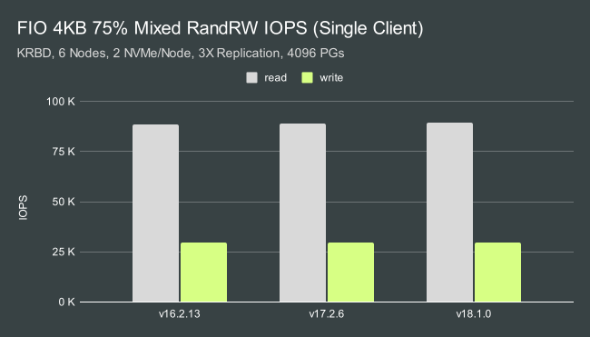 
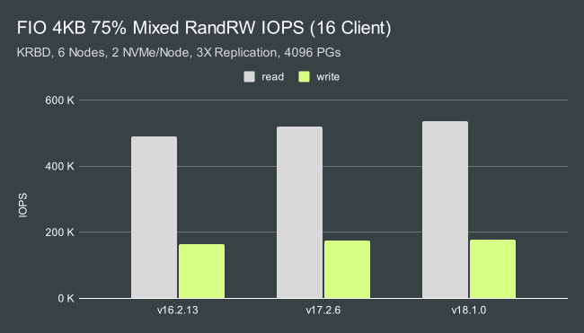    

Not only was Ceph able to achieve 10K IOPS in this mixed workload, it was an order of magnitude faster in the single client test.  We achieved roughly 92K random read and 31K random write IOPs from a single client against this small 12 OSD cluster.  The reason we wanted to run multi-client tests as well however, was to showcase just how much headroom this little cluster has when serving additional clients.  With the same mixed workload and 16 clients, we achieved over 500K random read and around 170K random write IOPs with just 12 NVMe backed OSDs.  In the mutli-client tests, Qunicy and Reef showed roughly a 6% and 9% performance advantage over Pacific respectively.  Enabling ```gtod_reduce``` improves performance by another 3-4%.

# Single and Multi Client CPU Usage

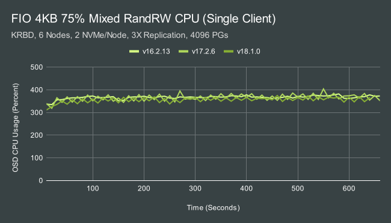    
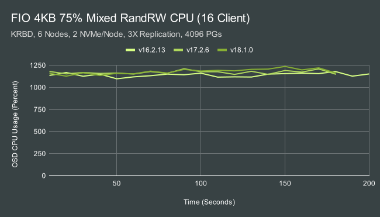

A common issue we see at Clyso with pre-existing NVMe backed Ceph clusters is that the CPUs are undersized for the NVMe drives.  To serve that single client workload, each OSD is consuming roughly 3-4 AMD EPYC cores.  To serve the multi-client workload, each OSD consumes rouhgly 11-12 cores!  IE even with just 2 OSDs per node, a 24 core EPYC processor is needed in each node to achieve the maximum performance with these drives.  Faster drives may require even bigger/faster processors.  What uses all of this CPU?

In my previous [blog post](https://ceph.io/en/news/blog/2022/ceph-osd-cpu-scaling/) about Ceph CPU Scaling, I mentioned that there are 4 main consumers of CPU:

Name | Count
-- | --
OSD Worker Threads | 16
Async Messenger Threads | 3
Bluestore KV Sync Thread | 1
Bluster "Finisher" Thread | 1
<br>

In some cases, RocksDB compaction threads can also periodically use CPU resources.  The BlueStore KV Sync thread can easily become a bottleneck for small random writes, especially when using lower clocked CPUs.  Overall CPU consumption however, is primarily the result of work done in the OSD worker and Async messenger threads.  This is a combination of crc checks, encoding/decoding, memory allocations, etc.

# Single and Multi Client Cycles/OP

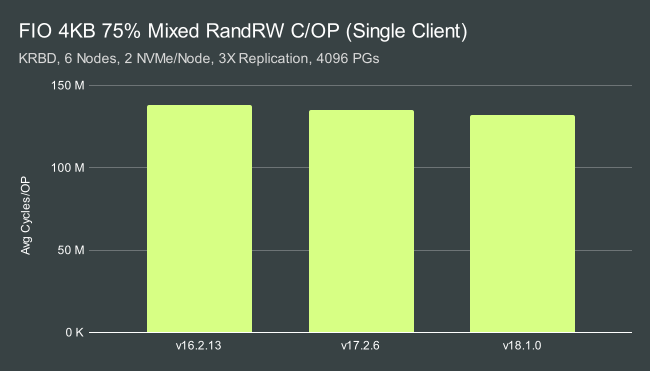 
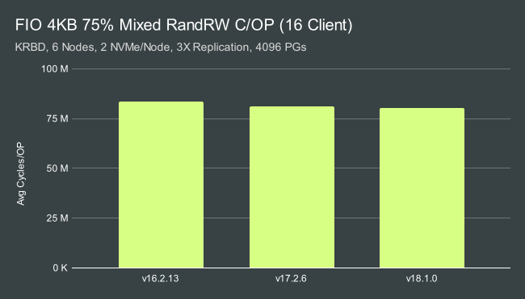

In both single and multi client tests, efficiency appears to have improved slightly from release to release which is great.  A more interesting take-away however is that we are far more efficient at processing data under heavy load in the multi-client tests vs low-load in the single-client tests.  Why is this the case?  In the previous section we discussed how the the majority of the work in the OSD is done by the OSD worker and async messenger threads.  When a new IO is recieved by an OSD, it is first processed and moved into user space by an async messenger thread that is associated with the corresponding network connection.  It is then placed into a scheduler workqueue for a given OSD shard.  If the queue was previously empty, all threads associated with that shard wake up and don't go back to sleep until the shard's workqueue is empty.  When only 1 client is performing IO there is significantly less load on the cluster, and the per-shard queues will often be empty for short periods of time.  Threads will constantly wake up and go back to sleep.  When the cluster is heavily loaded, the queues are more likely to have work to do so the threads spend less of their time sleeping and waking up. Instead, they spend more of their time doing actual work.  This is one of the areas [Clyso](https://clyso.com) is actively working on improving the ceph-osd code.

# Single and Multi Client Average Latency

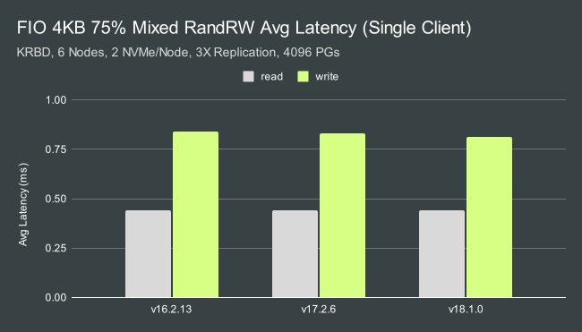
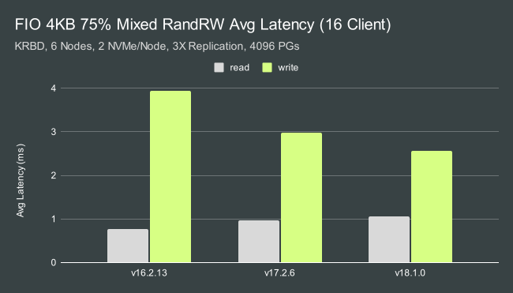

Ceph was able to maintain sub-millisecond average latency for both reads and writes in the single-client test.  In the multi-client test, we saw different behavior between Pacific, Quincy, and Reef.  Pacific showed the lowest read and highest write latency, while Reef showed a small increase in read latency but dramatically lower write latency.  Quincy's behavior was somewhere in the middle, but closer to Reef than Pacific.

# Single and Multi Client 99.9% Latency

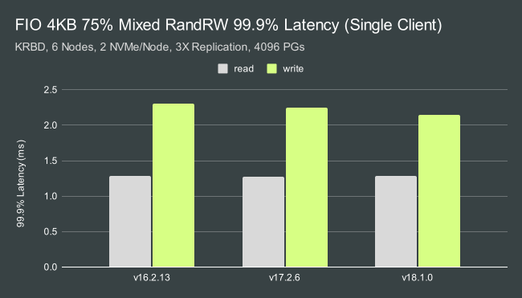
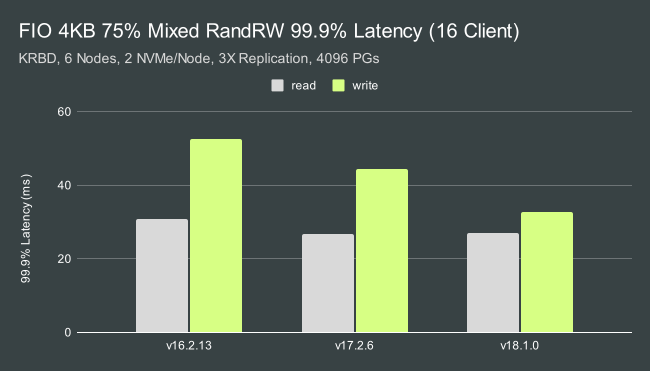

99.9% Latency is, as expected, a little higher.  We can achieve just under 1.3ms for reads and around 2.1-2.3ms for writes depending on the release.  Tail latency in the multi-client test is significantly higher, however Quincy and especially Reef show dramatically lower write tail latency than Pacific in this test.

# Conclusion

So how did we do in the end?  The goal was to reach 10K IOPS in this mixed read/write FIO workload with 75% reads and 25% writes.  I'll assume that means that the goal was 7500 read IOPs and 2500 write IOPS.  Let's compare how we did:

Single-Client IOPS:

Release | Read Goal | Read IOPS | Improvement | Write Goal | Write IOPS | Improvement
-- | -- | -- | -- | -- | -- | --
v16.2.13 | 7500 | 88540 | <b>11.8X</b> | 2500 | 30509 | <b>12.2X</b>
v17.2.6 | 7500 | 89032 | <b>11.9X</b> | 2500 | 30644 | <b>12.3X</b>
v18.1.0 | 7500 | 89669 | <b>12.0X</b> | 2500 | 30940 | <b>12.4X</b>
<br>

And just for fun...Multi-Client IOPS:

Release | Read Goal | Read IOPS | Improvement | Write Goal | Write IOPS | Improvement
-- | -- | -- | -- | -- | -- | --
v16.2.13 | 7500 | 490773 | <b>65.4X</b> | 2500 | 163649 | <b>65.5X</b>
v17.2.6 | 7500 | 521475 | <b>69.5X</b> | 2500 | 173887 | <b>69.6X</b>
v18.1.0 | 7500 | 535611 | <b>71.4X</b> | 2500 | 178601 | <b>71.4X</b>
<br>

Yes, I do believe we've beaten the challenge!  I also suspect that with faster NVMe drives the results could be improved further (these are value oriented enterprise grade drives from several years ago!).  Perhaps some enterprising reader here will take the challenge a deliver even higher Ceph results?  I can't wait to find out!  Thank you for reading, and if you have any questions or would like to talk more about Ceph performance, please feel to [reach out](mailto:mark.nelson@clyso.com).
