# Abstract

The Ceph community recently froze the upcoming Reef release of Ceph and today we are looking at Reef's RBD performance on a 10 node, 60 NVMe drive cluster.  After a small adventure in diagnosing hardware issues (fixed by an NVMe firmware update), Reef was able to sustain roughly **71GB/s** for large reads and **25GB/s** for large writes (75GB/s counting replication).  For small random IO, Reef delievered roughly **4.4M random read IOPS** and **800K random write IOPS** (2.4M counting replication).  For small 4K sequential syncronous writes, Reef acheived **sub 0.5ms average latency, sub 0.5ms 99% latency, and sub 0.8ms 99.9% latency**.  It also achieved under 8ms maximum latency despite performing 3x syncronous replication on commodity hardware.  While Reef is generally as fast or faster than Quincy, we did detect one small potential regression masked by other improvements we made.  During the Reef freeze, we will be investigating regressions like this to help make Reef the best release of Ceph yet.

# Introduction

Over the last couple of Ceph releases, both the upstream Ceph community and Red Hat's perf and scale team have run a variety of performance tests to compare previous releases with our new pre-release code.  We want to confirm the gains we expect to see and verify that we haven't introduced any last minute regressions.  This has been a big win for us during both the Pacific and Quincy release cycles.  Prior to both releases, we were able to bisect regressions and ultimately [fix issues](https://github.com/ceph/ceph/pull/45884) before the release that would have negatively impacted performance.

Unfortunately, catching subtle performance issues is quite complicated and becomes more complicated when you try to compare results that were gathered in the past to fresh results.  What might have changed?  Are regressions due to changes in the code, changes in the hardware/software stack, or something else?  Performance-CI can be useful here for trying to catch issues as they happen, but it's incredibly resource intensive and easy to misinterpret unless you are careful.  Today, we'll just be looking at a suite of simple tests comparing Quincy and Reef, but attempting to do it the exact same way, on the exact same hardware, with as few differences as possible.  It turns out there's a fairly interesting twist this time, but we'll get to that soon.

# Acknowledgements

First, thank you to my friends and colleagues at [Clyso GmbH](https://www.clyso.com) for encouraging me to continue as the upstream Ceph performance lead and for supporting the creation of articles like this for the community's benefit.  Thank you as well to [IBM](https://ibm.com)/[Red Hat](https://redhat.com) and [Samsung](https://samsung.com) for providing the upstream Ceph community with the hardware used for this testing.  Finally, thank you to all of the Ceph developers that have worked tirelessly to bring us another great release of Ceph!

# Cluster Setup 

Nodes | 10 x Dell PowerEdge R6515
-- | --
CPU | 1 x AMD EPYC 7742 64C/128T
Memory | 128GiB DDR4
Network | 1 x 100GbE Mellanox ConnectX-6
NVMe | 6 x 4TB Samsung PM983
OS Version | CentOS Stream release 8
Ceph Version 1 | Quincy v17.2.5 (built from source)
Ceph Version 2 | Reef 9d5a260e (built from source)

All nodes are located on the same Juniper QFX5200 switch and connected with a single 100GbE QSFP28 link.  Ceph was deployed and fio tests were launched using [CBT](https://github.com/ceph/cbt/).  Unless otherwise noted, Each node was configured to host 6 OSDs and had 6 colocated fio processes using the librbd engine.  An important OS level optimization on Intel systems is setting the tuned profile to either "latency-performance" or "network-latency".  This primarily helps by avoiding latency spikes associated with CPU C/P state transitions.  AMD Rome based systems do not appear to be as sensitive in this regard, and I have not confirmed that tuned is actually restricting C/P state transitions, however the tuned profile was nevertheless set to "network-latency" for these tests.

# Testing Setup

CBT was configured to deploy Ceph with a couple of modified settings versus stock.

Primarily, rbd cache was disabled, each OSD was given an 8GB memory target, and msgr V2 was used with cephx disabled.  Fio was configured to first pre-fill RBD volumes with large writes, followed by 3 iterations of tests (shown in the table below) at iodepth=128 for 5 minutes each.  6 fio processes per node were utilized for a total of 60 fio processes and an aggregate iodepth of 7680.  Certain background processes, such as scrub, deep scrub, pg autoscaling, and pg balancing were disabled.  An RBD pool with a static 16384 PGs (higher than typically recommended) and 3x replication was used with 1 RBD image per fio process.

IO Size | Read | Write | RandRead | RandWrite 
-- | -- | -- | -- | --
4096 | X | X | X | X
131072 | X | X | X | X
4094304 | X | X | X | X

# Initial Misleading Results 

On anything larger than a single-OSD clusters, Ceph places data determinsitically in a pseudo-random fashion using crush.  While high PG counts and/or PG balancing can help improve this, there are always going to be temporal hotspots and some OSDs enevitably take longer to do their work than others.  Aggregate, long term cluster performance is thus often limited by the slowest or most heavily utilized OSD at any given point in time.  This is a lesson that every Ceph operator learns and periodically relearns, myself included.  Why am I bringing this up now?  After the Reef freeze I resurrected the CBT configuration I had used for Quincy testing and got to running a new set of tests.  The initial results looked pretty good. Quincy performance was a little lower than expected, but not too far off from what we saw [previously](https://ceph.io/en/news/blog/2022/rocksdb-tuning-deep-dive).  Once I got to Reef though, the results started to look a little unexpected.

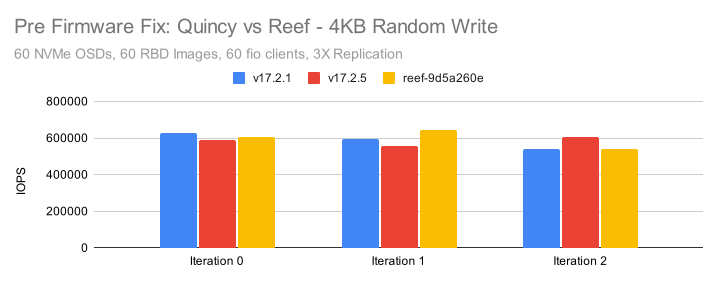

Reef is using the new RocksDB tunings that were tested in the [RocksDB Tuning Deep Dive](https://ceph.io/en/news/blog/2022/rocksdb-tuning-deep-dive).  We saw significantly better gains there when those tunings were paired with Quincy and we expected to see similar gains for Reef.  In these tests, Reef is performing no better than Quincy and in fact not much better than Pacific.  I confess that I ended up running quite a few tests trying to tease out any patterns or issues that might explain the discrepancy.  At some point (far later than it should have occured) I realized that I should probably start looking at system metrics.  CBT runs a copy of collectl for every single test and records a huge amount of system metric data.  In fact between the RBD and RGW tests that were run, CBT recorded over 20GB worth of metrics data over the course of many hours of testing. I got to work and ended up looking at the underlying device behavior for every NVMe drive in the system.  I started noticing a pattern.  nvme4 in the the 10th cluster node was showing high device queue wait times in many of the write tests, but not in the read tests.  Once I looked at 4KB random writes, the effect became obvious:

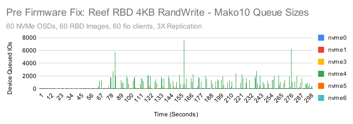
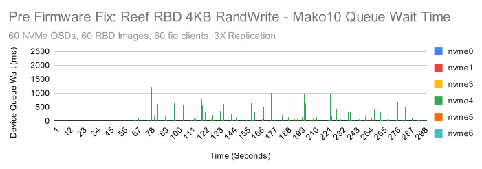

Yikes!  Those are pretty intense latency spikes on nvme4 and almost certainly related to the poorer than expected performance.  This drive was by far the worst offender, but some of the drives in the other nodes were showing higher than expected device latency as well.  My first thought was that I could simply do a full secure erase of every drive, assuming that fragmentation might be the issue.  I remembered though, that back during the Quincy release I had gotten a new firmware image from Samsung.  It didn't seem to help with the issue we were facing at the time, but Samsung thought that it might help improve performance overall.  I went back and installed it on Mako10 and the results were immediately noticeable.

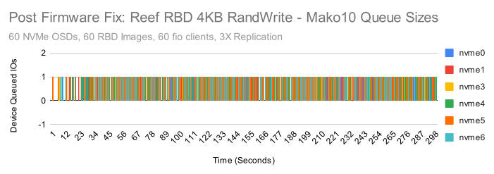
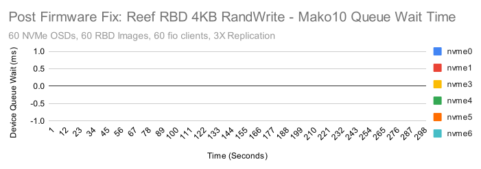

After the firmware upgrade, the device queue never has more than a single IO waiting and queue wait times are never anything other than 0ms.  It appears that the firmware update is a win, but is it a permanent fix?  We'll need to watch the state of the hardware as time goes on to make sure.  For the purposes of this testing however, it appears we are back in business.  How much did performance improve?  The firmware update primarily helped in 4KB and 128KB random write tests.

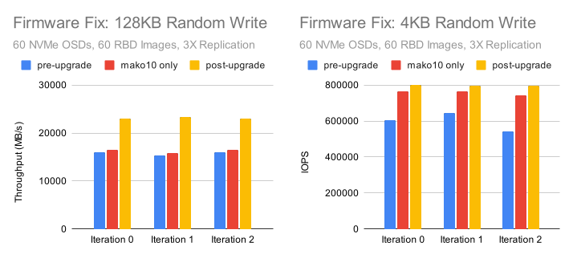

Performance is now back to roughly what was observed last fall in the RocksDB tuning tests.  More importantly, the small random IO tests are showing very consistent NVMe drive behavior.  Good enough, that it was time to rerun the tests and do some comparisons.

# 4MB Sequential Throughput

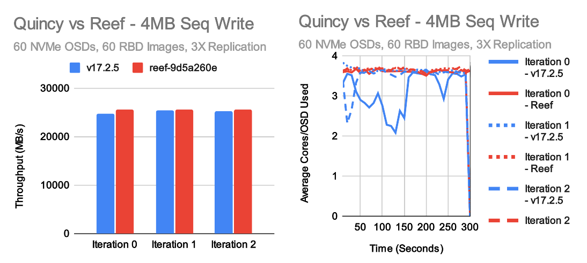
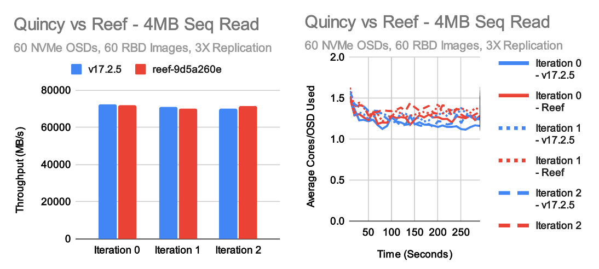

In large throughput tests, Quincy and Reef achieve roughly the same level of performance.  Reef may be a little faster for large writes and a little slower for large reads.  In both cases, the underlying cluster is able to perform at about 70-75GB/s, though because we are doing 3X replication the client visible write throughput is actually around 25GB/s.  Average per-OSD CPU consumption hovers around 1-1.5 cores for reads and 3-4 cores for writes in these tests.  The disparity is pretty typical as Ceph's write path does more work than the read path.

# 4KB Random IOPS

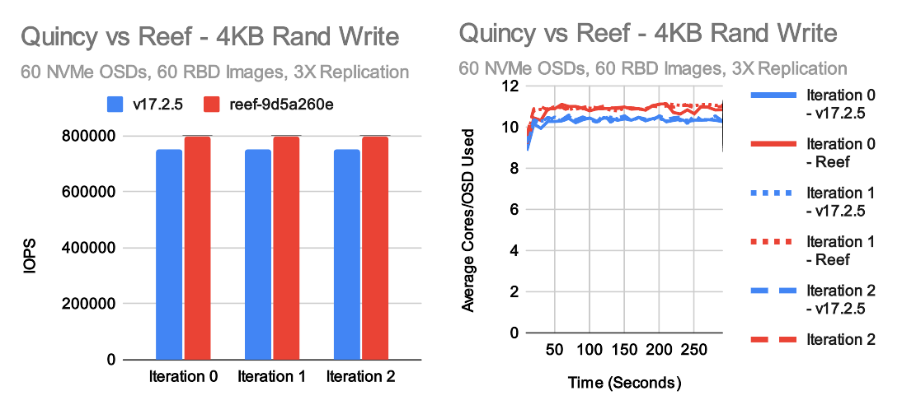
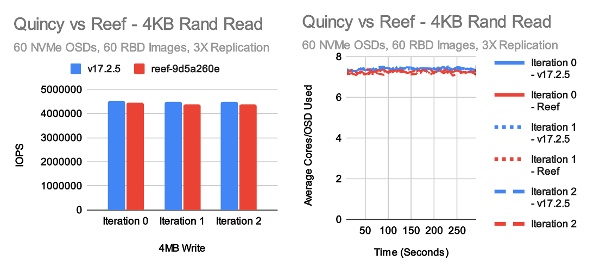

The most exciting tests for me every release are the small random IO tests.  These tests really stress the OSD and showcase whether or not we've kept the IO pipeline efficient.  In this case, we have generally positive results with a couple of caveats.  Reef is just a tiny bit slower than Quincy in 4K random reads, but it's pretty close. On the other hand, we're now consistently seeing a moderate improvement in 4K random write tests, primarily due to the new RocksDB tuning that was introduced.  Interestingly though, we're not seeing as big of a performance gain as expected based on the results from last fall.  CPU usage hovers a little over 7 cores per OSD in random read tests and nearly 11 cores per OSD for Reef in random write tests.  This appears to be fairly proportional to the higher performance vs Quincy.  One interesting aspect of increasing small random write performance in Ceph is that the kv_sync_thread is often a bottleneck when testing on NVMe with unlimited CPU resources, but the consumption of CPU primarily happens in the OSD worker and messenger threads which can easily become a bottleneck in CPU limited scenarios.  Thus, maximuming write performance is a tricky balance between OSD count, NVMe speed, core count, and core speed.

Random write performance is higher in Reef than Quincy which is great, but it's not as high as we were hoping.  Why is that?  There are two additional tests that might provide clues.  Right before we froze Reef, we upgraded to the newest version of RocksDB due to several significant bug fixes and improvements versus the much older version we are using in Quincy.  We can simply revert that change and see how well Reef does.  We also can run Quincy with the RocksDB tunings that we now are using as standard in Reef to see how much that improves Quincy performance.

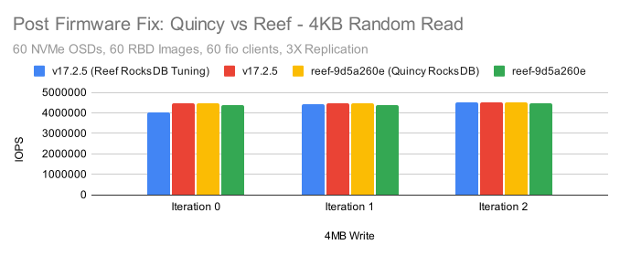

Except for a particuarly slow run on v17.2.5 with the Reef tuning, the numbers are pretty close.  There does appear to be a consistent, though small (~2%) performance gain when Reef is compiled using the older Quincy version of RocksDB.  Quincy and Reef compiled with the same version of RocksDB are neck and neck.

In the Random write case, we see two very interesting results.  One: When Quincy is compiled with the new RocksDB tuning defaults, it's actually faster than Reef regardless of which version of RocksDB it's using.  Two: Reverting to the old version of RocksDB does result in a performance gain, but again it's quite small (~1-2%).  It can't fully account for the regression seen when Quincy and Reef are both using the new RocksDB tunings.  The end result of this is that there is very likely a small regression in Reef impacting small random writes.

# 4KB Sequential Sync Write Latency

Over the past year, I've gotten a lot of questions about write latency in Ceph.  Can Ceph do sub-millisecond writes?  What kind of tail latency do we see?  We've tested this in the past, but I decided to include a quick set of 4K synchronous sequential write test here as well.  There are some caveats.  This is on a fresh cluster with a lot of free space and virtually zero fragmentation.  There's only 1 client doing writes with an io_depth of 1.  It's pretty much an ideal showcase to present Ceph's **potential** for low latency.  It doesn't necessarily reflect what the real average or tail latency would look like on a heavily used cluster with active traffic and existing fragmentation.  Having given that disclaimer, how did we do?

Metric | O_DSYNC Quincy | O_SYNC Quincy | O_DSYNC Reef | O_SYNC Reef
-- | -- | -- | -- | --
Average Latency (ms) | 0.417 | 0.416 | 0.421 | 0.418
99% Latency (ms) | 0.465 | 0.461 | 0.465 | 0.469
99.9% Latency (ms) | 0.741 | 0.733| 0.750 | 0.750
Max Latency (ms) | 7.404 | 6.554 | 7.568 | 6.950

In both cases Quincy and Reef are able to write the vast majority of IOs at sub 0.5ms latency.  CBT saves the fio latency graphs for each run, so we can look at those as well:

Overall the results are pretty consistent with only a couple of outliers.  One caveat here is that there may not be much difference between using the O_SYNC and O_DSYNC flags when testing librbd in fio.  I reached out to Ilya Dryomov (Ceph's RBD lead) to get his thoughts.  He confirmed that neither librbd or kernel RBD care as those flags are handled at the VFS layer.  We should however, only seek acknowledgement from the OSDs after these writes have fully persistsed on all participating OSDs.  In any event, performance appeared to be pretty equivalent across all runs.

On review of this blog post, Dan van der Ster (Thanks Dan!)  remarked that it would also be useful to highlight the network latency involved when doing these single-client,  io_depth=1 tests.  I very unscientifically went back and ran some ping tests between different nodes in the cluster.  A couple of caveates: ping is ICMP and not TCP, and ping is also round-trip.

Ping from mako01 to mako10 (100GbE interface):

icmp_seq | Latency (ms)
-- | --
1 | 0.039 ms
2 | 0.025 ms
3 | 0.032 ms
4 | 0.029 ms
5 | 0.034 ms
6 | 0.027 ms
7 | 0.026 ms
8 | 0.026 ms
9 | 0.028 ms
10 | 0.032 ms

In the read case, with replication, and when testing with RBD, Ceph is performing round-trips only from the client to the primary OSDs.  In the write case, Ceph must do multiple round trips.  1 between the client and the primary, and 1 between the primary and every secondary in parallel.  In write tests, we should expect somewhat worse than the average network latency of 2 round trips of contributing overhead.  Network latency is thus likley playing a significant (though perhaps not dominating role) in these small synchronous write tests.  There is still room to improve synchronous write latency in Ceph itself, however network latency is at this point a valid concern and will become an even bigger factor as Ceph itself improves.

# Conclusion

This post ended up being as much about the adventure of dealing with underlying hardware performance and firmware updates as looking at Reef.  Understanding the behavior of the underlying hardware is critical when benchmarking, and I would have missed some interesting behavior (and higher write IOPS!) if we hadn't first upgraded the firmware on all of the SSD drives.  This is a friendly reminder to all would-be benchmarking enthusiasts to make sure your firmware is up to date and your hardware is behaving well before spending a day running tests.

Once the hardware was in better shape,  Quincy and Reef showed fairly comparable performance.  Both achieved roughly 71GB/s for large reads and 25GB/s for large writes with 3X replication.  Both also acheived similar 4KB random read performance at about 4.4-4.5M IOPS.  Reef was about 6-7% faster at small random writes than Quincy primarily due to the new RocksDB tunings, however we expected it to be a little faster.  It appears that there may be a regression that is limiting Reef from achieving even higher performance.  We'll be investigating that potential regression during the Reef freeze and continue working to make Reef the best Ceph release yet!

Thank you for reading, and if you have any questions or would like to talk more about Ceph performance, please feel to [reach out](mailto:mark.nelson@clyso.com).
