# Abstract

The Ceph community recently froze the upcoming Reef release of Ceph and today we are looking at Reef's RGW performance and efficiency on a 10 node, 60 NVMe drive cluster.  We deployed 20 RGW instances and 200 hsbench S3 clients to execute highly parallel workloads across 512 buckets.  Reef was typically about 1-5% faster than Quincy in most tests.  It achieved roughly 53GB/s for 4MB GETs and 18.6GB/s for 4MB PUTs at 3X replication.  We suspect in both cases we were either at, or close to, the network saturation point.  Reef also achieved around 312K 4KB GET/s and 178K 4KB PUT/s also at 3X replication.  In large object tests CPU usage was equivalent between the releases. In 4KB PUT and GET tests however, Reef used up to 23% more CPU resources than Quincy.  This is something that we will be looking at closely as the Reef release approaches and may need to bisect to understand the cause.  Finally, we note that there is a significant skew in aggregate CPU usage between OSDs and RGW depending on the kind of workload being run.  This can have a big effect on hardware purchasing and deployment decisions and we hope that this post will help provide some guidance on that topic.

# Introduction

In [part 1](https://ceph.io/en/news/blog/2023/reef-freeze-rbd-performance/) of this series, we looked at how a tool called [CBT](https://github.com/ceph/cbt) could be used to understand how RBD performance has changed between multiple releases of Ceph.  In part 1, CBT utilized Jens Axboe's very well known [fio](https://github.com/axboe/fio) tool to run workloads against RBD images.  CBT can also utilize S3 benchmarking tools to test RGW.  In previous releases of Ceph, we've used this capability to great effect to catch performance regressions.  Combining CBT, the [hsbench](https://github.com/markhpc/s3bench.git) S3 benchmark, and git bisect enabled us to identify two separate commits that hurt RGW performance and efficiency in the Ceph Pacific release.

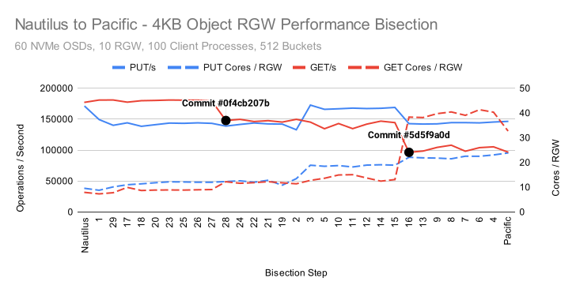

Once those commits were identified, Ceph's excellent RGW team was able to create fixes that brought performance and CPU usage back in line with what we saw in Nautilus.  In this article we won't be performing any bisection analysis, but we will use the same tools to look at how the Reef feature freeze is shaping up for S3 workloads.

# Acknowledgements

As always, thank you to my friends and colleagues at [Clyso GmbH](https://www.clyso.com) for the encouragement and support when creating articles like this for the community's benefit.  Thank you as well to [IBM](https://ibm.com)/[Red Hat](https://redhat.com) and [Samsung](https://samsung.com) for providing the upstream Ceph community with the hardware used for this testing.  Finally, thank you to all of the Ceph developers that have worked tirelessly to bring us another great release of Ceph.  Today, I especially want to thank the RGW development team for their hard and tireless work over the many years we've been working on Ceph.  Your work hasn't just made RGW better.  It has made Ceph better as a whole.

# Cluster Setup 

Nodes | 10 x Dell PowerEdge R6515
-- | --
CPU | 1 x AMD EPYC 7742 64C/128T
Memory | 128GiB DDR4
Network | 1 x 100GbE Mellanox ConnectX-6
NVMe | 6 x 3.84TB Samsung PM983
OS Version | CentOS Stream release 8
Ceph Version 1 | Quincy v17.2.5 (built from source)
Ceph Version 2 | Reef 9d5a260e (built from source)

All nodes are located on the same Juniper QFX5200 switch and connected with a single 100GbE QSFP28 link.  Ceph was deployed and fio tests were launched using [CBT](https://github.com/ceph/cbt/).  Each node was configured to host 6 OSDs and had 2 colocated RGW daemons.  For all tests, a ratio of 3 OSDs to 1 RGW daemon was maintained.  An important OS level optimization on Intel systems is setting the tuned profile to either "latency-performance" or "network-latency".  This primarily helps by avoiding latency spikes associated with CPU C/P state transitions.  AMD Rome based systems do not appear to be as sensitive in this regard, and I have not confirmed that tuned is actually restricting C/P state transitions, however the tuned profile was nevertheless set to "network-latency" for these tests.

# Testing Setup

CBT was configured to deploy Ceph with a couple of modified settings versus stock.  Each OSD was given an 8GB memory target, and msgr V1 was used with cephx disabled.  No special tuning of RGW was performed.  The [hsbench](https://github.com/markhpc/hsbench.git) benchmark was used for S3 testing.  Each node had 20 hsbench process started, each connecting to a distinct RGW instance.  Thus, every RGW process has an associated hsbench process connecting to it from every node (200 hsbench processes total).  Each hsbench process was configured to use 64 threads and target 512 buckets using a common bucket prefix.  Certain background processes, such as scrub, deep scrub, pg autoscaling, and pg balancing were disabled.  3X replication was used across all RGW pools.  The data and index pools were each given 8192 PGs, while the root, control, meta, and log pools were given 64 PGs each.  Two separate test suites were run for quincy and reef with 2 Million 4MiB objects and 200 Million 4KiB objects respectively.  Tests in each suite were run in the following order:

Test | Description
-- | --
cxi | Clear all existing objects from buckets, delete buckets, initialize buckets
p | Put objects into buckets
l | List objects in buckets
g | Get objects from buckets
d | Delete objects from buckets 

# 4MB PUT

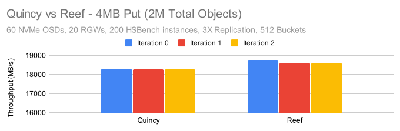
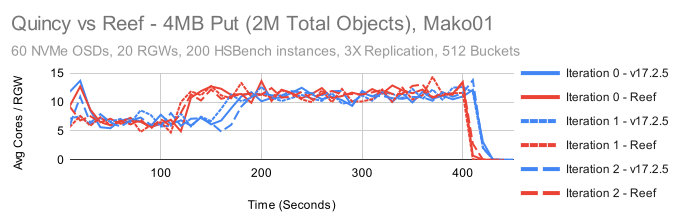
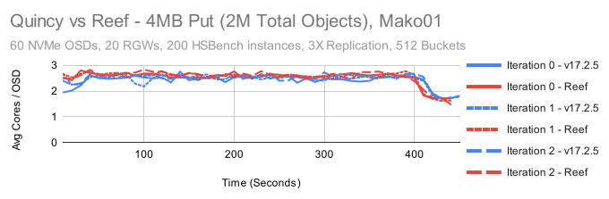

Reef is ever so slightly faster than Quincy, maintaing about a 2% lead across all three test iterations.  CPU Usage by the RGW and OSD processes are similar in both tests.  Surprisingl, both Quincy and Reef show a period where RGW CPU usage hovers around 5 cores, then doubles to 10 cores roughly 2-3 minutes into the test.

In [Part 1](https://ceph.io/en/news/blog/2023/reef-freeze-rbd-performance/) of this series, we looked at 4MB sequential write throughput and saw that with librbd, we could maintain about 25GB/s (75GB/s with replication).  Why is it that we are seeing only around 18.5GB/s for 4MB PUTs here?  A big part of the reason is that we are transfering the data twice.  Once from the client to RGW, and then again from RGW to the OSDs.  Because we've created a mesh, some of the transfers will happen to RGW instances or OSDs sitting on the same node.  We also can't ignore replication, as we will always incur at least 2 additional transfers from primary to seconday OSDs that must land on other nodes.

```
Probability of 2 transfers = 1/10 * 1/10 = 1/100
Probability of 4 transfers = 9/10 * 9/10 = 81/100
Probability of 3 transfer = 1 - 1/100 - 81/100 = 18/100
```

The general best case performance we should expect relative to the maximum network throughput is:

```
100 / (2 * (1/100) + 4 * (81/100) + 3 * (18/100)) = 26.31%
```

In the librbd case we always have 3 transfers at 3X replication (1 to the primary, then 1 for each secondary) :

```
100 / 3 = 33.3%
```

Applying our ratios and multiplying we get:

```
25GB/s * 26.31/33.3 = 19.75GB/s
```

It looks like we're doing just slightly worse than RBD, but not too far off once the additional network overhead is taken into account.

# 4MB LIST

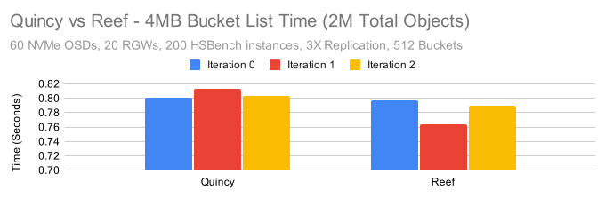

Bucket list times are dominated entirely by the number of objects.  In this case, because we only had 2M objects total spread across 512 buckets, the indivdiual bucket list times were quite short.  Reef was again as fast or slightly faster than Quincy.

# 4MB GET

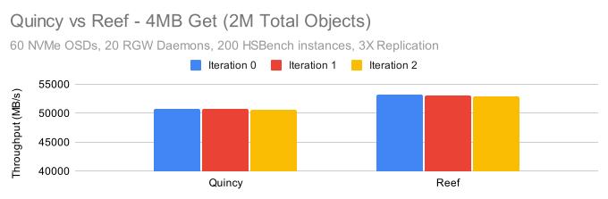
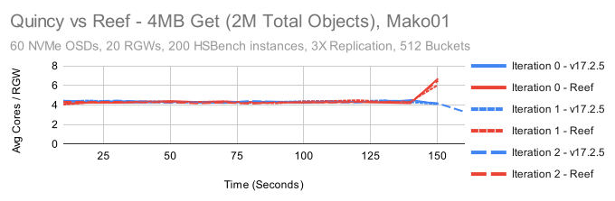
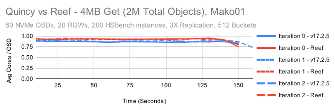

CPU Usage is pretty consistent for both the RGW and OSD processes in this test.  Like in the PUT tests, we must consider the probability of how many times we must transfer data.  Because we are using replication, we will always transfer data only once from an OSD to RGW, then to the client.

```
Probability of 0 transfers = 1/10 * 1/10 = 1/100
Probability of 2 transfers = 9/10 * 9/10 = 81/100
Probability of 1 transfer = 1 - 1/100 - 81/100 = 18/100
```

```
100 / (0 * (1/100) + 2 * (81/100) + 1 * (18/100)) = 55.6%
```

Here we are maintaining about 51GB/s for Quincy and about 53GB/s for Reef.  This is pretty close to the maximum that these 100GbE NICs should be able to deliver.

# 4MB DELETE

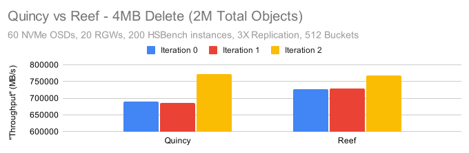

The delete "throughput" numbers here appear to be alarmingly high, however delete performance is primarily governed by the number of objects being deleted rather than by the size of the objects and the actual deletion process is asyncronous.  Having said that, it appears that Reef on average was again slightly faster than Quincy.  Both appear to have a faster deletion rate on the 3rd test iteration.  The reason for this is still unknown.

# 4KB PUT

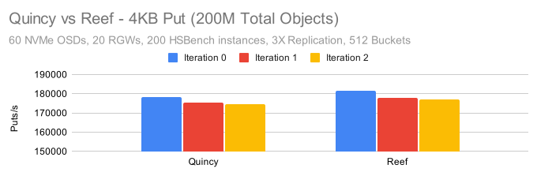
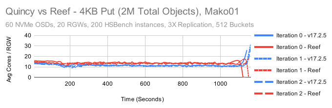
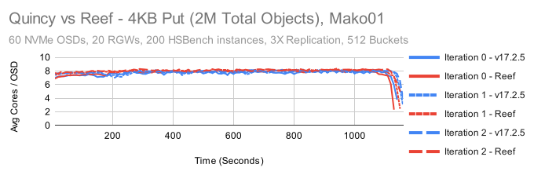

Like in the previous tests, Reef is ever so slightly faster than Quincy.  OSD CPU usage is roughly the same in both, however it appears that RGW CPU usage has gone up by roughly 15%.  On the plus side, in Quincy's RGW saw a dramatic spike in CPU consumption at the end of each test iteration that did not occur in Reef.  One important point here is that both the OSD and RGW are working pretty hard to maintain 180K PUT/s.  RGW requires 3 round trips to the primary OSD (2 syncronous, 1 asyncronous) per PUT operation to properly write the data and keep the bucket index properly syncronized.  For these 4K object workloads that keeps both RGW and the OSDs very busy.

# 4KB LIST

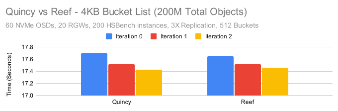

With more objects comes longer bucket list times vs the previous tests.  Reef is just slightly faster in the first iteration, but otherwise Quincy and Reef are neck and neck.

# 4KB GET

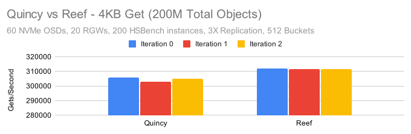
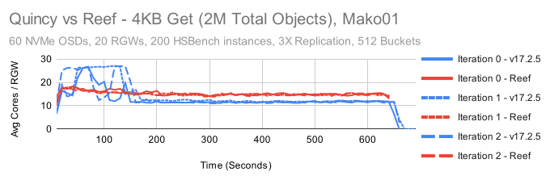
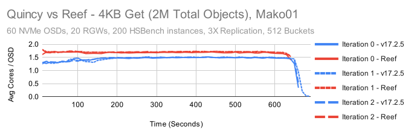

First, get performance is both a little faster and more stable in Reef than it was in Quincy.  Having said that, there are some really interesting behaviors here.  In Quincy, the first 2 minutes of testing are dominated by extremely high CPU usage.  Once that completes, the steady state CPU usage is quite a bit lower than it is in Reef.  OSD CPU usage is likewise lower.  Reef is using about 10-20% more CPU on the RGW side and about 17-23% more CPU on the OSD side in this test. This may ultimately be another regression that we need to bisect and track down.  The good news is that again, Reef's behavior appears to be much more consistent.  While RGW CPU usage is higher at the beginning of the test, it's no where near as high as what occured in the Quincy tests.

# 4KB DELETE

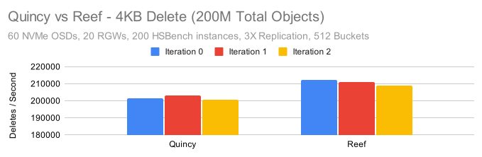

Finally, Reef on average was about 5% faster at deleting 4K objects.  Again, this is an asyncronous process, so the results may not match how quickly RGW can delete things behind the scenes.

# Conclusion

These tests only show a small picture of RGW's performance characteristics.  We didn't have time for this article to look at single-op latencies, or try different client<->rgw topologies to minimize network traffic and push RGW and the OSDs harder.  There's many additional tests that could be run to give us more information.  Despite that, in the tests we did run, we saw two trends.  1) Reef showed anywhere from around 1-5% higher performance than Quincy, and it was fairly consistent across the tests and happened in most test iterations.  2) In some tests, especially the 4K GET tests, Reef showed higher CPU usage than Quincy.  This was more prevalant in the RGW processes but we also saw it in the OSD.  This is something we will likely want to follow up on before Reef is released.

There are a couple of other interesting things to note about these results.  In previous tests we used 10 RGW instances for a 60 NVMe cluster.  In these tests, we used 20 RGW instances and saw significantly higher performance for small object PUT and GET tests vs what we've seen previously.  It's quite possible that increasing the RGW count to an even higher ratio, perhaps 1 RGW instance for every 2 or even every 1 OSD might yield even better small object performance.

The second interesting thing to note is that CPU consumption varied significantly across these tests, and the ratio of CPU consumption between RGW and OSD processes changed too.  If we look at the Reef results and calculate the approximate number of cores used by RGW and OSD, we get:

4MB:
Test | Result | Total RGW Cores | Total OSD Cores | Total Cores | RGW/OSD Core Ratio
-- | -- | -- | -- | -- | --
4MB PUT | 18.6GB/s | 184 Cores | 152 Cores | 336 Cores | 6/5
4MB GET | 53GB/s | 88 Cores | 55 Cores | 143 Cores | 8/5

4KB:
Test | Result | Total RGW Cores | Total OSD Cores | Total Cores | RGW/OSD Core Ratio
-- | -- | -- | -- | -- | --
4KB PUT | 178K IOPS | 269 Cores | 475 Cores | 744 Cores | 11/20
4KB GET | 312K IOPS | 302 Cores | 102 Cores | 404 Cores | 3/1

Beyond understanding the number of cores that were used in these tests, there's another lesson to take from these results.  The idea of running Ceph in containers is very appealing.  Recent versions of Ceph have a huge number of external dependencies and package management can become a pain really fast.  Beyond that, many users have adopted containers for user applications and want to deploy ceph in the same way.  A natural extension of this is that people want to assign Ceph daemons static resource allocations at the container level: A certain amount of memory, and a certain number of cores to run on.  This is where we can run into trouble.  I'll leave the full discussion about memory quotas for another day, but in short:  It's extremely difficult to guarantee memory usage in an application not specifically designed for it.  The best we can do without significant effort is to make Ceph processes watch their mapped memory and auto-adjust non-essential memory usage to compensate.  I should know, I wrote the underlying memory autotuning and cache management code in Ceph.

Restricting core counts generally won't lead to the same kind of problems as restricting memory, but look at the ratio of cores in the 4K object tests.  The spread is nearly 6x between PUTs and GETs in these tests.  If you only optimize for one scenario, you'll either hurt the other or have a lot of excess cores that are idle at different points in time. Perhaps in some future version of Ceph we can spin up or spin down RGW containers on-demand if we need more 4K GET throughput.  For now though, realize that achieving high performance and high efficiency (to the extent that is currently possible) requires a certain level of finesse. 

Thank you for reading, and if you have any questions or would like to talk more about Ceph performance, please feel to [reach out](mailto:mark.nelson@clyso.com).
