Hello Ceph community!  It's time again for another blog post!  One of the most common questions we've gotten over the years is whether or not users should deploy multiple OSDs per flash drive.  This topic is especially complicated because our advice has changed over the years.  Back in the Ceph Nautilus era, we often recommended 2, or even 4 OSDs per flash drive.  There were obvious and significant performance advantages at the time when deploying multiple OSDs per flash device, especially when using NVMe drives.

During the Octopus and Pacific development cycles that started changing.  We introduced several performance improvements in the OSD and BlueStore code (For example [here](https://github.com/ceph/ceph/pull/28597) and [here](https://github.com/ceph/ceph/pull/34363)) that greatly improved per-OSD performance.  As Pacific was nearing completion, we ran a variety of tests to determine whether or not our recommendation should change.

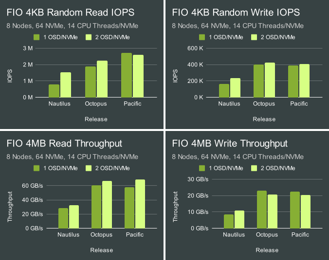

As expected, Octopus and Pacific are significantly faster than Nautilus, but also no longer show a consistent performance gain with 2 OSDs per NVMe versus 1.  Some tests still showed some gains, though others showed slight losses.  These tests however are fairly limited in scope.  Does the availability of CPU resources change the results?  Are there other advantages or disadvantages in terms of performnace or resource consumption?  Finally, we've continued to improve the OSD and bluestore code since Pacific.  Do we see similar behavior today?  Read on to find out!
<br>

# Acknowledgements

First, thank you to [Clyso](https://www.clyso.com) for funding this work to benefit the Ceph community.  Thank you as well to [IBM](https://ibm.com)/[Red Hat](https://redhat.com), [Intel](https://intel.com) and [Samsung](https://samsung.com) for providing the upstream Ceph community with the hardware used for this testing.  Thank you as well to all of the Ceph developers that have worked tirelessly to make Ceph great!
<br>

# Cluster Setup 

Nodes | 10 x Dell PowerEdge R6515
-- | --
CPU | 1 x AMD EPYC 7742 64C/128T
Memory | 128GiB DDR4
Network | 1 x 100GbE Mellanox ConnectX-6
NVMe | 6 x 4TB Samsung PM983
OS Version | CentOS Stream release 8
Ceph Version | Reef v18.2.0 (built from source)
<br>

5 of the nodes were configured to host OSDs and 5 of the nodes were configured as client nodes.  All nodes are located on the same Juniper QFX5200 switch and connected with a single 100GbE QSFP28 link.  Ceph was deployed and FIO tests were launched using [CBT](https://github.com/ceph/cbt/).  An important OS level optimization on Intel systems is setting the TuneD profile to either "latency-performance" or "network-latency".  This primarily helps by avoiding latency spikes associated with CPU C/P state transitions.  AMD Rome based systems do not appear to be as sensitive in this regard, and I have not confirmed that TuneD is actually restricting C/P state transitions on AMD processors.  The TuneD profile was nevertheless set to "network-latency" for these tests.
<br>

# Testing Setup

CBT was configured to deploy Ceph with several modified settings.  Normally when testing Ceph, it's common to think about the number of cores and the amount of memory assigned to each OSD.  In this testing however, it's better to think about how much CPU and Memory is available per NVMe drive.  Each of these systems can confortably support 16GB of memory per NVMe drive, and can scale up to 20 CPU threads per NVMe.  To maintain the correct memory ratio, the `osd_memory_target` was set to 16GB in the 1 OSD/NVMe case and to 8GB in the 2 OSD/NVMe case.  Numactl was utilized to control the number of CPU threads per OSD.  OSDs were assigned to two pools of "processors" in an attempt to scale both physical and HT cores at the same time.   To do this, a processor to physical core map was generated using the following bash one-liner:

```
paste <(cat /proc/cpuinfo | grep "core id") <(cat /proc/cpuinfo | grep "processor") | sed 's/[[:blank:]]/ /g'
```

This showed that processors 0-63 corresponded to physical cores and processors 64-127 corresponded to HT cores.  Next, numactl was invoked to utilize an equal number of physical and HT processors (which for this article we'll refer to generally as CPU threads).  For instance, to assign OSDs to a pool of 12 physical and 12 HT cores (for a total of 24 cpu threads, or 4 threads per NVMe), OSDs were invoked thusly:

```
...numactl --physcpubind=0-12,64-76 /usr/local/bin/ceph-osd
```

Tests were conducted with between 2 and 20 CPU Threads per NVMe drive.  FIO was configured to first pre-fill RBD volume(s) with large writes, followed by 4MB and 4KB IO tests for 60 seconds each.  Certain background processes, such as scrub, deep scrub, PG autoscaling, and PG balancing were disabled.  An RBD pool with a static 16384 PGs (higher than typically recommended) and 3x replication was used.
<br>

# 4MB Throughput 

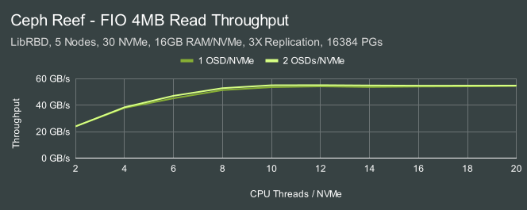 
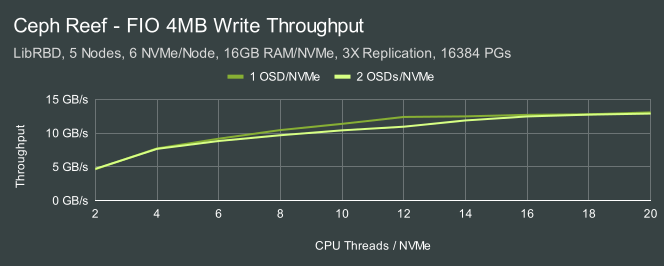    

When I started this testing I wasn't expecting to see a significant performance difference with multiple OSDs per NVMe device for large IO workloads.  For reads, the difference is fairly small, though the 2 OSD configuration showed a fairly consistent small advantage.  For writes however, I was surprised to observe that there was a moderate throughput slump that peaked at 12 CPU threads per NVMe versus the single OSD configuration.

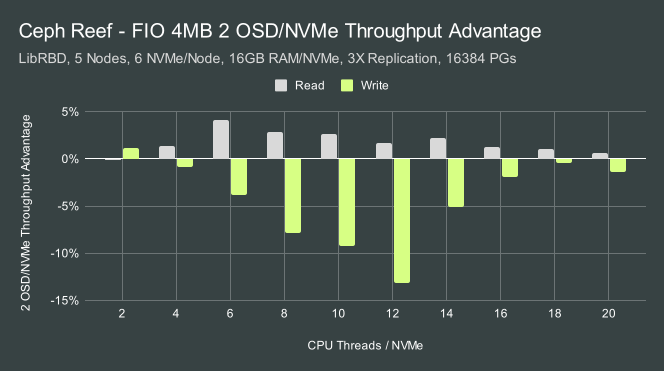

These were short running tests, but the cluster was recreated at every CPU count sample point and we see a clear trend over multiple samples.  The effect is likely to be real and appears to match the behavior we saw in Octopus and Pacific where 4MB Write throughput was actually lower in the 2 OSD/NVMe configuration.  Unfortunately I do not yet have an explanation for this behavior.
<br>

# 4KB Random IOPS

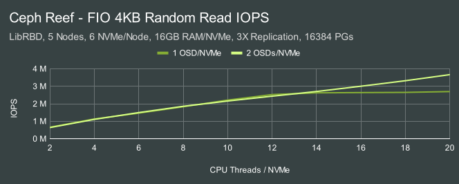
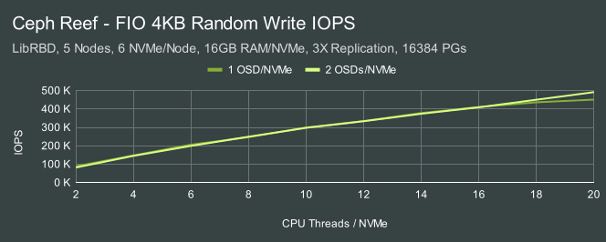
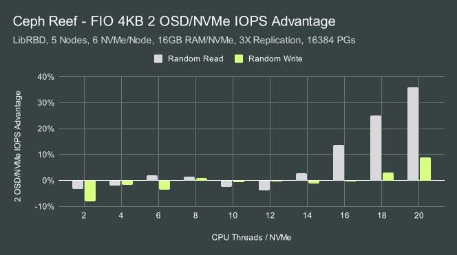

With Nautilus we saw a significant advantage with 2 OSDs/NVMe in both 4KB random read and random write tests.  On the same hardware, same OS, same kernel version, and running the exact same tests, we saw different behavior with Octopus and Pacific.  We no long have the same hardware or OS available for these Reef tests, but the behavior we do see looks much closer to what we saw in Pacific on our previous test platform.  There is no particular IOPS advantage to deploying 2 OSDs on each NVMe drive unless you have 16 CPU threads per NVMe drive or more.  In fact for deployments that have 2-4 CPU threads per NVMe, there's a slight IOPS hit.  There's a couple of immediate takeaways from this testing:

* With the default tunings, OSDs don't scale much past about 14-16 CPU threads each.
* Random Reads benefit from multiple OSDs more than random writes at high CPU thread counts.
* At low CPU thread counts running multiple OSDs per NVMe adds some amount of additional overhead.

But IOPS isn't the only factor to consider.  What about latency?  What about resource consumption?
<br>

# 4KB Random Latency

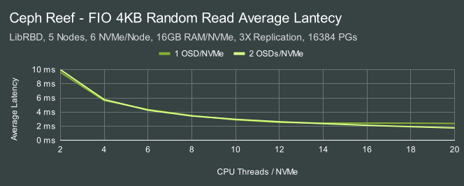
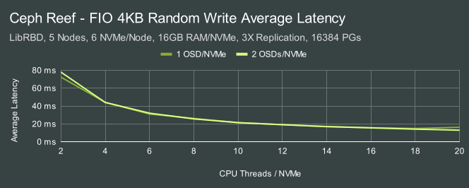

In these tests we have 50 fio client processes running with an io_depth of 128 each.  Ceph can achieve significantly lower average latency, but in this case we are saturating the OSDs to the point where we are completely CPU bound.  Latency in this case is directly proportional to IOPS.

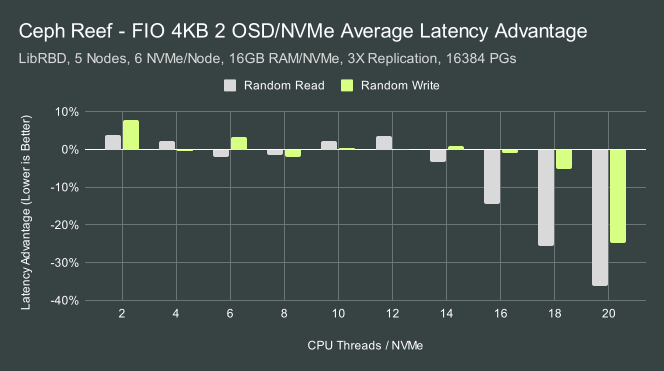

The average latency reduction follows a similar pattern to what we saw with IOPS.  Average latency is slightly worse (higher) at low CPU thread counts with 2 OSDs per NVMe, but significantly better (lower) at very high CPU thread counts.
<br>

# 4KB Random 99% Tail Latency

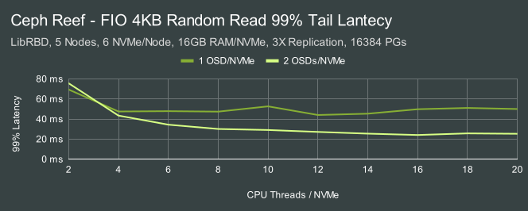
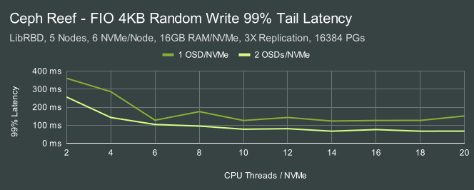

So far we haven't seen strong evidence that deploying multiple OSDs per NVMe is a significant advantage except at very high CPU thread ratios.  There is one case though where we still see a significant advantage.  Running multiple OSDs per NVMe consistently reduces tail latency in almost all cases.

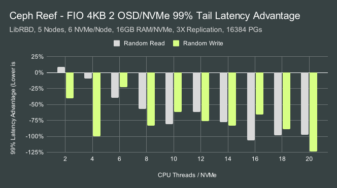

The improvement in 99% Tail latency is dramatic, in some cases running 2 OSDs per NVMe reduces 99% latency to half.  While not shown here, the improvement for 99.9% latency is even better.  While for most Reef deployments running with multiple OSDs per NVMe may not show a signicant performance advantage, it may show a significant tail latency advantage.  But...Is there a cost?
<br>

# 4KB Random CPU Usage

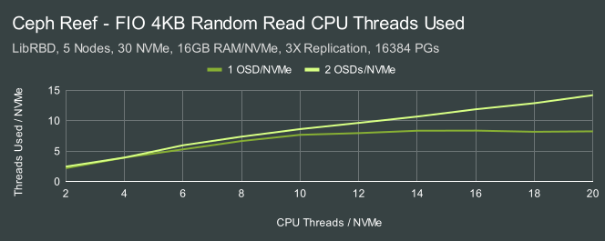
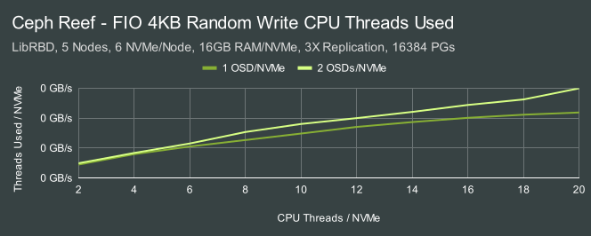
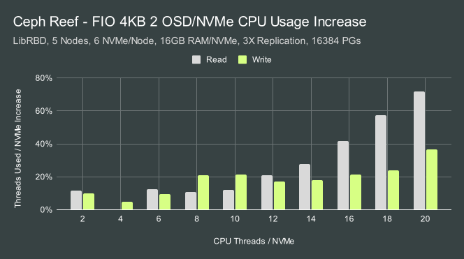

Despite restricting OSDs to only using a certain number of CPU threads via numactl, the 2 OSD per NVMe configuration consistently used more CPU than the 1 OSD per NVMe case.  Let's look further at how this translates into CPU Efficiency.


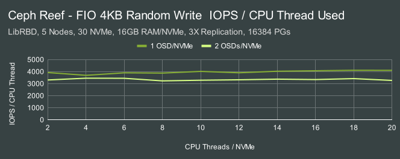
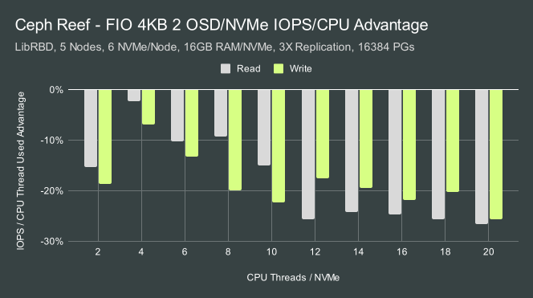

We saw previously that both OSD configurations performed similarly up to around 16 CPU Threads.  After that, the 2 OSDs per NVMe configuration continued to scale while the single OSD configuration topped out.  We also saw that 2 OSD per NVMe configurations had significantly lower tail latency.  Here we are seeing that each CPU thread is working harder in the 2 OSDs per NVMe configuration to achieve the same IOPS despite those other advantages.  That potentially could lead to higher power consumption and greater heat generation.  One note: The random write results reported here factor replication in to match the results we published last fall for Pacific [here](https://ceph.io/en/news/blog/2022/ceph-osd-cpu-scaling/).  While the test configuration is not exactly the same as it was last fall, it appears we are acheiving a moderate efficiency improvement in these Reef tests.
<br>

# 4KB Random Memory Usage

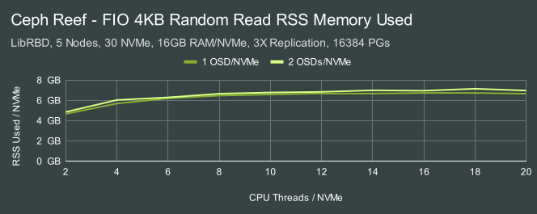
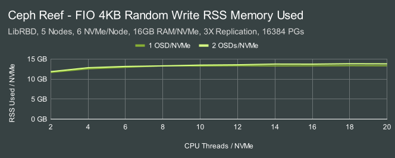
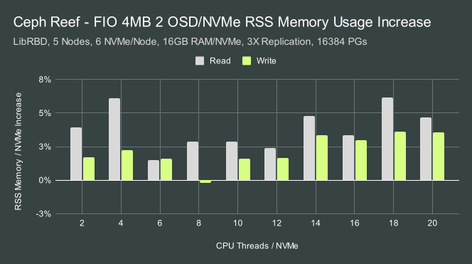

While CPU usage in the 2 OSDs per NVMe case increased significantly, the memory usage increase is comparatively small.  Typically there is about a 3-6% penalty versus using 1 OSD per NVMe.  Neither configuration used the full amount of memory made available to the OSDs for this dataset size.
<br>

# Conclusion

Previously we saw that the performance advantage of using multiple OSDs per NVMe changed significantly between the Nautilus and Pacific verisons of Ceph.  Now that Reef has been released we've performed a more extensive analysis and noticed several nuanced advantages and disadvantages on our test systems:

1 OSD per NVMe Pros | 2 OSDs per NVMe Pros
-- | --
\+ Simpler Configuration | \+ Slightly Better Large Read Throughput
\+ Better Large Write Throughput | \+ Better IOPS when Very CPU Dense
\+ Slightly Better IOPS when CPU Starved | \+ Better Latency when Very CPU Dense 
\+ Better CPU Efficiency | \+ Significantly Better Tail Latency
\+ Slightly Better Memory Usage |
<br>

Other hardware configurations may show different scaling behavior based on the CPU, flash, or other performance characteristics.  I believe these results should however provide a general picture of what the potential advantages and disaadvantages of running a 2 OSD per NVMe configuration in modern Ceph releases.  As always, the best way to know is to test yourself and see if your findings match what we saw here.  Thank you for reading, and if you have any questions or would like to talk more about Ceph performance, please feel to [reach out](mailto:mark.nelson@clyso.com).
