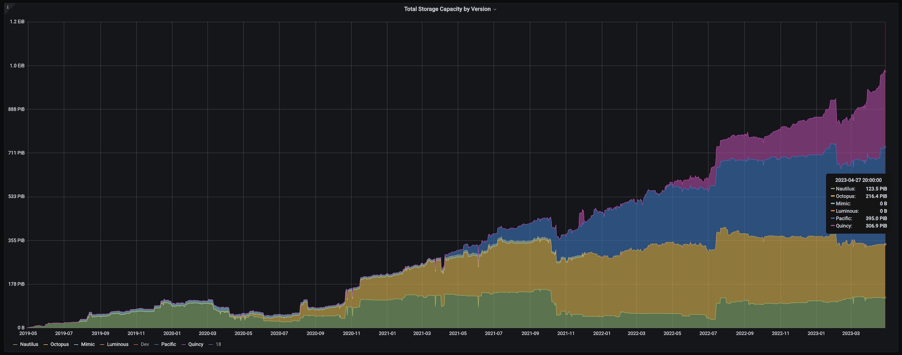
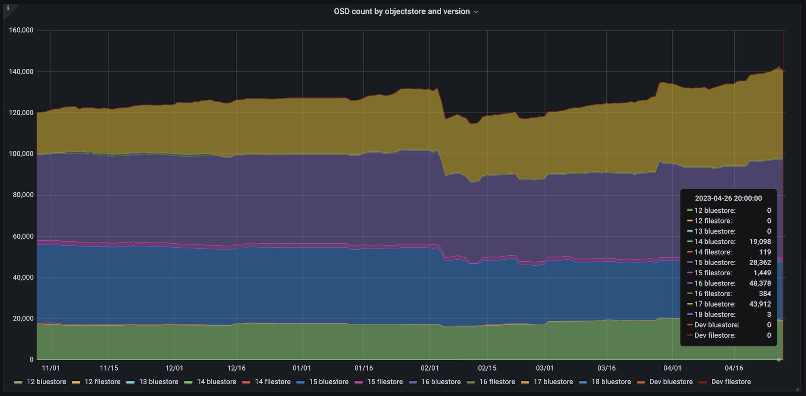

We are excited to announce we have reached the 1 exabyte milestone of Ceph storage, reported through our telemetry by more than 2,500 Ceph clusters in the community.

## Background

Ceph telemetry was introduced in 2019 as a service that allows users to phone home information about their deployments. By opting-in, the telemetry module generates anonymized reports according to the [channels](https://docs.ceph.com/en/latest/mgr/telemetry/#channels) that are enabled, and sends them daily to our backend.

Our [public telemetry dashboards](https://telemetry-public.ceph.com/) display aggregated time series analysis about version adoption rates, cluster storage capacity distribution, storage capacity by version, and more.

Since the service was launched, we see a steady opt-in increase from community installations. Here we can see a breakdown of the total storage capacity by version over the past four years:



## Make your voice heard

In addition to mailing lists, that serve as a great communication channel when looking for any feedback from the community, telemetry is an excellent resource for developers that helps answer questions about how Ceph is used. For example, when considering when to deprecate Filestore, the telemetry data helped in understanding how commonly it is being deployed vs. BlueStore across versions. Here is what telemetry tells us about OSD count by objectstore and version:



By looking at real data from real clusters, we can make educated decisions about the continuation and support of features. Clusters that phone home make their voice heard when we look for answers.

## Privacy

The telemetry reports are anonymized, and do not contain sensitive information like host, pool, or object names. The FSID of the cluster is not reported, and IPs are not stored.
See a sample report in Quincy and later releases with:
```
ceph telemetry preview-all
```
and in prior releases with:
```
ceph telemetry show-all
```

## Leaderboard

Users who are opted-in to telemetry can also opt-in to participating in a leaderboard in the telemetry [public dashboards](https://telemetry-public.ceph.com/). Users can now also add a description of the cluster to publicly appear in the leaderboard.
Opt-in to the leaderboard with:
```
ceph config set mgr mgr/telemetry/leaderboard true
```
Add a cluster description to the leaderboard with:
```
ceph config set mgr mgr/telemetry/leaderboard_description 'Research cluster of XYZ University'
```

## Opting-in

By default, Ceph telemetry reporting is off. Please consider opting-in with `ceph telemetry on`, or with the Ceph dashboard wizard.

We thank everyone who is opted-in. Each and every cluster makes a difference by increasing our understanding of how Ceph is doing in the field. We are happy to hear any feedback and ideas.
