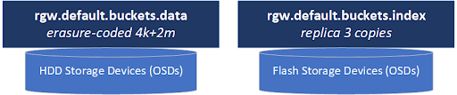
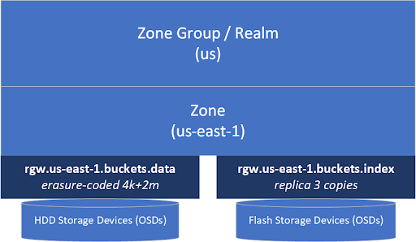
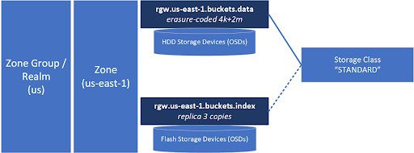
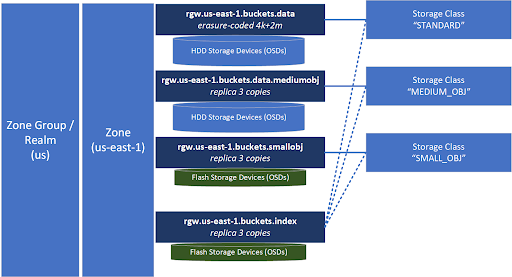

---
title: "Auto-tiering Ceph Object Storage - PART 1"
date: 2024-03-08
author: Steven Umbehocker (OSNexus)
image: "images/image1.png"
---

S3-compatible object storage systems generally have the ability to store
objects into different tiers with different characteristics so you can get the
best combination of cost and performance to match the needs of any given
application workload.  Storage tiers are referred to as ‘Storage Classes’ in S3
parlance with example storage classes at AWS including “STANDARD” for general
purpose use and lower storage classes like “DEEP_ARCHIVE” and “GLACIER” for
backups and archive use cases.

Ceph’s S3-compatible storage capabilities also includes the ability to create
your own Storage Classes and by default it automatically creates a single
storage class called “STANDARD” to match the default tier offered by AWS.

In this 3 part blog post we’re going to dive into auto-tiering object storage
with Ceph and explore some basic Lua scripting as part of that which I think
you’ll find approachable even if you’ve not used or heard of Lua before:

* PART 1 - Ceph Object storage basics and why you’d want to set up different
  storage classes
* PART 2 - How to use Lua scripting to automatically assign objects to
  different storage classes based on size
* PART 3 - More advanced Lua scripting to dynamically match objects to storage
  classes based on regex matching to object names

**Ceph Object Storage Basics**

Ceph object storage clusters consist of two primary storage pools, one for
metadata and one for data.

The metadata pool stores the index of all the objects for every bucket and
contains “rgw.bucket.index” in the name. Essentially the bucket index pool is
a collection of databases, one for each bucket which contains the list of every
object in that bucket and information on the location of each chunk of data
(RADOS object) that makes up each S3 object.

Data pools typically contain “rgw.buckets.data” in their name and they store
all the actual data blocks (RADOS objects) that make up each S3 object in your
cluster.

The metadata in the bucket index pool needs to be on fast storage that’s great
for small reads and writes (IOPS) as it is essentially a collection of
databases.  As such (and for various technical reasons beyond this article)
this pool must be configured with a replica layout and ideally should be
stored on all-flash storage media.  Flash storage for the bucket index pool
is also important as buckets must resize their bucket index databases
(RocksDB based) periodically to make it larger to make more room for more
object metadata as a bucket grows.   This process is called “resharding”
and it all happens automatically behind the scenes but resharding can
greatly impact cluster performance if the bucket index pool is on HDD media
rather than flash media.

In contrast, the data pool (eg default.rgw.buckets.data) is typically storing
large chunks of data that can be written efficiently to HDDs.  This is where
erasure coding layouts shine and provide one with a [big boost in usable
capacity](https://docs.ceph.com/en/latest/rados/operations/erasure-code/#erasure-coded-pool-overhead)
(usually 66% or more vs 33% usable with replica=3).   Erasure coding also has
great write performance when you’re working with objects that are [large
enough](https://docs.google.com/spreadsheets/d/1rpGfScgG-GLoIGMJWDixEkqs-On9w8nAUToPQjN8bDI/edit#gid=358760253)
(generally anything 4MB and larger but ideally 64MB and larger) as there’s much
less network write amplification when using erasure coding (~125% of client N/S
traffic) vs a replica based layout (300% of client N/S traffic).

**Object Storage Zones and Zone Groups**

A zone contains a complete copy of all of your S3 objects and those can be
mirrored in whole or in part to other zones.  When you want to mirror
everything to another zone you put the zones you want mirrored together into
a Zone Group.  Typically the name of the Zone Group is also the name of the S3
realm like “us” or “eu” and the zone will have a name like “us-east-1” or
“us-west-1” to borrow from some common AWS zone names.   When setting up your
Ceph object storage for use with products like Veritas Netbackup we recommend
using a AWS zone name like “us-east-1” for compatibility as some products
specifically look for known AWS zone and realm names.  A cluster setup with
a zone “us-east-1” and zone group (and realm) of “us” will look like this.

**Object Storage Classes**

Storage classes provide us with a way to tag objects to go into the data pool
of our choosing.  When you set up a cluster with a single data pool like you
see above you’ll have a single storage class mapped to it called “STANDARD” and
your cluster will look like this.

**Auto-tiering via Multiple Storage Classes**

So now we get to the heart of this article.  What if all your data isn’t
composed of large objects, what if you have millions or billions of small
objects mixed in with large objects?  You want to use erasure coding for the
large objects but that’ll be wasteful and expensive for the small objects (eg.
1K to 64K).   But if you use replica=3 as the layout for the data pool you’ll
only get 33% usable capacity and you’ll run out of space and need three times
more storage.  This is where multiple data pools come to the rescue.  Without
buying any additional storage we can share the underlying media (OSDs) with the
existing pools and make new data pools to give ourselves additional layout
options.  Here’s an example of where we add two additional data pools and
associated storage classes we’ll call SMALL_OBJ for objects &lt; 16K and
MEDIUM_OBJ for everything 16K to 1MB would look like:

So now we have a storage class “SMALL_OBJ” that’s only going to use a few
gigabytes for every million small objects and will be able to read and write
those efficiently.  We also have a HDD based “MEDIUM_OBJ” storage class that is
also using a replica=3 layout like “SMALL_OBJ” but this pool is on HDD media so
it’s less costly and allows us to reasonably store roughly one million 1MB
objects in just 1TB of space.  For everything else we’ll route it to our
erasure-coded default “STANDARD” storage class.  Note also that some
applications written for AWS S3 won’t accept custom Storage Class names like
“SMALL_OBJ” so if you run into compatibility issues, try choosing from
[pre-defined Storage Class names used by
AWS](https://docs.aws.amazon.com/AmazonS3/latest/API/API_PutObject.html).

**Users Don’t Aim**

Ok, so you’ve done all the above, you’ve got an optimally configured object
storage cluster but now your users are calling and saying it’s slow.  So you
look into it and you find that your users are not making any effort to
categorize their objects into the right Storage Class categories (i.e. by
setting the S3 X-Amz-Storage-Class header) when they upload objects.  It’s like
trying to get everyone to organize and separate their recycling.  But in this
case we have a secret weapon, that’s Lua, and in the next article we’re going
to use a few lines of scripting to put our objects into the right Storage Class
every time so that users won’t need to do a thing.

(Following the recycle bin analogy, we’ll be able to just throw the object in
the general direction of the bins and it will always land in the correct bin.
No aiming required, just like Shane from [Stuff Made
Here](https://en.wikipedia.org/wiki/Shane_Wighton)! 😀 )
