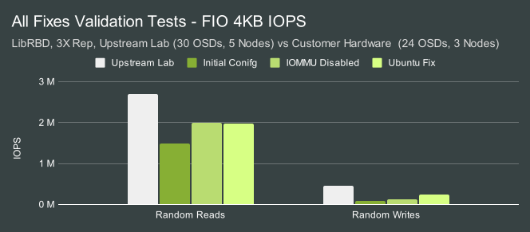
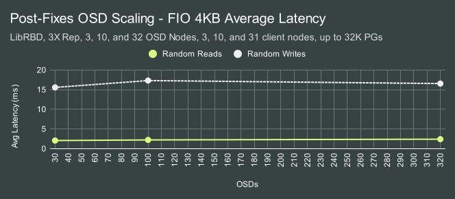

***I can't believe they figured it out first.***  That was the thought going through my head back in mid-December after several weeks of 12-hour days debugging why this cluster was slow.  This was probably the most intense performance analysis I'd done since Inktank.  Half-forgotten superstitions from the 90s about appeasing SCSI gods flitted through my consciousness.  The 90s?  Man, I'm getting old.  We were about two-thirds of the way through the work that would let us start over at the beginning.  Speaking of which, I'll start over at the beginning.

Back in 2023 (I almost said earlier this year until I remembered we're in 2024), Clyso was approached by a fairly hip and cutting edge company that wanted to transition their HDD backed Ceph cluster to a 10 petabyte NVMe deployment.  They were immediately interesting.  They had no specific need for RBD, RGW, or CephFS.  They had put together their own hardware design, but to my delight approached us for feedback before actually purchasing anything.  They had slightly unusual requirements.  The cluster had to be spread across 17 racks with 4U of space available in each.  Power, cooling, density, and vendor preference were all factors.  The new nodes needed to be migrated into the existing cluster with no service interruption.  The network however was already built, and it's a *beast*.  It's one of the fastest Ethernet setups I've ever seen.  I knew from the beginning that I wanted to help them build this cluster.  I also knew we'd need to do a pre-production burn-in and that it would be the perfect opportunity to showcase what Ceph can do on a system like this.  What follows is the story of how we built and tested that cluster and how far we were able to push it.

# Acknowledgments

I would first like to thank our amazing customer who made all of this possible.  You were a pleasure to work with!  Thank you as well for allowing us here at [Clyso](https://www.clyso.com) to share this experience with the Ceph community.  It is through this sharing of knowledge that we make the world a better place.  Thank you to [IBM](https://ibm.com)/[Red Hat](https://redhat.com) and [Samsung](https://samsung.com) for providing the Ceph community with the hardware used for comparison testing.  It was invaluable to be able to evaluate the numbers we were getting against previous tests from the lab.  Thank you to all of the Ceph contributors who have worked tirelessly to make Ceph great! Finally, thank you especially to Anthony D'Atri and Lee-Ann Pullar for their amazing copyediting skills!

# Cluster Setup 

When the customer first approached Clyso, they proposed a configuration utilizing 34 dual-socket 2U nodes spread across 17 racks.  We provided a couple of alternative configurations from multiple vendors with a focus on smaller nodes.  Ultimately they decided to go with a Dell architecture we designed, which quoted at roughly 13% cheaper than the original configuration despite having several key advantages.  The new configuration has less memory per OSD (still comfortably 12GiB each), but faster memory throughput.  It also provides more aggregate CPU resources, significantly more aggregate network throughput, a simpler single-socket configuration, and utilizes the newest generation of AMD processors and DDR5 RAM.  By employing smaller nodes, we halved the impact of a node failure on cluster recovery.

The customer indicated they would like to limit the added per-rack power consumption to around 1000-1500 watts.  With 4 of these nodes per rack, the aggregate TDP is estimated to be at least 1120 Watts plus base power usage, CPU overage peaks, and power supply inefficiency.  IE it's likely we're pushing it a bit under load, but we don't expect significant deviation beyond the acceptable range.  If worse came to worst, we estimated we could shave off roughly 100 watts per rack by lowering the processor cTDP.

Specs for the system are shown below:

Nodes | 68 x Dell PowerEdge R6615
-- | --
CPU | 1 x AMD EPYC 9454P 48C/96T
Memory | 192GiB DDR5
Network | 2 x 100GbE Mellanox ConnectX-6
NVMe | 10 x Dell 15.36TB Enterprise NVMe Read Intensive AG
OS Version | Ubuntu 20.04.6 (Focal)
Ceph Version | Quincy v17.2.7 (Upstream Deb Packages)

An additional benefit of utilizing 1U Dell servers is that they are essentially a newer refresh of the systems David Galloway and I designed for the upstream Ceph performance lab.  These systems have been tested in a [variety](https://ceph.io/en/news/blog/2023/ceph-encryption-performance/) of [articles](https://ceph.io/en/news/blog/2023/reef-osds-per-nvme/) over the past couple of years.  It turns out that there was a major performance-impacting issue that came out during testing that did not affect the previous generation of hardware in the upstream lab but did affect this new hardware.  We'll talk about that more later.

Without getting into too many details, I will reiterate that the customer's network configuration is very well-designed and quite fast.  It easily has enough aggregate throughput across all 17 racks to let a cluster of this scale really stretch its legs.

# Testing Setup

To do the burn-in testing, ephemeral Ceph clusters were deployed and FIO tests were launched using [CBT](https://github.com/ceph/cbt/).  CBT was configured to deploy Ceph with several modified settings.  OSDs were assigned an 8GB `osd_memory_target`.  In production, a higher `osd_memory_target` should be acceptable.  The customer had no need to test block or S3 workloads, so one might assume that `RADOS bench` would be the natural benchmark choice.  In my experience, testing at a large scale with `RADOS bench` is tricky.  It's tough to determine how many instances are needed to saturate the cluster at given thread counts.  I've run into issues in the past where multiple concurrent pools were needed to scale performance.  I also didn't have any preexisting `RADOS bench` tests handy to compare against.  Instead, we opted to do burn-in testing using the same `librbd` backed FIO testing we've used in the upstream lab.  This allowed us to partition the cluster into smaller chunks and compare results with previously published results.  FIO is also very well known and well-trusted.

A major benefit of the `librbd` engine in FIO (versus utilizing FIO with kernel RBD) is that there are no issues with stale mount points potentially requiring system reboots.  We did not have IPMI access to this cluster and we were under a tight deadline to complete tests.  For that reason, we ultimately skipped kernel RBD tests.  Based on previous testing, however, we expect the aggregate performance to be roughly similar given sufficient clients.  We were able, however, to test both 3X replication and 6+2 erasure coding.  We also tested msgr V2 in both unencrypted and secure mode using the following Ceph options:

```
ms_client_mode = secure
ms_cluster_mode = secure
ms_service_mode = secure
ms_mon_client_mode = secure
ms_mon_cluster_mode = secure
ms_mon_service_mode = secure
```

OSDs were allowed to use all cores on the nodes.  FIO was configured to first pre-fill RBD volume(s) with large writes, followed by 4MB and 4KB IO tests for 300 seconds each (60 seconds during debugging runs). Certain background processes, such as scrub, deep scrub, PG autoscaling, and PG balancing were disabled.

### A Note PG counts

Later in this article, you'll see some eye-popping PG counts being tested.  This is intentional.  We know from previous upstream lab testing that the PG count can have a dramatic effect on performance.  Some of this is due to [clumpiness](https://www.profmatt.com/clumpy) in random distributions at low sample (PG) counts.  This potentially can be mitigated in part through additional balancing.  Less commonly discussed is PG lock contention inside the OSD.  We've observed that on very fast clusters, PG lock contention can play a significant role in overall performance.  This unfortunately is less easily mitigated without increasing PG counts.  How much does PG count actually matter?


With just 60 OSDs, Random read performance scales all the way up to 16384 PGs on an RBD pool using 3X replication. Writes top out much earlier, but still benefits from up to 2048 PGs.

Let me be clear:  You shouldn't go out and blindly configure a production Ceph cluster to use PG counts as high as we are testing here. That's especially true given some of the other defaults in Ceph for things like PG log lengths and PG stat updates.  I do, however, want to encourage the community to start thinking about whether the conventional wisdom of 100 PGs per OSD continues to make sense.  I would like us to rethink what we need to do to achieve higher PG counts per OSD while keeping overhead and memory usage in check.  I dream about a future where 1000 PGs per OSD isn't out of the ordinary, PG logs are auto-scaled on a per-pool basis, and PG autoscaling is a far more seldom-used operation.

# A Rough Start

We were first able to log into the new hardware the week after Thanksgiving in the US.  The plan was to spend a week or two doing burn-in validation tests and then integrate the new hardware into the existing cluster.  We hoped to finish the migration in time for the new year if everything went to plan.  Sadly, we ran into trouble right at the start.  The initial low-level performance tests looked good.  Iperf network testing showed us hitting just under 200Gb/s per node.  Random sampling of a couple of the nodes showed reasonable baseline performance from the NVMe drives.  One issue we immediately observed was that the operating system on all 68 nodes was accidentally deployed on 2 of the OSD drives instead of the internal Dell BOSS m.2 boot drives.  We had planned to compare results for a 30 OSD configuration (3 nodes, 10 OSDs per node) against the results from the upstream lab (5 nodes, 6 OSDs per node).  Instead, we ended up testing 8 NVMe drives per node.  The first Ceph results were far lower than what we had hoped to see, even given the reduced OSD count.


The only result that was even close to being tolerable was for random reads, and that still wasn't great. Clearly, something was going on.  We stopped running 3-node tests and started looking at single-node, and even single OSD configurations.

That's when things started to get weird.

# Spooky Behavior

As we ran different combinations of 8-OSD and 1-OSD tests on individual nodes in the cluster, we saw wildly different behavior, but it took several days of testing to really understand the pattern of what we were seeing.  Systems that initially performed well in single-OSD tests stopped performing well after multi-OSD tests, only to start working well again hours later.  8-OSD tests would occasionally show signs of performing well, but then perform terribly for all subsequent tests until the system was rebooted.  We were eventually able to discern a pattern on fresh boot that we could roughly repeat across different nodes in the cluster:


| Step               | OSDS       | 4MB Randread (MB/s) | 4MB Randwrite (MB/s) |
| ------------------ | ---------- | ------------------- | -------------------- |
| Boot               |
| 1                  | 1 OSD      | 5716                | 3998                 |
| 2                  | 8 OSDs     | **3190**            | **2494**             |
| 3                  | 1 OSD      | **523**             | 3794                 |
| 4                  | 8 OSDs     | **2319**            | **2931**             |
| 5                  | 1 OSD      | **551**             | 3796                 |
| 20-30 minute pause 
| 6                  | 1 OSD      | **637**             | 3724                 |
| 20-30 minute pause |
| 7                  | 1 OSD      | **609**             | 3860                 |
| 20-30 minute pause |
| 8                  | 1 OSD      | **362**             | 3972                 |
| 20-30 minute pause |
| 9                  | 1 OSD      | 6581                | 3998                 |
| 20-30 minute pause |
| 10                 | 1 OSD      | 6350                | 3999                 |
| 20-30 minute pause |
| 11                 | 1 OSD      | 6536                | 4001                 |

The initial single-OSD test looked fantastic for large reads and writes and showed nearly the same throughput we saw when running FIO tests directly against the drives.  As soon as we ran the 8-OSD test, however, we observed a performance drop.  Subsequent single-OSD tests continued to perform poorly until several hours later when they recovered. So long as a multi-OSD test was not introduced, performance remained high.

Confusingly, we were unable to invoke the same behavior when running FIO tests directly against the drives.  Just as confusing, we saw that during the 8 OSD test, a single OSD would use significantly more CPU than the others:

### 4MB Random Read
```
   PID USER      PR  NI    VIRT    RES    SHR S  %CPU  %MEM     TIME+ COMMAND 
511067 root      20   0 9360000   7.2g  33792 S  1180   3.8  15:24.32 ceph-osd                                              
515664 root      20   0 9357488   7.2g  34560 S 523.6   3.8  13:43.86 ceph-osd                                              
513323 root      20   0 9145820   6.4g  34560 S 460.0   3.4  13:01.12 ceph-osd                                              
514147 root      20   0 9026592   6.6g  33792 S 378.7   3.5   9:56.59 ceph-osd                                              
516488 root      20   0 9188244   6.8g  34560 S 378.4   3.6  10:29.23 ceph-osd                                              
518236 root      20   0 9390772   6.9g  33792 S 361.0   3.7   9:45.85 ceph-osd                                              
511779 root      20   0 8329696   6.1g  33024 S 331.1   3.3  10:07.18 ceph-osd                                              
516974 root      20   0 8984584   6.7g  34560 S 301.6   3.6   9:26.60 ceph-osd  
```

A wallclock profile of the OSD under load showed significant time spent in io_submit, which is what we typically see when the kernel starts blocking because a drive's queue becomes full.


### Example tp_osd_tp Thread io_submit Wallclock Profile
```
+ 31.00% BlueStore::readv(boost::intrusive_ptr<ObjectStore::CollectionImpl>&, g...
 + 31.00% BlueStore::_do_readv(BlueStore::Collection*, boost::intrusive_ptr<Blu...
  + 24.00% KernelDevice::aio_submit(IOContext*)
  |+ 24.00% aio_queue_t::submit_batch(std::_List_iterator<aio_t>, std::_List_it...
  | + 24.00% io_submit
  |  + 24.00% syscall
```

Why would running an 8 OSD test cause the kernel to start blocking in io_submit during future single OSD tests?  It didn't make very much sense.  Initially, we suspected throttling.  We saw that with the default cooling profile in the bios, several of the core complexes on the CPU were reaching up to 96 degrees Celsius.  We theorized that perhaps we were hitting thermal limits on either the CPU or the NVMe drives during the 8-OSD tests. Perhaps that left the system in a degraded state for a period of time before recovering.  Unfortunately, that theory didn't pan out.  AMD/Dell confirmed that we shouldn't be hitting throttling even at those temperatures, and we were able to disprove the theory by running the systems with the fans running at 100% and a lower cTDP for the processor.  Those changes kept them consistently around 70 degrees Celsius under load without fixing the problem.

For over a week, we looked at everything from bios settings, NVMe multipath, low-level NVMe debugging, changing kernel/Ubuntu versions, and checking every single kernel, OS, and Ceph setting we could think of.  None these things fully resolved the issue.

We even performed blktrace and iowatcher analysis during "good" and "bad" single OSD tests, and could directly observe the slow IO completion behavior:

### Blkparse Output - Good vs Bad
| Timestamp (good)  | Offset+Length (good) | Timestamp (bad) | Offset+Length (bad) |
| ----------- | --------------------- | ----------- | --------------------- |
| 10.00002043 | 1067699792 + 256 [0]  | 10.0013855  | 1206277696 + 512 [0]  |
| 10.00002109 | 1153233168 + 136 [0]  | 10.00138801 | 1033429056 + 1896 [0] |
| 10.00016955 | 984818880 + 8 [0]     | 10.00209283 | 1031056448 + 1536 [0] |
| 10.00018827 | 1164427968 + 1936 [0] | 10.00327372 | 1220466752 + 2048 [0] |
| 10.0003024  | 1084064456 + 1928 [0] | <b>10.00328869</b> | 1060912704 + 2048 [0] |
| 10.00044238 | 1067699280 + 512 [0]  | <b>10.01285746</b> | 1003849920 + 2048 [0] |
| 10.00046659 | 1040160848 + 128 [0]  | 10.0128617 | 1096765888 + 768 [0]  |
| 10.00053302 | 1153233312 + 1712 [0] | 10.01286317 | 1060914752 + 720 [0]  |
| 10.00056482 | 1153229312 + 2000 [0] | 10.01287147 | 1188736704 + 512 [0]  |
| 10.00058707 | 1067694160 + 64 [0]   | 10.01287216 | 1220468800 + 1152 [0] |
| 10.00080624 | 1067698000 + 336 [0]  | 10.01287812 | 1188735936 + 128 [0]  |
| 10.00111046 | 1145660112 + 2048 [0] | 10.01287894 | 1188735168 + 256 [0]  |
| 10.00118455 | 1067698344 + 424 [0]  | 10.0128807  | 1188737984 + 256 [0]  |
| 10.00121413 | 984815728 + 208 [0]   | 10.01288286 | 1217374144 + 1152 [0] |


# The Three Fixes
At this point, we started getting the hardware vendors involved.  Ultimately it turned out to be unnecessary.  There was one minor, and two major fixes that got things back on track.

### Fix One

The first fix was an easy one, but only got us a modest 10-20% performance gain.  Many years ago it was discovered (Either by Nick Fisk or Stephen Blinick if I recall) that Ceph is incredibly sensitive to latency introduced by CPU c-state transitions.  A quick check of the bios on these nodes showed that they weren't running in [maximum performance](https://infohub.delltechnologies.com/p/bios-settings-for-optimized-performance-on-next-generation-dell-poweredge-servers/) mode which disables c-states.  This was a nice win but not enough to get the results where we wanted them.

### Fix Two

By the time I was digging into the blktrace results shown above, I was about 95% sure that we were either seeing an issue with the NVMe drives or something related to the PCIe root complex since these systems don't have PCIe switches in them.  I was busy digging into technical manuals and trying to find ways to debug/profile the hardware.  A very clever engineer working for the customer offered to help out.  I set up a test environment for him so he could repeat some of the same testing on an alternate set of nodes and he hit a home run.

While I had focused primarily on wallclock profiles and was now digging into trying to debug the hardware, he wanted to understand if there was anything interesting happening kernel side (which in retrospect was the obvious next move!).  He ran a perf profile during a bad run and made a very astute discovery:

```
    77.37%  tp_osd_tp        [kernel.kallsyms]             [k] native_queued_spin_lock_slowpath
            |
            ---native_queued_spin_lock_slowpath
               |          
                --77.36%--_raw_spin_lock_irqsave
                          |          
                          |--61.10%--alloc_iova
                          |          alloc_iova_fast
                          |          iommu_dma_alloc_iova.isra.0
                          |          iommu_dma_map_sg
                          |          __dma_map_sg_attrs
                          |          dma_map_sg_attrs
                          |          nvme_map_data
                          |          nvme_queue_rq
                          |          __blk_mq_try_issue_directly
                          |          blk_mq_request_issue_directly
                          |          blk_mq_try_issue_list_directly
                          |          blk_mq_sched_insert_requests
                          |          blk_mq_flush_plug_list
                          |          blk_flush_plug_list
                          |          |          
                          |          |--56.54%--blk_mq_submit_bio
```

A huge amount of time is spent in the kernel contending on a spin lock while updating the IOMMU mappings.  He disabled IOMMU in the kernel and immediately saw a huge increase in performance during the 8-node tests.  We repeated those tests multiple times and  repeatedly saw much better 4MB read/write performance.  Score one for the customer.  There was however still an issue with 4KB random writes.

### Fix Three

After being beaten to the punch by the customer on the IOMMU issue, I was almost grateful that we had an additional problem to solve.  4K random write performance had improved with the first two fixes but was still significantly worse than the upstream lab (even given the reduced node/drive counts).  I also noticed that compaction was far slower than expected in RocksDB.  There previously have been two significant cases that presented similarly and appeared to be relevant:

1) Ceph can be very slow when not properly compiled with TCMalloc support.
2) Ceph can be very slow when not compiled with the right cmake flags and compiler optimizations.

Historically this customer used the upstream Ceph Ubuntu packages and we were still using them here (rather than self-compiling or using cephadm with containers).  I verified that TCMalloc was compiled in.  That ruled out the first issue.  Next, I dug out the upstream build logs for the 17.2.7 Ubuntu packages.  That's when I noticed that we were not, in fact, building RocksDB with the correct compile flags.  It's not clear how long that's been going on, but we've had general build performance issues going back as far as [2018](https://github.com/ceph/ceph/pull/25478).

It turns out that Canonical [fixed](https://bugs.launchpad.net/ubuntu/+source/ceph/+bug/1894453) this for their own builds as did [Gentoo](https://bugs.gentoo.org/733316) after seeing the note I wrote in do_cmake.sh over 6 years ago.  It's quite unfortunate that our upstream Deb builds have suffered with this for as long as they have, however, it at least doesn't appear to affect anyone using cephadm on Debian/Ubuntu with the upstream containers.  With the issue understood, we built custom 17.2.7 packages with a fix in place.  Compaction time dropped by around 3X and 4K random write performance doubled (Though it's a bit tough to make out in the graph):




4KB random write performance was still lower than I wanted it to be, but at least now we were in roughly the right ballpark given that we had fewer OSDs, only 3/5 the number of nodes, and fewer (though faster) cores per OSD.  At this point, we were nearing winter break.  The customer wanted to redeploy the OS to the correct boot drives and update the deployment with all of the fixes and tunings we had discovered.  The plan was to take the holiday break off and then spend the first week of the new year finishing the burn-in tests.  Hopefully, we could start migrating the cluster the following week.

# The First week of 2024 

On the morning of January 2nd, I logged into Slack and was greeted by a scene I'll describe as moderately controlled chaos.  A completely different cluster we are involved in was having a major outage.  Without getting too into the details, it took 3 days to pull that cluster back from the brink and get it into a stable and relatively healthy state.  It wasn't until Friday that I was able to get back to performance testing.  I was able to secure an extra day for testing on Monday, but this meant I was under a huge time crunch to showcase that the cluster could perform well under load before we started the data migration process.

### Fate Smiles

I worked all day on Friday to re-deploy CBT and recreate the tests we ran previously.  This time I was able to use all 10 of the drives in each node.  I also bumped up the number of clients to maintain an average of roughly 1 FIO client with an io_depth of 128 per OSD.  The first 3 node test looked good.  With 10 OSDs per node, We were achieving roughly proportional (IE higher) performance relative to the previous tests.  I knew I wasn't going to have much time to do proper scaling tests, so I immediately bumped up from 3 nodes to 10 nodes. I also scaled the PG count at the same time and used CBT to deploy a new cluster.  At 3 nodes I saw 63GiB/s for 4MB random reads.  At 10 Nodes, I saw 213.5GiB/s.  That's almost linear scaling at 98.4%.  It was at this point that I knew that things were finally taking a turn for the better. Of the 68 nodes for this cluster, only 63 were up at that time.  The rest were down for maintenance to fix various issues.  I split the cluster roughly in half, with 32 nodes (320 OSDs) in one half, and 31 client nodes running 10 FIO processes each in the other half.  I watched as CBT built the cluster over roughly a 7-8 minute period.  The initial write prefill looked really good.  My heart soared.  We were reading data at 635 GiB/s.  We broke 15 million 4k random read IOPS.  While this may not seem impressive compared to the individual NVMe drives, these were the highest numbers I had ever seen for a ~300 OSD Ceph cluster.


I also plotted both average and tail latency for the scaling tests.  Both looked consistent. This was likely due to scaling the PG count and the FIO client count at the same time as OSDs.  These tests are very IO-heavy however.  We have so much client traffic that we are likely well into the inflection point where performance doesn't increase while latency continues to grow as more IO is added.




I showed these results to my colleague Dan van der Ster who previously had built the Ceph infrastructure at CERN.  He bet me a beer (*Better be a good one Dan!*) if I could hit 1 TiB/s.  I told him that had been my plan since the beginning.

# A Partially Operational Death Star

I had no additional client nodes to test the cluster with at full capacity, so the only real option was to co-locate FIO processes on the same nodes as the OSDs.  On one hand, this provides a very slight network advantage.  Clients will be able to communicate with local OSDs 1/63rd of the time.  On the other hand, we know from previous testing that co-locating FIO clients on OSD nodes isn't free.  There's often a performance hit, and it wasn't remotely clear to me how much of a hit a cluster of this scale would take. 

I built a new CBT configuration targeting the 63 nodes I had available.  Deploying the cluster with CBT took about 15 minutes to stand up all 630 OSDs and build the pool.  I waited with bated breath and watched the results as they came in.


Around 950GiB/s.  So very very close.  It was late on Friday night at this point, so I wrapped up and turned in for the night.  On Saturday morning I logged in and threw a couple of tuning options at the cluster:  Lowering OSD shards and async messenger threads while also applying the Reef RocksDB tunings. As you can see, we actually hurt read performance a little while helping write performance.  In fact, random write performance improved by nearly 20%.  After further testing, it looked like the reef tunings were benign though only helping a little bit in the write tests.  The bigger effect seemed to be coming from shard/thread changes.  At this point, I had to take a break and wasn't able to get back to working on the cluster again until Sunday night.  I tried to go to bed, but I knew that I was down to the last 24 hours before we needed to wrap this up.  At around midnight I gave up on sleep and got back to work. 

I mentioned earlier that we know that the PG count can affect performance. I decided to keep the "tuned" configuration from earlier but doubled the number of PGs.  In the first set of tests, I had dropped the ratio of clients to OSDs down given that we were co-locating them on the OSD nodes.  Now I tried scaling them up again.  4MB random read performance improved slightly as the number of clients grew, while small random read IOPS degraded.  Once we hit 8 FIO processes per node (504 total), sequential write performance dropped through the floor.


To understand what happened, I reran the write test and watched “ceph -s” output:

```
  services:
    mon: 3 daemons, quorum a,b,c (age 42m)
    mgr: a(active, since 42m)
    osd: 630 osds: 630 up (since 24m), 630 in (since 25m)
         flags noscrub,nodeep-scrub
 
  data:
    pools:   2 pools, 131073 pgs
    objects: 4.13M objects, 16 TiB
    usage:   48 TiB used, 8.2 PiB / 8.2 PiB avail
    pgs:     129422 active+clean
             1651   active+clean+laggy
 
  io:
    client:   0 B/s rd, 1.7 GiB/s wr, 1 op/s rd, 446 op/s wr
```

As soon as I threw 504 FIO processes doing 4MB writes at the cluster, some of the PGs started going active+clean+laggy.  Performance tanked and the cluster didn't recover from that state until the workload was completed.  What's worse, more PGs went laggy over time even though the throughput was only a small fraction of what the cluster was capable of.  Since then, we've found a couple of reports of laggy PGs on the [mailing list](https://www.mail-archive.com/ceph-users@ceph.io/msg15040.html) along with a couple of suggestions that might fix them.  It's not clear if those ideas would have helped here.  We do [know](https://docs.ceph.com/en/quincy/rados/operations/pg-states/) that IO will temporarily be paused when PGs go into a laggy state and that this happens because a replica hasn't acknowledged new leases from the primary in time.  After discussing the issue with other Ceph developers, we think this could possibly be an issue with locking in the OSD or having lease messages competing with work in the same async msgr threads. 

Despite being distracted by the laggy PG issue, I wanted to refocus on hitting 1.0TiB/s.  Lack of sleep was finally catching up with me.  At some point I had doubled the PG count again to 256K, just to see if it had any effect at all on the laggy PG issue.  That put us solidly toward the upper end of the curve we showed earlier, though frankly, I don't think it actually mattered much.  I decided to switch back to the default OSD shard counts and continue testing with 504 FIO client processes.  I did however scale the number of async messenger threads.  There were two big takeaways.  The first is that dropping down to 1 async messenger allowed us to avoid PGs going laggy and achieve “OK” write throughput with 504 clients.  It also dramatically hurt the performance of 4MB reads.  The second:  Ceph's defaults were actually ideal for 4MB reads.  With 8 shards, 2 threads per shard, and 3 msgr threads, we finally broke 1TiB/s.  Here's the view I had at around 4 AM Monday morning as the final set of tests for the night ran:

```
  services:
    mon: 3 daemons, quorum a,b,c (age 30m)
    mgr: a(active, since 30m)
    osd: 630 osds: 630 up (since 12m), 630 in (since 12m)
         flags noscrub,nodeep-scrub
 
  data:
    pools:   2 pools, 262145 pgs
    objects: 4.13M objects, 16 TiB
    usage:   48 TiB used, 8.2 PiB / 8.2 PiB avail
    pgs:     262145 active+clean
 
  io:
    client:   1.0 TiB/s rd, 6.1 KiB/s wr, 266.15k op/s rd, 6 op/s wr
```

and the graphs from the FIO results:


# Sleep; Erasure Coding

After finally seeing the magical "1.0 TiB/s" screen I had been waiting weeks to see, I finally went to sleep.  Nevertheless, I got up several hours later.  There was still work to be done.  All of the testing we had done so far was with 3X replication, but the customer would be migrating this hardware into an existing cluster deployed with 6+2 erasure coding.  We needed to get some idea of what this cluster was capable of in the configuration they would be using.

I reconfigured the cluster again and ran through new tests.  I picked PG/shard/client values from the earlier tests that appeared to work well.  Performance was good, but I saw that the async messenger threads were working very hard.  I decided to try increasing them beyond the defaults to see if they might help given the added network traffic.


We could achieve well over 500GiB/s for reads and nearly 400GiB/s for writes with 4-5 async msgr threads.  But why are the read results so much slower with EC than with replication?  With replication, The primary OSD for a PG only has to read local data and send it to the client.  The network overhead is essentially 1X.  With 6+2 erasure coding, The primary must read 7 or of the 8 chunks from replicas before it can then send the constructed object to the client.  The overall network overhead for the request is roughly (1 + 7/8)X.  That's why we see slightly better than half the performance of 3X replication for reads.  We have the opposite situation for writes.  With 3X replication, the client sends the object to the primary, which then further sends copies over the network to two secondaries. This results in an aggregate network overhead of 3X.  In the EC case, we only need to send 7/8 chunks to the secondaries just like in the read case.  For large writes, performance is actually faster. 

IOPS however, are another story.  For very small reads and writes, Ceph will contact all participating OSDs in a PG for that object even when the data they store isn't relevant for the operation.  For instance, if you are doing 4K reads and the data you are interested in is entirely stored in a single chunk on one of the OSDs, Ceph will still fetch data from all OSDs participating in the stripe.  In the summer of 2023, Clyso [resurrected](https://github.com/ceph/ceph/pull/52746) a PR from Xiaofei Cui that implements partial stripe reads for erasure coding to avoid this extra work.  The effect is dramatic:


It's not clear yet if we will be able to get this merged for Squid, though Radoslaw Zarzynski, core lead for the Ceph project, has offered to help try to get this over the finish line.

# Squeezing in Msgr Encryption Testing

Finally, we wanted to provide the customer with a rough idea of how much msgr-level encryption would impact their cluster if they decided to use it.  The adrenaline of the previous night had long faded and I was dead tired at this point.  I managed to run through both 3X replication and 6+2 erasure coding tests with msgr v2 encryption enabled and compared it against our previous test results.


The biggest hit is to large reads.  They drop from ~1 TiB/s to around 750 GiB/s.  Everything else sees a more modest, though consistent hit.  At this point, I had to stop.  I really wanted to do PG scaling tests and even kernel RBD tests.  It was time, though, to hand the systems back to the customer for re-imaging and then to one of my excellent colleagues at Clyso for integration.

# Finale

So what's happened with this cluster since the end of the testing? All hardware was re-imaged and the new OSDs were deployed into the customer's existing HDD cluster.  Dan's upmap-remapped script is being used to control the migration process and we've migrated around 80% of the existing data to the NVMe backed OSDs.  By next week, the cluster should be fully migrated to the new NVMe based nodes.  We've opted not to employ all of the tuning we've done here, at least not at first.  Initially, we'll make sure the cluster behaves well under the existing, mostly default, configuration.  We now have a mountain of data we can use to tune the system further if the customer hits any performance issues.

Since there was a ton of data and charts here, I want to recap some of the highlights.  Here's an outline of the best numbers we were able to achieve on this cluster:

|                | 30 OSDs (3x) | 100 OSDs (3x) | 320 OSDs (3x) | 630 OSDs (3x) | 630 OSDs (EC62)
| -------------- | ------------ | ------------- | ------------- | ------------- | ---------------
| Co-Located Fio | No           | No            | No            | Yes           | Yes
| 4MB Read       | 63 GiB/s     | 214 GiB/s     | 635 GiB/s     | 1025 GiB/s    | 547 GiB/s
| 4MB Write      | 15 GiB/s     | 46 GiB/s      | 133 GiB/s     | 270 GiB/s     | 387 GiB/s
| 4KB Rand Read  | 1.9M IOPS    | 5.8M IOPS     | 16.6M IOPS    | 25.5M IOPS    | 3.4M IOPS
| 4KB Rand Write | 248K IOPS    | 745K IOPS     | 2.4M IOPS     | 4.9M IOPS     | 936K IOPS

What's next? We need to figure out how to fix the laggy PG issue during writes.  We can't have Ceph falling apart when the write workload scales up.  Beyond that, we learned through this exercise that Ceph is perfectly capable of saturating 2x 100GbE NICs.  To push the throughput envelope further we will need 200GbE+ when using 10 NVMe drives per node or more.  IOPS is more nuanced. We know that PG count can have a big effect.  We also know that the general OSD threading model is playing a big role.  We consistently hit a wall at around 400-600K random read IOPS per node and we've seen it in multiple deployments.  Part of this may be how the async msgr interfaces with the kernel and part of this may be how OSD threads wake up when new work is put into the shard queues.  I've modified the OSD code in the past to achieve better results under heavy load, but at the expense of low-load latency.  Ultimately, I suspect improving IOPS will take a multi-pronged approach and a rewrite of some of the OSD threading code.

To my knowledge, these are the fastest single-cluster Ceph results ever published and the first time a Ceph cluster has achieved 1 TiB/s.  I think Ceph is capable of quite a bit more.  If you have a faster cluster out there, I encourage you to publish your results!  Thank you for reading, and if you have any questions or would like to talk more about Ceph performance, please feel free to [reach out](mailto:mark.nelson@clyso.com).
