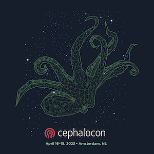

The **Cephalocon Conference** t-shirt is a perennial favorite and is literally worn as a badge of honor around the world. And the **design** on the shirt is what makes it so special!

How would you like to be honored as the creator adorning this year’s object d’arte!, and receive a complimentary registration to this year’s [event](https://events.linuxfoundation.org/cephalocon/) at CERN, in Geneva, Switzerland this December, in recognition!

You don’t need to be an artist nor a graphics designer, as we are looking for simple conceptual renderings of your design - scan in a hand-drawn image or sketch with your favorite tool. All we ask is that it be original art (need to avoid licensing issues). Also, please limit to black/white if possible, or at most one additional color, to be budget friendly.

To submit your idea for consideration, please email your drawing file (PDF or JPG) to cephalocon24@ceph.io. **All submissions must be received no later than Friday, August 16th** - so get those creative juices flowing!!

The Conference planning team will review and announce the winner when the Conference Schedule is announced in September.

_2023’s Image for reference, in case you need inspiration_

