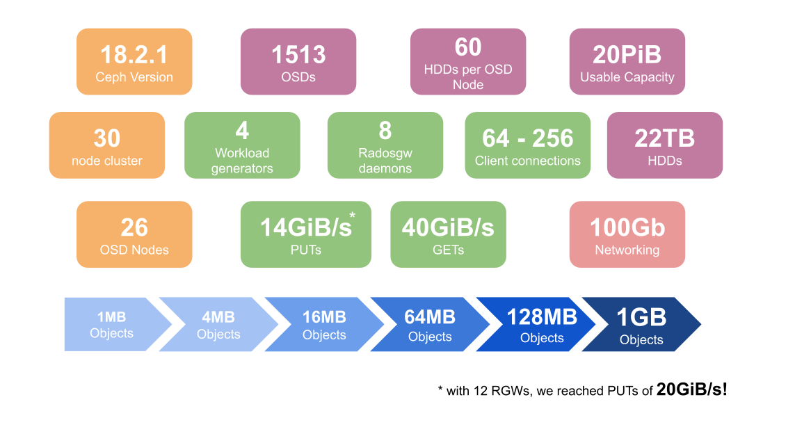
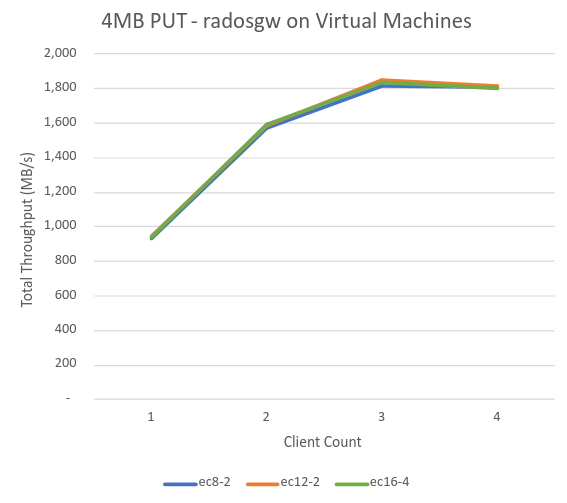
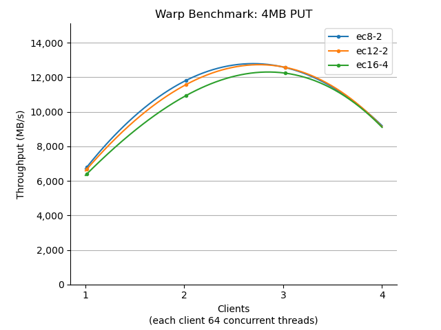

From time to time, our friends over at the [Pawsey Supercomputing Research Centre](https://pawsey.org.au/) in Australia provide us with the opportunity to test Ceph on hardware that developers normally can’t access.

The Pawsey Supercomputing Research Centre provides integrated research solutions, expertise and computing infrastructure to Australian and international researchers across numerous scientific domains. Pawsey uses Ceph predominantly for object storage, with their [Acacia](https://pawsey.org.au/systems/acacia/) service providing tens of petabytes of Ceph object storage. Acacia consists of two production Ceph clusters: an 11PB cluster supporting general research and a 27PB cluster dedicated to radio astronomy.

This time, one of the goals was to evaluate a different deployment architecture for OSD hosts: **single socket 1U servers, connected to 60-drive external SAS enclosures.**

We started off by defining some initial questions to help guide our testing efforts.

- How well does the OSD drivespec cope when defining bespoke configurations required by dense nodes and relatively small NVME?
- Do dashboard features like LED controls work with the external enclosures?
- Are there any considerations when using VMs for RGW instances?
- What’s the performance like for different EC profiles with simple GET/PUT workloads?
- Are there any deployment and management issues with dense nodes?
- How well does the Ceph dashboard deal with dense OSD nodes?\*

As you can see, these questions cover a wide variety of topics, so in the interests of avoiding reader fatigue, our observations will be split into 3 blog posts covering:

1. Installation, Management and Architecture Validation
2. Performance Deep Dive
3. Scaling RGW instances

## Overview

Short on time? Here’s a teaser of the environment and some key performance results.



## What did we learn?

### Deployment

Note that prior to 18.2.1, ceph-volume was not able to consume the multipath devices presented by the external enclosure. Check your ceph version and use of device-mapper-multipath if you're having issues!

Our first challenge was OSD configuration. The defaults for the block.db allocation are based on the capacity of the OSD - in our case 22TB. However, each OSD node only had 4 x 1.6TB NVMe drives - so the defaults couldn’t be used. Instead we used a spec file that explicitly defined the space for block.db and the ratio of OSDs to NVMe drives.

```
service_type: osd
service_id: aio-hdds
placement:
  host_pattern: storage-13-09012
spec:
  block_db_size: 60G
  db_slots: 15
  data_devices:
    rotational: 1
  db_devices:
    rotational: 0

```

Problem solved, but then our first hiccup. We found that OSD deployment to dense nodes can hit timeouts in cephadm. In our case it only happened twice, but it can be annoying! There is a fix for this in Reef which enables the mgr/cephadm/default_cephadm_command_timeout setting to be user defined, but this isn’t planned to ‘land’ until 18.2.3. Bear this in mind if you’re planning to use dense enclosures.

### Management

With the cluster deployed, our focus switched to management of the cluster with the CLI and GUI. These were our focus areas:

1. How will the high number of OSDs and daemons per node render in the UI?
2. How responsive will the UI be with over 1,500 OSDs?
3. How will the disks be represented given deployment is based on multipath devices?
4. Will workflows like IDENTIFY (LED control) work with the external HDD enclosure?
5. How do the enclosures affect normal operations like maintenance and power cycles?

The good news is that, in general, the UI coped well with this number of hosts and OSDs, and the LED controls worked fine! However there were a couple of stumbling blocks.

- After the OSDs were deployed, the device list in the dashboard didn’t show the HDDs any more. This inventory issue was attributable to ceph-volume itself which feeds the GUI and also the ceph orch device CLI command. The tracker for this is [63862](https://tracker.ceph.com/issues/63862)
- Switching between pages within the OSD view was slow (3-4s). You can follow the progress resolving this issue in [56511](https://tracker.ceph.com/issues/56511)

A number of UX enhancements were also raised:

| Tracker                                        | Component | Description                                    | Status  |
| ---------------------------------------------- | --------- | ---------------------------------------------- | ------- |
| [64171](https://tracker.ceph.com/issues/64171) | UI        | Includes expand/collapse in the crush map view | backlog |
| [63864](https://tracker.ceph.com/issues/63864) | CLI       | Show devices per node summary                  | Merged  |
| [63865](https://tracker.ceph.com/issues/63865) | UI        | CPU thread count is incorrectly reported       | Merged  |

As mentioned earlier, this hardware is based on 1U servers connected over SAS to a 60 Drive enclosure. Whilst SAS connectivity with Linux is not an issue, we did find some related issues that would be good to bear in mind.

- At boot time, if the host reaches “ready” before the enclosure, LVM is unable to activate the logical volumes used for the OSDs. The result is an awful lot of OSDs in a down state.
- Ceph is completely unaware of the enclosure hardware’s health. During our power cycling tests, two enclosures experienced faults. To Ceph, this manifested as OSDs being offline, but the root cause wasn’t apparent until the status lights on the enclosures were inspected!

Finally, during our data analysis we hit an issue where our monitoring was reporting way higher put ops than those reported by the warp tool making it difficult to reconcile Ceph data with warp results. A tracker [65131](https://tracker.ceph.com/issues/65131) was raised to explore what’s going on, and the culprit identified: multipart upload. For large objects, the warp client is using multipart for parallelism as you’d expect, and Ceph is reporting each ‘part upload’ as a separate put op, which it technically is. The problem is there isn’t a corresponding counter from RGW that represents the overall completion of the put op - so you can’t easily reconcile the client and RGW views.

### Architecture Validation

Since the OSD nodes are single socket machines, our starting strategy involved using virtual machines to host the RGW daemons, leaving as much CPU as possible for the **60** OSD daemons. Validating this design decision was our next ‘stop’.

Given that PUT workloads are generally more demanding, we used a simple 4MB object workload as a litmus test. The chart below, shows our initial disappointing results. Failing to even deliver 2GiBs throughput shows that there was a major bottleneck in the design!



The Ceph performance statistics revealed no issues at all, which was hardly surprising given the hardware. The culprit wasn't Ceph, but the CPU and network constraints on the hypervisors which were hosting the RGW daemons!

Looking at the OSD CPU usage, we found that even though there were 60 daemons per host, the OSD hosts were not under any CPU pressure at all. Next up - a prompt switch to an RGW collocation strategy, relocating the RGW daemons to the OSD hosts. We also took the opportunity to collocate the workload generators to the Ceph Index nodes. Now the same same test delivered a much more appropriate starting point.



As you can see, adopting a collocation strategy delivered a **7x** improvement in PUT throughput!

This was our first win, and will influence Pawsey’s production deployment strategy.

In our next post we may set a new record for the number of charts in a Ceph blog, as we dive deeper into the performance of the cluster across a variety of object sizes and Erasure Code (EC) profiles.
