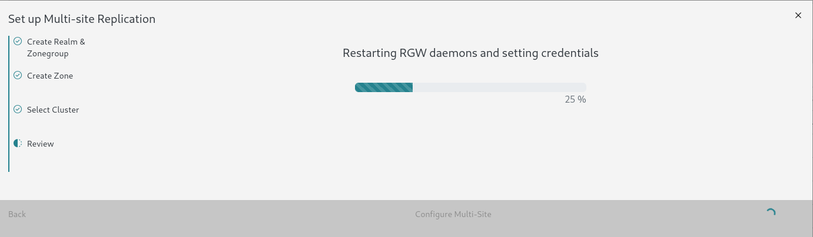

In the fast-evolving world of object storage, seamless data replication across clusters is crucial for ensuring data availability, redundancy, and disaster recovery. In Ceph, this is achieved through the RADOS Gateway (RGW) multisite replication feature. However, setting up and managing RGW multisite configurations through the command line can be a time-consuming process that involves executing a long series of complex commands—sometimes as many as 20 to 25.

To simplify this workflow, we've developed a user-friendly 4-step wizard, now accessible through a single button in the Ceph dashboard’s RGW multisite page. This new wizard significantly reduces the setup time for RGW multisite replication to just a few steps while ensuring that users can configure realms, zonegroups, and zones efficiently and with minimal effort.

  

## Why Was This Wizard Developed?

The command-line interface (CLI) is a powerful tool, but when it comes to RGW multisite replication, its complexity can become a roadblock. Configuring realms, zonegroups, and zones involves running a multitude of commands, each of which needs to be executed in a precise order. From creating realms and defining zonegroups with their respective endpoints to setting up zones and configuring system users, every step has to be done carefully. Any misstep can lead to replication failures or misconfigurations.

With the new wizard, we’ve drastically reduced the setup complexity. The wizard takes care of these steps for you in an intuitive, guided process. What previously required up to 25 CLI commands can now be achieved in just 3 to 4 steps—saving both time and effort while also lowering the risk of misconfiguration.

## A Step-by-Step Guide to the 4-Step Wizard

The RGW multisite wizard in the Ceph dashboard is designed to streamline the entire configuration process. Here’s how it works:

### 1. Realm and Zonegroup Setup

In the first step, you’re prompted to enter the **realm name**, **zonegroup name**, and **zonegroup endpoints**. These are the fundamental elements of any multisite setup. The zonegroup endpoints refer to the cluster addresses that will serve as part of the replication ecosystem.

  
*Figure: Step 1 - Entering realm and zonegroup information.*

### 2. Zone and System User Configuration

Next, you’ll define the **zone name** and its corresponding **endpoints**, as well as create the **system user** that will operate within this zone. The system user is crucial for managing access and permissions in the replication process.

  
*Figure: Step 2 - Configuring the zone and creating a system user.*

### 3. Cluster Selection (Optional)

If you’ve added another cluster in the multi-cluster setup, the third step presents an option to select that cluster. This step allows you to replicate the configuration automatically to the secondary cluster. If no additional cluster has been added or you do not wish to select a cluster at the moment, you can skip this step.

  
*Figure: Step 3 - Selecting a replication cluster and entering replication zone name*

*Figure: Secondary cluster added in multi-cluster setup*

### 4. Review and Token Generation

The final step serves as a **review page** where you can verify all the values entered in the previous steps. If no additional cluster is added for replication, submitting this step generates a **token**. This token contains the realm name, access keys, and endpoints, and it can be manually imported into the secondary cluster using the `realm pull` command.

However, if a secondary cluster is already present in the multi-cluster setup, you can select the cluster from the list, and the wizard will automatically import the realm token into the secondary cluster, completing the process seamlessly.

  
*Figure: Step 4 - Reviewing the configuration*

**You can see a step by step progress on submitting the wizard.**

**On the completion of the wizard you can verify the configuration in the secondary cluster, which in our case should look something like**

*Figure: Configuration in the secondary cluster*

**To verify the sync status you can visit the Objects > Overview Page**

*Figure: Sync status in the primary cluster*

## Use Cases for the RGW Multisite Replication Wizard

This new wizard simplifies RGW multisite configuration in several critical use cases:

### 1. **Disaster Recovery (DR)**

By replicating data across geographically distant clusters, organizations can ensure that they are protected from data loss in case of a regional failure. The wizard makes it easy to set up DR scenarios in just a few clicks.

### 2. **Data Redundancy**

Enterprises that need to maintain multiple copies of their data across different locations can now do so without spending hours on the command line. The wizard enables easy setup of data redundancy policies between clusters.

### 3. **Multi-Cluster Management**

For users managing multiple Ceph clusters, this tool provides an efficient way to replicate configurations and data without manual intervention or the complexity of multi-step CLI commands. With the wizard’s ability to handle automatic realm imports between clusters, the entire process becomes frictionless.

### 4. **Rapid Setup for New Deployments**

When deploying new Ceph clusters and configuring RGW multisite replication, time is of the essence. The wizard cuts down the time required to configure a new multi-site deployment, making it ideal for administrators who need to get their systems up and running quickly.

## Conclusion

The introduction of the RGW multisite replication wizard marks a significant improvement in the way Ceph users can manage multisite configurations. By reducing the complexity of a process that previously required up to 25 commands into a simple, intuitive 4-step wizard, we’ve made it easier than ever to set up and manage multisite replication in Ceph. Whether you’re setting up a disaster recovery plan, ensuring data redundancy, or managing multiple clusters, this tool empowers users with a streamlined, error-free process that gets the job done in a fraction of the time.

We encourage you to explore this new feature in the Ceph dashboard and experience firsthand how it can transform your RGW multisite management workflows.

