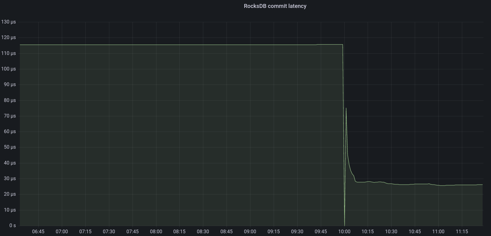

~~There is no~~ silver bullet regarding RocksDB performance. Now that I got your attention: you might be "lucky" when you are using upstream Ceph Ubuntu packages.

### TL;DR
Mark Nelson [found out](https://ceph.io/en/news/blog/2024/ceph-a-journey-to-1tibps/#fix-three) that [before](https://github.com/ceph/ceph/pull/54918) PR was merged the build process did not properly propagate the `CMAKE_BUILD_TYPE` options to external projects built by Ceph, in this case, RocksDB. [Before](https://github.com/ceph/ceph/pull/24133) packages were built with the `RelWithDebInfo` to build a "performance" release package. While this has not been verified, it is possible that upstream Ceph Ubuntu packages have suffered from this since some version of Luminous.

# Acknowledgments

Thanks to Mark Nelson for finding and fixing this issue. Thanks to Kefu Chai for providing a fix for the build system. Thanks to Casey Bodley for taking care of creating the backport trackers. Thanks to my employer [BIT](https://www.bit.nl) for having me work on Ceph, and Els de Jong for editing.

### So what does this mean?

RocksDB performance is sub-optimal. This can be improved by running peformance packages. The actual performance increase depends on the cluster, but the RocksDB compaction time seems to be reduced by a factor of three. In some cases random 4K write performance is doubled. See these links ...

### How can I fix this?

1) install a version where this problem is resolved for the release you are running: [Pacific](https://tracker.ceph.com/issues/64362), [Quincy](https://github.com/ceph/ceph/pull/55501),[Reef](https://github.com/ceph/ceph/pull/55502)

2) If you are running an EOL version of Ceph you can built it yourself. See [documentation](https://docs.ceph.com/en/latest/install/build-ceph/), or the short version below

```
git clone [ceph](https://github.com/ceph/ceph.git)
cd ceph
git checkout vYour_Release_Verion
add "extraopts += -DCMAKE_BUILD_TYPE=RelWithDebInfo" to debian/rules file
./do_cmake.sh -DCMAKE_BUILD_TYPE=RelWithDebInfo
dpkg-buildpackage -us -uc -j$DOUBLE_NUMBER_OF_CORES_BUILD_HOST 2>&1 | tee ../dpkg-buildpackage.log
```

Note: add "-b" option to `dpkg-buildpackage` if you only want binary packages and no source packages. Make sure you have enough file space available, and enough memory, especially when building with a lot of threads. I used a VM with 256 GB of RAM, 64 cores and 300 GB of space and that took around 1 hour and 7 minutes (a full build including source packages).

Make sure you check the dpkg-buildpackage.log and check for `DCMAKE_BUILD_TYPE=RelWithDebInfo` like below

```
cd /home/stefan/ceph/obj-x86_64-linux-gnu/src/rocksdb && /usr/bin/cmake -DCMAKE_POSITION_INDEPENDENT_CODE=ON -DWITH_GFLAGS=OFF -DCMAKE_PREFIX_PATH= -DCMAKE_CXX_COMPILER=/usr/bin/c++ -DWITH_SNAPPY=TRUE -DWITH_LZ4=TRUE -Dlz4_INCLUDE_DIRS=/usr/include -Dlz4_LIBRARIES=/usr/lib/x86_64-linux-gnu/liblz4.so -DWITH_ZLIB=TRUE -DPORTABLE=ON -DCMAKE_AR=/usr/bin/ar -DCMAKE_BUILD_TYPE=RelWithDebInfo -DFAIL_ON_WARNINGS=OFF -DUSE_RTTI=1 "-GUnix Makefiles" -DCMAKE_C_FLAGS=-Wno-stringop-truncation "-DCMAKE_CXX_FLAGS='-Wno-deprecated-copy -Wno-pessimizing-move'" "-GUnix Makefiles" /home/stefan/ceph/src/rocksdb
```

### Actual performance improvements as seen on one of our clusters


And to zoom in on one specific OSD



Some more graphs here

some text about reduction in rocksdb compaction backed with graphs

### Conclusions


