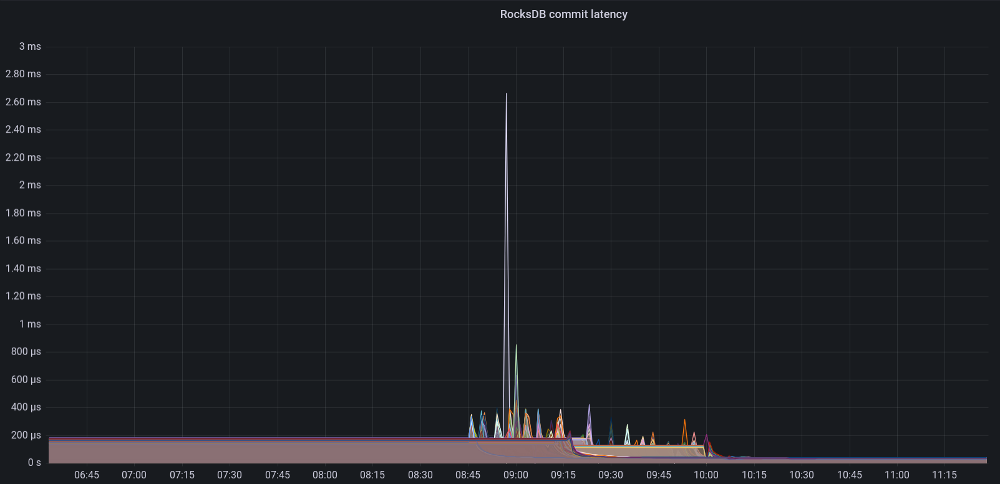

~~There is no~~ silver bullet regarding RocksDB performance. Now that I got your attention: you might be "lucky" when you are using upstream Ceph Ubuntu packages.

### TL;DR
Mark Nelson [found out](https://ceph.io/en/news/blog/2024/ceph-a-journey-to-1tibps/#fix-three) that [before](https://github.com/ceph/ceph/pull/54918) Pull request (PR) was merged, the build process did not properly propagate the `CMAKE_BUILD_TYPE` options to external projects built by Ceph - in this case, RocksDB. [Before](https://github.com/ceph/ceph/pull/24133), packages were built with the `RelWithDebInfo` to build a "performance" release package. While it has not been verified, it is possible that upstream Ceph Ubuntu packages have suffered from this since Luminous.

# Acknowledgments

Thanks to Mark Nelson for finding and fixing this issue. Thanks to Kefu Chai for providing a fix for the build system. Thanks to Casey Bodley for taking care of creating the backport trackers. Thanks to my employer [BIT](https://www.bit.nl) for having me work on Ceph, and to Els de Jong and Anthony D'Atri for editing.

### So what does this mean?

RocksDB performance is sub-optimal when built without `RelWithDebInfo`. This can be mitigated by installing "peformance" package builds. The actual performance increase depends on the cluster, but the RocksDB compaction is reduced by a factor of three. In some cases random 4K write performance is doubled. See these links [1](https://bugs.gentoo.org/733316) and [2](https://ceph.io/en/news/blog/2024/ceph-a-journey-to-1tibps/).

### How can I resolve this performance issue? 

1) Install a version where this problem is resolved for the release you are running: [Pacific](https://tracker.ceph.com/issues/64362), [Quincy](https://github.com/ceph/ceph/pull/55501),[Reef](https://github.com/ceph/ceph/pull/55502)

2) If you are running an EOL version of Ceph you can build it yourself. See [documentation](https://docs.ceph.com/en/latest/install/build-ceph/), or the short version below

```
git clone [ceph](https://github.com/ceph/ceph.git)
cd ceph
git checkout vYour_Release_Verion
add "extraopts += -DCMAKE_BUILD_TYPE=RelWithDebInfo" to debian/rules file
./do_cmake.sh -DCMAKE_BUILD_TYPE=RelWithDebInfo
dpkg-buildpackage -us -uc -j$DOUBLE_NUMBER_OF_CORES_BUILD_HOST 2>&1 | tee ../dpkg-buildpackage.log
```

Note: add the "-b" option to `dpkg-buildpackage` if you only want binary packages and no source packages. Make sure you have enough file space available, and enough memory, especially when building with a lot of threads. I used a VM with 256 GB of RAM, 64 cores and 300 GB of space and that took around 1 hour and 7 minutes (a full build including source packages).

Make sure you check the dpkg-buildpackage.log and check for `DCMAKE_BUILD_TYPE=RelWithDebInfo` like below

```
cd /home/stefan/ceph/obj-x86_64-linux-gnu/src/rocksdb && /usr/bin/cmake -DCMAKE_POSITION_INDEPENDENT_CODE=ON -DWITH_GFLAGS=OFF -DCMAKE_PREFIX_PATH= -DCMAKE_CXX_COMPILER=/usr/bin/c++ -DWITH_SNAPPY=TRUE -DWITH_LZ4=TRUE -Dlz4_INCLUDE_DIRS=/usr/include -Dlz4_LIBRARIES=/usr/lib/x86_64-linux-gnu/liblz4.so -DWITH_ZLIB=TRUE -DPORTABLE=ON -DCMAKE_AR=/usr/bin/ar -DCMAKE_BUILD_TYPE=RelWithDebInfo -DFAIL_ON_WARNINGS=OFF -DUSE_RTTI=1 "-GUnix Makefiles" -DCMAKE_C_FLAGS=-Wno-stringop-truncation "-DCMAKE_CXX_FLAGS='-Wno-deprecated-copy -Wno-pessimizing-move'" "-GUnix Makefiles" /home/stefan/ceph/src/rocksdb
```

### Actual RocksDB performance improvements as seen on one of our clusters

We installed the rebuilt packages (of which ceph-osd being the most important one) on our storage nodes and the results are striking



And to zoom in on one specific OSD


If you ever find yourself needing to compact your OSDs, you are in for a pleasant surpise. Compacting OSDs brings about three major benefits:

1) Improved performance of RocksDB itself.
2) Enhanced write performance of OSDs, leading to faster recovery times.
3) Reduced downtime, resulting in a smaller amount of data needing recovery.

Some graphs from server metrics to show this. Our procedure for compacting OSDs involves a staggered shutdown of OSDs. Once all OSDs are shut down, compaction is performed in parallel (`df|grep "/var/lib/ceph/osd" |awk '{print $6}' |cut -d '-' -f 2|sort -n|xargs -n 1 -P 10 -I OSD ceph-kvstore-tool bluestore-kv /var/lib/ceph/osd/ceph-OSD compact`).

Debug package disk IOPS (before)


Performance package disk IOPS (after)


This is a node with SATA SSDs. A node with NVMe disks is even faster. Compaction time is between 3-5 minutes.

Debug package disk IOPS (before)


Performance package disk IOPS (after)


Please note the increasing difference in OSD compaction time between SATA SSDs and NVMe drives. Previously, this gap was not as big due to the performance issues with RocksDB. However, with the introduction of faster and lower-latency disks, this difference has become more pronounced. THis suggests that the most significant perfornance improvements can be seen in clusters equipped with faster disks. 

In this specific cluster, the performance packages have reduced the time needed to compact all OSDs by approximately one-third. Previously taking nine and a half hours, the process now completes in six hours.

### Real world performance gains

While we hoped to see the performance double this was not the case. However we still saw some significant improvements in performance. To detect [gray failure](https://www.microsoft.com/en-us/research/wp-content/uploads/2017/06/paper-1.pdf) We have virtual machines running on our cloud to continously (at 5 minute intervals) monitor performance as experienced from within the virtual machine. One of these tests is a [FIO](https://github.com/axboe/fio) 4K random write test (single threaded, queue depth of 1).

4K random write on CephFS (before)


4K random write on CephFS (after)


We have also performed other fio benchmarks and the main benefits are that standard deviation is lower, and tail latencies have decreased.


### Conclusions

- It pays to conduct performance verification against a "known good" cluster, as Mark Nelson did. This helps identify performance issues early, before running production workloads. 
- Clusters equipped with faster disks are more likely to see significant performance improvements compared to those with lower-performance drives like SAS/SATA SSDs or HDDs.

### Recommendations / considerations

- When performance testing, explore various deployment strategies. This could include testing on bare metal with different operating systems, containerized environments using upstream containers, and other supported deployment methods within the Ceph project.

Okay, that might be *way* too much in practice, but to catch issues like this it's good to have a couple of different tests performed.

- Over time, conducting these tests can lead to more standardized metrics, such as an "IO/Watt" or "throughput/Watt" ratio, which would allow for easier comparison across different tests. Perhaps we could develop Ceph-specific tests for use with tools like the [Phoronix test-suite](https://www.phoronix-test-suite.com/)?

- Although not an issue in this particular case, it is worth mentioning that there could be performance regressions related to specific CPU architectures. For example, having both an ARM64 and an x86-64 performance cluster could reveal discrepancies tied to specific build options. This approach helps catch such regressions early on.

Thank you for reading, and if you have any questions or would like to talk more about Ceph, please feel free to [reach out](mailto:stefan@bit.nl).
