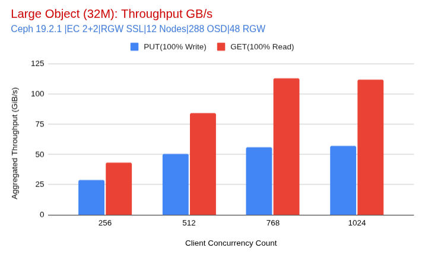
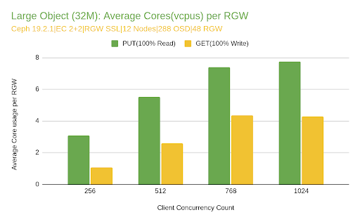
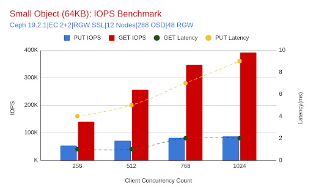
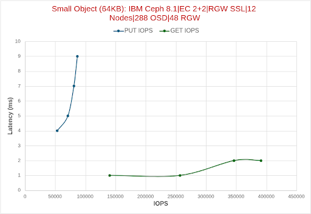
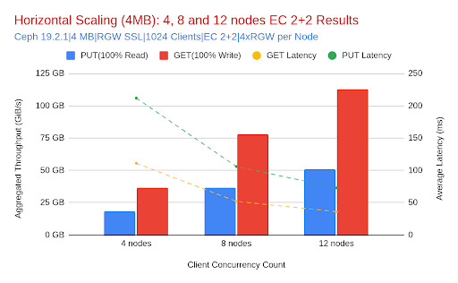
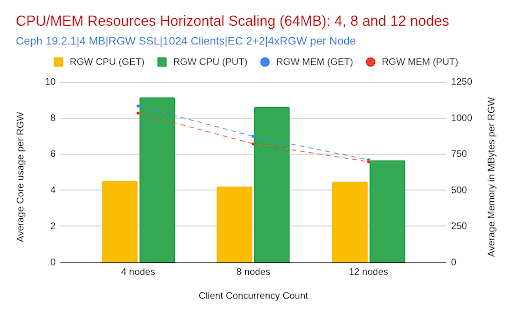
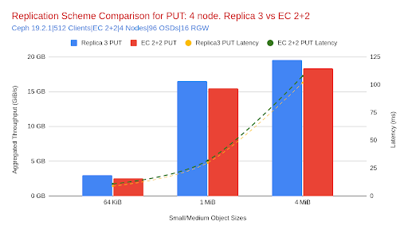
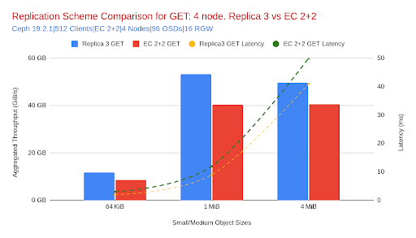
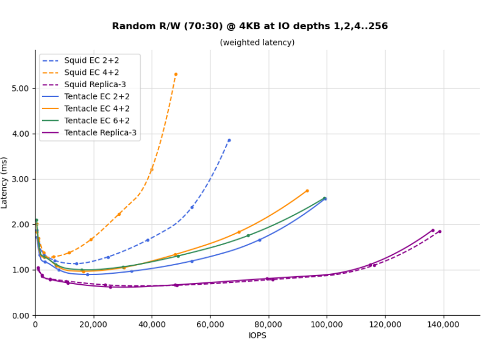

## Introduction

This post is the second installment in our blog series on benchmarking the Ceph Object Gateway (RGW)
on All-Flash IBM Storage Ceph (Dell) Ready Nodes. If you haven’t read [Part 1](https://ceph.io/en/community/events/2025/benchmarking-object-part1/),
we recommend starting there. It provides comprehensive details of our testing
environment, including hardware and software configurations, network architecture,
and benchmarking methodology.

In this installment, we delve into key performance results, focusing on peak
throughput, maximum IOPS, and horizontal scalability results.

Note on resource collocation: All services — RGW, Monitor, Manager, OSD, and
Ingress — were deployed in a collocated fashion across all nodes. While this
reflects a typical real-world deployment pattern, it also means resource sharing
could introduce internal contention. These results were gathered with this
trade-off in mind, and additional separation of services may yield even higher
performance for specific workloads.

### Peak Throughput Performance Highlights

In our effort to uncover the upper limits of the Ceph Object Gateway (RGW), we
tested a twelve-node all-NVMe (288 OSD) cluster under ideal conditions, with
optimized EC profiles, large object sizes, and high client concurrency in order
to push the platform to its maximum capabilities.

### Maximum GET Throughput

* 111 GiB/s aggregate GET throughput was achieved using 32 MiB
  objects (EC 2+2, RGW SSL enabled, 12 nodes, 1024 client threads).
    
* This corresponds to 9.25 GiB/s per node, pushing the limits of the Ceph node
  hardware’s physical network capacity.
    
* Limiting factor: Network. Each node is equipped with dual 100 GE NICs bonded
  via LACP; however, the Intel cards used are limited to a total bandwidth of
  100 Gbps (12.5 GiB/s) for all ports on each card. Given this, the ~111 GiB/s
  cluster-wide result confirms that we are very close to line-rate saturation
  given framing overhead.
    

### Maximum PUT Throughput

* 65.8 GiB/s aggregate PUT throughput was reached under similar test conditions.
    
* PUT operations inherently require additional I/O for replication, especially
  with EC, which multiplies data movement within the cluster. This explains why
  PUT throughput is lower than GET.
    
* Despite this, each node still delivered ~5.5 GiB/s on average, which, when
  accounting for replication traffic, again places us near the effective NIC
  limit of our nodes.
    

### CPU and Memory Utilization

* CPU usage for RGW processes remained within bounds (8–14% total cluster-wide
  RGW CPU across 768 vCPUs), confirming that neither RGW nor CPU resources were
  the bottleneck under large object workloads.
    
* Latencies remained consistent across EC profiles (2+2, 4+2, 8+3), further
  indicating that the network, not the compute resources, was the limiting
  factor during testing.
    

### Peak IOPS Performance Highlights

While large object tests revealed the cluster’s raw throughput potential, small
object workloads (64 KiB) helped expose the limits of metadata and IOPS
scalability. Using a twelve-node all-NVMe cluster and high client concurrency,
we tested both GET and PUT operations with multiple EC configurations to isolate
the peak operations per second the platform can sustain with small object sizes.

#### Maximum GET IOPS

* ~391K GET IOPS were achieved using 64 KiB objects (EC 2+2, no SSL, 12 nodes,
  1024 client threads). This corresponds to a total GET throughput of ~24.4 GiB/s
  and an average latency of ~2 ms.
    
* Limiting factor: CPU usage on RGWs began to rise (~9.8% across 768 vCPUs), but
  the system still had headroom. Low latency and consistent scaling across client
  threads suggest that the cluster could push higher IOPS with additional
  client-side resources/concurrency.

#### **Maximum PUT IOPS**

* ~86.6K PUT IOPS were recorded with the same configuration (64KiB, EC 2+2, RGW
  with SSL, 12 nodes, 1024 client threads). PUT throughput peaked at ~5.4 GiB/s
  with an average latency of ~8 ms at full concurrency (1024 client threads).
    
* Limiting factor: PUT operations involve more backend coordination due to
  erasure coding writes. While RGW CPU usage remained modest (~2.9%), the OSD
  layer and I/O complexity likely capped further gains. The gap between GET and
  PUT IOPS reflects this inherent asymmetry in workload cost.
   

#### CPU and Memory Utilization

For small object workloads (64 KB), RGW CPU usage showed a clear distinction
between GET and PUT operations. GET workloads consumed significantly more CPU
per RGW daemon, scaling from ~3 cores at low concurrency to nearly 10 cores
per RGW with eight clients (1,024 threads). In contrast, PUT workloads remained
consistently lighter, peaking at just under three cores per RGW even at maximum
concurrency.

This behavior is attributed to the high volume of GET requests (as shown in
the following graph): over 390K IOPS at peak, which, despite being individually
lightweight, require more CPU cycles due to their sheer frequency. Additionally,
PUT requests, while involving a heavier I/O path, occur at a lower rate (~87K IOPS)
and benefit from write path optimizations.

**Note:** Object storage workloads in production environments tend to be
read-heavy (GET-dominant). This pattern aligns with common use cases including
analytics pipelines, data lakes, and media delivery systems.

Memory consumption across RGW daemons remained stable throughout the test, with no
signs of pressure or leaks. Each RGW daemon consumed between 170 and 260 MiB of
memory during PUTs and between 205 and 260 MiB for GETs, showing a gradual increase
with added concurrency.

These results demonstrate that CPU availability becomes the dominant performance
factor for small object workloads, particularly under high GET request rates.
As IOPS scale into the hundreds of thousands, provisioning sufficient CPU
resources is critical to maintaining low latency and high throughput.

### Horizontal Scalability with EC 2+2 (4MB Objects)

To evaluate the impact of scaling out the Ceph Object Gateway (RGW), we conducted
a controlled test using an erasure coding 2+2 profile, 4MB object sizes, and SSL
enabled at the RGW layer. This specific EC profile was chosen because it is valid
across 4, 8, and 12-node deployments, allowing for a fair apples-to-apples comparison.

By incrementally increasing the number of nodes and OSDs, we observed how the
system responds in terms of throughput, latency, and resource consumption under
identical client concurrency and request sizes.

#### Analysis

* Predictable, Linear Scaling:
  As the cluster expanded from four to twelve nodes, GET throughput nearly tripled,
  growing from ~39 GiB/s to ~113 GiB/s. PUT throughput similarly increased by over
  3×, rising from ~15.5 GiB/s to just over 50 GiB/s. This linear gain reinforces the
  effectiveness of the Ceph Object Gateway’s horizontal scalability for both read
  and write operations.
    
* Latency, Stability, and Improvement:
  GET latency remained stable and improved as the cluster scaled. The twelve-node
  deployment exhibited lower latency (36 ms) compared to the eight-node
  deployment (52 ms), despite achieving significantly higher throughput. This
  indicates reduced contention and greater parallelism at scale.

* CPU and Memory Resources:

One of the key advantages of Ceph’s distributed architecture is its ability to
amortize per-service resources as cluster size increases. With 64 MiB objects
and 1024 concurrent threads, our testing revealed that RGW CPU and memory usage
per daemon decreased as we added more nodes, even as throughput more than tripled.
PUT operations, which are typically more resource-intensive due to erasure coding
computation, saw RGW CPU usage decrease from ~9.2 cores per daemon at four nodes
to just 5.7 cores at twelve nodes. Similarly, RGW memory usage decreased
from ~1035 MiB to ~698 MiB as the cluster scaled. GET operations showed comparable
trends: memory declined by ~35% per RGW, and CPU remained consistently low.

This test demonstrates that adding nodes to a Ceph cluster not only increases
raw storage capacity but also proportionally enhances throughput and efficiency.
For large-object workloads, including backups, media pipelines, or AI training set
staging, this horizontal growth pattern is essential. With consistent configuration
and moderate tuning, the Ceph Object Gateway (RGW) is capable of scaling linearly
and predictably to meet growing performance demands.

### Replica 3 vs EC 2+2: Object Size Impact on Performance

To better understand how replication and erasure coding compare across various
object sizes, we tested Ceph RGW with both replica 3 and EC 2+2 profiles on a
four-node cluster, with SSL enabled at the gateway level. While ideally we would
extend this comparison across twelve nodes, because of time constraints, replica 3
was only tested on four nodes. We plan to revisit these benchmarks with larger
deployments once Tentacle becomes available, which introduces Fast EC improvements.

Each scenario was tested using 512 client threads to avoid saturating the smaller,
four-node cluster. Object sizes ranged from 64 KiB to 256 MiB to observe how
replication and erasure coding scale across different I/O profiles.

Table 1: Relative Difference in Throughput and Latency: Replica 3 vs EC 2+2

Positive = Replica 3 performs better (higher throughput, lower latency)

| **Object Size** | **PUT Throughput Increase** | **GET Throughput Increase** | **PUT Latency Improvement** | **GET Latency Improvement** |
| --- | --- | --- | --- | --- |
| **64 KiB** | +18% | +37% | +18% | +33% |
| **4 MiB** | +6% | +22% | +6% | +16% |
| **64 MiB** | +1% | +21% | +2% | +16% |
| **256 MiB** | +1% | +21% | +2% | +17% |

### Analysis: Throughput and Latency Comparison

* With smaller objects (64 KiB), replica 3 significantly outperformed EC 2+2,
  delivering 18% more PUT and 37% more GET throughput. This behavior aligns
  with expectations: encoding/decoding overhead in EC adds latency and
  computational cost, making replica 3 better suited for high-ops,
  small-object workloads.
    
* As object sizes grow, the throughput advantage of replica 3 narrows. At 1 MiB
  and 4 MiB, performance differences remain notable but smaller, with replica 3
  providing 8–9% higher GET throughput and 6–7% higher PUT throughput.
    
* However, at larger client object sizes like 64 MiB, both schemes approach
  the network saturation point of a four-node cluster, causing throughput to
  plateau. As a result, the difference in performance becomes marginal, and
  neither scheme can fully exploit its architectural advantages. This makes
  64 MiB results less reliable for comparing replication efficiency.
    
* Latency trends mirror throughput. Replica 3 maintains lower PUT and GET
  latency across all sizes, but the relative improvement decreases with
   object size, from 33% faster GETs at 64 KiB to only ~16% at 64 MiB.
    

### Looking Ahead: EC Performance Enhancements

The performance gap at small object sizes is expected to narrow in future
releases. Ceph Tentacle introduces **Fast EC**, which addresses erasure coding
padding inefficiencies and boosts small-object performance. These advances make
erasure coding a more attractive option even for high-frequency, small-object workloads.

Check out the details of Fast EC improvements as presented in this Ceph Day London
[slide deck](https://ceph.io/assets/pdfs/events/2025/ceph-day-london/04%20Erasure%20Coding%20Enhancements%20for%20Tentacle.pdf)
and [video](https://www.youtube.com/watch?v=WH6dFrhllyo). We're adding a graph
from the FastEC initial benchmark results to whet your appetite:

### Coming Up Next

In the next post, we will explore the trade-offs introduced by different security
configurations — including TLS/SSL, SSE-S3, and msgr v2 — and how they affect Ceph
Object Gateway (RGW) performance across small and large object workloads. We’ll
also begin analyzing the optimal Ceph Object Gateway-to-CPU ratio as we delve
deeper into real-world benchmarking results.

Read Part 3 [here](https://ceph.io/en/community/events/2025/benchmarking-object-part3/)

The authors would like to thank IBM for supporting the community with our time to create these posts.
