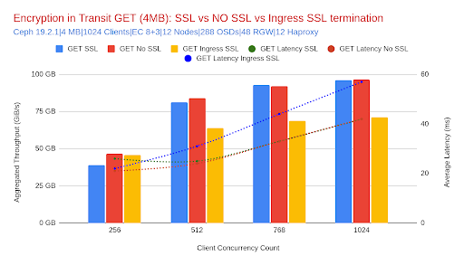
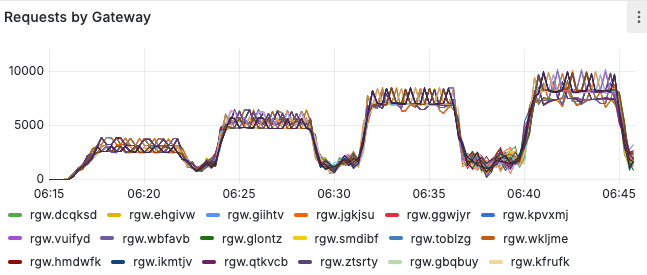
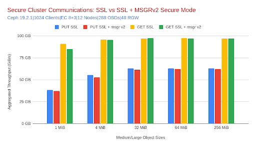

## Previously, in Part 2 of our Performance Blog Post Series

We explored how IBM Storage Ceph RGW scales with node count, revealing near-linear
throughput improvements for both PUT and GET operations across four, eight, and
twelve nodes. We also examined how resource usage trends evolve with cluster
size, confirming that scaling out improves efficiency even for resource-intensive
erasure-coded workloads. If you haven’t checked it out, here is the link
for [Part 2](https://ceph.io/en/community/events/2025/benchmarking-object-part2/).

## TLS Termination Performance: S3 Endpoint Encryption in Transit

To evaluate the impact of TLS on Ceph Object Gateway (RGW) S3 endpoint performance,
we compared three common deployment strategies: end-to-end encryption (SSL at RGW),
SSL termination at the cephadm-deployed ingress service (HAProxy), and an
unencrypted baseline. The HAproxy services run collocated with the Ceph Object
Gateway (RGW) services. There is a virtual IP address (VIP) configured per node,
and the benchmark clients balance requests across all VIPs configured. These
tests were performed on a twelve-node cluster using EC 8+3 with both
mid/large (4 MiB) and small (64 KiB) object workloads.

### Medium/Large Object Workloads (4 MiB)

This section focuses on 4 MiB object size results, which serve as a
representative case for medium to large object sizes. For even larger objects,
the trends observed here generally hold or improve further due to greater
transmission efficiency with lower per-byte overhead.

SSL at the Ceph Object Gateway (RGW) delivered throughput nearly identical to
the no-SSL configuration. For GET requests, the difference was just 0.4% lower,
while PUT throughput showed a slightly larger decline of 4.2%. This small delta
is expected, as the cluster was network-bound. Although the average Ceph Object
Gateway (RGW) CPU usage increased by 40% for GETs and 71% for PUTs during these
tests, the maximum CPU utilization per Ceph host reached ~83%, the additional
load had no material impact on performance, confirming that SSL at RGW is a
secure-by-default option with a negligible performance penalty for large object workloads.

| **Metric** | **No SSL (Baseline)** | **SSL at RGW** | **% Change (vs. No SSL)** |
| --- | --- | --- | --- |
| **GET Throughput (MiB/s)** | 96,351 | 95,965 | **\-0.4%** |
| **PUT Throughput (MiB/s)** | 58,086 | 55,651 | **\-4.2%** |
| **GET Latency (ms)** | 42 | 42 | 0% |
| **PUT Latency (ms)** | 64 | 70 | **+9.4%** |
| **RGW CPU (GET)** | 3.19 cores | 4.46 cores | **+40%** |
| **RGW CPU (PUT)** | 3.62 cores | 6.19 cores | **+71%** |

In contrast, terminating SSL at the ingress service (HAProxy) showed more noticeable
effects. Throughput declined by approximately 27% for GETs and 19% for PUTs, and
latency increased accordingly. This drop was not due to SSL overhead itself, but
rather the shift of encryption workload to the HAProxy layer. Under a heavy workload,
each HAProxy daemon consumed 3 to 6 vCPUs (on average) as the object size scaled
from 64 KiB to 1 GiB. The peak CPU utilization on Ceph hosts reached up to 90%,
highlighting the need for appropriate HAProxy tuning and scaling to prevent CPU
from becoming a bottleneck.

### **Small Object Workloads (64 KiB)**

With small objects, throughput naturally shifts from being network-bound to CPU-bound,
making encryption overhead more apparent. Still, the impact of enabling SSL at
the Ceph Object Gateway (RGW) was manageable. GET IOPS dropped by 5.2%, and PUT
IOPS declined by 10.7% relative to the no-SSL baseline. Ceph Object Gateway (RGW)
CPU usage increased by 4.2% for GETs and 11.3% for PUTs, indicating that the
encryption work was well-distributed across the cluster. Despite the higher
sensitivity of small object workloads to CPU usage, end-to-end SSL remains
practical, with performance degradation kept within single-digit percentages for most cases.

| **Metric** | **No SSL (Baseline)** | **SSL at RGW** | **% Change (vs. No SSL)** |
| --- | --- | --- | --- |
| **GET IOPS** | 137,226 | 130,089 | **\-5.2%** |
| **PUT IOPS** | 75,074 | 67,013 | **\-10.7%** |
| **GET Latency (ms)** | 3.05 | 3.25 | +6.6% |
| **PUT Latency (ms)** | 9.75 | 10.00 | +2.5% |
| **RGW CPU (GET)** | 6.11 cores | 6.37 cores | **+4.2%** |
| **RGW CPU (PUT)** | 2.20 cores | 2.45 cores | **+11.3%** |

Ingress-terminated SSL again introduced a larger performance gap. GET IOPS fell
by approximately 18%, and PUT IOPS by 8%, compared to the no-SSL case. This was
accompanied by increased ingress CPU consumption and slightly higher request
latency. While the numbers suggest a larger performance delta, this setup remains
valid for production deployments where security policies dictate TLS offload,
provided ingress scaling is aligned with concurrency and throughput goals.

### Conclusion - SSL/TLS S3 Endpoint security

In summary, SSL/TLS at the Ceph Object Gateway (RGW) offers an outstanding
balance between security and performance for most object workloads. It delivers
near-baseline throughput for large objects and modest performance degradation for
small ones, all while preserving end-to-end encryption.

### Cluster Services Encryption In Transit: Safeguarding Internal Traffic at Scale

As security standards continue to evolve, securing internal communication between
Ceph daemons is becoming a best practice for production deployments, especially in
regulated environments. In Ceph, this internal encryption is enabled via
Messenger v2 Secure Mode, also referred to as cluster network encryption or
internal encryption in transit. Unlike TLS, which secures traffic between external
clients and the S3 Ceph Object Gateway(RGW) endpoint, Messenger v2 ensures that
all inter-daemon traffic — including RGW-to-OSD, OSD-to-Monitor, and Manager
communications — is encrypted and authenticated.

This section examines the performance impact of enabling Messenger v2 Secure
Mode on top of a Ceph Object Gateway (RGW) SSL-enabled baseline. Both
configurations — with and without secure mode — used SSL at the RGW for
client-facing encryption. The tests were conducted on a twelve-node cluster
using 8+3 erasure coding with medium-to-large object sizes (1 MiB to 256 MiB).

#### High-Level Overview: Minimal Overhead for Stronger Security

We evaluated the throughput and latency of GET and PUT operations across
configurations with and without Messenger v2 security enabled. As shown
in the graph and table below, the performance delta was negligible for both
read and write operations, demonstrating that internal encryption in transit is
compatible with high-throughput object storage use cases.

Next is a table that provides a complete comparison of the percentage changes
measured between configurations using our reference 4 MiB object size.

| **Metric** | **No Encryption** | **Secure Messenger v2** | **% Change** |
| --- | --- | --- | --- |
| **GET Throughput** | 95,965 MiB/s | 95,671 MiB/s | \-0.3% |
| **PUT Throughput** | 55,651 MiB/s | 52,994 MiB/s | \-4.8% |
| **GET Latency** | 42 ms | 42 ms | 0% |
| **PUT Latency** | 70 ms | 71 ms | +1.4% |
| **RGW CPU (GET)** | 4.46 cores | 4.38 cores | \-1.8% |
| **RGW CPU (PUT)** | 6.19 cores | 6.55 cores | +5.8% |
| **RGW Memory (GET)** | 313 MiB | 336 MiB | +7.3% |
| **RGW Memory (PUT)** | 308 MiB | 329 MiB | +6.8% |

#### Analysis

* Throughput impact:
  Across all tested object sizes (1 MiB to 256 MiB), GET throughput remained
  effectively unchanged after enabling Messenger v2 secure mode. PUT throughput
  showed a modest drop, most notably with 1 MiB objects (−3.1%) and flattening
  out to near-zero impact at larger sizes (e.g., −0.4% at 64 MiB and 256 MiB).
  This trend aligns with expectations, as smaller objects amplify coordination
  and encryption overhead, while larger objects are more throughput-bound and
  amortize the cost.
    
* Latency impact:
  Both GET and PUT latencies remained stable across the board. Variations
  observed were minimal (typically ±1 ms), confirming that enabling Messenger
  v2 secure mode does not introduce meaningful queuing or processing delay,
  even under high concurrency and across varying object sizes.
    
* Resource utilization:
  CPU usage at the RGW level increased slightly for PUT operations (~2–6%
  depending on object size), while GET CPU usage stayed essentially flat.
  Memory consumption showed similarly modest changes (within ~5–7%), with no
  signs of resource exhaustion or saturation.

### Conclusion – Messenger v2 for Internal Encryption

Enabling Messenger v2 Secure Mode adds cryptographic protection to internal
Ceph daemon communications with negligible performance impact. Our testing
showed stable throughput and latency across all object sizes, with only modest
increases in RGW memory and CPU usage, primarily for PUT operations. The design
of Messenger v2 ensures strong security guarantees with minimal trade-offs, making
it highly compatible with high-throughput, enterprise-grade object storage deployments.

## Final Recommendation – Secure by Design: TLS + Messenger v2

For environments that require strong data protection both in transit to clients
and internally between cluster services, the combination of TLS at the S3 endpoint
and Messenger v2 for internal encryption provides robust security with minimal
impact on performance.

Whether you're securing AI pipelines, analytics platforms, or multi-tenant object
storage services, Ceph RGW demonstrates that full-stack encryption can be deployed
confidently, without compromising throughput, latency, or scalability.

## Encryption at Rest (SSE-S3): Context and 4 MiB Results

### Why SSE-S3?

Encryption at rest ensures that object data is encrypted before it is persisted
and decrypted only when accessed. In Ceph RGW, SSE-S3 uses envelope encryption:
a per-object data key encrypts the payload; that data key is itself stored and
protected by a KMS: we used Vault Transit via Vault Agents for token management
and auth offload during the benchmark. This design gives strong security guarantees
and centralized key control.

The trade-off is predictable: every object PUT/GET adds cryptographic work
and (for KMS-protected keys) a key unwrap step. The smaller the object, the more
the fixed per-object cost dominates. With smaller object sizes, we observed the
expected pattern: the smaller the object, the larger the relative overhead from
per-object key operations and crypto

### What we measured (12-node, EC 8+3, 512 Client Threads, 4 MiB objects)

Configurations:

* Baseline : RGW + TLS + msgr_v2 (no SSE)
* SSE @ RGW : Baseline + SSE-S3 (TLS terminated at RGW)
* SSE @ Ingress: SSE-S3 with TLS offload at HAProxy (msgr_v2)
 

Throughput & Latency comparison of SSE versus baseline performance:

| Metric | Baseline (No SSE) | SSE @ RGW | Δ vs Baseline | SSE @ Ingress | Δ vs Baseline |
| --- | --- | --- | --- | --- | --- |
| **PUT Throughput (MiB/s)** | 44,121 | 39,643 | **−10.1%** | 33,922 | **−23.1%** |
| **PUT Latency (ms)** | 44 | 50 | **+13.6%** | 57 | **+29.5%** |
| **GET Throughput (MiB/s)** | 85,951 | 46,815 | **−45.5%** | 63,574 | **−26.0%** |
| **GET Latency (ms)** | 23 | 25 | **+8.7%** | 32 | **+39.1%** |

### How to read this:

* At 4 MiB, SSE @ RGW preserves ~90% of PUT throughput with a modest latency
  increase—good news for large-object, write-heavy pipelines.
* GET paths show greater sensitivity because each read requires unwrapping the
  object’s data key (KMS round-trip + decrypt), which becomes the pacing factor
  at higher concurrency. Offloading TLS to the ingress frees CPU on RGW and
  recovers part of the GET gap, but the KMS/key-unwrap cost still dominates.

### Conclusion – Encryption At Rest (SSE-S3)

SSE-S3 delivers strong encryption at rest with predictable overhead: it’s
efficient for larger objects (PUTs stay close to baseline) and KMS-sensitive
for small, chatty workloads, which is a trade-off you can mitigate with object
sizing, KMS scaling, and RGW/ingress capacity planning.

## What’s Next

Our future Benchmarking goals

* Explore Fast EC improvements (Ceph 9.x) for small-object EC performance.
* Re-run large-object tests with 200/400 GbE to push past current NIC ceilings.
* Research possible better default tunables for the Ingress service when terminating SSL

## Conclusion

Across this three-part series, we demonstrated predictable scale with security
enabled: a 12-node cluster delivering ~111 GiB/s GET and ~66 GiB/s PUT,
near-linear gains from 4→8→12 nodes with lower or stable latency, and up
to ~391K/86K IOPS at 64 KB. TLS at RGW held near-baseline performance,
Messenger v2 added negligible overhead, and SSE-S3 showed size-dependent,
tunable costs—strong results that underscore IBM Storage Ceph Object readiness
for high-throughput and low-latency workloads at scale.

The authors would like to thank IBM for supporting the community with our time to create these posts.
